ssm+Vue计算机毕业设计疫情期间的校园防控管理系统（程序+LW文档）

**项目运行**

**环境配置：**

**Jdk1.8 + Tomcat7.0 + Mysql + HBuilderX** **（Webstorm也行）+ Eclispe（IntelliJ
IDEA,Eclispe,MyEclispe,Sts都支持）。**

**项目技术：**

**SSM + mybatis + Maven + Vue** **等等组成，B/S模式 + Maven管理等等。**

**环境需要**

**1.** **运行环境：最好是java jdk 1.8，我们在这个平台上运行的。其他版本理论上也可以。**

**2.IDE** **环境：IDEA，Eclipse,Myeclipse都可以。推荐IDEA;**

**3.tomcat** **环境：Tomcat 7.x,8.x,9.x版本均可**

**4.** **硬件环境：windows 7/8/10 1G内存以上；或者 Mac OS；**

**5.** **是否Maven项目: 否；查看源码目录中是否包含pom.xml；若包含，则为maven项目，否则为非maven项目**

**6.** **数据库：MySql 5.7/8.0等版本均可；**

**毕设帮助，指导，本源码分享，调试部署** **(** **见文末** **)**

### 系统结构设计

管理员登录后对整个系统相关操作进行处理，可进行系统管理。系统的功能结构图如下图所示。

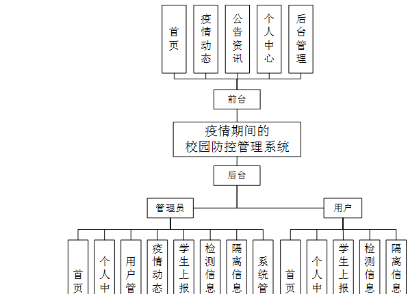

图3-1 系统结构图

### 3.5数据库设计

数据可设计要遵循职责分离原则，即在设计时应该要考虑系统独立性，即每个系统之间互不干预不能混乱数据表和系统关系。

数据库命名也要遵循一定规范，否则容易混淆，数据库字段名要尽量做到与表名类似，多使用小写英文字母和下划线来命名并尽量使用简单单词。

#### 3.5.1 E-R图设计

概念模型是对现实中的问题出现的事物的进行描述，ER图是由实体及其关系构成的图，通过E-R图可以清楚地描述系统涉及到的实体之间的相互关系。

疫情动态E-R图如下所示：

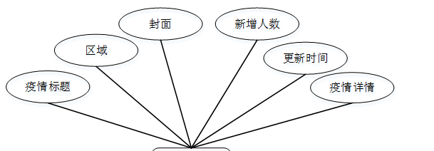

图3-2疫情动态E-R图

检测信息E-R图如下所示：

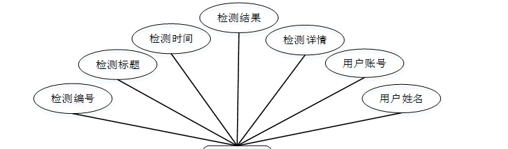

图3-3检测信息ER图

用户E-R图如下所示：

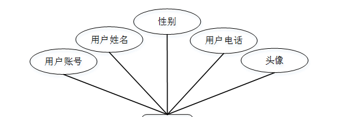

图3-4用户ER图

###

### 系统功能模块

疫情期间的校园防控管理系统，在系统首页可以查看首页、疫情动态、公告资讯、个人中心、后台管理等内容，并进行详细操作；如图4-1所示。

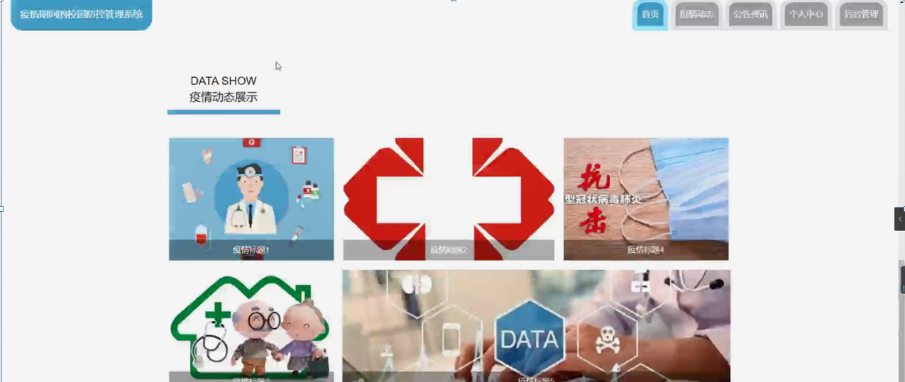

图4-1系统首页界面图

用户注册，在用户注册页面通过填写用户账号、密码、确认密码、用户姓名、用户电话等内容进行用户注册操作，如图4-2所示。

图4-2用户注册界面图

疫情动态，在疫情动态页面可以查看疫情标题、区域、封面、新增人数、更新时间、疫情详情等信息，并根据需要进行评论操作；如图4-3所示。

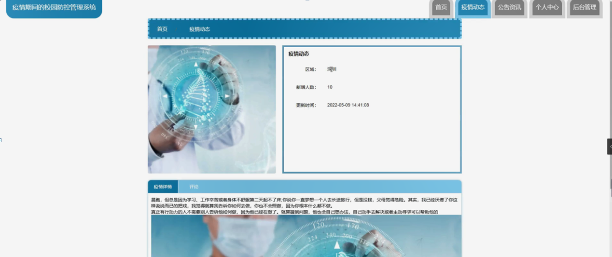

图4-3疫情动态界面图

个人中心，在个人中心页面通过填写用户账号、密码、用户姓名、性别、用户电话、上传图片等内容进行更新信息，如图4-4所示。

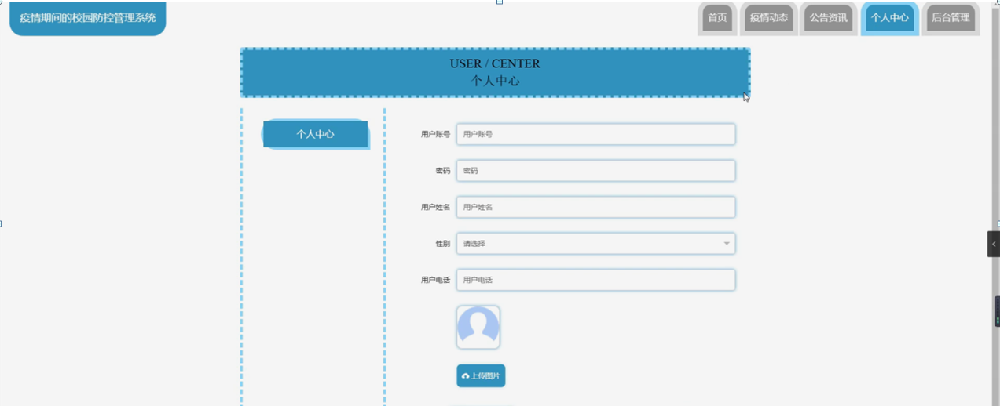

图4-4个人中心界面图

### 4.2 后台功能模块

后台登录，管理员和用户通过填写注册时输入的用户名，密码，选择角色等信息进行登录操作，如图4-5所示。

图4-5后台登录界面图

#### 4.2.1 管理员功能模块

管理员登录进入系统可以查看首页、个人中心、用户管理、疫情动态管理、学生上报管理、检测信息管理、隔离信息管理、系统管理等功能，并进行详细操作，如图4-6所示。

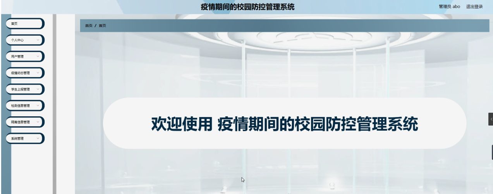

图4-6管理员功能界面图

用户管理；在用户管理页面中可以对索引、用户账号、用户姓名、性别、用户电话、头像等内容进行详情，修改和删除操作；如图4-7所示。

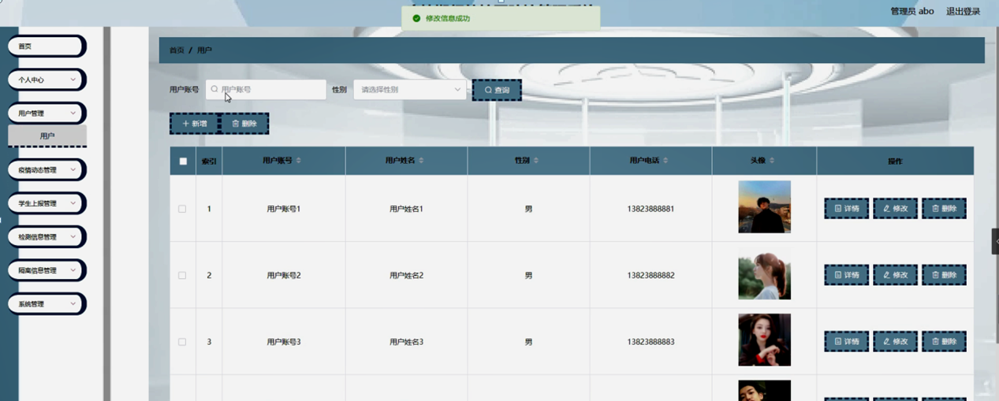

图4-7用户管理界面图

疫情动态管理；在疫情动态管理页面中可以对索引、疫情标题、区域、封面、新增人数、更新时间等内容进行详情，修改，查看评论或删除操作；如图4-8所示。

图4-8疫情动态管理界面图

学生上报管理；在学生上报管理页面中可以对索引、上报编号、上报标题、上报时间、用户账号、用户姓名、审核回复、审核状态、审核等内容进行详情，修改和删除操作；如图4-9所示。

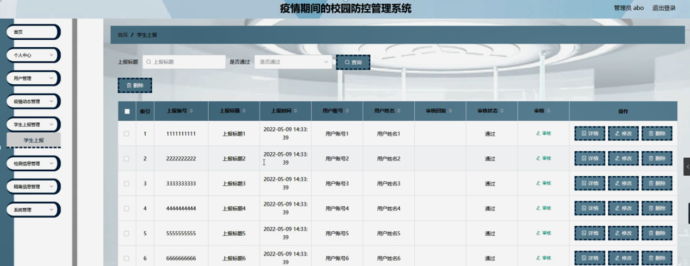

图4-9学生上报管理界面图

检测信息管理；在检测信息管理页面中可以对索引、检测编号、检测标题、检测时间、检测结果、用户账号、用户姓名等内容进行详情，修改和删除操作；如图4-10所示。

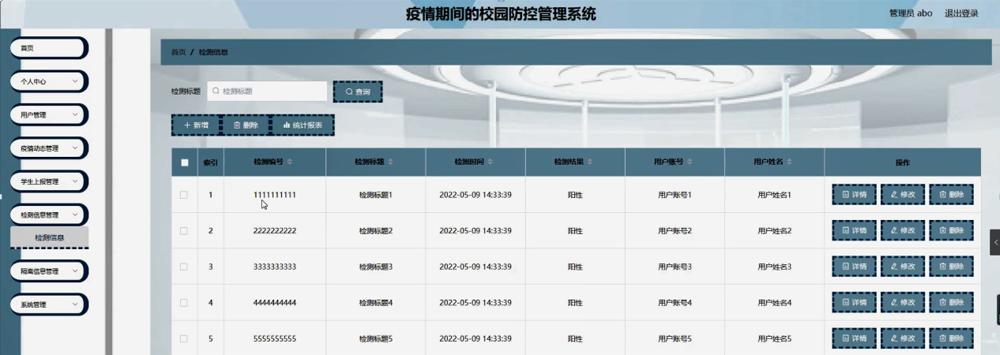

图4-10检测信息管理界面图

隔离信息管理；在隔离信息管理页面中可以对索引、编号、标题、隔离时间、隔离天数、隔离地点、用户账号、用户姓名等内容进行详情，修改和删除操作；如图4-11所示。

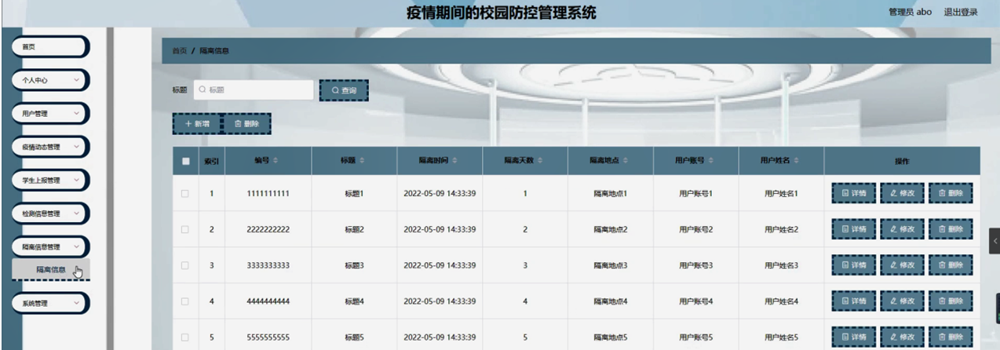

图4-11隔离信息管理界面图

系统管理；在公告资讯页面中可以对索引、标题、图片等内容进行详情，修改和删除操作；还可以对轮播图管理进行详细操作；如图4-12所示。

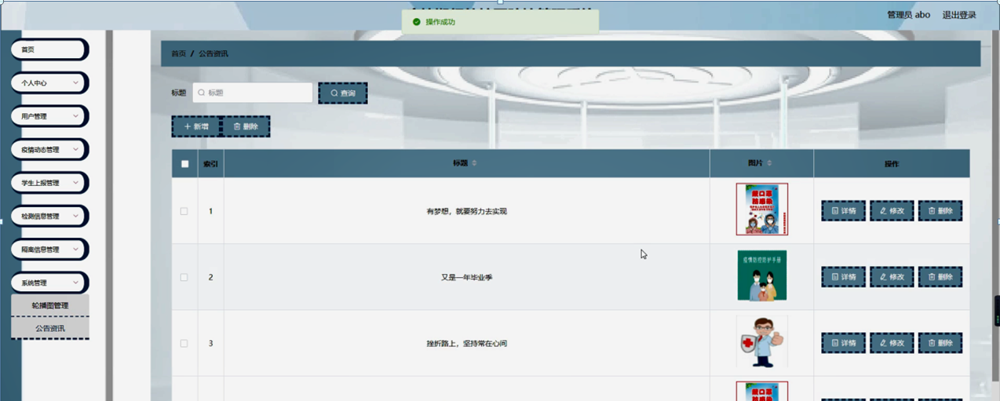

图4-12系统管理界面图

#### **JAVA** **毕设帮助，指导，源码分享，调试部署**

