ssm+Vue计算机毕业设计疫情期间社区信息管理系统（程序+LW文档）

**项目运行**

**环境配置：**

**Jdk1.8 + Tomcat7.0 + Mysql + HBuilderX** **（Webstorm也行）+ Eclispe（IntelliJ
IDEA,Eclispe,MyEclispe,Sts都支持）。**

**项目技术：**

**SSM + mybatis + Maven + Vue** **等等组成，B/S模式 + Maven管理等等。**

**环境需要**

**1.** **运行环境：最好是java jdk 1.8，我们在这个平台上运行的。其他版本理论上也可以。**

**2.IDE** **环境：IDEA，Eclipse,Myeclipse都可以。推荐IDEA;**

**3.tomcat** **环境：Tomcat 7.x,8.x,9.x版本均可**

**4.** **硬件环境：windows 7/8/10 1G内存以上；或者 Mac OS；**

**5.** **是否Maven项目: 否；查看源码目录中是否包含pom.xml；若包含，则为maven项目，否则为非maven项目**

**6.** **数据库：MySql 5.7/8.0等版本均可；**

**毕设帮助，指导，本源码分享，调试部署** **(** **见文末** **)**

### 功能结构

为了更好的去理清本系统整体思路，对该系统以结构图的形式表达出来，设计实现该疫情期间社区信息管理系统的功能结构图如下所示：

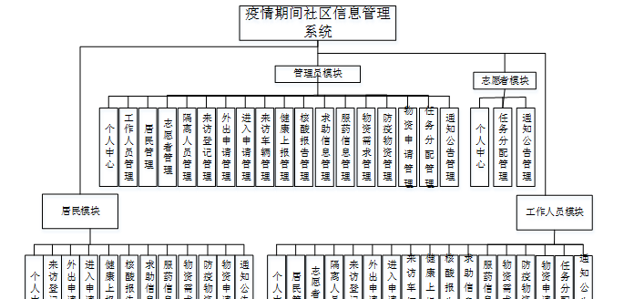图4-1 系统总体结构图

### 4.2 数据库设计

####  4.2.1 数据库E/R图

ER图是由实体及其关系构成的图，通过E/R图可以清楚地描述系统涉及到的实体之间的相互关系。在系统中对一些主要的几个关键实体如下图：

(1)服药信息E/R图如下所示：

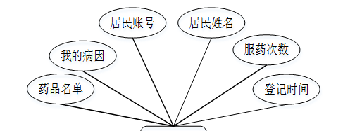

图4-2服药信息E/R图

(2) 核酸报告E/R图如下所示：

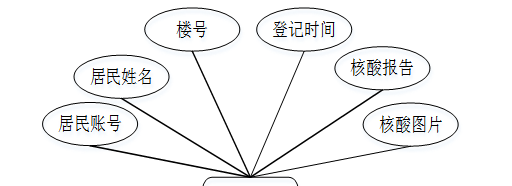

图4-3核酸报告E/R图

  1. 求助信息E/R图如下所示： 

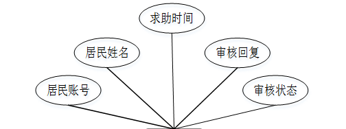

图4-4求助信息E/R图

### 管理员功能模块

管理员登录，管理员通过输入用户名、密码，选择角色并点击登录进行系统登录操作，如图5-1所示。

图5-1管理员登录界面图

管理员登录系统后，可以对个人中心、工作人员管理、居民管理、志愿者管理、隔离人员管理、来访登记管理、外出申请管理、进入申请管理、来访车辆管理、健康上报管理、核酸报告管理、求助信息管理、服药信息管理、物资需求管理、防疫物资管理、物资申请管理、任务分配管理、通知公告管理等功能进行相应操作，如图5-2所示。

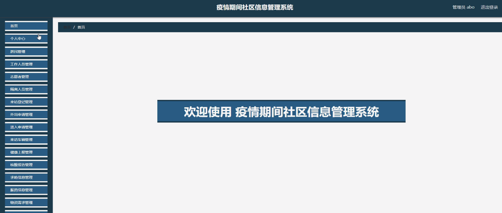

图5-2管理员功能界图面

居民管理，管理员可在居民管理页面查看居民账号、居民姓名、性别、年龄、手机号、类型、楼号、地区等内容，还可进行新增、修改或删除等操作，如图5-3所示。

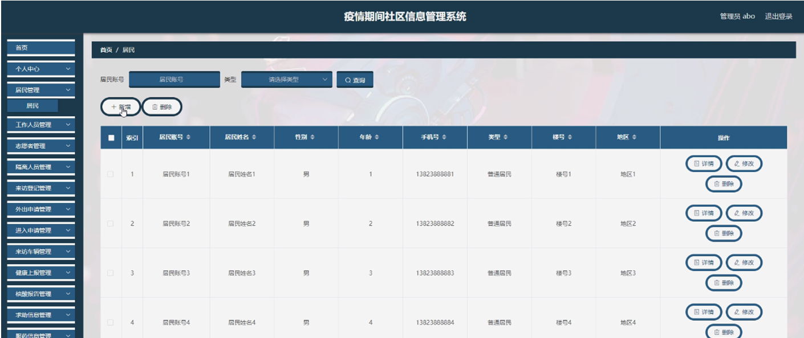

图5-3居民管理界面图

工作人员管理，管理员可在工作人员管理页面查看工号、姓名、性别、手机、身份证、负责区域等内容，还可进行新增、修改或删除等操作，如图5-4所示。

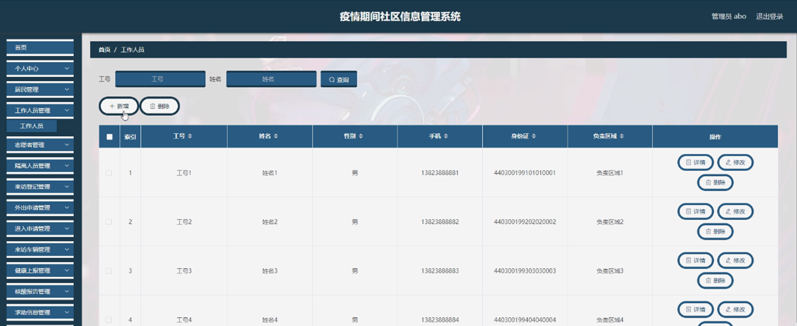

图5-4工作人员管理界面图

志愿者管理，管理员可在志愿者管理页面查看志愿者账号、志愿者姓名、城市、证件号码、性别、政治面貌、民族、志愿者手机、负责区域等内容，还可进行新增、修改或删除等操作，如图5-5所示。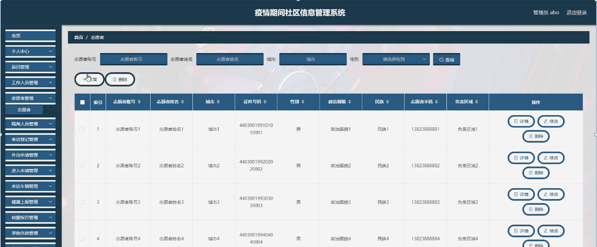

图5-5志愿者管理界面图

隔离人员管理，管理员可在隔离人员管理页面查看居民账号、居民姓名、年龄、手机号、性别、楼号、地区、隔离时长、开始日期、截止日期等内容，还可进行修改或删除等操作，如图5-6所示。

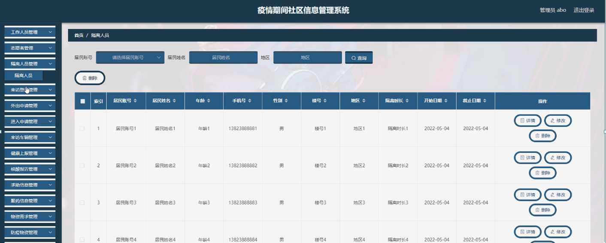

图5-6隔离人员管理界面图

来访登记管理，管理员可在来访登记管理页面查看访客名称、手机号码、到访目的、体温、粤康码、到访时间、审核回复、审核状态等内容，还可进行修改或删除等操作，如图5-7所示。

图5-7来访登记管理界面图

外出申请管理，管理员可在外出申请管理页面查看居民账号、居民姓名、性别、手机号、紧急联系人、联系人电话、申请类型、体温、外出时间、目的地、申请时间、审核回复、审核状态等内容，还可进行修改或删除等操作，如图5-8所示。

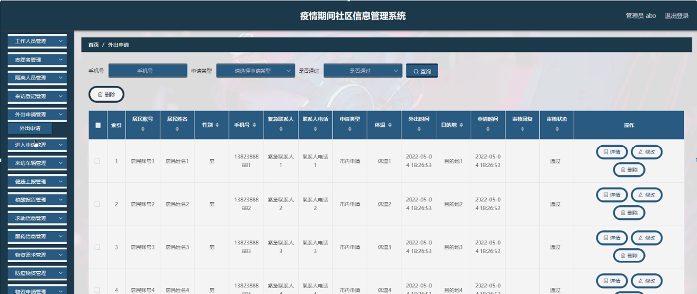

图5-8外出申请管理界图面

进入申请管理，管理员可在进入申请管理页面查看居民账号、居民姓名、手机号、体温、进入时间、审核回复、审核状态等内容，还可进行修改或删除等操作，如图5-9所示。

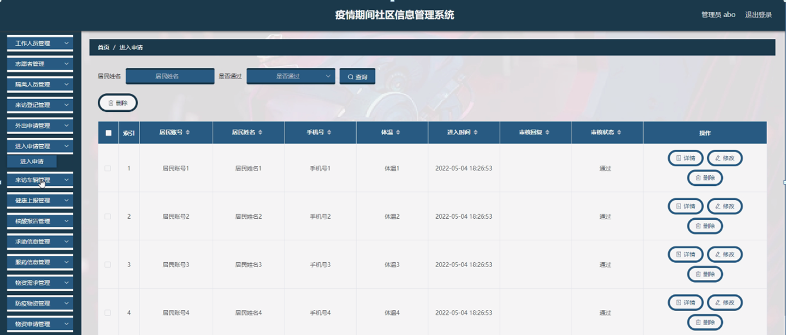

图5-9进入申请管理界面图

健康上报管理，管理员可在健康上报管理页面查看居民账号、居民姓名、手机号、填报日期、是否发热、是否咳嗽、是否胸闷、是否确诊、去过中高风险地区、体温、健康码、打卡地点等内容，还可进行修改或删除等操作，如图5-10所示。

图5-10健康上报管理界面图

核酸报告管理，管理员可在核酸报告管理页面查看居民账号、居民姓名、楼号、登记时间、核酸报告、核酸图片等内容，还可进行修改或删除等操作，如图5-11所示。

图5-11核酸报告管理界面图

求助信息管理，管理员可在求助信息管理页面查看居民账号、居民姓名、求助时间、审核回复、审核状态等内容，还可进行修改或删除等操作，如图5-12所示。

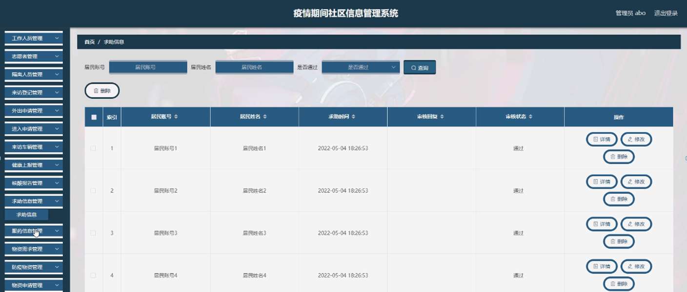

图5-12求助信息管理界面图

#### **JAVA** **毕设帮助，指导，源码分享，调试部署**

