ssm+Vue计算机毕业设计疫情期间超市管理系统（程序+LW文档）

**项目运行**

**环境配置：**

**Jdk1.8 + Tomcat7.0 + Mysql + HBuilderX** **（Webstorm也行）+ Eclispe（IntelliJ
IDEA,Eclispe,MyEclispe,Sts都支持）。**

**项目技术：**

**SSM + mybatis + Maven + Vue** **等等组成，B/S模式 + Maven管理等等。**

**环境需要**

**1.** **运行环境：最好是java jdk 1.8，我们在这个平台上运行的。其他版本理论上也可以。**

**2.IDE** **环境：IDEA，Eclipse,Myeclipse都可以。推荐IDEA;**

**3.tomcat** **环境：Tomcat 7.x,8.x,9.x版本均可**

**4.** **硬件环境：windows 7/8/10 1G内存以上；或者 Mac OS；**

**5.** **是否Maven项目: 否；查看源码目录中是否包含pom.xml；若包含，则为maven项目，否则为非maven项目**

**6.** **数据库：MySql 5.7/8.0等版本均可；**

**毕设帮助，指导，本源码分享，调试部署** **(** **见文末** **)**

### 系统结构图

整个系统的模块划分包含用户管理模块、员工管理模块和管理员管理模块, 又划分了若干了子模块,为了方便更直观的理解,下图以图形形式给出关于整个网站的结构图。

网站总体功能结构图3-1如图所示：

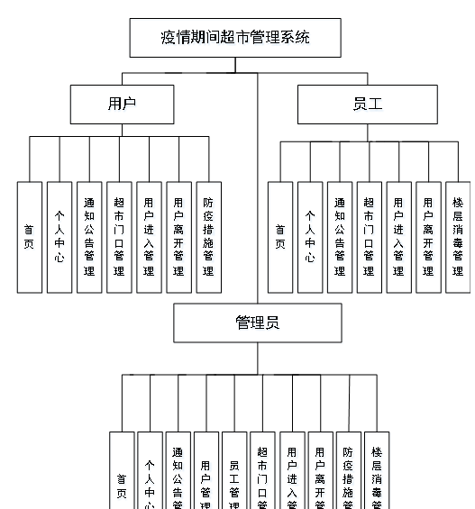

图3-2网站总体功能结构图

### 数据库概念设计

在对数据库设计之前首先要分析一下疫情期间超市管理系统的功能，和各模块之间的关系，再对数据表进行设计。每一个模块的实体都会对应多个实体对象，下面是几个系统中的数据实体。

防疫措施信息实体E-R图如图4-1所示：

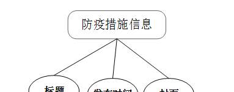

图4-1防疫措施信息E-R图

用户信息实体E-R图如图4-2所示：

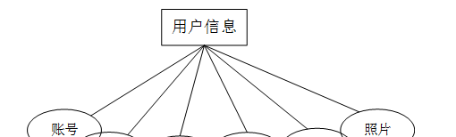

图4-2用户信息实体E-R图

员工信息实体E-R图如图4-3所示：

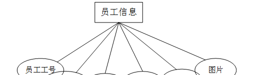

图4-3员工信息实体E-R图

楼层消毒信息实体E-R图如图4-4所示：

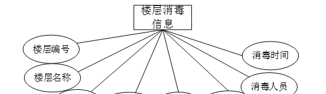

图4-4楼层消毒信息实体E-R图

### 管理员功能模块

管理员进行登录，进入系统前在登录页面根据要求填写用户名和密码，选择角色等信息，点击登录操作，如图5-1所示。

图5-1管理员登录界面图

管理员登录系统后，可以对首页、个人中心、通知公告管理、用户管理、员工管理、超市门口管理、用户进入管理、用户离开管理、防疫措施管理、楼层消毒管理等进行相应的操作管理，如图5-2所示。

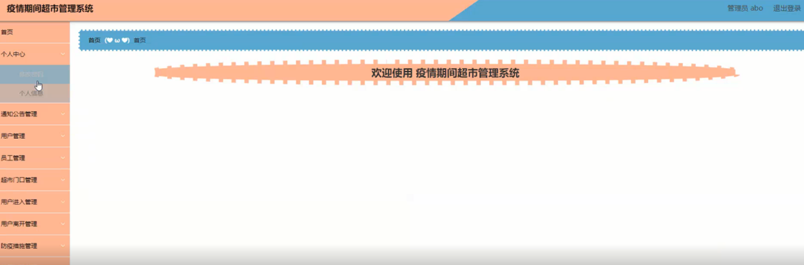

图5-2管理员功能界图面

员工管理，在员工管理页面可以对员工工号、员工姓名、性别、年龄、手机、图片等内容进行详情、修改和删除等操作，如图5-3所示。

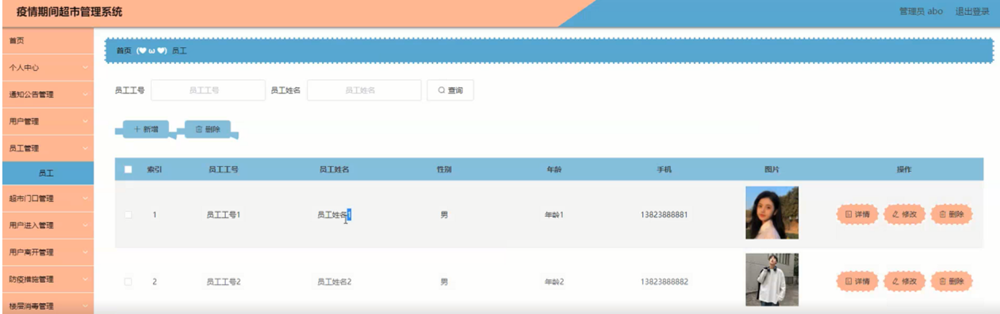

图5-3员工管理界面图

用户管理，在用户管理页面可以对账号、姓名、年龄、性别、手机、照片等内容进行详情、修改、删除等操作，如图5-4所示。

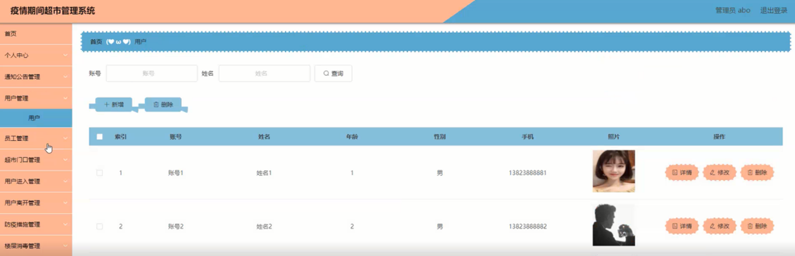

图5-4用户管理界面图

通知公告管理，在通知公告管理页面可以对标题、发布时间、封面等内容进行修改和删除等操作，如图5-5所示。

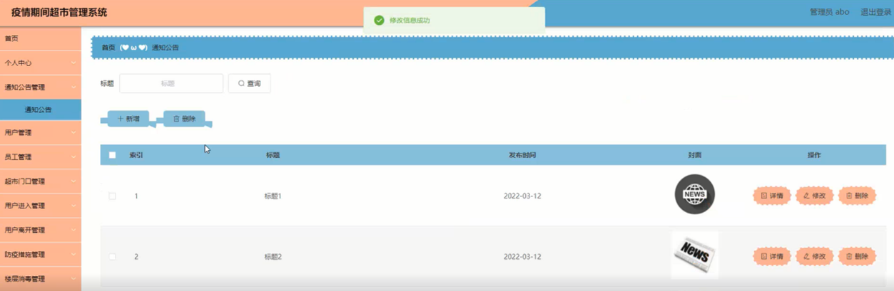

图5-5通知公告管理界面图

超市门口管理，在超市门口管理页面可以对编号、名称、地址、封面、员工工号、员工姓名等内容进行修改和删除等操作，如图5-6所示。

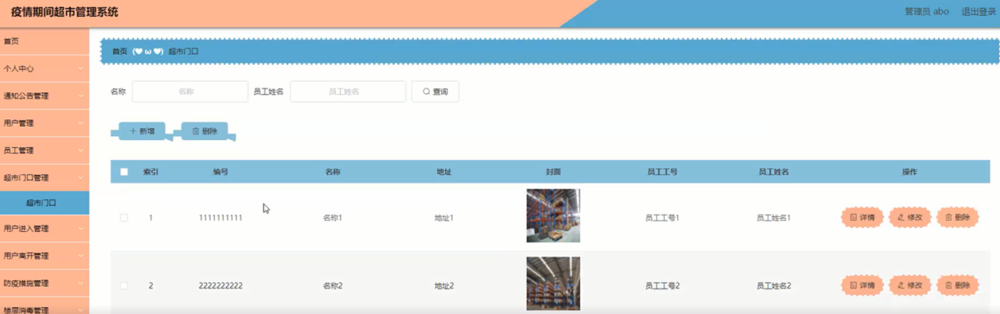

图5-6超市门口管理界面图

用户进入管理，在用户进入管理页面可以对登记编号、编号、名称、进入时间、备注、健康码、行程码、口罩、核酸检测、疫苗情况、账号、姓名、员工工号、员工姓名、审核回复、审核状态等内容进行修改和删除等操作，如图5-7所示。

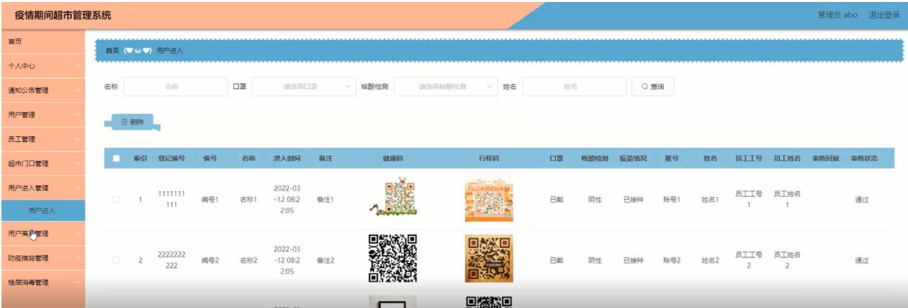

图5-7用户进入管理界面图

用户离开管理，在用户离开管理页面可以对登记编号、编号、名称、离开时间、停留时间、备注、账号、姓名、车牌号、员工工号、员工姓名、审核回复、审核状态等内容进行修改和删除等操作，如图5-8所示。

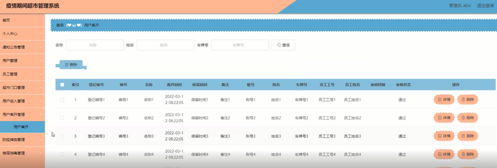

图5-8用户离开管理界面图

防疫措施管理，在防疫措施管理页面可以对标题、发布时间、封面等内容进行修改和删除等操作，如图5-9所示。

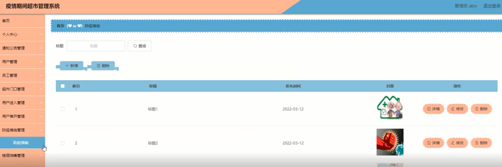

图5-9防疫措施管理界面图

楼层消毒管理，在楼层消毒管理页面可以对楼层编号、楼层名称、图片、消毒药剂、用量、消毒方式、消毒人员、消毒时间等内容进行修改和删除等操作，如图5-10所示。

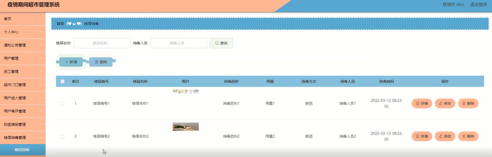

图5-10楼层消毒管理界面图

### 5.2用户后台功能模块

用户注册，在注册页面可以填写账号、密码、确认密码、姓名、年龄、手机等信息进行注册，如图5-11所示。

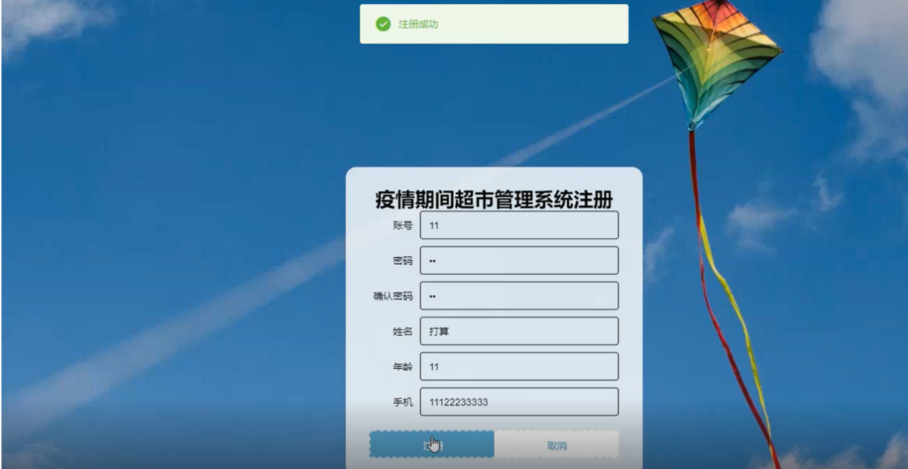

图5-11用户注册界面图

用户登录，在登录页面可以填写用户名、密码、选择角色进行登录，如图5-12所示。

图5-12用户登录界面图

#### **JAVA** **毕设帮助，指导，源码分享，调试部署**

