ssm+Vue计算机毕业设计疫情状态下的图书馆座位预约系统（程序+LW文档）

**项目运行**

**环境配置：**

**Jdk1.8 + Tomcat7.0 + Mysql + HBuilderX（Webstorm也行）+ Eclispe（IntelliJ
IDEA,Eclispe,MyEclispe,Sts都支持）。**

**项目技术：**

**SSM + mybatis + Maven + Vue 等等组成，B/S模式 + Maven管理等等。**

**环境需要**

**1.运行环境：最好是java jdk 1.8，我们在这个平台上运行的。其他版本理论上也可以。**

**2.IDE环境：IDEA，Eclipse,Myeclipse都可以。推荐IDEA;**

**3.tomcat环境：Tomcat 7.x,8.x,9.x版本均可**

**4.硬件环境：windows 7/8/10 1G内存以上；或者 Mac OS；**

**5.是否Maven项目: 否；查看源码目录中是否包含pom.xml；若包含，则为maven项目，否则为非maven项目**

**6.数据库：MySql 5.7/8.0等版本均可；**

**毕设帮助，指导，本源码分享，调试部署(** **见文末)**

### 系统结构

本系统架构网站系统，本系统的具体功能如下：

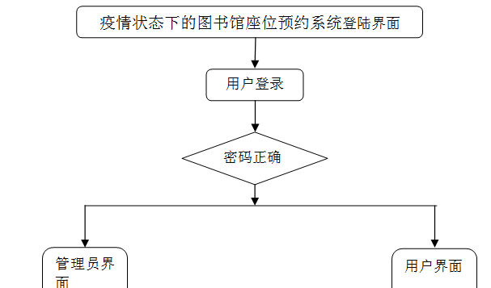

图4-2系统功能结构图

这些功能可以充分满足疫情状态下的图书馆座位预约系统的需求。此系统功能较为全面如下图系统功能结构如图4-4所示。

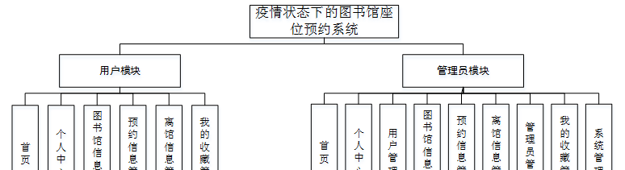

图4-3系统功能结构图

### 4.3. 数据库设计

4.3.1 数据库实体

管理员信息结构图，如图4-4所示：

图4-4 管理员信息实体结构图

图书馆信息管理实体属性图，如图4-5所示：

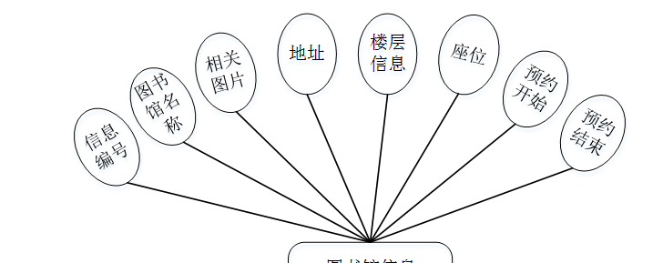

图4-5图书馆信息管理实体属性图

用户信息管理实体属性图，如图4-6所示：

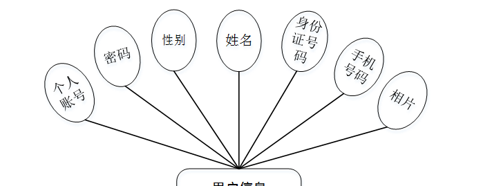

图4-6用户信息管理实体属性图

### 系统功能模块

疫情状态下的图书馆座位预约系统，在疫情状态下的图书馆座位预约系统首页可以查看首页、图书馆信息、预约信息、离馆信息、个人中心、后台管理等内容进行详细操作，如图5-1所示。

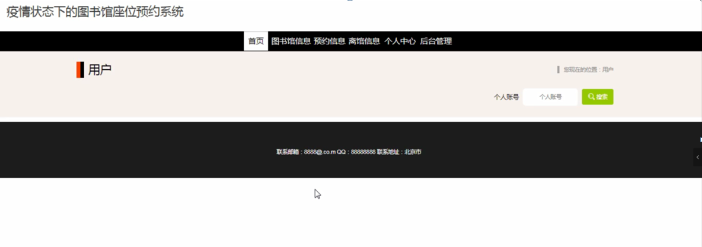

图5-1网站首页界面图

注册，在用户注册页面可以填写个人账号、密码、姓名、身份证号码、手机号码等信息进行注册，如图5-2所示。在个人中心页面可以填写个人账号、密码、姓名、性别、身份证号码、手机号码、图片等信息进行更新操作，还可以根据需要对我的收藏进行相应操作；如图5-3所示。

图5-2用户注册界面图

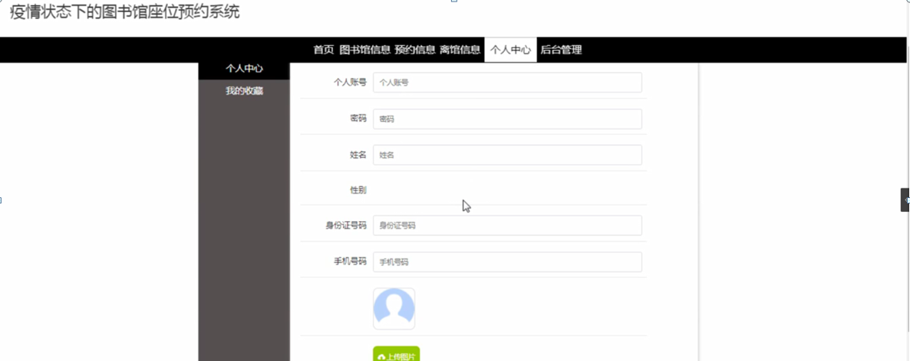

图5-3个人中心界面图

图书馆信息，在图书馆信息页面可以查看信息编号、图片、地址、楼层信息、座位、预约开始、预约结束等详细信息，根据需要进行预约、离馆、评论或收藏等操作，如图5-4所示。

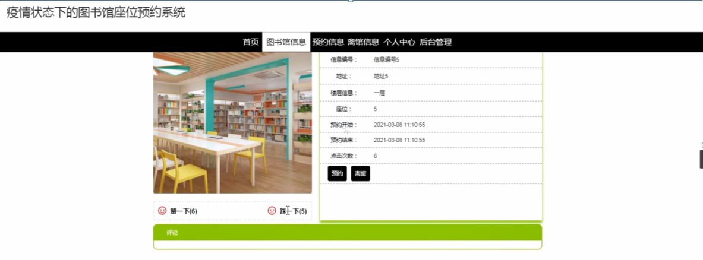

图5-4图书馆信息界面图

预约信息，在预约信息页面可以查看信息编号、地址、楼层信息、座位、个人账号、姓名、申请日期等详细信息进行评论等操作，如图5-5所示。

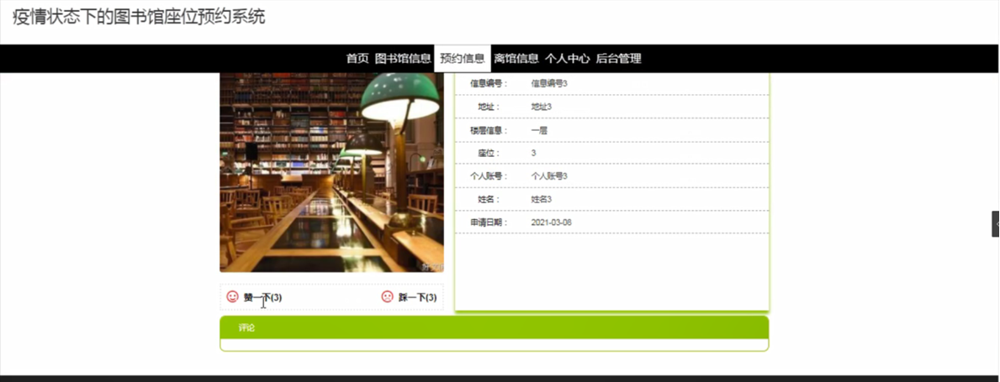

图5-5预约信息界面图

离馆信息，在离馆信息页面可以查看信息编号、地址、楼层信息、座位、个人账号、姓名、离馆时间等详细信息进行评论等操作，如图5-6所示。

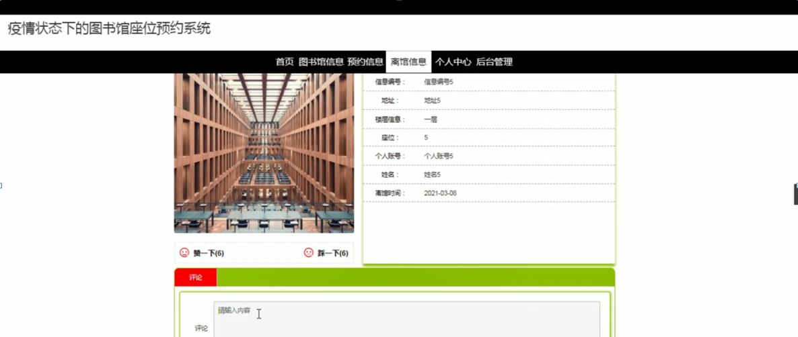

图5-6离馆信息界面图

### 5.2用户后台功能模块

用户登录进入疫情状态下的图书馆座位预约系统可以查看首页、个人中心、图书馆信息管理、预约信息管理、离馆信息管理、我的收藏管理等内容进行详细操作，如图5-7所示。

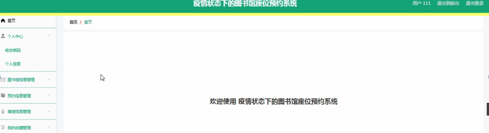

图5-7用户后台功能界面图

图书馆信息管理，在图书馆信息管理页面可以对信息编号、图书馆名称、相关图片、地址、楼层信息、座位、预约开始、预约结束等信息进行详情、预约或离馆等操作，如图5-8所示。

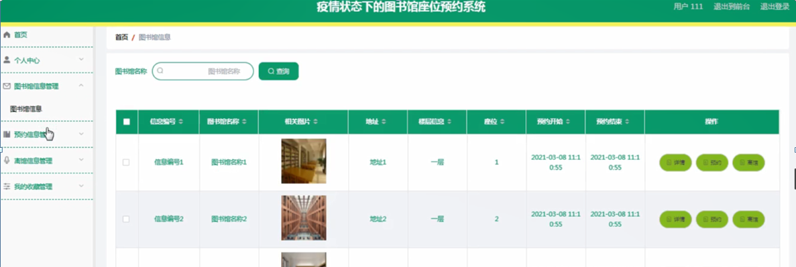

图5-8图书馆信息管理界面图

### 5.3管理员功能模块

管理员登录，管理员通过输入账号，密码，选择角色等信息即可进行系统登录，如图5-9所示。

图5-9管理员登录界面图

管理员登录进入疫情状态下的图书馆座位预约系统可以查看首页、个人中心、用户管理、图书馆信息管理、预约信息管理、离馆信息管理、管理员管理、我的收藏管理、系统管理等内容进行详细操作，如图5-10所示。

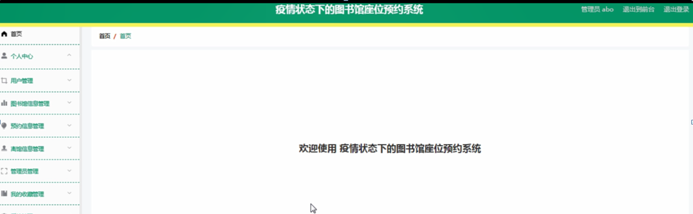

图5-10管理员功能界面图

用户管理，在用户管理页面可以对个人账号、密码、姓名、性别、身份证号码、手机号码、相片等信息进行详情、修改或删除等操作，如图5-11所示。

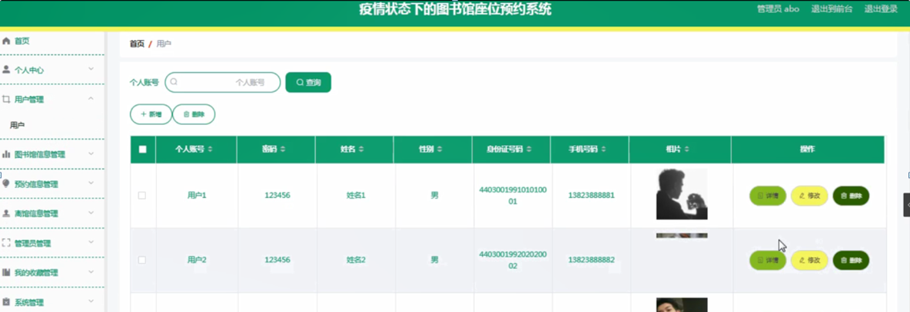

图5-11用户管理界面图

图书馆信息管理，在图书馆信息管理页面可以对信息编号、图书馆名称、相关图片、地址、楼层信息、座位、预约开始、预约结束等信息进行详情、修改、查看评论或删除等操作，如图5-12所示。

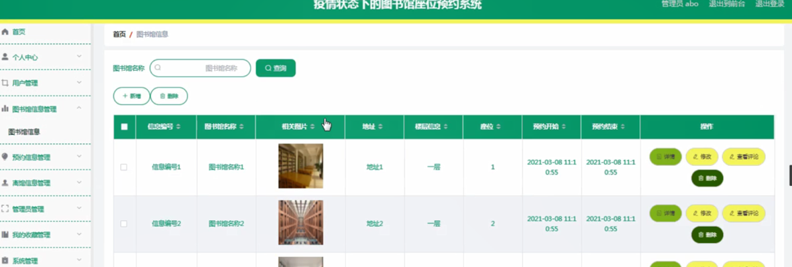

图5-12图书馆信息管理界面图

**JAVA** **毕设帮助，指导，源码分享，调试部署**

