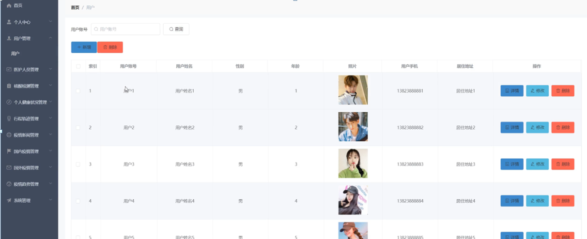
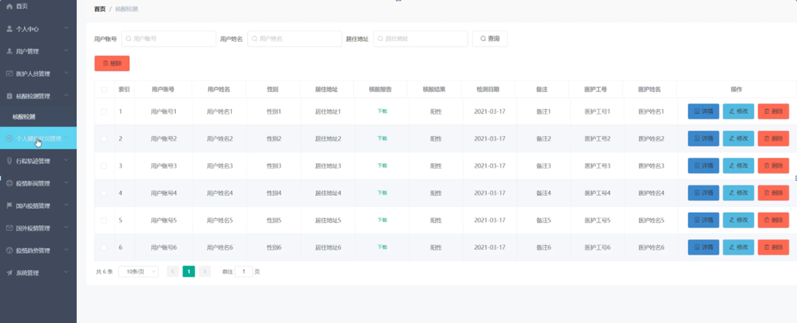

ssm+Vue计算机毕业设计疫情监测管理系统（程序+LW文档）

**项目运行**

**环境配置：**

**Jdk1.8 + Tomcat7.0 + Mysql + HBuilderX** **（Webstorm也行）+ Eclispe（IntelliJ
IDEA,Eclispe,MyEclispe,Sts都支持）。**

**项目技术：**

**SSM + mybatis + Maven + Vue** **等等组成，B/S模式 + Maven管理等等。**

**环境需要**

**1.** **运行环境：最好是java jdk 1.8，我们在这个平台上运行的。其他版本理论上也可以。**

**2.IDE** **环境：IDEA，Eclipse,Myeclipse都可以。推荐IDEA;**

**3.tomcat** **环境：Tomcat 7.x,8.x,9.x版本均可**

**4.** **硬件环境：windows 7/8/10 1G内存以上；或者 Mac OS；**

**5.** **是否Maven项目: 否；查看源码目录中是否包含pom.xml；若包含，则为maven项目，否则为非maven项目**

**6.** **数据库：MySql 5.7/8.0等版本均可；**

**毕设帮助，指导，本源码分享，调试部署** **(** **见文末** **)**

### 系统结构设计

整个系统是由多个功能模块组合而成的，要将所有的功能模块都一一列举出来，然后进行逐个的功能设计，使得每一个模块都有相对应的功能设计，然后进行系统整体的设计。

本疫情监测管理系统结构图如图3-2所示。

图3-2系统结构图

### 3.3 数据库设计

数据库可以说是所有软件的根本，如果数据库存在缺陷，那么会导致系统开发的不顺利、维护困难、用户使用不顺畅等一系列问题，严重时将会直接损害企业的利益，同时在开发完成后，数据库缺陷也更加难以解决。所以必须要对数据库设计重点把握，做到认真细致。因此，数据库设计是这个疫情监测管理系统的重点要素。

#### 3.3.1概念结构设计

(1)管理员实体属性图如下图3-3所示

图3-3管理员实体属性图

(2) 核酸检测管理实体属性如下图3-4所示

 图3-4核酸检测管理实体属性图

(3) 个人健康状况管理实体属性如下图3-5所示

 图3-5个人健康状况管理实体属性图

(4) 行程轨迹管理实体属性如下图3-6所示

图3-6行程轨迹管理实体属性图

(5) 用户注册实体属性如下图3-7所示

图3-7用户注册实体属性图

### 系统功能模块

疫情监测管理系统，在系统首页可以查看首页、疫情新闻、国内疫情、国外疫情、疫情趋势、个人中心、后台管理等内容，如图4-1所示。

图4-1系统首页界面图

用户注册，在用户注册页面通过填写用户账号、密码、用户姓名、年龄、用户手机、居住地址等信息完成用户注册，如图4-2所示。

图4-2用户注册界面图

疫情新闻，在疫情新闻页面可以查看新闻标题、新闻类型、文章来源、发表时间、发表人等详细内容，如图4-3所示。

图4-3疫情新闻界面图

国内疫情，在国内疫情页面可以查看地区、新增确诊、累计确诊、治愈、死亡、时间等详细内容，如图4-4所示。

图4-4国内疫情界面图

疫情趋势，在疫情趋势页面可以查看标题、未来趋势、发布时间、发布人、来源等详细内容，如图4-5所示。

图4-5疫情趋势界面图

### 4.2管理员功能模块

管理员登录，管理员通过输入用户名、密码，选择角色并点击登录进行系统登录操作，如图4-6所示。

图4-6管理员登录界图面

管理员登录系统后，可以对首页、个人中心、用户管理、医护人员管理、核酸检测管理、个人健康状况管理、行程轨迹管理、疫情新闻管理、国内疫情管理、国外疫情管理、疫情趋势管理、系统管理等功能模块进行相应操作，如图4-7所示。

图4-7管理员功能界图面

用户管理，在用户管理页面可以对索引、用户账号、用户姓名、性别、年龄、照片、用户手机、居住地址等内容进行详情、修改、删除操作，如图4-8所示。

图4-8用户管理界面图

医护人员管理，在医护人员管理页面可以对索引、医护工号、医护姓名、性别、年龄、医护照片等内容进行详情、修改、删除操作，如图4-9所示。

图4-9医护人员管理界面图

核酸检测管理，在核酸检测管理页面可以对索引、用户账号、用户姓名、性别、居住地址、核酸报告、核酸结果、检测日期、备注、医护工号、医护姓名等内容进行详情、修改、删除操作，如图4-10所示。

图4-10核酸检测管理界面图

个人健康状况管理，在个人健康状况管理页面可以对索引、用户账号、用户姓名、性别、照片、年龄、身高、体重、血压、心率、体温、最近情况、测量日期、备注等内容进行详情、修改、删除操作，如图4-11所示。

图4-11个人健康状况管理界面图

行程轨迹管理，在行程轨迹管理页面可以对索引、用户账号、用户姓名、性别、居住地址、最近外出史、半月行踪、更新时间、备注等内容进行详情、修改、删除操作，如图4-12所示。

图4-12行程轨迹管理界面图

#### **JAVA** **毕设帮助，指导，源码分享，调试部署**

