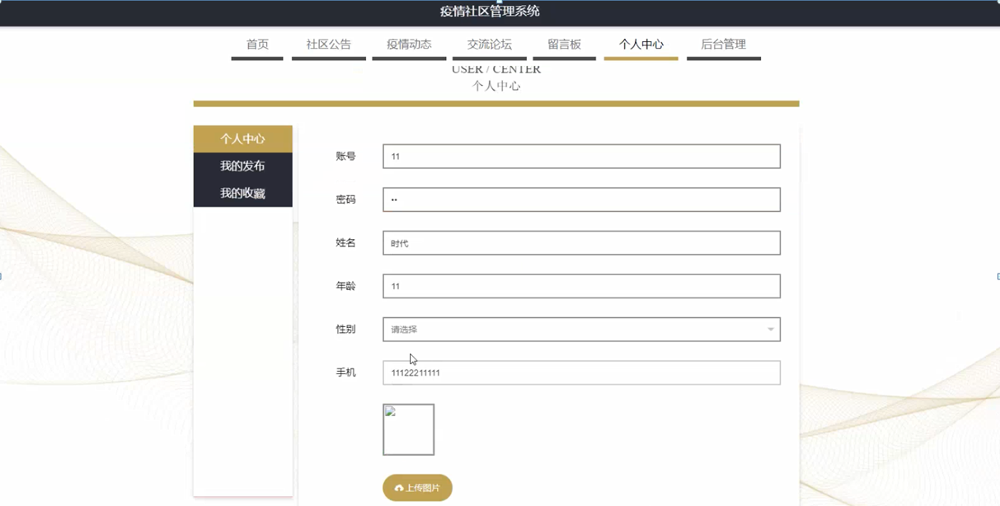

ssm+Vue计算机毕业设计疫情社区管理系统（程序+LW文档）

**项目运行**

**环境配置：**

**Jdk1.8 + Tomcat7.0 + Mysql + HBuilderX** **（Webstorm也行）+ Eclispe（IntelliJ
IDEA,Eclispe,MyEclispe,Sts都支持）。**

**项目技术：**

**SSM + mybatis + Maven + Vue** **等等组成，B/S模式 + Maven管理等等。**

**环境需要**

**1.** **运行环境：最好是java jdk 1.8，我们在这个平台上运行的。其他版本理论上也可以。**

**2.IDE** **环境：IDEA，Eclipse,Myeclipse都可以。推荐IDEA;**

**3.tomcat** **环境：Tomcat 7.x,8.x,9.x版本均可**

**4.** **硬件环境：windows 7/8/10 1G内存以上；或者 Mac OS；**

**5.** **是否Maven项目: 否；查看源码目录中是否包含pom.xml；若包含，则为maven项目，否则为非maven项目**

**6.** **数据库：MySql 5.7/8.0等版本均可；**

**毕设帮助，指导，本源码分享，调试部署** **(** **见文末** **)**

### 软件功能模块设计

网站整功能如下图所示：

**图 4-1** **疫情社区管理系统总体功能模块图**

### 4.2 数据库设计

#### 4.2.1 概念模型设计

概念模型是对现实中的问题出现的事物的进行描述，ER图是由实体及其关系构成的图，通过E-R图可以清楚地描述系统涉及到的实体之间的相互关系。

用户信息实体图如图4-2所示：

图4-2用户信息实体图

疫情动态实体图如图4-3所示：

图4-3疫情动态实体图

### **系统前台功能模块**

用户注册，在用户注册页面通过填写账号、密码、再次输入密码、姓名、年龄、手机等信息完成用户注册操作，如图5-1-1所示；用户注册好之后，填写账号和密码进行登录，登录到疫情社区管理系统可以进行相应操作，如图5-1-2所示。

图5-1-1用户注册界面图

图5-1-2用户登录界面图

疫情社区管理系统，在网站首页可以查看首页、社区公告、疫情动态、交流论坛、留言板、个人中心、后台管理等内容，并进行相关的操作，网站首页如图5-2所示。

图5-2网站首页界面图

点击疫情动态，用户可以查看标题、图片、简介、地区、发布时间、点击次数、内容等疫情动态详情，并进行点我收藏的操作；疫情动态页面如图5-3所示。

图5-3疫情动态界面图

在留言板页面，用户可以查看其他人发布的留言，也可以通过输入留言和图片，点击立即提交进行留言，如图5-4所示。

图5-4留言板界面图

个人中心，在个人信息页面通过填写账号、密码、姓名、年龄、性别、手机、上传图片等信息进行更新信息，并对我的发布、我的收藏进行操作，用户还可以点击退出登录的按钮退出系统前台，如图5-5所示。

图5-5个人中心界面图

点击社区公告，用户可以查看公告标题、图片、简介、发布时间、点击次数、内容等信息，并进行收藏、评论的操作，社区公告页面如图5-6所示。

图5-6社区公告界面图

###

### 5.2管理员功能模块

管理员进行登录，进入系统前在登录页面根据要求填写用户名和密码，选择角色等信息，点击登录进行登录操作，如图5-7所示。

图5-7管理员登录界面图

管理员登录系统后，可以对个人中心、社区公告管理、用户管理、体温上报管理、用户举报管理、出入申请管理、来访登记管理、疫情动态管理、留言板管理、交流论坛、系统管理等进行相应的操作管理，如图5-8所示。

图5-8管理员功能界面图

用户管理，在用户管理页面可以对索引、账号、姓名、年龄、性别、手机、照片等内容进行详情、修改或删除、新增等操作，如图5-9所示。

图5-9用户管理界面图

在体温上报管理页面，管理员可以对索引、账号、姓名、体温、健康码、有无不适、去向史、接触史、备注、日期等内容进行查看详情、修改、删除或查询等操作，如图5-10所示。

图5-10体温上报管理界面图

在出入申请管理页面，管理员可以对索引、账号、姓名、类型、时间段、目的地、出入时长、申请时间、审核回复、审核状态等内容进行审核、查看详情、删除或查询等操作，如图5-11所示。

图5-11出入申请管理界面图

在用户举报管理页面页面，可以对索引、标题、举报时间、账号、姓名、审核回复、审核状态等进行审核、查看详情、删除或查询等操作，如图5-12所示。

图5-12用户举报管理界面图

#### **JAVA** **毕设帮助，指导，源码分享，调试部署**

