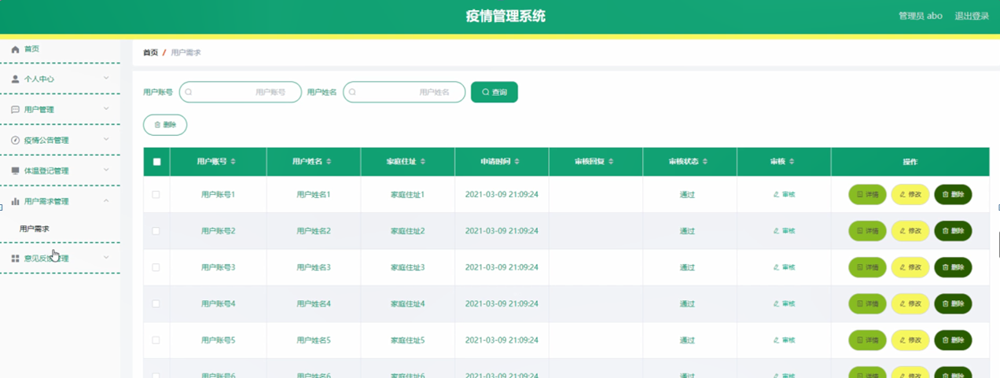

ssm+Vue计算机毕业设计疫情管理系统（程序+LW文档）

**项目运行**

**环境配置：**

**Jdk1.8 + Tomcat7.0 + Mysql + HBuilderX** **（Webstorm也行）+ Eclispe（IntelliJ
IDEA,Eclispe,MyEclispe,Sts都支持）。**

**项目技术：**

**SSM + mybatis + Maven + Vue** **等等组成，B/S模式 + Maven管理等等。**

**环境需要**

**1.** **运行环境：最好是java jdk 1.8，我们在这个平台上运行的。其他版本理论上也可以。**

**2.IDE** **环境：IDEA，Eclipse,Myeclipse都可以。推荐IDEA;**

**3.tomcat** **环境：Tomcat 7.x,8.x,9.x版本均可**

**4.** **硬件环境：windows 7/8/10 1G内存以上；或者 Mac OS；**

**5.** **是否Maven项目: 否；查看源码目录中是否包含pom.xml；若包含，则为maven项目，否则为非maven项目**

**6.** **数据库：MySql 5.7/8.0等版本均可；**

**毕设帮助，指导，本源码分享，调试部署** **(** **见文末** **)**

系统结构设计

系统设计主要是管理员登录后对整个系统相关操作进行处理，可进行管理员的添加和删除，首页、个人中心、用户管理、疫情公告管理、体温登记管理、用户需求管理、意见反馈管理等操作管理。

系统的功能结构图如下图所示。

图4-1系统功能结构图

E-R图设计

概念设计是整个数据库设计的关键，在概念设计阶段，由需求分析得到了E-
R模型。E-R图是识别功能模型与数据模型间关联关系的，在主题数据库的抽取和规范化的过程中，采用的是简化的E-R图表示方法，从而避免过繁过细的E-
R图表示影响规划的直观和可用性。是对现实世界的抽象和概括，是数据库设计人员进行数据可设计的有力工具，能够方便直接地表达应用中的各种语义知识，令一方面它简单、清晰、易于用户理解。

管理员实体包括管理员名称、密码和权限三个属性。

管理员体ER图如下图所示。

图4-2管理员ER图

体温登记管理ER图如下图所示。

图4-3体温登记管理ER图

用户需求管理ER图如下图所示。

图4-4用户需求管理ER图

登录模块的实现

系统登录模块可为管理员和用户登录模块，为确保系统安全性，系统操作员只有在登录界面输入正确的管理员名、密码选择角色，单击“登录”按钮后才能够进入本系统的主界面。

管理员登录流程图如下所示。

图5-1管理员登录流程图

登录界面如下图所示。

图5-2登录界面图

### 5.2管理员功能模块

管理员登录进入系统可以查看首页、个人中心、用户管理、疫情公告管理、体温登记管理、用户需求管理、意见反馈管理等信息进行相应操作，如图5-3所示。

图5-3管理员功能界面图

用户管理，在用户管理页面中可以对用户账号、用户姓名、性别、年龄、联系电话、电子邮箱、家庭住址等信息进行详情，修改或删除等操作，如图5-4所示。

图5-4用户管理界面图

疫情公告管理，在疫情公告管理页面中可以对标题、发布时间等信息进行详情，修改或删除等操作，如图5-5所示。

图5-5疫情公告管理界面图

体温登记管理，在体温登记管理页面中可以对用户账号、用户姓名、当日体温、是否不适、体温状态、登记时间等信息进行详情，修改或删除等操作，如图5-6所示。

图5-6体温登记管理界面图

用户需求管理，在用户需求管理页面中可以对用户账号、用户姓名、家庭住址、申请时间、审核回复、审核状态、审核等信息进行详情，修改或删除等操作，如图5-7所示。

图5-7用户需求管理界面图

意见反馈管理，在意见反馈管理页面中可以对用户账号、用户姓名、提交时间、审核回复、审核状态、审核等信息进行详情，修改或删除等操作，如图5-8所示。

图5-8意见反馈管理界面图

### 5.3用户功能模块

用户登录进入系统可以查看首页、个人中心、疫情公告管理、体温登记管理、用户需求管理、意见反馈管理等内容进行相应操作，如图5-9所示。

图5-9用户功能界面图

个人中心，在个人中心页面中可以填写用户账号、用户姓名、性别、年龄、联系电话、电子邮箱、家庭住址等信息进行修改操作，如图5-10所示。

图5-10个人中心界面图

疫情公告管理，在疫情公告管理页面中可以对标题、发布时间等信息进行详情操作，如图5-11所示。

图5-11疫情公告管理界面图

体温登记管理，在体温登记管理页面中可以对用户账号、用户姓名、当日体温、是否不适、体温状态、登记时间等信息进行详情，修改或删除等操作，如图5-12所示。

图5-12体温登记管理界面图

**JAVA** **毕设帮助，指导，源码分享，调试部署**

