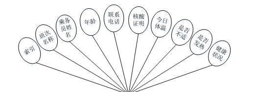

ssm+Vue计算机毕业设计疫情综合管控系统平台（程序+LW文档）

**项目运行**

**环境配置：**

**Jdk1.8 + Tomcat7.0 + Mysql + HBuilderX** **（Webstorm也行）+ Eclispe（IntelliJ
IDEA,Eclispe,MyEclispe,Sts都支持）。**

**项目技术：**

**SSM + mybatis + Maven + Vue** **等等组成，B/S模式 + Maven管理等等。**

**环境需要**

**1.** **运行环境：最好是java jdk 1.8，我们在这个平台上运行的。其他版本理论上也可以。**

**2.IDE** **环境：IDEA，Eclipse,Myeclipse都可以。推荐IDEA;**

**3.tomcat** **环境：Tomcat 7.x,8.x,9.x版本均可**

**4.** **硬件环境：windows 7/8/10 1G内存以上；或者 Mac OS；**

**5.** **是否Maven项目: 否；查看源码目录中是否包含pom.xml；若包含，则为maven项目，否则为非maven项目**

**6.** **数据库：MySql 5.7/8.0等版本均可；**

**毕设帮助，指导，本源码分享，调试部署** **(** **见文末** **)**

### 系统功能设计

系统的功能设计是整个系统的运行基础，是一个把设计需求替换成以计算机系统的形式表示出来。通过对疫情综合管控系统的调查、分析和研究，得出了该网站的总体规划，这是开发设计系统的初步核心。

系统功能结构图如图4-1所示。

图4-1系统功能结构图

### 4.2数据库设计

在整个系统来说，数据库的设计是相当重要的，需要非常仔细去设计。

本系统中涉及的各级权限分别是：

（1）用户登录权限，可以查看系统前台的疫情信息，修改查看自己的信息，并能修改个人资料，查看疫情信息，还可以在线留言，可以看到网站的公告等。

（2）管理员权限，管理员有系统的所有权限，包括用户的管理，可以添加、修改和删除任意权限的用户；还包括发布网站的前台疫情信息、网站公告等等。

#### 4.2.1概念结构设计

根据分析系统的数据需求，得到系统的实体属性图。

(1)用户管理E-R图，如图4-2所示：

图4-2用户管理息E-R图

(2)机票信息管理E-R图，如图4-3所示：

图4-3机票信息管理E-R图

(3)健康状态管理E-R图，如图4-4所示：

图4-4健康状态管理E-R图

### 系统功能模块

疫情综合管控系统，在系统首页可以查看首页，机票信息，疫情资讯，留言板，个人中心，后台管理，在线投诉等内容，并进行详细操作，如图5-1所示。

图5-1系统首页界面图

用户注册，在用户注册页面通过填写用户名，密码，确认密码，姓名，年龄，邮箱，身份证，手机等内容完成用户注册，如图5-2所示。

图5-2用户注册界面图

机票信息，在机票信息页面可以查看类型，地区，起点，终点，日期，起飞时间，座位类型，票数，价格，公里，时长等内容，并进行预约操作，如图5-3所示。

图5-3机票信息界面图

留言板，在留言板页面可以查看留言，图片等内容，并进行立即提交或重置等操作；如图5-4所示。

图5-4留言板界面图

个人中心，在个人中心页面通过填写用户名，密码，姓名，照片，性别，年龄，邮箱，身份证，手机等内容进行更新信息，如图5-5所示。

图5-5个人中心界面图

### 5.2管理员功能模块

管理员进行登录，进入系统前在登录页面根据要求填写用户名和密码，选择角色等信息，点击登录进行登录操作，如图5-6所示。

图5-6管理员登录界面图

管理员登录系统后，可以对首页，个人中心，用户管理，机票信息管理，机票预定管理，健康上报管理，健康状态管理，上报信息管理，留言板管理，系统管理等进行相应的操作管理，如图5-7所示。

图5-7管理员功能界面图

用户管理，在用户管理页面可以对索引，用户名，姓名，头像，性别，年龄，邮箱，身份证，手机等内容进行修改和删除等操作，如图5-8所示。

图5-8用户管理界面图

机票信息管理，在机票信息页面可以对索引，班次名称，类型，图片，地区，起点，终点，日期，起飞时间，座位类型，票数，价格，公里，时长等内容进行详情，修改和删除等操作，如图5-9所示。

图5-9机票信息管理界面图

健康状态管理，在健康状态页面可以对索引，班次名称，乘务员姓名，年龄，联系电话，核酸证明，今日体温，是否不适，是否发热，健康状况等内容进行详情，修改和删除等操作，如图5-10所示。

图5-10健康状态管理界面图

上报信息管理，在上报信息页面可以对索引，标题，类型，班次名称，起点，终点，名单，到达时间等内容进行详情，修改和删除等操作，如图5-11所示。

图5-11上报信息管理界面图

留言板管理，在留言板页面可以对索引，用户名，留言内容，留言图片，回复内容，回复图片等内容进行详情，修改，回复和删除等操作，如图5-12所示。

图5-12留言板管理界面图

#### **JAVA** **毕设帮助，指导，源码分享，调试部署**

