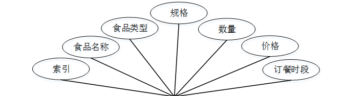
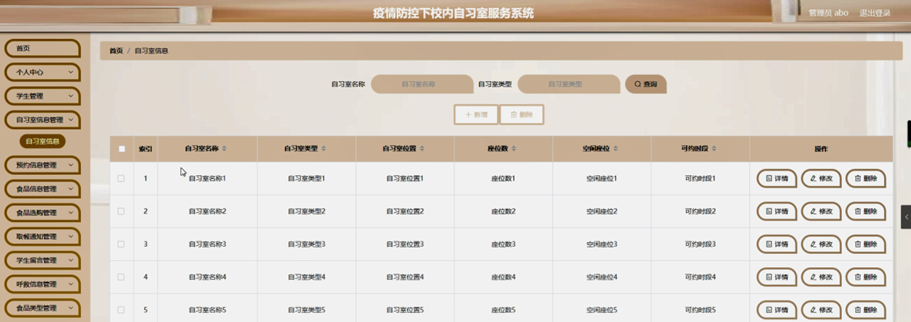

ssm+Vue计算机毕业设计疫情防控下校内自习室服务系统（程序+LW文档）

**项目运行**

**环境配置：**

**Jdk1.8 + Tomcat7.0 + Mysql + HBuilderX** **（Webstorm也行）+ Eclispe（IntelliJ
IDEA,Eclispe,MyEclispe,Sts都支持）。**

**项目技术：**

**SSM + mybatis + Maven + Vue** **等等组成，B/S模式 + Maven管理等等。**

**环境需要**

**1.** **运行环境：最好是java jdk 1.8，我们在这个平台上运行的。其他版本理论上也可以。**

**2.IDE** **环境：IDEA，Eclipse,Myeclipse都可以。推荐IDEA;**

**3.tomcat** **环境：Tomcat 7.x,8.x,9.x版本均可**

**4.** **硬件环境：windows 7/8/10 1G内存以上；或者 Mac OS；**

**5.** **是否Maven项目: 否；查看源码目录中是否包含pom.xml；若包含，则为maven项目，否则为非maven项目**

**6.** **数据库：MySql 5.7/8.0等版本均可；**

**毕设帮助，指导，本源码分享，调试部署** **(** **见文末** **)**

### 数据库设计

信息管理系统的效率和实现的效果完全取决于数据库结构设计的好坏。为了保证数据的完整性，提高数据库存储的效率，那么统一合理地设计数据库结构是必要的。数据库设计一般包括如下几个步骤：

（1）根据用户需求，确定数据库信息进行保存

对用户的需求分析是数据库设计的第一阶段，用户的需求调研，熟悉运作流程，系统要求，这些都是以概念模型为基础的。

（2）设计数据的概念模型

概念模型与数据建模用户的观点一致，用于信息世界的建模工具。通过E-R图可以清楚地描述系统涉及到的实体之间的相互关系。

学生注册实体图如图4-1所示：

图4-1学生注册实体图

自习室信息实体图如图4-2所示：

图4-2自习室信息实体图

食品信息实体图如图4-3所示：

图4-3食品信息实体图

### 系统登录注册

用户登录系统，通过输入用户名、密码，选择角色并点击登录进行系统登录操作，如图5-1所示。

图5-1登录界面图

学生注册，在学生注册页面通过填写学号,密码,确认密码,姓名,班级,手机,邮箱等信息完成学生注册，如图5-2所示。

图5-2学生注册界面图

### 5.2管理员功能模块

管理员登录系统后，可以对首页,个人中心,学生管理,自习室信息管理,预约信息管理,食品信息管理,食品选购管理,取餐通知管理,学生留言管理,呼救信息管理,食品类型管理等功能模块进行相应操作，如图5-3所示。

图5-3管理员功能界面图

学生管理，在学生管理页面可以对索引,学号,姓名,性别,班级,手机,邮箱等信息进行详情，修改和删除等操作，如图5-4所示。

图5-4学生管理界面图

自习室信息管理，在自习室信息管理页面可以对索引,自习室名称,自习室类型,自习室位置,座位数,空闲座位,可约时段等信息进行详情，修改和删除等操作，如图5-5所示。

图5-5自习室信息管理界面图

预约信息管理，在预约信息管理页面可以对索引,自习室名称,自习室类型,自习室位置,预约座位,预约时间,备注,学号,姓名,审核回复,审核状态,审核等信息进行详情和删除等操作，如图5-6所示。

图5-6预约信息管理界面图

食品信息管理，在食品信息管理页面可以对索引,食品名称,食品类型,规格,数量,价格,订餐时段等信息进行详情，修改和删除等操作，如图5-7所示。

图5-7食品信息管理界面图

食品选购管理，在食品选购管理页面可以对索引,订单编号,食品名称,食品类型,规格,数量,价格,总价,选购类型,选购时间,备注,学号,姓名,是否支付,审核回复,审核状态,审核等信息进行详情和删除等操作，如图5-8所示。

图5-8食品选购管理界面图

取餐通知，在取餐通知页面可以对索引,标题,通知时间,学号,姓名等信息进行详情，修改和删除等操作，如图5-9所示。

图5-9取餐通知界面图

学生留言管理，在学生留言管理页面可以对索引,标题,留言时间,学号,姓名等信息进行详情和删除等操作，如图5-10所示。

图5-10学生留言管理界面图

呼救信息管理，在呼救信息管理页面可以对索引,学号,姓名,体温,呼救时间,审核回复,审核状态,审核等信息进行详情和删除等操作，如图5-11所示。

图5-11呼救信息管理界面图

食品类型管理，在食品类型管理页面可以对索引,类型等信息进行修改和删除操作，如图5-12所示。

图5-12食品类型管理界面图

#### **JAVA** **毕设帮助，指导，源码分享，调试部署**

