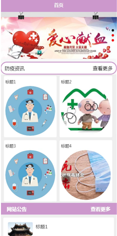
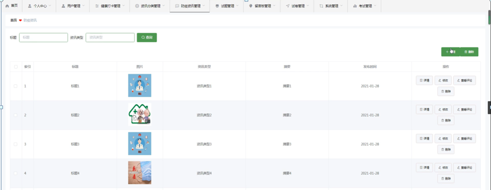

ssm+Vue计算机毕业设计疫情防控健康调查管理小程序（程序+LW文档）

**项目运行**

**环境配置：**

**Jdk1.8 + Tomcat7.0 + Mysql + HBuilderX** **（Webstorm也行）+ Eclispe（IntelliJ
IDEA,Eclispe,MyEclispe,Sts都支持）。**

**项目技术：**

**SSM + mybatis + Maven + Vue** **等等组成，B/S模式 + Maven管理等等。**

**环境需要**

**1.** **运行环境：最好是java jdk 1.8，我们在这个平台上运行的。其他版本理论上也可以。**

**2.IDE** **环境：IDEA，Eclipse,Myeclipse都可以。推荐IDEA;**

**3.tomcat** **环境：Tomcat 7.x,8.x,9.x版本均可**

**4.** **硬件环境：windows 7/8/10 1G内存以上；或者 Mac OS；**

**5.** **是否Maven项目: 否；查看源码目录中是否包含pom.xml；若包含，则为maven项目，否则为非maven项目**

**6.** **数据库：MySql 5.7/8.0等版本均可；**

**毕设帮助，指导，本源码分享，调试部署** **(** **见文末** **)**

#### 实体ER图

数据库是整个软件编程中最重要的一个步骤，对于数据库问题主要是判定数据库的数量和结构公式的创建。展示系统使用的是Mysql进行对数据库进行管理，进行保证数据的安全性、稳定性等。

概念模型的设计是为了抽象真实世界的信息，并对信息世界进行建模。它是数据库设计的强大工具。数据库概念模型设计可以通过E-R图描述现实世界的概念模型。系统的E-
R图显示了系统中实体之间的链接。而且Mysql数据库是自我保护能力比较强的数据库，下图主要是对数据库实体的E-R图：

(1) 防疫资讯管理E-R图，如图4-3所示：

图4-3防疫资讯管理实体属性图

(2) 健康打卡管理E-R图如图4-4所示：

图4-4健康打卡管理实体图

这些功能可以充分满足疫情防控健康调查管理小程序的需求。此系统功能较为全面如下图系统功能结构如图4-5所示。

图4-5系统功能结构图

### 用户端

用户登录，用户通过输入用户名和密码，选择角色并点击登录进行系统登录操作，如图5-1所示。

图5-1登录界面图

注册，在注册页面通过填写用户名、密码、姓名、年龄、性别、手机、邮箱等信息完成注册，如图5-2所示。

图5-2注册界面图

用户登陆系统后，可以对首页、防疫资讯、网站公告、我的等功能模块进行操作，如图5-3所示。

图5-3系统首页界面图

防疫资讯，在防疫资讯页面可以查看标题、资讯类型、发布时间等信息进行赞、踩操作，如图5-4所示。

图5-4防疫资讯界面图

我的，在我的页面可以对健康打卡、我的收藏管理、试卷列表、考试记录、留言板等详细信息进行操作，如图5-5所示。

图5-5我的界面图

健康打卡，在健康打卡页面可以填写用户名、姓名、手机、打卡图片、体温、是否有不适症状、是否发热、打卡时间等信息进行提交，如图5-6所示。

图5-6健康打卡界面图

### 5.2管理端

管理员登录，管理员通过输入账号和密码，选择角色并点击登录进行系统登录操作，如图5-7所示。

图5-7管理员登录界图面

管理员登陆系统后，可以对首页、个人中心、用户管理、健康打卡管理、资讯分类管理、防疫资讯管理、试题管理、留言板管理、试卷管理、系统管理、考试管理等功能模块进行相应操作，如图5-8所示。

图5-8管理员功能界图面

用户管理，在用户管理页面可以对索引、用户名、密码、姓名、年龄、性别、手机、邮箱、头像等内容进行详情，修改或删除等操作，如图5-9所示。

图5-9用户管理界面图

健康打卡管理，在健康打卡管理页面可以对索引、用户名、姓名、手机、打卡图片、体温、是否有不适症状、是否发热、打卡时间等内容进行详情，删除等操作，如图5-10所示。

图5-10健康打卡管理界面图

资讯分类管理，在资讯分类管理页面可以对索引、资讯类型等内容进行详情，修改或删除等操作，如图5-11所示。

图5-11资讯分类管理界面图

防疫资讯管理，在防疫资讯管理页面可以对索引、标题、图片、资讯类型、摘要、发布时间等内容进行详情、查看评论、修改或删除等操作，如图5-12所示。

图5-12防疫资讯管理界面图

**JAVA** **毕设帮助，指导，源码分享，调试部署**

