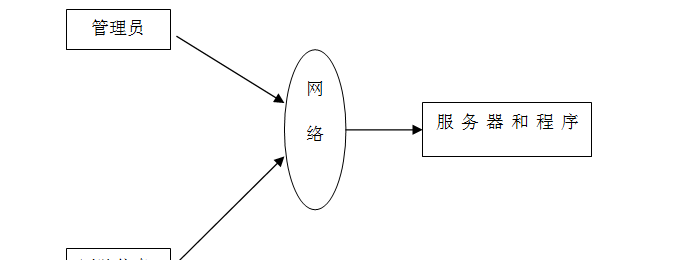

ssm+Vue计算机毕业设计疫情防控医用品管理2022（程序+LW文档）

**项目运行**

**环境配置：**

**Jdk1.8 + Tomcat7.0 + Mysql + HBuilderX** **（Webstorm也行）+ Eclispe（IntelliJ
IDEA,Eclispe,MyEclispe,Sts都支持）。**

**项目技术：**

**SSM + mybatis + Maven + Vue** **等等组成，B/S模式 + Maven管理等等。**

**环境需要**

**1.** **运行环境：最好是java jdk 1.8，我们在这个平台上运行的。其他版本理论上也可以。**

**2.IDE** **环境：IDEA，Eclipse,Myeclipse都可以。推荐IDEA;**

**3.tomcat** **环境：Tomcat 7.x,8.x,9.x版本均可**

**4.** **硬件环境：windows 7/8/10 1G内存以上；或者 Mac OS；**

**5.** **是否Maven项目: 否；查看源码目录中是否包含pom.xml；若包含，则为maven项目，否则为非maven项目**

**6.** **数据库：MySql 5.7/8.0等版本均可；**

**毕设帮助，指导，本源码分享，调试部署** **(** **见文末** **)**

### 系统体系结构

疫情防控医用品管理的结构图4-1所示：

图4-1 系统结构

登录系统结构图，如图4-2所示：

图4-2 登录结构图

管理员结构图，如图4-3所示。

图4-3 管理员结构图

### 数据库设计原则

学习编程，我们都知道数据库设计是基于需要设计的系统功能，我们需要建立一个数据库关系模型，用于存储数据信息，这样当我们在程序中时，就没有必要为程序页面添加数据，从而提高系统的效率。数据库存储了很多信息，可以说是信息管理系统的核心和基础，数据库还提供了添加、删除、修改和检查，使系统能够快速找到自己想要的信息，而不是在程序代码中找到。数据库中信息表的每个部分根据一定的关系精确地组合，排列和组合成数据表。

通过疫情防控医用品管理的功能进行规划分成几个实体信息，实体信息将通过ER图进行说明，本系统的主要实体图如下：

管理员信息属性图如图4-5所示。

图4-5 管理员信息实体属性图

物品信息实体属性图如图4-6所示。

图4-6物品信息实体属性图

物资信息实体属性图如图4-7所示。

图4-7物资信息实体属性图

物资捐赠管理实体属性图如图4-8所示。

图4-8物资捐赠管理实体属性图

### 系统功能模块

疫情防控医用品管理，在系统首页可以查看首页、物品信息、物资信息、公告信息、个人中心、后台管理、购物车等内容，如图5-1所示。

图5-1系统首页界面图

医院信息注册，在医院信息注册页面通过填写医院编号、密码、医院名称、联系人、联系电话、医院地址等信息完成医院信息注册，如图5-2所示。

图5-2医院信息注册界面图

物品信息，在物品信息页面可以查看物品名称、价格、物品编号、物品类别、规格、品牌、点击次数、详情、物品图片等详细内容，根据需要进行添加到购物车、立即购买等操作，如图5-3所示。

图5-3物品信息界面图

物资信息，在物资信息页面可以查看物资编号、物资名称、物资图片、规格、品牌、数量、详情等详细内容，根据需要进行申请调度操作，如图5-4所示。

图5-4物资信息界面图

我的，在个人中心页面通过填写医院编号、密码、医院名称、上传图片、联系人、联系电话、医院地址等信息进行更新信息，根据需要对我的订单、我的地址、我的收藏进行相应操作，如图5-5所示。

图5-5我的界面图

购物车，在购物车页面可以查看购买商品、价格、数量、总价等详细内容，并进行购买操作，如图5-6所示。

图5-6购物车界面图

### 5.2管理员功能模块

管理员登录，管理员通过输入用户名、密码，选择角色并点击登录进行系统登录操作，如图5-7所示。

图5-7管理员登录界面图

管理员登录系统后，可以对首页、个人中心、物品类别管理、物品信息管理、物资信息管理、物资入库管理、医院信息管理、物资调度管理、物资捐赠管理、管理员管理、系统管理、订单管理等功能模块进行相应操作，如图5-8所示。

图5-8管理员功能界面图

物品信息管理，在物品信息管理页面可以对索引、物品编号、物品名称、物品类别、物品图片、规格、品牌、价格等内容进行详情、修改或删除等操作，如图5-9所示。

图5-9物品信息管理界面图

物资信息管理，在物资信息管理页面可以对索引、物资编号、物资名称、物资图片、规格、品牌、数量等内容进行物资捐赠、物资入库、详情、修改等操作，如图5-10所示。

图5-10物资信息管理界面图

医院信息管理，在医院信息管理页面可以对索引、医院编号、密码、医院名称、医院图片、联系人、联系电话、医院地址等内容进行修改或删除等操作，如图5-11所示。

图5-11医院信息管理界面图

物资调度管理，在物资调度管理页面可以对索引、申请单号、物资名称、物资图片、规格、品牌、数量、申请日期、医院编号、医院名称、联系电话、医院地址、审核回复、审核状态、审核等内容进行详情、修改等操作，如图5-12所示。

图5-12物资调度管理界面图

**JAVA** **毕设帮助，指导，源码分享，调试部署**

