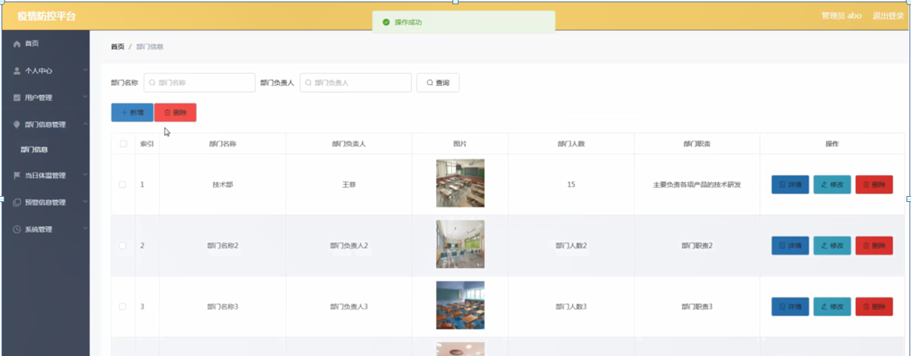

ssm+Vue计算机毕业设计疫情防控平台（程序+LW文档）

**项目运行**

**环境配置：**

**Jdk1.8 + Tomcat7.0 + Mysql + HBuilderX** **（Webstorm也行）+ Eclispe（IntelliJ
IDEA,Eclispe,MyEclispe,Sts都支持）。**

**项目技术：**

**SSM + mybatis + Maven + Vue** **等等组成，B/S模式 + Maven管理等等。**

**环境需要**

**1.** **运行环境：最好是java jdk 1.8，我们在这个平台上运行的。其他版本理论上也可以。**

**2.IDE** **环境：IDEA，Eclipse,Myeclipse都可以。推荐IDEA;**

**3.tomcat** **环境：Tomcat 7.x,8.x,9.x版本均可**

**4.** **硬件环境：windows 7/8/10 1G内存以上；或者 Mac OS；**

**5.** **是否Maven项目: 否；查看源码目录中是否包含pom.xml；若包含，则为maven项目，否则为非maven项目**

**6.** **数据库：MySql 5.7/8.0等版本均可；**

**毕设帮助，指导，本源码分享，调试部署** **(** **见文末** **)**

### 系统体系结构

疫情防控平台开发系统的结构图4-1所示：

图4-1 系统结构

模块包括首页、个人中心、用户管理、部门信息管理、当日体温管理、预警信息管理、系统管理等进行相应的操作。

登录系统结构图，如图4-2所示：

图4-2 登录结构图

这些功能可以充分满足疫情防控平台的需求。此系统功能较为全面如下图系统功能结构如图4-3所示。

图4-3系统功能结构图

### 4.2 数据库设计原则

每个数据库的应用它们都是和区分开的，当运行到一定的程序当中，它就会与自己相关的协议与客户端进行通讯。那么这个系统就会对使这些数据进行连接。当我们选择哪个桥段的时候，接下来就会简单的叙述这个数据库是如何来创建的。当点击完成按钮的时候就会自动在对话框内弹出数据源的名称，在进行点击下一步即可，直接在输入相对应的身份验证和登录密码。

疫情防控平台的数据流程：

图4-4 系统数据流程图

### 小程序端

用户登录，用户通过输入账号和密码，选择用户类型并点击登录进行系统登录操作，如图5-1所示。

图5-1用户登录界面图

用户登陆系统后，可以对首页、部门信息、我的等功能模块进行操作，如图5-2所示。

图5-2系统首页界面图

部门信息，在部门信息页面可以查看部门名称、部门负责人、部门图片、部门人数、部门职责等信息进行操作，如图5-3所示。

图5-3部门信息界面图

我的，在我的页面可以对当日体温、预警信息等详细信息进行操作，如图5-4所示。

图5-4我的界面图

用户信息，在用户信息页面可以填写用户名、密码、姓名、性别、部门、头像、身份证、手机等详细信息进行保存操作，如图5-5所示。

图5-5用户信息界面图

### 5.2服务端

管理员登录，管理员通过输入账号和密码，选择角色并点击登录进行系统登录操作，如图5-6所示。

图5-6管理员登录界图面

管理员登陆系统后，可以对首页、个人中心、用户管理、部门信息管理、当日体温管理、预警信息管理、系统管理等功能模块进行相应操作，如图5-7所示。

图5-7管理员功能界图面

用户管理，在用户管理页面可以对索引、用户名、密码、姓名、性别、部门、头像、身份证、手机等内容进行修改或删除等操作，如图5-8所示。

图5-8用户管理界面图

部门信息管理，在部门信息管理页面可以对索引、部门名称、部门负责人、图片、部门人数、部门职责等内容进行详情，修改或删除等操作，如图5-9所示。

图5-9部门信息管理界面图

当日体温管理，在当日体温管理页面可以对索引、名称、用户名、头像、姓名、部门、职位、工龄、出行轨迹、温度、日期等内容进行详情、预警、修改或删除等操作，如图5-10所示。

图5-10当日体温管理界面图

预警信息管理，在预警信息管理页面可以对索引、名称、头像、用户名、姓名、预警内容、日期等内容进行详情、修改或删除等操作，如图5-11所示。

图5-11预警信息管理界面图

系统管理，在公告信息页面可以对索引、标题、简介、图片等内容进行详情、修改或删除等操作，还可以对轮播图管理进行相应操作；如图5-12所示。

图5-12系统管理界面图

#### **JAVA** **毕设帮助，指导，源码分享，调试部署**

