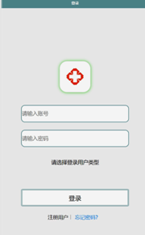

ssm+Vue计算机毕业设计疫情防控平台（程序+LW文档）

**项目运行**

**环境配置：**

**Jdk1.8 + Tomcat7.0 + Mysql + HBuilderX** **（Webstorm也行）+ Eclispe（IntelliJ
IDEA,Eclispe,MyEclispe,Sts都支持）。**

**项目技术：**

**SSM + mybatis + Maven + Vue** **等等组成，B/S模式 + Maven管理等等。**

**环境需要**

**1.** **运行环境：最好是java jdk 1.8，我们在这个平台上运行的。其他版本理论上也可以。**

**2.IDE** **环境：IDEA，Eclipse,Myeclipse都可以。推荐IDEA;**

**3.tomcat** **环境：Tomcat 7.x,8.x,9.x版本均可**

**4.** **硬件环境：windows 7/8/10 1G内存以上；或者 Mac OS；**

**5.** **是否Maven项目: 否；查看源码目录中是否包含pom.xml；若包含，则为maven项目，否则为非maven项目**

**6.** **数据库：MySql 5.7/8.0等版本均可；**

**毕设帮助，指导，本源码分享，调试部署** **(** **见文末** **)**

### 系统结构

本系统架构网站，本系统的具体功能如下：

图4-3系统功能结构图

系统结构图，如图4-4所示：

图4-4：系统结构图

### 4.3. 数据库设计

#### 4.3.1 数据库实体

管理员信息属性图如图4-5所示。

图4-5 管理员信息实体属性图

用户信息实体属性图如图4-6所示。

图4-6用户信息实体属性图

个人信息管理实体属性图如图4-7所示。

图4-7个人信息管理实体属性图

交流中心实体属性图如图4-8所示。

图4-8交流中心实体属性图

### 用户端

用户登录，用户通过输入账号和密码，选择角色并点击登录进行系统登录操作，如图5-1所示。

图5-1用户登录界面图

用户注册，在用户注册页面通过填写用户名、密码、姓名、性别、手机、部门、邮箱等信息进行注册操作；如图5-2所示。

图5-2用户注册界面图

用户登陆系统后，可以对首页、个人信息、交流中心、我的等功能模块进行操作，如图5-3所示。

图5-3系统首页界面图

个人信息，在个人信息页面通过填写用户名、姓名、性别、头像、部门、手机、体温、身体状态、是否就医、登记日期、备注等信息进行提交操作，如图5-4所示。

图5-4个人信息界面图

我的，在我的页面可以对个人信息、我要发帖、我的发帖等详细信息进行操作，如图5-5所示。

图5-5我的界面图

用户信息，在用户信息页面通过填写用户名、密码、姓名、性别、头像、手机、部门、邮箱等详细信息进行保存操作，如图5-6所示。

图5-6用户信息界面图

### 5.2管理端

管理员登录，管理员通过输入用户名、密码，选择角色并点击登录进行系统登录操作，如图5-7所示。

图5-7管理员登录界图面

管理员登陆系统后，可以对首页、个人中心、部门管理、用户管理、个人信息管理、交流中心、系统管理等功能模块进行相应操作，如图5-8所示。

图5-8管理员功能界图面

部门管理，在部门管理页面可以对索引、部门等内容进行详情、修改或删除等操作，如图5-9所示。

图5-9部门管理界面图

用户管理，在用户管理页面可以对索引、用户名、姓名、性别、头像、手机、部门、邮箱等内容进行详情，修改或删除等操作，如图5-10所示。

图5-10用户管理界面图

个人信息管理，在个人信息管理页面可以对索引、用户名、姓名、性别、头像、部门、手机、体温、身体状态、是否就医、登记日期、备注、审核回复、审核状态等内容进行详情，修改或删除等操作，如图5-11所示。

图5-11个人信息管理界面图

交流中心，在交流中心页面可以对索引、帖子标题、用户名、状态等内容进行详情，修改或删除等操作，如图5-13所示。

图5-12交流中心界面图

#### **JAVA** **毕设帮助，指导，源码分享，调试部署**

