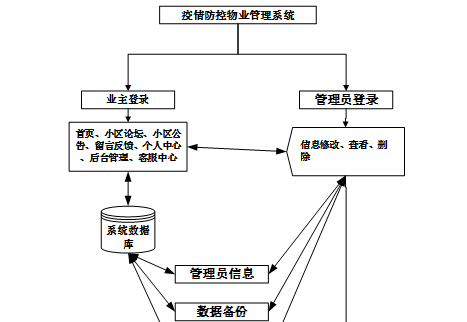
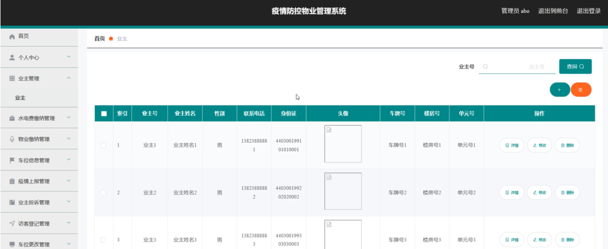

ssm+Vue计算机毕业设计疫情防控物业管理系统2022（程序+LW文档）

**项目运行**

**环境配置：**

**Jdk1.8 + Tomcat7.0 + Mysql + HBuilderX** **（Webstorm也行）+ Eclispe（IntelliJ
IDEA,Eclispe,MyEclispe,Sts都支持）。**

**项目技术：**

**SSM + mybatis + Maven + Vue** **等等组成，B/S模式 + Maven管理等等。**

**环境需要**

**1.** **运行环境：最好是java jdk 1.8，我们在这个平台上运行的。其他版本理论上也可以。**

**2.IDE** **环境：IDEA，Eclipse,Myeclipse都可以。推荐IDEA;**

**3.tomcat** **环境：Tomcat 7.x,8.x,9.x版本均可**

**4.** **硬件环境：windows 7/8/10 1G内存以上；或者 Mac OS；**

**5.** **是否Maven项目: 否；查看源码目录中是否包含pom.xml；若包含，则为maven项目，否则为非maven项目**

**6.** **数据库：MySql 5.7/8.0等版本均可；**

**毕设帮助，指导，本源码分享，调试部署** **(** **见文末** **)**

### 系统体系结构

疫情防控物业管理系统开发系统的结构图4-1所示：

图4-1 系统结构

模块包括首页、个人中心、业主管理、水电费缴纳管理、物业缴纳管理、车位信息管理、疫情上报管理、业主投诉管理、访客登记管理、车位更改管理、车辆类型管理、留言板管理、小区论坛、系统管理等进行相应的操作。

登录系统结构图，如图4-2所示：

图4-2 登录结构图

这些功能可以充分满足疫情防控物业管理系统的需求。此系统功能较为全面如下图系统功能结构如图4-3所示。

图4-3系统功能结构图

### 4.2 数据库设计原则

每个数据库的应用它们都是和区分开的，当运行到一定的程序当中，它就会与自己相关的协议与客户端进行通讯。那么这个系统就会对使这些数据进行连接。当我们选择哪个桥段的时候，接下来就会简单的叙述这个数据库是如何来创建的。当点击完成按钮的时候就会自动在对话框内弹出数据源的名称，在进行点击下一步即可，直接在输入相对应的身份验证和登录密码。

疫情防控物业管理系统的数据流程：

图4-4 系统数据流程图

疫情上报管理实体E-R图，如图4-5所示。

图4-5疫情上报管理E-R图

业主注册E-R图，如图4-6所示。

图4-6业主注册E-R图

访客登记管理E-R图，如图4-7所示。

图4-7访客登记管理E-R图

### 系统功能模块

疫情防控物业管理系统，在系统的首页可以查看首页、小区论坛、小区公告、留言反馈、个人中心、后台管理、客服中心等信息进行详细操作，如图5-1所示。

图5-1系统首页界面图

业主注册，在业主注册页面通过填写业主号、密码、业主姓名、联系电话、身份证、车牌号、楼房号、单元号等信息完成业主注册，如图5-2所示。

图5-2业主注册界面图

小区论坛，在小区论坛页面中输入标题、类型、内容等信息进行发布帖子或重置操作，如图5-3所示。

图5-3小区论坛界面图

小区公告，在小区公告页面可以查看标题、图片等信息，如图5-4所示。

图5-4小区公告界面图

留言反馈，在留言反馈页面输入留言内容并立即提交或重置操作，如图5-5所示。

图5-5留言反馈界面图

个人中心，在个人中心页面中填写业主号、密码、业主姓名、性别、联系电话、身份证、上传图片、车牌号、楼房号、单元号等信息进行更新信息，根据需要对我的发布进行详细操作，如图5-6所示。

图5-6个人中心界面图

### 5.2 管理员功能模块

管理员登录，管理员通过输入用户名、密码、选择角色等信息，然后点击登录就能登录到系统进行系统的使用了，如图5-7所示。

图5-7管理员登录界面图

管理员登录进入系统之后，就可以对所有的信息进行查看，可以查看到首页、个人中心、业主管理、水电费缴纳管理、物业缴纳管理、车位信息管理、疫情上报管理、业主投诉管理、访客登记管理、车位更改管理、车辆类型管理、留言板管理、小区论坛、系统管理等，并且还可以对其进行相应的操作管理，如图5-8所示。

图5-8管理员功能界面图

业主管理，在业主管理页面中可以对索引、业主号、业主姓名、性别、联系电话、身份证、头像、车牌号、楼房号、单元号等信息进行详情，修改或删除等操作，如图5-9所示。

图5-9业主管理界面图

水电费缴纳管理，在水电费缴纳管理页面中可以对索引、业主号、业主姓名、单元号、用水量、用电量、水费、电费、水电总费、收费时间、是否支付等信息进行详情，修改或删除等操作，如图5-10所示。

图5-10水电费缴纳管理界面图

物业缴纳管理，在物业缴纳管理页面中可以对索引、业主号、业主姓名、单元号、物业费、收费时间、是否支付等信息进行详情，修改或删除等操作，如图5-11所示。

图5-11物业缴纳管理界面图

车位信息管理，在车位信息管理页面中可以对索引、车辆名称、车位编号、车辆类型、车位区域、图片、备注、车牌号、业主号、业主姓名、审核回复、审核状态、审核等信息进行更改信息，删除等操作，如图5-12所示。

图5-12车位信息管理界面图

**JAVA** **毕设帮助，指导，源码分享，调试部署**

