ssm+Vue计算机毕业设计疫情防控管理系统（程序+LW文档）

**项目运行**

**环境配置：**

**Jdk1.8 + Tomcat7.0 + Mysql + HBuilderX** **（Webstorm也行）+ Eclispe（IntelliJ
IDEA,Eclispe,MyEclispe,Sts都支持）。**

**项目技术：**

**SSM + mybatis + Maven + Vue** **等等组成，B/S模式 + Maven管理等等。**

**环境需要**

**1.** **运行环境：最好是java jdk 1.8，我们在这个平台上运行的。其他版本理论上也可以。**

**2.IDE** **环境：IDEA，Eclipse,Myeclipse都可以。推荐IDEA;**

**3.tomcat** **环境：Tomcat 7.x,8.x,9.x版本均可**

**4.** **硬件环境：windows 7/8/10 1G内存以上；或者 Mac OS；**

**5.** **是否Maven项目: 否；查看源码目录中是否包含pom.xml；若包含，则为maven项目，否则为非maven项目**

**6.** **数据库：MySql 5.7/8.0等版本均可；**

**毕设帮助，指导，本源码分享，调试部署** **(** **见文末** **)**

### 系统总体架构设计

该款疫情防控管理系统；员工可以通过注册账号从而登入系统主界面来实现相对应的功能，分别是个人中心，健康上报管理，通知公告管理，外出报备管理，复工申请管理等功能。

系统使用Eclipse设计开发，使用MySql进行对数据的存储。后台读取数据并转换成json类型的数据进行传输，在客户端接收数据解析实现各功能并显示给用户。

该系统软件的功能结构图：

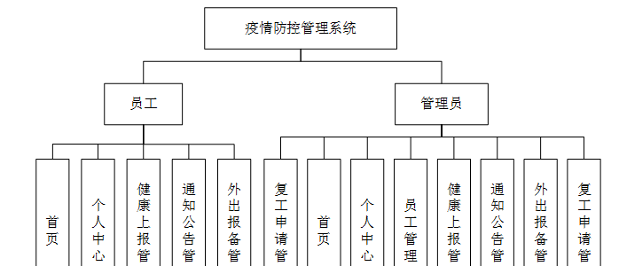

图4-1功能结构图

### 4.3 系统数据库的设计

#### 4.3.1数据库E/R图

ER图是由实体及其关系构成的图，通过E/R图可以清楚地描述系统涉及到的实体之间的相互关系。在系统中对一些主要的几个关键实体如下图：

  1. 员工注册E/R图如下所示：

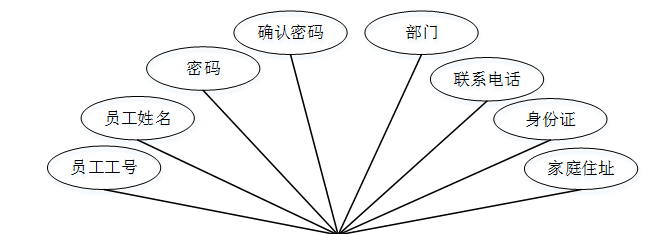

图4-2员工注册E/R图

(2)健康上报管理E/R图如下所示：

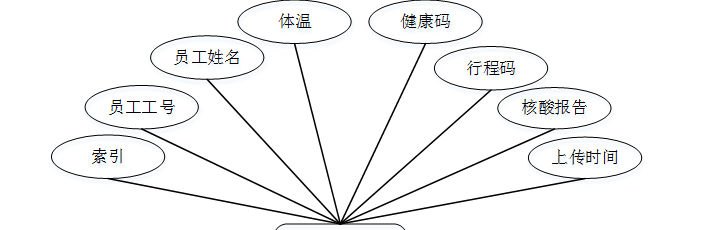

图4-3健康上报管理E/R图

### 系统登录注册

系统登录，管理员和员工进入系统前在登录页面根据要求填写用户名和密码，选择角色等信息，点击登录进行登录操作，如图5-1所示。

图5-1系统首页界面图

员工注册，在员工注册页面通过填写员工工号，员工姓名，密码，确认密码，部门，联系电话，身份证，家庭住址等信息进行注册操作，如图5-2所示。

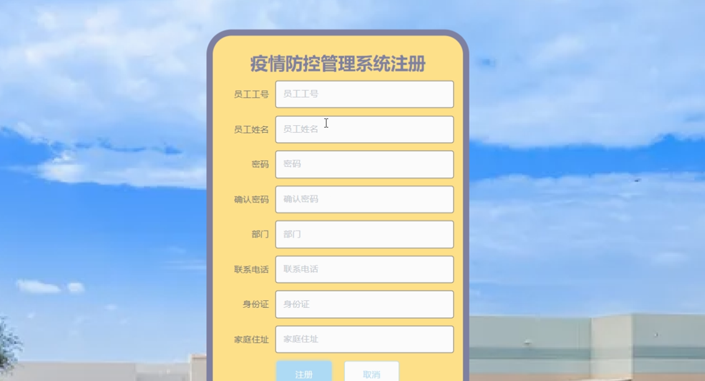

图5-2员工注册界面图

### 5.2管理员功能模块

管理员登录进入疫情防控管理系统可以对首页，个人中心，员工管理，健康上报管理，通知公告管理，外出报备管理，复工申请管理等功能进行相应的操作管理，如图5-3所示。

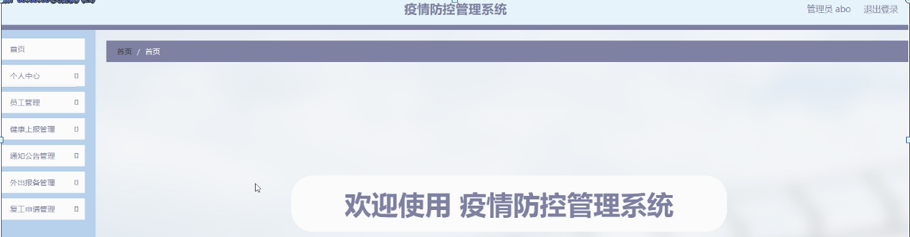

图5-3管理员功能界面图

员工管理，在员工管理页面可以对索引,员工工号，员工姓名，部门，性别，联系电话，身份证，家庭住址等内容进行详情，修改和删除等操作，如图5-4所示。

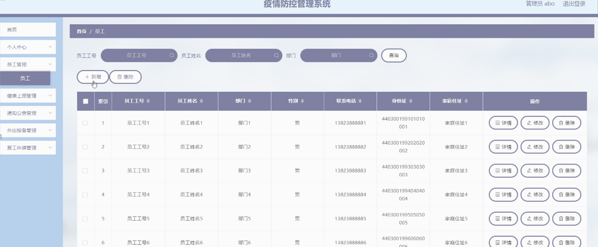

图5-4员工管理界面图

健康上报管理，在健康上报管理页面可以对索引,员工工号，员工姓名，体温，健康码，行程码，核酸报告，上传时间等内容进行详情，修改和删除等操作，如图5-5所示。

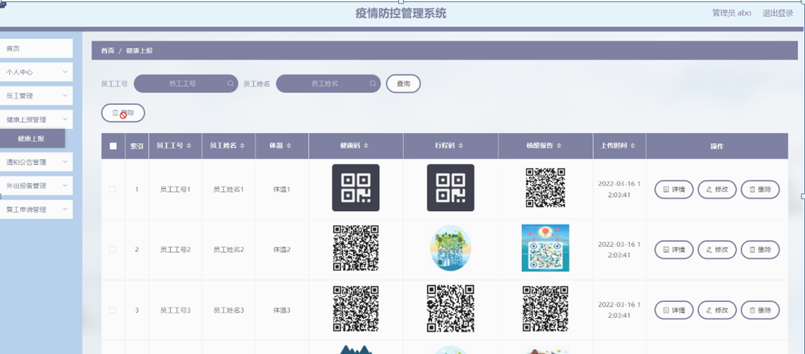

图5-5健康上报管理界面图

通知公告管理，在通知公告管理页面可以对索引,公告标题，公告类型，发布时间等内容进行详情，修改和删除等操作，如图5-6所示。

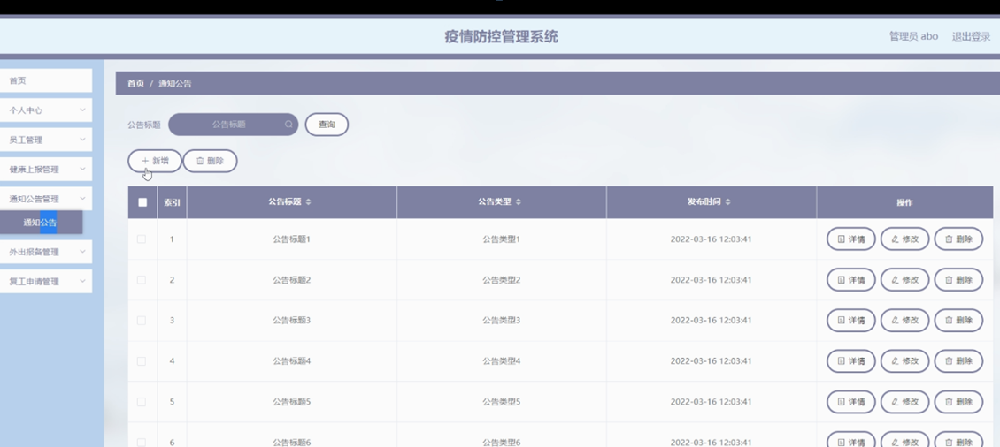

图5-6通知公告管理界面图

外出报备管理，在外出报备管理页面可以对索引,员工工号，员工姓名，部门，外出时间，目的地，体温，粤康码，审核回复，审核状态，审核等内容进行详情和删除等操作，如图5-7所示。

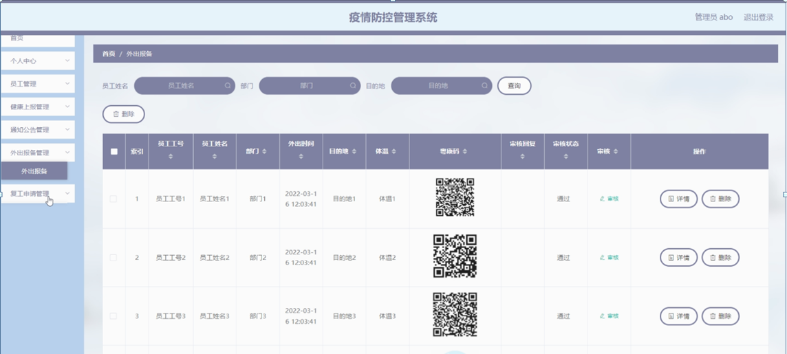

图5-7外出报备管理界面图

复工申请管理，在复工申请管理页面可以对索引,员工工号，员工姓名，部门，申请时间，粤康码，行程码，核酸码，体温，出发地，复工日期，审核回复,审核状态，审核等内容进行详情和删除操作，如图5-8所示。

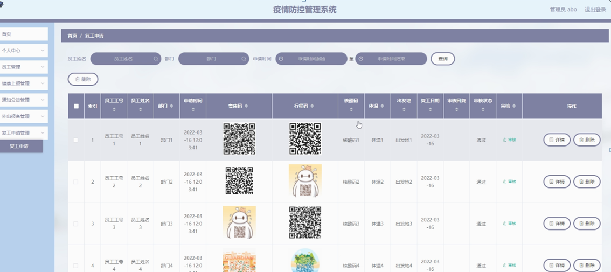

图5-8复工申请管理界面图

### 5.3员工功能模块

员工登录进入疫情防控管理系统可以对首页，个人中心，健康上报管理，通知公告管理，外出报备管理，复工申请管理等功能进行相应的操作管理，如图5-9所示。

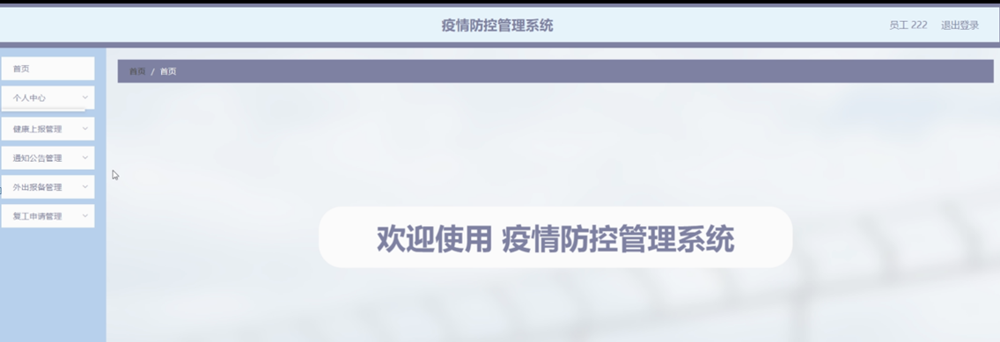

图5-9员工功能界面图

个人中心，在个人信息页面通过填写员工工号，员工姓名，部门，性别，联系电话，身份证，家庭住址等内容进行个人信息修改操作，如图5-10所示。

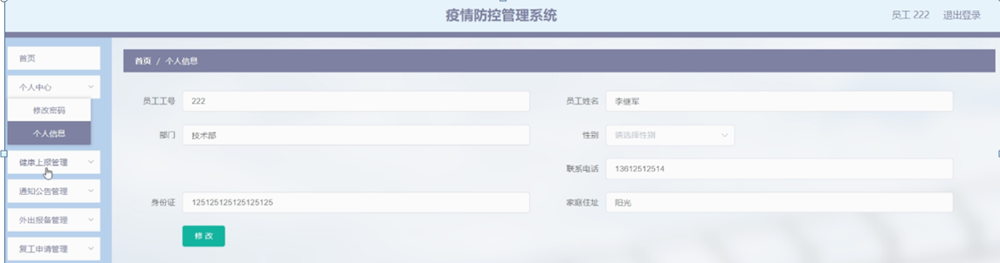

图5-10个人中心界面图

健康上报管理，在健康上报管理页面可以对索引,员工工号，员工姓名，体温，健康码，行程码，核酸报告，上传时间等内容进行详情，修改和删除等操作，如图5-11所示。

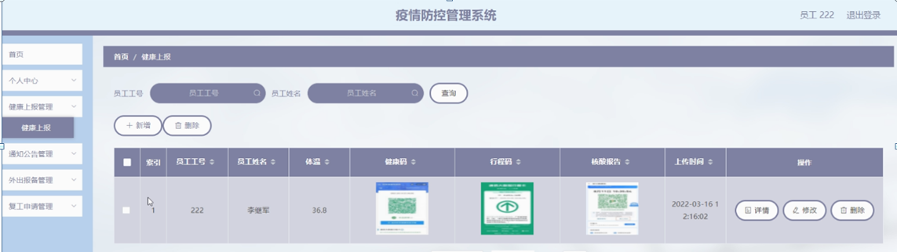

图5-11健康上报管理界面图

通知公告管理，在通知公告管理页面可以对索引,公告标题，公告类型，发布时间等内容进行详情操作，如图5-12所示。

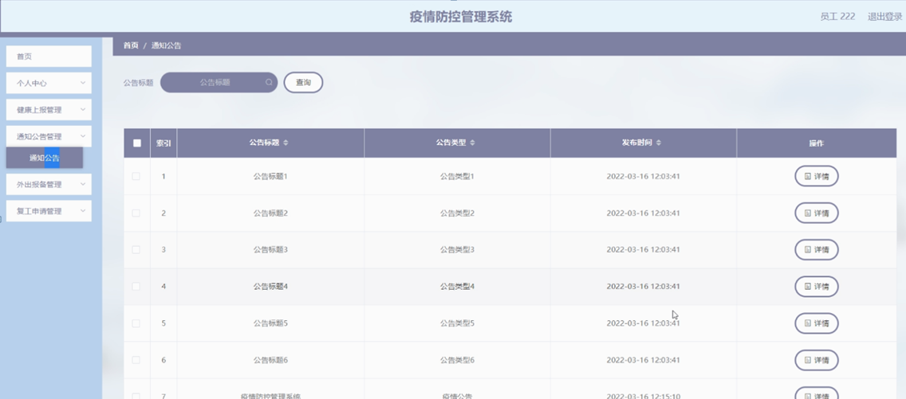

图5-12通知公告管理界面图

#### **JAVA** **毕设帮助，指导，源码分享，调试部署**

