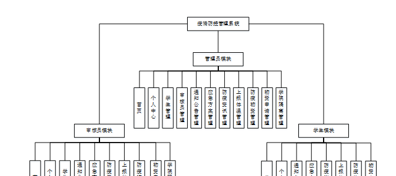
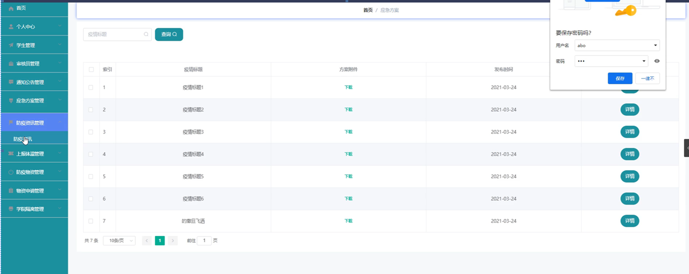
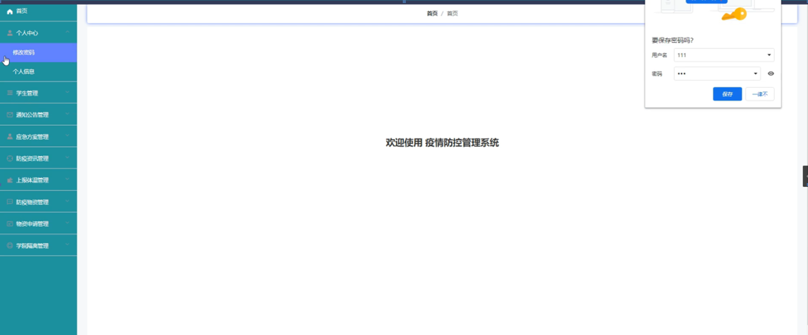

ssm+Vue计算机毕业设计疫情防控管理系统（程序+LW文档）

**项目运行**

**环境配置：**

**Jdk1.8 + Tomcat7.0 + Mysql + HBuilderX** **（Webstorm也行）+ Eclispe（IntelliJ
IDEA,Eclispe,MyEclispe,Sts都支持）。**

**项目技术：**

**SSM + mybatis + Maven + Vue** **等等组成，B/S模式 + Maven管理等等。**

**环境需要**

**1.** **运行环境：最好是java jdk 1.8，我们在这个平台上运行的。其他版本理论上也可以。**

**2.IDE** **环境：IDEA，Eclipse,Myeclipse都可以。推荐IDEA;**

**3.tomcat** **环境：Tomcat 7.x,8.x,9.x版本均可**

**4.** **硬件环境：windows 7/8/10 1G内存以上；或者 Mac OS；**

**5.** **是否Maven项目: 否；查看源码目录中是否包含pom.xml；若包含，则为maven项目，否则为非maven项目**

**6.** **数据库：MySql 5.7/8.0等版本均可；**

**毕设帮助，指导，本源码分享，调试部署** **(** **见文末** **)**

### 系统体系结构

疫情防控管理系统的结构图4-1所示：

图4-1 系统结构

登录系统结构图，如图4-2所示：

图4-2 登录结构图

系统架构图属于系统设计阶段，系统架构图只是这个阶段一个产物，系统的总体架构决定了整个系统的模式，是系统的基础。就业推荐系统的整体结构设计如图4-3所示。

图4-3 系统结构图

### 数据库设计原则

学习编程，我们都知道数据库设计是基于需要设计的系统功能，我们需要建立一个数据库关系模型，用于存储数据信息，这样当我们在程序中时，就没有必要为程序页面添加数据，从而提高系统的效率。数据库存储了很多信息，可以说是信息管理系统的核心和基础，数据库还为系统提供了添加、删除、修改和检查等操作模块，使系统能够快速找到自己想要的信息，而不是在程序代码中找到。数据库中信息表的每个部分根据一定的关系精确地组合，排列和组合成数据表。

通过疫情防控管理系统的功能进行规划分成几个实体信息，实体信息将通过ER图进行说明，本系统的主要实体图如下：

管理员信息属性图如图4-5所示。

图4-5 管理员信息实体属性图

学生信息实体属性图如图4-6所示。

图4-6学生信息属性图

防疫物资管理实体属性图如图4-7所示。

图4-7防疫物资管理实体属性图

物资申请管理实体属性图如图4-8所示。

图4-8物资申请管理实体属性图

### 管理员功能模块

管理员登录，通过填写用户名、密码、角色等信息，输入完成后选择登录即可进入疫情防控管理系统，如图5-1所示。

图5-1管理员登录界面图

管理员登录进入疫情防控管理系统后可以查看首页、个人中心、学生管理、审核员管理、通知公告管理、应急方案管理、防疫资讯管理、上报体温管理、防疫物资管理、物资申请管理、学院隔离管理等内容，如图5-2所示。

图5-2管理员功能界面图

学生管理，在学生管理页面中可以查看索引、学籍号、学生姓名、年龄、班级、性别、专业、联系电话、邮箱、身份证等信息，如图5-3所示。

图5-3学生管理界面图

审核员管理，在审核员管理页面中可以查看索引、账号、姓名、性别、联系电话、身份证、邮箱证等信息，还可以根据需要进行修改或删除等操作，如图5-4所示。

图5-4审核员管理界面图

应急方案管理，在应急方案管理页面中可以查看索引、疫情标题、方案附件、发布时间等信息，如图5-5所示。

图5-5应急方案管理界面图

物资申请管理，在物资申请管理页面中可以查看索引、物品编号、物品名称、数量、学籍号、学生姓名、时间、审核回复、审核状态等信息，还可以根据需要进行删除等操作，如图5-6所示。

图5-6物资申请管理界面图

### 5.2审核员功能模块

审核员登录进入疫情防控管理系统可以查看首页、个人中心、学生管理、通知公告管理、应急方案管理、防疫资讯管理、上报体温管理、防疫物资管理、物资申请管理、学院隔离管理等信息，如图5-7所示。

图5-7审核员功能界面图

个人中心，在个人中心页面中通过填写索引、学籍号、学生姓名、年级、班级、性别、专业、联系电话、邮箱、身份证等信息进行修改，如图5-8所示。

图5-8个人中心界面图

通知公告管理，在通知公告管理页面中可以查看索引、公告标题、公告类型、发布时间等信息，还可以根据需要进行修改或删除等操作，如图5-9所示。

图5-9通知公告管理界面图

应急方案管理，在应急方案管理页面中可以查看索引、疫情标题、方案附件、发布时间等信息，还可以根据需要进行修改或删除等操作，如图5-10所示。

图5-10应急方案管理界面图

防疫资讯管理，在防疫资讯管理页面中可以查看索引、标题、类型、时间、来源网等信息，还可以根据需要进行修改或删除等操作，如图5-11所示。

图5-11防疫资讯管理界面图

上报体温管理，在上报体温管理页面中可以查看索引、学籍号、学生姓名、当日体温、体温状态、上报时间等信息，如图5-12所示。

图5-12上报体温管理界面图

#### **JAVA** **毕设帮助，指导，源码分享，调试部署**

