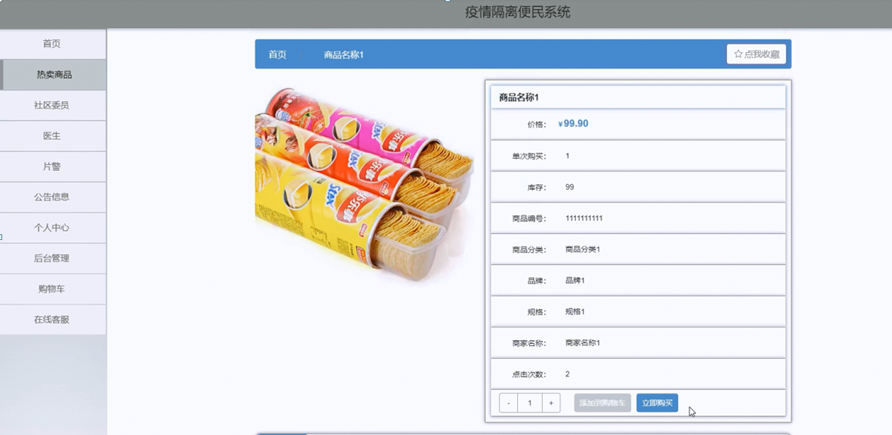

ssm+Vue计算机毕业设计疫情隔离便民系统（程序+LW文档）

**项目运行**

**环境配置：**

**Jdk1.8 + Tomcat7.0 + Mysql + HBuilderX** **（Webstorm也行）+ Eclispe（IntelliJ
IDEA,Eclispe,MyEclispe,Sts都支持）。**

**项目技术：**

**SSM + mybatis + Maven + Vue** **等等组成，B/S模式 + Maven管理等等。**

**环境需要**

**1.** **运行环境：最好是java jdk 1.8，我们在这个平台上运行的。其他版本理论上也可以。**

**2.IDE** **环境：IDEA，Eclipse,Myeclipse都可以。推荐IDEA;**

**3.tomcat** **环境：Tomcat 7.x,8.x,9.x版本均可**

**4.** **硬件环境：windows 7/8/10 1G内存以上；或者 Mac OS；**

**5.** **是否Maven项目: 否；查看源码目录中是否包含pom.xml；若包含，则为maven项目，否则为非maven项目**

**6.** **数据库：MySql 5.7/8.0等版本均可；**

**毕设帮助，指导，本源码分享，调试部署** **(** **见文末** **)**

###  系统总体架构设计

该款疫情隔离便民系统；用户可以通过注册账号从而登入系统主界面来实现相对应的功能，分别是查看首页，热卖商品，社区委员，医生，片警，公告信息，个人中心，后台管理，购物车，在线客服等功能。

系统使用Eclipse设计开发，使用MySql进行对数据的存储。后台读取数据并转换成json类型的数据进行传输，在客户端接收数据解析实现各功能并显示给户主。

该系统软件的功能结构图：

图4-1 功能结构图

### 4.3 系统数据库的设计

#### 4.3.1 数据库E/R图

ER图是由实体及其关系构成的图，通过E/R图可以清楚地描述系统涉及到的实体之间的相互关系。在系统中对一些主要的几个关键实体如下图：

  1. 户主注册E/R图如下所示：

图4-2户主注册E/R图

(2)个人中心E/R图如下所示：

图4-3个人中心E/R图

(3)社区委员E/R图如下所示：

图4-4社区委员E/R图

### 系统功能模块

疫情隔离便民系统，在系统首页可以查看首页，热卖商品，社区委员，医生，片警，公告信息，个人中心，后台管理，购物车，在线客服等内容，并进行详细操作；如图5-1所示。

图5-1系统首页界面图

户主注册，在用户注册页面通过填写户主账号,密码,确认密码,户主姓名,联系方式等信息进行注册操作；如图5-2所示。

图5-2户主注册界面图

热卖商品，在热卖商品页面可以查看商品名称，价格，单次购买，库存，商品编号，商品分类，品牌，规格，商家名称，点击次数等内容进行立即购买等操作；如图5-3所示。

图5-3热卖商品界面图

片警，在片警页面可以查看首页，片警账号，片警姓名，性别，联系电话，一键呼叫等内容进行操作；如图5-4所示。

图5-4片警界面图

个人中心，在个人中心页面通过填写户主账号,密码,户主姓名,上传图片，性别，联系方式，健康码，余额等内容进行更新信息操作，还可以对我的订单我的地址我的收藏进行详细操作；如图5-5所示。

图5-5个人中心界面图

### 5.2 后台功能模块

后台登录，进入疫情隔离便民系统前在登录页面根据要求填写用户名和密码，选择角色等信息，点击登录进行登录操作，如图5-6所示。

图5-6后台登录界面图

#### 5.2.1 管理员功能

管理员登录系统后，可以对首页，个人中心，户主管理，商家管理，商品分类管理，热卖商品管理，社区委员管理，在线咨询管理，医生管理，线上问诊管理，片警管理，一键呼叫管理，系统管理，订单管理等功能进行相应的操作管理，如图5-7所示。

图5-7管理员功能界面图

户主管理，在户主管理页面可以对索引,户主账号,户主姓名,照片，性别,联系方式，健康码等内容进行详情，修改和删除等操作，如图5-8所示。

图5-8户主管理界面图

商家管理，在商家管理页面可以对索引,商家名称，商家图片，商家地址，联系人，联系电话，经营范围等内容进行详情，修改和删除等操作，如图5-9所示。

图5-9商家管理界面图

热卖商品管理，在热卖商品管理页面可以对索引,商品编号,商品名称,封面，商品分类，品牌，规格，商家名称，价格，单限，库存等内容进行详情，修改，查看评论和删除等操作，如图5-10所示。

图5-10热卖商品管理界面图

社区委员管理，在社区委员管理页面可以对索引,委员账号，委员姓名，照片，性别，联系电话等内容进行详情，修改和删除等操作，如图5-11所示。

图5-11社区委员管理界面图

医生管理，在医生管理页面可以对索引,医生工号，医生姓名，照片，级别联系电话等内容进行详情，修改和删除等操作，如图5-12所示。

图5-12医生管理界面图

**JAVA** **毕设帮助，指导，源码分享，调试部署**

