ssm+Vue计算机毕业设计疫情隔离心理辅导系统（程序+LW文档）

**项目运行**

**环境配置：**

**Jdk1.8 + Tomcat7.0 + Mysql + HBuilderX** **（Webstorm也行）+ Eclispe（IntelliJ
IDEA,Eclispe,MyEclispe,Sts都支持）。**

**项目技术：**

**SSM + mybatis + Maven + Vue** **等等组成，B/S模式 + Maven管理等等。**

**环境需要**

**1.** **运行环境：最好是java jdk 1.8，我们在这个平台上运行的。其他版本理论上也可以。**

**2.IDE** **环境：IDEA，Eclipse,Myeclipse都可以。推荐IDEA;**

**3.tomcat** **环境：Tomcat 7.x,8.x,9.x版本均可**

**4.** **硬件环境：windows 7/8/10 1G内存以上；或者 Mac OS；**

**5.** **是否Maven项目: 否；查看源码目录中是否包含pom.xml；若包含，则为maven项目，否则为非maven项目**

**6.** **数据库：MySql 5.7/8.0等版本均可；**

**毕设帮助，指导，本源码分享，调试部署** **(** **见文末** **)**

### **系统设计主要功能**

通过市场调研及咨询研究，了解了用户的使用需求，于是制定了管理员、用户、咨询师的功能模块。其功能结构图如下图4-1所示：

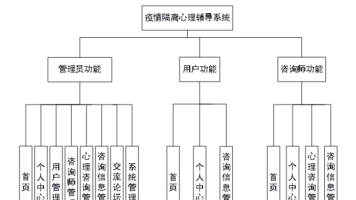

图4.1系统功能结构图

### **4.2** **数据库设计**

#### 4.2.1 数据库设计规范

数据可设计要遵循职责分离原则，即在设计时应该要考虑系统独立性，即每个系统之间互不干预不能混乱数据表和系统关系。

数据库命名也要遵循一定规范，否则容易混淆，数据库字段名要尽量做到与表名类似。

#### 4.2.2 E-R图

用户信息E-R图，如图4-2所示：

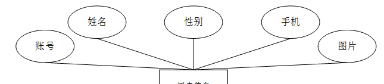

图4-2 用户信息E-R图

咨询师信息E-R图，如图4-3所示：

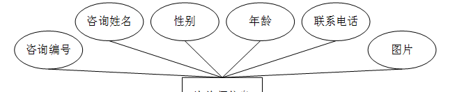

图4-3咨询师信息E-R图

心理咨询信息E-R图如图4-4所示。

图4-4心理咨询信息E-R图

咨询信息E-R图如图4-5所示。

图4-5咨询信息E-R图

### **前台功能模块**

疫情隔离心理辅导系统，在网站首页可以查看首页、心理咨询、交流论坛、疫情公告、个人中心、后台管理等内容操作，如图5-1所示。

图5-1网站首页界面图

用户注册，在注册页面通过填写账号、密码、确认密码、姓名、手机等信息进行注册，在登录页面通过填写账号、密码等信息进行角色登录，如图5-2所示。

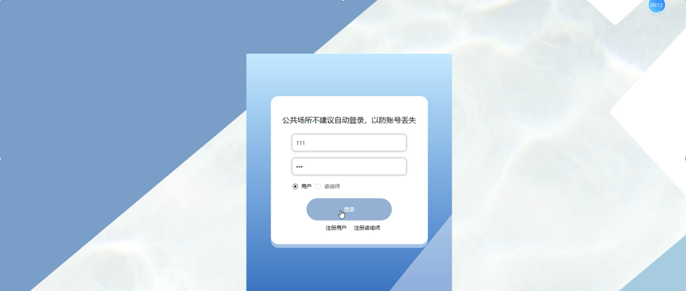

图5-2 用户注册、用户登录界面图

心理咨询；在心理咨询页面中可以查看咨询编号、咨询姓名、性别、年龄、联系电话、点击次数等内容，并进行咨询、收藏等操作；如图5-3所示。

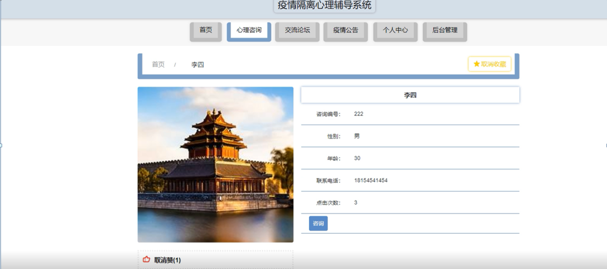

图5-3心理咨询界面图

在交流论坛页面查看帖子标题、用户名、状态，进行发布帖子，如图5-4所示。

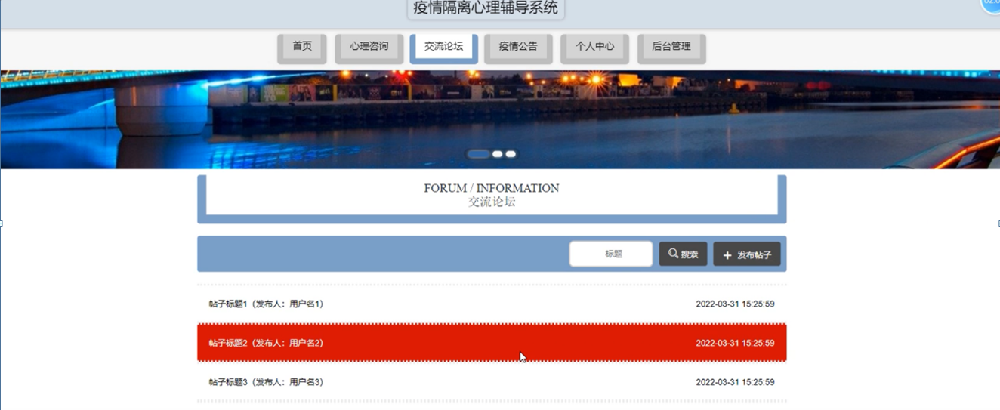

图5-4交流论坛界面图

在疫情公告页面查看标题、疫情公告内容，如图5-5所示。

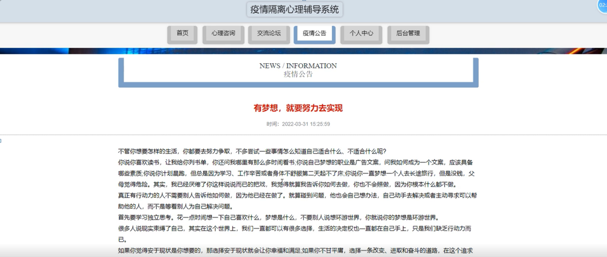

图5-5疫情公告界面图

在个人中心页面通过编辑账号、姓名、性别、手机、图片等信息进行修改、更新信息，还能对我的发布、我的收藏进行相应操作，如图5-6 5-7 5-8所示。

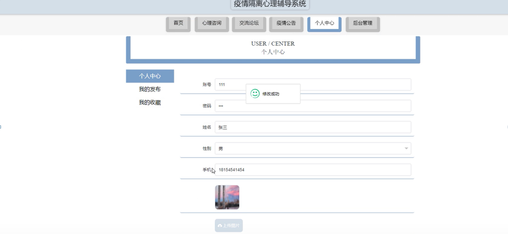

图5-6个人中心界面图

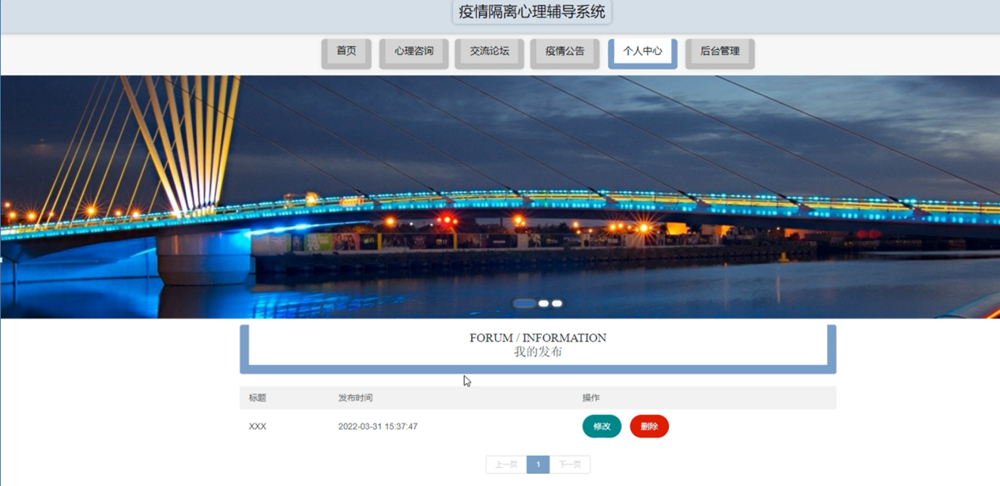

图5-7我的发布界面图

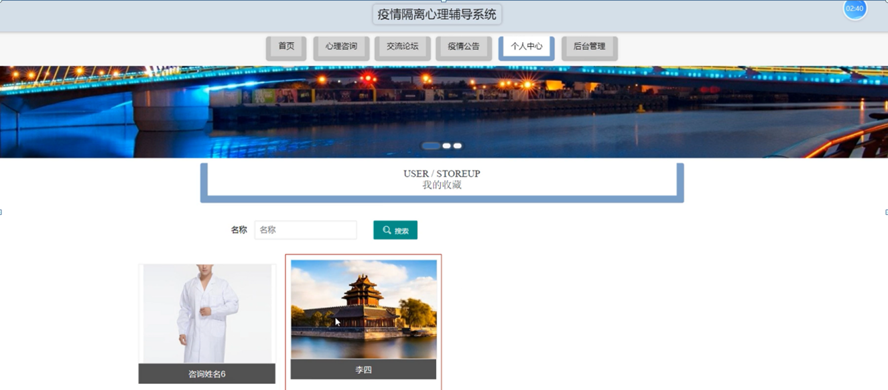

图5-8我的收藏界面图

### **5.2** **管理员功能模块**

管理员登录，通过登录页面输入用户名、密码、选择角色等信息进行登录操作，如图5-9所示。

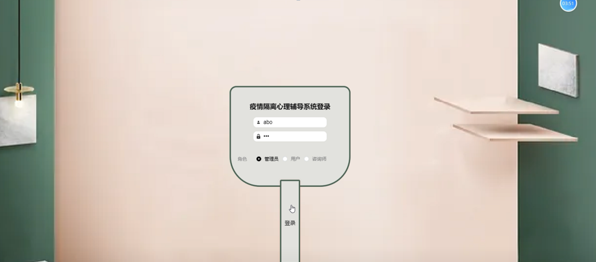

图5-9管理员登录界面图

管理员登录进入疫情隔离心理辅导系统可以查看首页、个人中心、用户管理、咨询师管理、心理咨询管理、咨询信息管理、交流论坛、系统管理等信息进行相应操作，如图5-10所示。

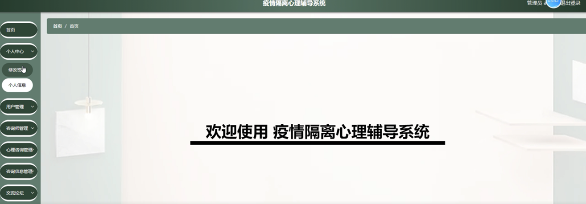

图5-10管理员功能界面图

用户管理；在用户管理页面中可以查看账号、姓名、性别、手机、图片等内容，并进行详情、修改或删除等操作；如图5-11所示。

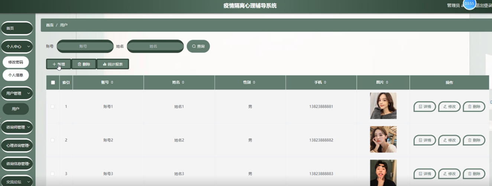

图5-11用户管理界面图

咨询师管理：在咨询师管理页面中可以查看咨询编号、咨询姓名、性别、年龄、联系电话、图片等内容，并进行详情、修改或删除等操作，如图5-12所示。

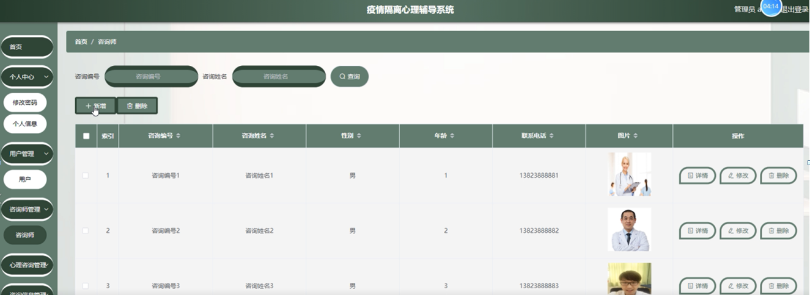

图5-12咨询师管理界面图

**JAVA** **毕设帮助，指导，源码分享，调试部署**

