ssm+Vue计算机毕业设计疫苗接种管理系统（程序+LW文档）

**项目运行**

**环境配置：**

**Jdk1.8 + Tomcat7.0 + Mysql + HBuilderX** **（Webstorm也行）+ Eclispe（IntelliJ
IDEA,Eclispe,MyEclispe,Sts都支持）。**

**项目技术：**

**SSM + mybatis + Maven + Vue** **等等组成，B/S模式 + Maven管理等等。**

**环境需要**

**1.** **运行环境：最好是java jdk 1.8，我们在这个平台上运行的。其他版本理论上也可以。**

**2.IDE** **环境：IDEA，Eclipse,Myeclipse都可以。推荐IDEA;**

**3.tomcat** **环境：Tomcat 7.x,8.x,9.x版本均可**

**4.** **硬件环境：windows 7/8/10 1G内存以上；或者 Mac OS；**

**5.** **是否Maven项目: 否；查看源码目录中是否包含pom.xml；若包含，则为maven项目，否则为非maven项目**

**6.** **数据库：MySql 5.7/8.0等版本均可；**

**毕设帮助，指导，本源码分享，调试部署** **(** **见文末** **)**

### 软件功能模块设计

系统整体功能如下图所示：

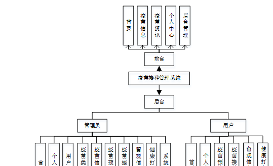

图 4-1 系统总体功能模块图

### 4.2数据库设计与实现

在每一个系统中数据库有着非常重要的作用，数据库的设计得好将会增加系统的效率以及系统各逻辑功能的实现。所以数据库的设计我们要从系统的实际需要出发，才能使其更为完美的符合系统功能的实现。

#### 4.2.1概念模型设计

概念模型是对现实中的问题出现的事物的进行描述，ER图是由实体及其关系构成的图，通过E-R图可以清楚地描述系统涉及到的实体之间的相互关系。

用户注册实体图如图4-2所示：

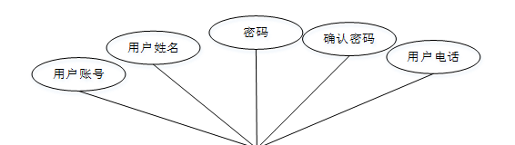

图4-2用户注册实体图

疫苗信息实体图如图4-3所示：

图4-3疫苗信息实体图

### 系统功能模块

疫苗接种管理系统，在系统首页可以查看首页，疫苗信息，疫苗资讯，个人中心，后台管理等内容，并进行详细操作；如图5-1所示。

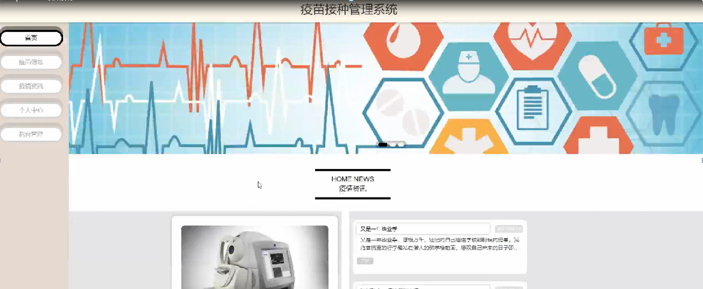

图5-1系统首页界面图

用户注册，在用户注册页面通过填写用户账号，密码，确认密码，用户姓名，用户电话等信息进行注册操作，如图5-2所示。

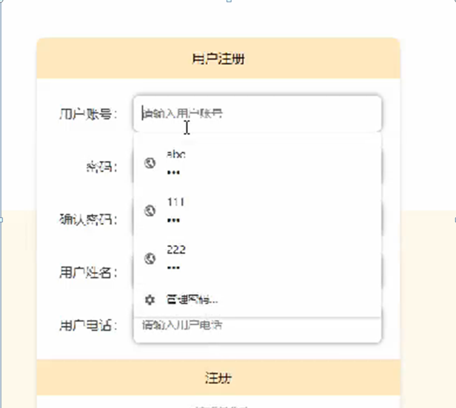

图5-2用户注册界面图

疫苗信息，在疫苗信息页面可以查看疫苗编号，疫苗类型，供应商，疫苗分类，产品规格，数量，接种剂次，预防病毒，接种对象，接种医院，接种地址等内容，并进行预约操作，如图5-3所示。

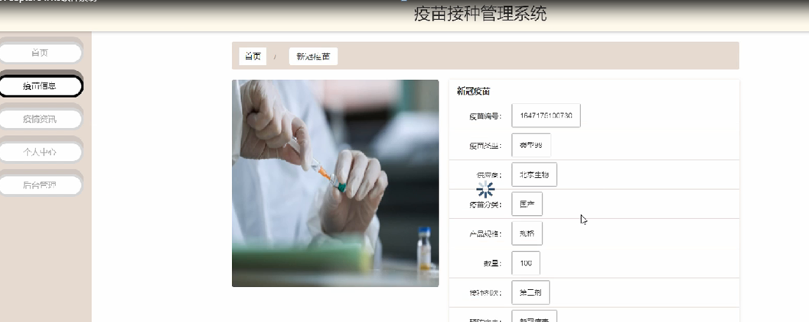

图5-3疫苗信息界面图

个人中心，在个人中心对用户账号，密码，用户姓名，性别，用户电话，图片等进行修改操作，如图5-4所示。

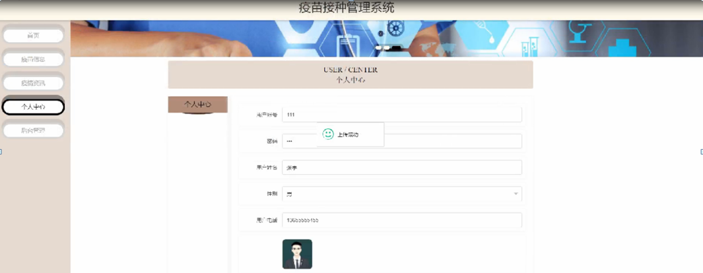

图5-4个人中心界面图

### 5.2管理员功能模块

管理员进行登录，进入系统前在登录页面根据要求填写用户名和密码，选择角色等信息，点击登录进行登录操作，如图5-5所示。

图5-5登录界面图

管理员登录系统后，可以对首页，个人中心，用户管理，疫苗类型管理，疫苗信息管理，疫苗预约管理，疫苗接种管理，留观信息管理，健康打卡管理，系统管理等功能进行相应的操作管理，如图5-6所示。

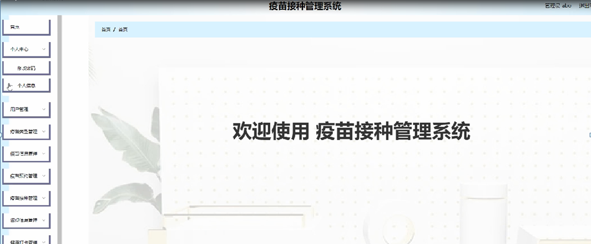

图5-6管理员功能界面图

用户管理，在用户管理页面可以对用户账号，用户姓名，性别，用户电话，头像等内容进行详情，修改和删除等操作，如图5-7所示。

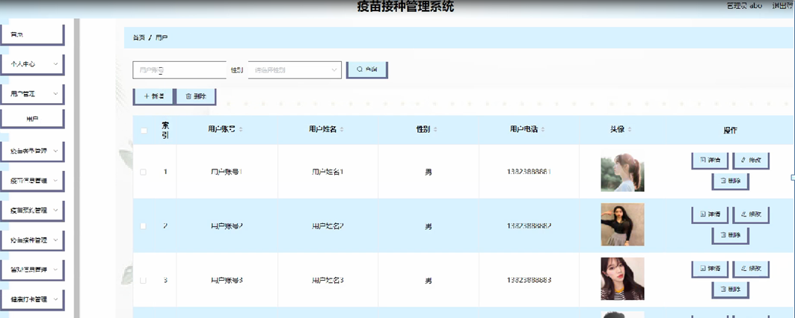

图5-7用户管理界面图

疫苗信息管理，在疫苗信息管理页面可以对疫苗编号，疫苗名称，疫苗类型，供应商，疫苗分类，产品规格，数量，接种剂次，预防病毒，接种对象，接种医院，接种地址等内容进行详情，修改和删除等操作，如图5-8所示。

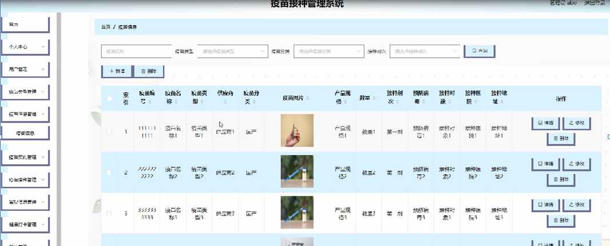

图5-8疫苗信息管理界面图

留观信息管理，在留观信息页面可以对疫苗编号，疫苗名称，疫苗类型，疫苗分类，疫苗图片，接种剂次，接种医院，接种地址，接种时间，留观时长，用户账号，用户姓名，审核回复，审核状态等内容进行详情，修改和删除操作，如图5-9所示。

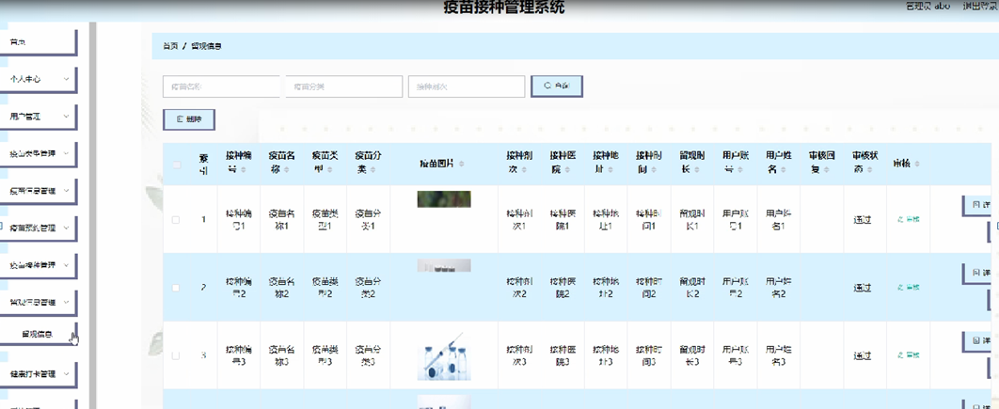

图5-9留观信息管理界面图

### 5.3用户功能模块

用户登录进入疫苗接种管理系统可以对首页，个人中心，疫苗预约管理，疫苗接种管理，留观信息管理，健康打卡管理等功能进行相应操作，如图5-10所示。

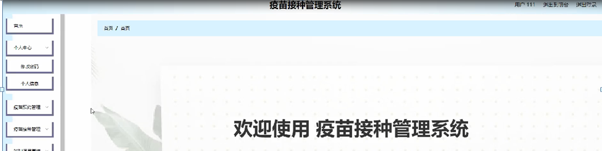

图5-10用户功能界面图

个人中心，在个人中心对用户账号，用户姓名，性别，用户电话，头像等进行修改操作，如图5-11所示。

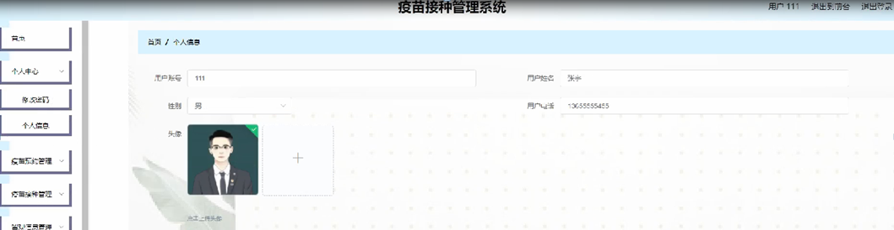

图5-11个人中心界面图

疫苗预约管理，在疫苗预约管理页面可以对疫苗编号，疫苗名称，疫苗类型，疫苗图片，疫苗分类，产品规格，数量，接种剂次，供应商，预防病毒，接种对象，接种医院，接种地址，预约时间，用户账号，用户姓名，审核回复，审核状态等内容进行详情，修改和删除等操作，如图5-12所示。

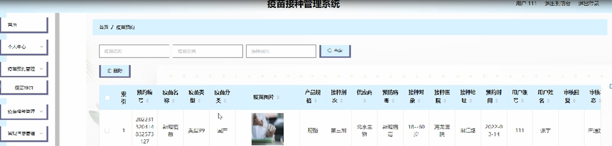

图5-12疫苗预约管理界面图

#### **JAVA** **毕设帮助，指导，源码分享，调试部署**

