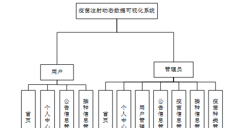
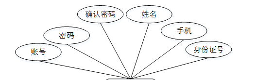
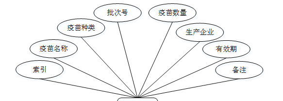
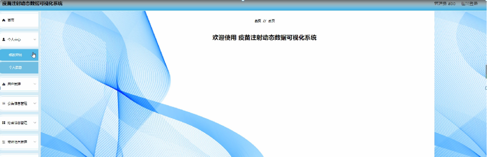
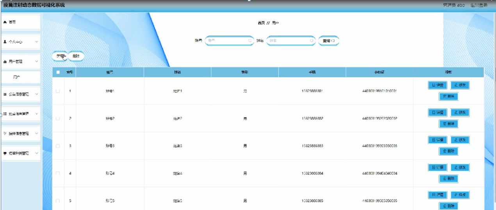
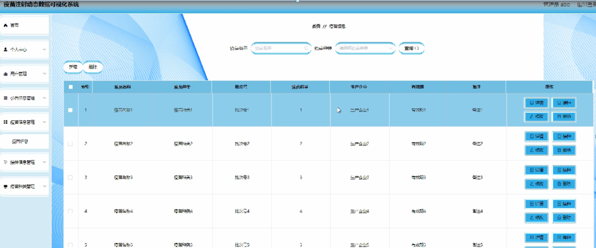
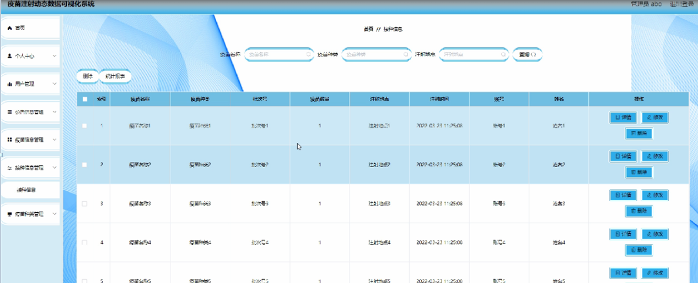
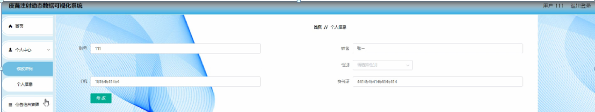
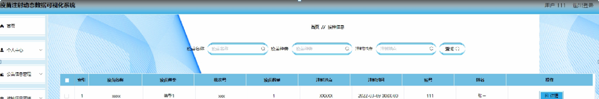

ssm+Vue计算机毕业设计疫苗注射动态数据可视化系统（程序+LW文档）

**项目运行**

**环境配置：**

**Jdk1.8 + Tomcat7.0 + Mysql + HBuilderX** **（Webstorm也行）+ Eclispe（IntelliJ
IDEA,Eclispe,MyEclispe,Sts都支持）。**

**项目技术：**

**SSM + mybatis + Maven + Vue** **等等组成，B/S模式 + Maven管理等等。**

**环境需要**

**1.** **运行环境：最好是java jdk 1.8，我们在这个平台上运行的。其他版本理论上也可以。**

**2.IDE** **环境：IDEA，Eclipse,Myeclipse都可以。推荐IDEA;**

**3.tomcat** **环境：Tomcat 7.x,8.x,9.x版本均可**

**4.** **硬件环境：windows 7/8/10 1G内存以上；或者 Mac OS；**

**5.** **是否Maven项目: 否；查看源码目录中是否包含pom.xml；若包含，则为maven项目，否则为非maven项目**

**6.** **数据库：MySql 5.7/8.0等版本均可；**

**毕设帮助，指导，本源码分享，调试部署** **(** **见文末** **)**

### 总体设计

根据疫苗注射动态数据可视化系统的功能需求，进行系统设计。

用户功能：用户进入系统可以实现首页，个人中心，公告信息管理，接种信息管理等内容进行操作；

后台主要是管理员，管理员功能包括首页，个人中心，用户管理，公告信息管理，疫苗信息管理，接种信息管理，疫苗种类管理等；

系统对这些功能进行整合，产生的功能结构图如下图所示：

图3-1 系统总体设计图

### 3.4数据库设计

在每一个系统中数据库有着非常重要的作用，数据库的设计得好将会增加系统的效率以及系统各逻辑功能的实现。所以数据库的设计我们要从系统的实际需要出发，才能使其更为完美的符合系统功能的实现。

#### 3.4.1数据库E-R图

E-R图为实体-关系图，本系统的E-R图展现了各个实体之间的关系，在本数据库中，各个实体之间的关系均为多对多的关系；

用户注册属性图如图3-2所示。

图3-2用户注册实体属性图

疫苗信息实体属性图如图3-3所示。

图3-3疫苗信息实体属性图

登录，进入系统前在登录页面根据要求填写用户名和密码，选择角色等信息，点击登录进行登录操作，如图4-1所示。

图4-1登录界面图

### 4.1管理员功能模块

管理员登录系统后，可以对首页，个人中心，用户管理，公告信息管理，疫苗信息管理，接种信息管理，疫苗种类管理等功能进行相应的操作，如图4-2所示。

图4-2管理员功能界面图

用户管理，在用户列表可以对索引，账号，姓名，性别，手机，身份证等内容进行查看，修改和删除等操作，如图4-3所示。

图4-3用户管理界面图

疫苗信息管理，在疫苗信息管理页面可以对索引，疫苗名称，疫苗种类，批次号，疫苗数量，生产企业，有效期，备注等内容进行详情，修改，接种和删除等操作，如图4-4所示。

图4-4疫苗信息管理界面图

接种信息管理，在接种信息管理页面可以对索引，疫苗名称，疫苗种类，批次号，疫苗数量，注射地点，注射时间，账号，姓名等内容进行详情，修改和删除等操作，如图4-5所示。

图4-5接种信息管理界面图

### 4.2用户功能模块

用户登录进入系统可以对首页，个人中心，公告信息管理，接种信息管理等功能进行相应操作，如图4-6所示。

图4-6用户功能界面图

个人中心，在个人中心页面通过填写账号，姓名，性别，手机，身份证等内容并提交进行个人信息修改操作，如图4-7所示。

图4-7个人中心界面图

接种信息管理，在接种信息管理页面可以对索引，疫苗名称，疫苗种类，批次号，疫苗数量，注射地点，注射时间，账号，姓名等内容进行详情操作，如图4-8所示。

图4-8接种信息管理界面图

#### **JAVA** **毕设帮助，指导，源码分享，调试部署**

