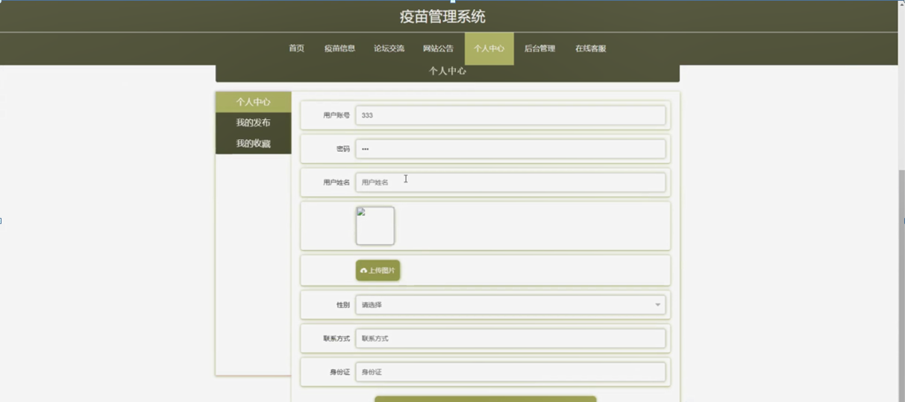
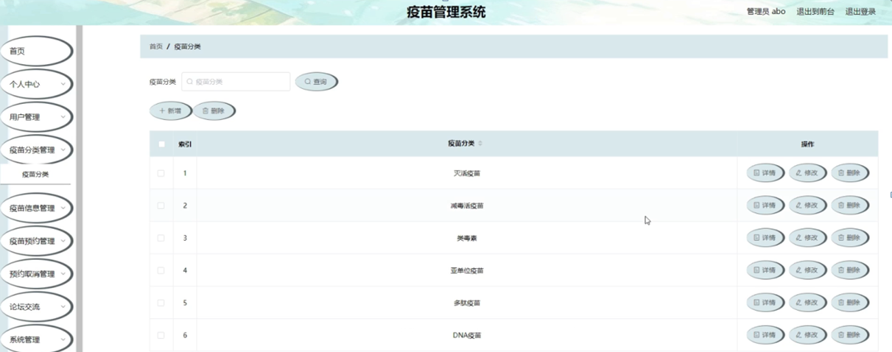

ssm+Vue计算机毕业设计疫苗管理系统（程序+LW文档）

**项目运行**

**环境配置：**

**Jdk1.8 + Tomcat7.0 + Mysql + HBuilderX** **（Webstorm也行）+ Eclispe（IntelliJ
IDEA,Eclispe,MyEclispe,Sts都支持）。**

**项目技术：**

**SSM + mybatis + Maven + Vue** **等等组成，B/S模式 + Maven管理等等。**

**环境需要**

**1.** **运行环境：最好是java jdk 1.8，我们在这个平台上运行的。其他版本理论上也可以。**

**2.IDE** **环境：IDEA，Eclipse,Myeclipse都可以。推荐IDEA;**

**3.tomcat** **环境：Tomcat 7.x,8.x,9.x版本均可**

**4.** **硬件环境：windows 7/8/10 1G内存以上；或者 Mac OS；**

**5.** **是否Maven项目: 否；查看源码目录中是否包含pom.xml；若包含，则为maven项目，否则为非maven项目**

**6.** **数据库：MySql 5.7/8.0等版本均可；**

**毕设帮助，指导，本源码分享，调试部署** **(** **见文末** **)**

系统功能结构图

系统功能结构图是系统设计阶段，系统功能结构图只是这个阶段一个基础，整个系统的架构决定了系统的整体模式，是系统的根据。疫苗管理系统的整个设计结构如图4-1所示。

图4-1系统功能模块图

### 4.2 数据库分析

本系统是一个疫苗管理系统的设计与实现，考虑到用户信息量和开发成本等问题，决定采用MySql数据库技术。数据库是当前应用软件系统的重要组成部分，如何使基于数据库的应用系统安全、高效的运行一直是软件开发技术研究的难题。所以本系统的数据库设计基于以下几点来考虑：

数据库规范化与非规范化的考虑。

数据查询优化与索引的建立。

下面介绍各实体的E-R图。

1\. 用户注册实体

用户注册实体包括用户账号，密码，用户姓名，联系方式，身份证等信息。用户注册实体图如图4-2所示：

图4-2用户注册实体图

2.疫苗信息实体

疫苗信息实体包括疫苗名称，疫苗编号，疫苗图片，疫苗分类，疫苗属性，批次号，接种人群，疫苗价格，数量，有效期，注意事项，疫苗功效，点击次数等信息。疫苗信息实体图如图4-3所示：

图4-3疫苗信息实体图

### 系统功能模块

疫苗管理系统，在系统首页可以查看首页，疫苗信息，论坛交流，网站公告，个人中心，后台管理，在线客服等内容，并进行详细操作，如图5-1所示。

图5-1系统首页界面图

用户注册，在用户注册页面通过填写用户账号，密码，用户姓名，联系方式，身份证等内容完成用户注册，如图5-2所示。

图5-2用户注册界面图

疫苗信息，在疫苗信息页面可以查看疫苗名称，疫苗编号，疫苗图片，疫苗分类，疫苗属性，批次号，接种人群，疫苗价格，数量，有效期，注意事项，疫苗功效，点击次数等内容，并进行立即预约，评论和收藏等操作，如图5-3所示。

图5-3疫苗信息界面图

论坛交流，在论坛交流页面输入标题，类型，内容等内容进行发布帖子或重置操作，如图5-4所示。

图5-4论坛交流界面图

个人中心，在个人中心页面通过填写用户账号，密码，用户姓名，上传图片，性别，联系方式，身份证等内容进行更新信息，根据需要对我的发布，我的收藏进行相应操作，如图5-5所示。

图5-5个人中心界面图

### 5.2管理员功能模块

管理员进行登录，进入系统前在登录页面根据要求填写用户名和密码，选择角色等信息，点击登录进行登录操作，如图5-7所示。

图5-7管理员登录界面图

管理员登录系统后，可以对首页，个人中心，用户管理，疫苗分类管理，疫苗信息管理，疫苗预约管理，预约取消管理，论坛交流，系统管理等进行相应的操作管理，如图5-8所示。

图5-8管理员功能界面图

用户管理，在用户管理页面可以对索引，用户账号，用户姓名，照片，性别，联系方式，身份证等内容进行详情，修改和删除等操作，如图5-9所示。

图5-9用户管理界面图

疫苗分类管理，在疫苗分类管理页面可以对索引，疫苗分类等内容进行详情，修改和删除等操作，如图5-10所示。

图5-10疫苗分类管理界面图

疫苗信息管理，在疫苗信息管理页面可以对索引，疫苗编号，疫苗名称，图片，疫苗分类，疫苗属性，批次号，接种人群，疫苗价格，数量，有效期等内容进行详情，查看评论，修改和删除等操作，如图5-11所示。

图5-11疫苗信息管理界面图

疫苗预约管理，在疫苗预约管理页面可以对索引，疫苗编号，疫苗名称，疫苗分类，疫苗价格，数量，总金额，预约时间，用户账号，用户姓名，联系方式，身份证，是否支付，审核回复，审核状态，审核等内容进行详情，删除等操作，如图5-12所示。

图5-12疫苗预约管理界面图

#### **JAVA** **毕设帮助，指导，源码分享，调试部署**

