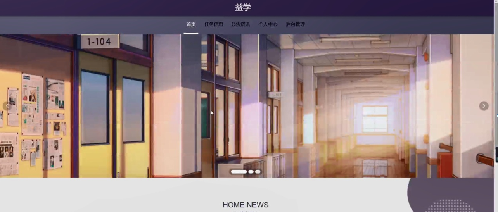
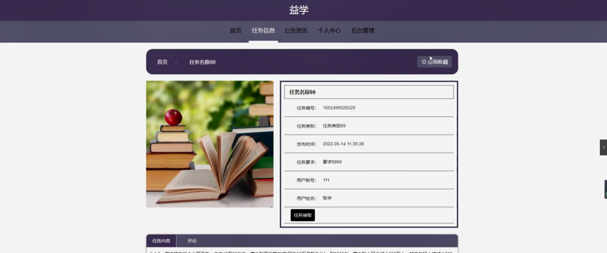
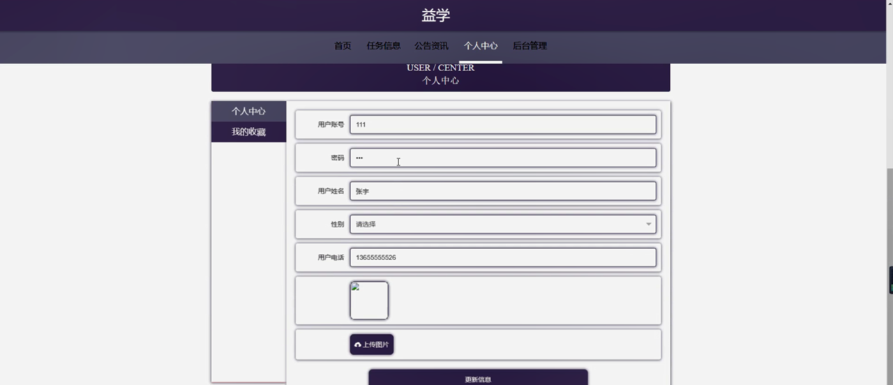
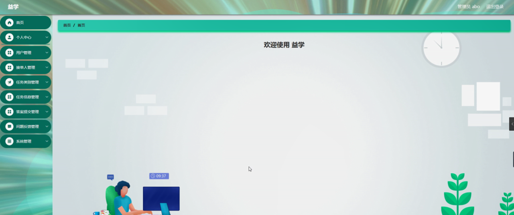
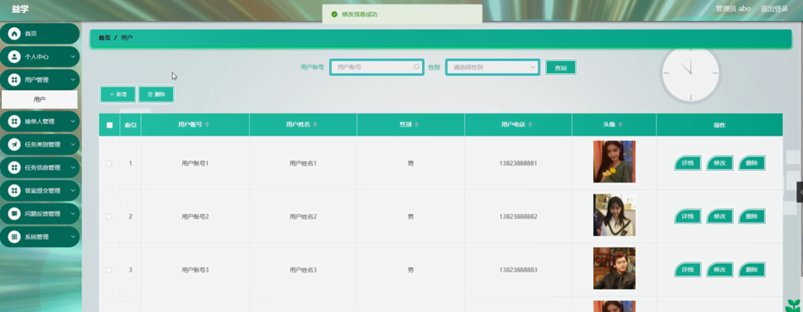
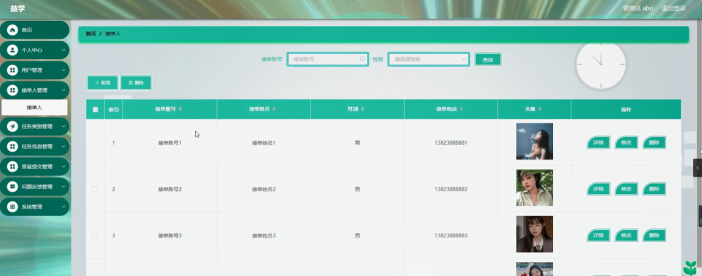
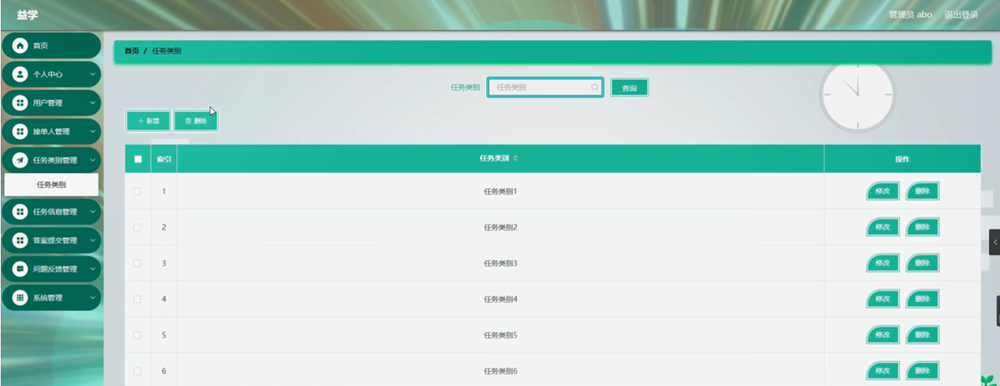
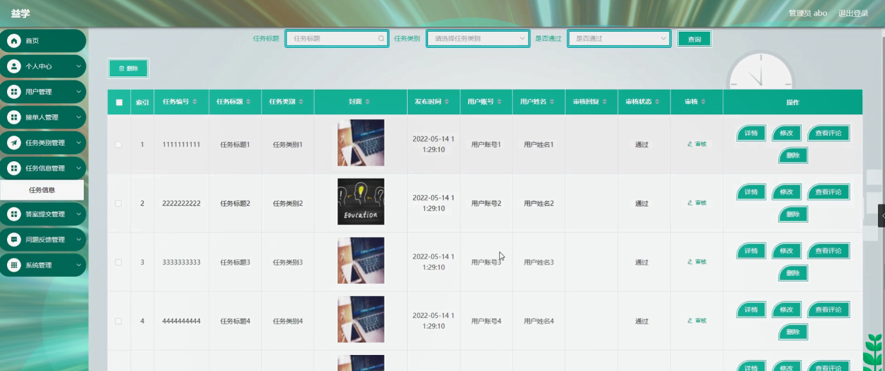
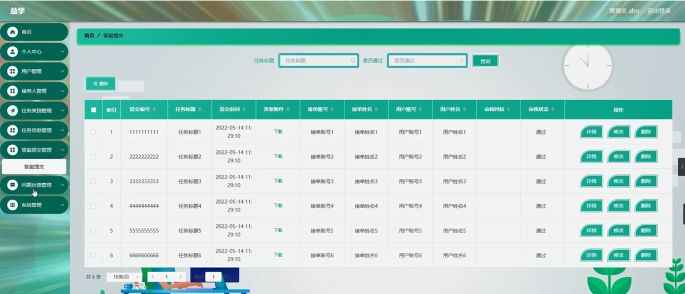
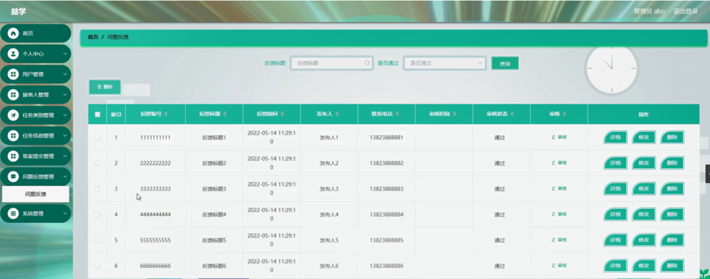

ssm+Vue计算机毕业设计益学（程序+LW文档）

**项目运行**

**环境配置：**

**Jdk1.8 + Tomcat7.0 + Mysql + HBuilderX** **（Webstorm也行）+ Eclispe（IntelliJ
IDEA,Eclispe,MyEclispe,Sts都支持）。**

**项目技术：**

**SSM + mybatis + Maven + Vue** **等等组成，B/S模式 + Maven管理等等。**

**环境需要**

**1.** **运行环境：最好是java jdk 1.8，我们在这个平台上运行的。其他版本理论上也可以。**

**2.IDE** **环境：IDEA，Eclipse,Myeclipse都可以。推荐IDEA;**

**3.tomcat** **环境：Tomcat 7.x,8.x,9.x版本均可**

**4.** **硬件环境：windows 7/8/10 1G内存以上；或者 Mac OS；**

**5.** **是否Maven项目: 否；查看源码目录中是否包含pom.xml；若包含，则为maven项目，否则为非maven项目**

**6.** **数据库：MySql 5.7/8.0等版本均可；**

**毕设帮助，指导，本源码分享，调试部署** **(** **见文末** **)**

### 系统功能模块

益学管理系统，在系统首页可以查看首页、任务信息、公告资讯、个人中心、后台管理等内容，并进行详细操作；如图5-1所示。

图5-1系统首页界面图

用户注册，在用户注册页面通过填写用户账号、密码、确认密码、用户姓名、用户电话等内容进行用户注册操作，如图5-2所示。

图5-2用户注册界面图

任务信息，在任务信息页面可以查看任务编号、任务标题、任务类别、封面、发布时间、任务要求、用户账号、用户姓名、任务内容等内容，并进行任务接取，评论或收藏操作，如图5-3所示。

图5-3任务信息界面图

个人中心，在个人中心页面通过填写用户账号、密码、用户姓名、性别、用户电话、上传图片等内容进行更新信息，还可以对我的收藏进行详细操作；如图5-4所示。

图5-4个人中心界面图

### 5.2后台功能模块

后台登录，用户进入系统前在登录页面根据要求填写用户名和密码，选择角色等信息，点击登录进入系统操作界面，如图5-5所示。

图5-5后台登录界面图

#### 5.2.1管理员功能

管理员登录系统后，可以对首页、个人中心、用户管理、接单人管理、任务类别管理、任务信息管理、答案提交管理、问题反馈管理、系统管理等功能进行相应的操作管理，如图5-6所示。

图5-6管理员功能界面图

用户管理，在用户管理页面可以对索引、用户账号、用户姓名、性别、用户电话、头像等内容进行详情，修改和删除操作，如图5-7所示。

图5-7用户管理界面图

接单人管理，在接单人管理页面可以对索引、接单账号、接单姓名、性别、接单电话、头像等信息进行详情，修改和删除操作，如图5-8所示。

图5-8接单人管理界面图

任务类别管理，在任务类别管理页面可以对索引、任务类别等内容进行修改和删除操作，如图5-9所示。

图5-9任务类别管理界面图

任务信息管理，在任务信息管理页面可以对索引、任务编号、任务标题、任务类别、封面、发布时间、用户账号、用户姓名、审核回复、审核状态、审核等内容进行详情，修改，查看评论或删除操作，如图5-10所示。

图5-10任务信息管理界面图

答案提交管理，在答案提交管理页面可以对索引、提交编号、任务标题、提交时间、答案附件、接单账号、接单姓名、用户账号、用户姓名、审核回复、审核状态等内容进行详情，修改和删除操作，如图5-11所示。

图5-11答案提交管理界面图

问题反馈管理，在问题反馈管理页面可以对索引、反馈编号、反馈标题、反馈时间、发布人、联系电话、审核回复、审核状态、审核等内容进行详情，修改和删除操作，如图5-12所示。

图5-12问题反馈管理界面图

**JAVA** **毕设帮助，指导，源码分享，调试部署**

