ssm+Vue计算机毕业设计知识付费运营管理系统（程序+LW文档）

**项目运行**

**环境配置：**

**Jdk1.8 + Tomcat7.0 + Mysql + HBuilderX** **（Webstorm也行）+ Eclispe（IntelliJ
IDEA,Eclispe,MyEclispe,Sts都支持）。**

**项目技术：**

**SSM + mybatis + Maven + Vue** **等等组成，B/S模式 + Maven管理等等。**

**环境需要**

**1.** **运行环境：最好是java jdk 1.8，我们在这个平台上运行的。其他版本理论上也可以。**

**2.IDE** **环境：IDEA，Eclipse,Myeclipse都可以。推荐IDEA;**

**3.tomcat** **环境：Tomcat 7.x,8.x,9.x版本均可**

**4.** **硬件环境：windows 7/8/10 1G内存以上；或者 Mac OS；**

**5.** **是否Maven项目: 否；查看源码目录中是否包含pom.xml；若包含，则为maven项目，否则为非maven项目**

**6.** **数据库：MySql 5.7/8.0等版本均可；**

**毕设帮助，指导，本源码分享，调试部署** **(** **见文末** **)**

系统功能结构图

系统功能结构图是系统设计阶段，系统功能结构图只是这个阶段一个基础，整个系统的架构决定了系统的整体模式，是系统的根据。知识付费运营管理系统的整个设计结构如图3-1所示。

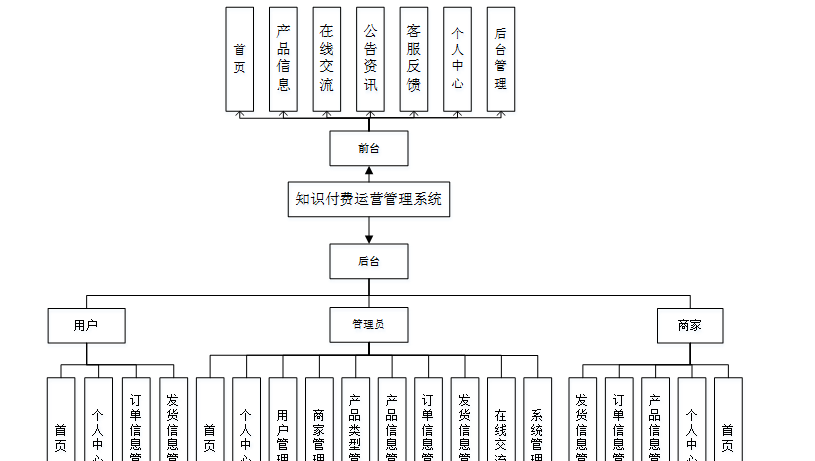图3-1系统功能结构图

### 数据库设计

信息管理系统的效率和实现的效果完全取决于数据库结构设计的好坏。为了保证数据的完整性，提高数据库存储的效率，那么统一合理地设计数据库结构是必要的。数据库设计一般包括如下几个步骤：

（1）根据用户需求，确定数据库信息进行保存

对用户的需求分析是数据库设计的第一阶段，用户的需求调研，熟悉知识付费运营运作流程，系统要求，这些都是以概念模型为基础的。

（2）设计数据的概念模型

概念模型与数据建模用户的观点一致，用于信息世界的建模工具。通过E-R图可以清楚地描述系统涉及到的实体之间的相互关系。

用户实体图如图4-1所示：

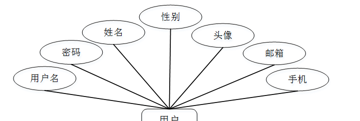

图4-1用户实体图

订单信息实体图如图4-2所示：

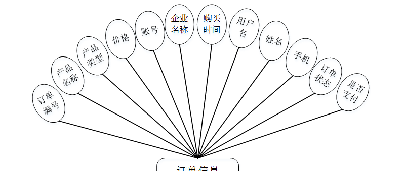图4-2订单信息实体图

### 系统功能模块

知识付费运营管理系统，在系统首页可以查看首页，产品信息，在线交流，公告资讯，个人中心，后台管理，客服反馈等内容进行详细操作，如图5-1所示。

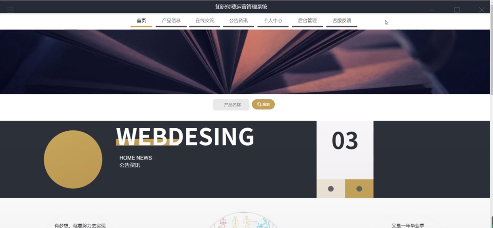

图5-1系统首页界面图

用户注册，在用户注册页面通过填写用户账号、姓名、密码、确认密码、年龄、手机号码等信息完成用户注册，如图5-2所示。

图5-2用户注册界面图

产品信息，在产品信息页面可以查看产品名称，产品图片等详细内容，并进行收藏操作，如图5-3所示。

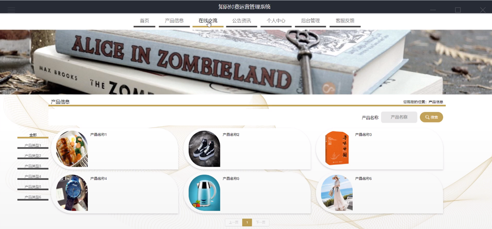

图5-3产品信息界面图

在线交流，在在线交流页面可以查看帖子标题，内容等详细内容，并进行发布帖子操作；如图5-4所示。

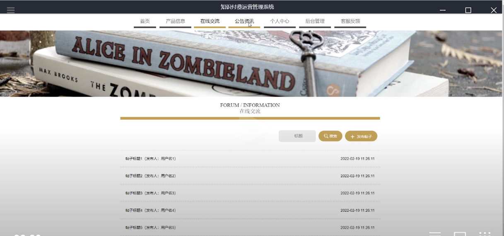

图5-4在线交流界面图

个人中心，在个人中心页面通过填写用户名、姓名、密码、上传图片、性别、邮箱、手机等信息进行更新信息，根据需要对我的发布，我的收藏进行详细操作，如图5-5所示。

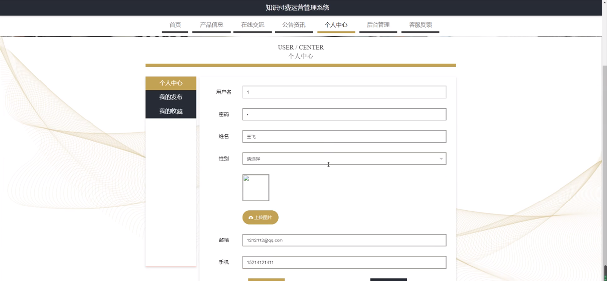

图5-5个人中心界面图

### 5.2管理员功能模块

管理员登录系统后，可以对首页，个人中心，用户管理，商家管理，产品类型管理，产品信息管理，订单信息管理，发货信息管理，在线交流，系统管理等功能模块进行相应操作，如图5-6所示。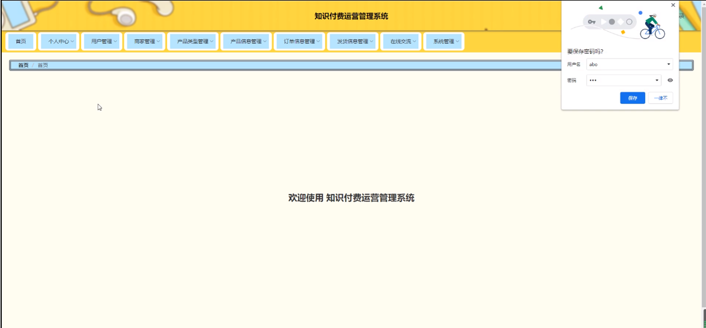

图5-6管理员功能界面图

用户管理，在用户管理页面可以对索引、用户名、姓名、头像、性别、邮箱、手机等信息进行修改和删除等操作，如图5-7所示。

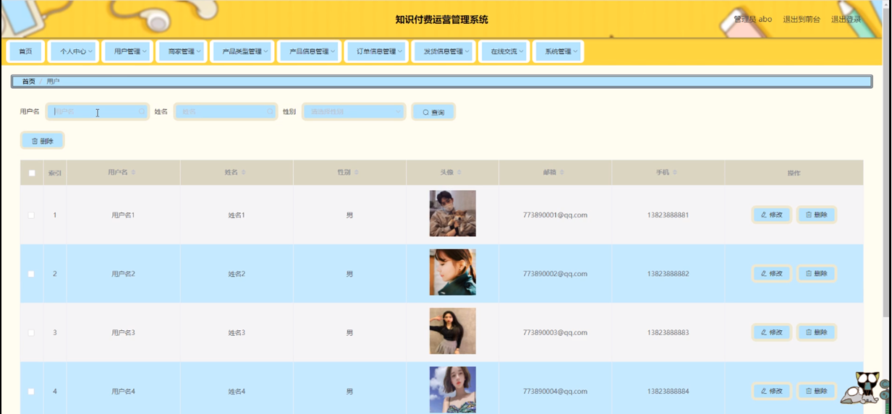

图5-7用户管理界面图

商家管理，在商家管理页面可以对索引、账号、企业名称、负责人、性别、头像、电话等内容进行修改和删除等操作，如图5-9所示。

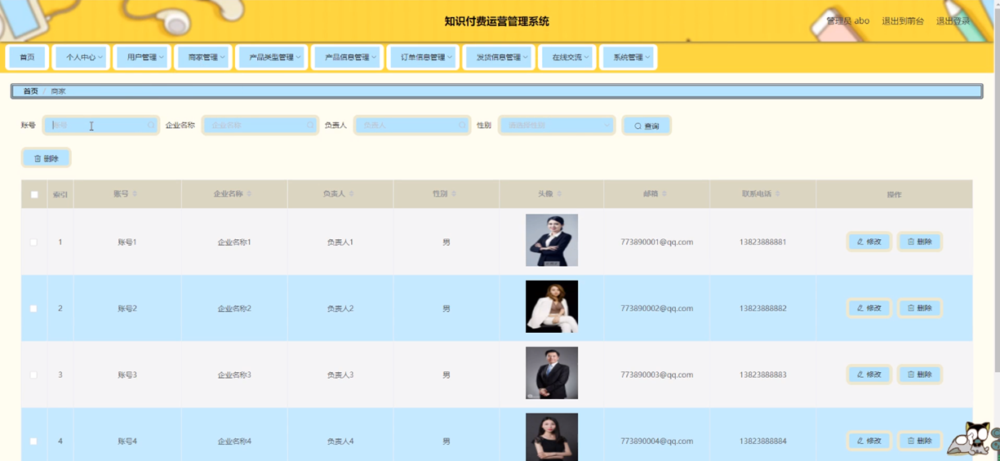

图5-8商家管理界面图

产品类型管理，在产品类型管理页面可以对索引、产品类型等内容进行详情，修改，查看评论和删除操作，如图5-9所示。

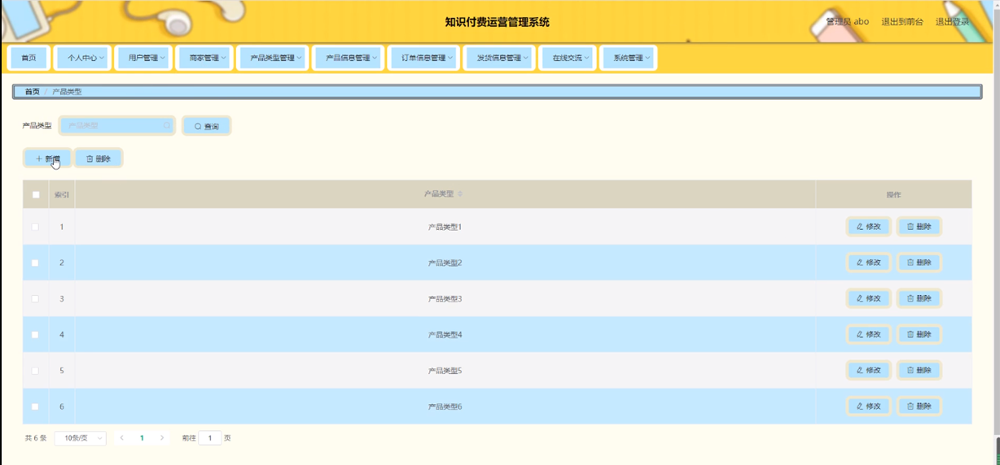

图5-9产品类型管理界面图

产品信息管理，在产品信息管理页面可以对索引、产品名称，产品类型，图片，价格，产品规格，产品说明，账号，企业名称，联系电话等内容进行详情，修改，查看评论或删除等操作，如图5-10所示。

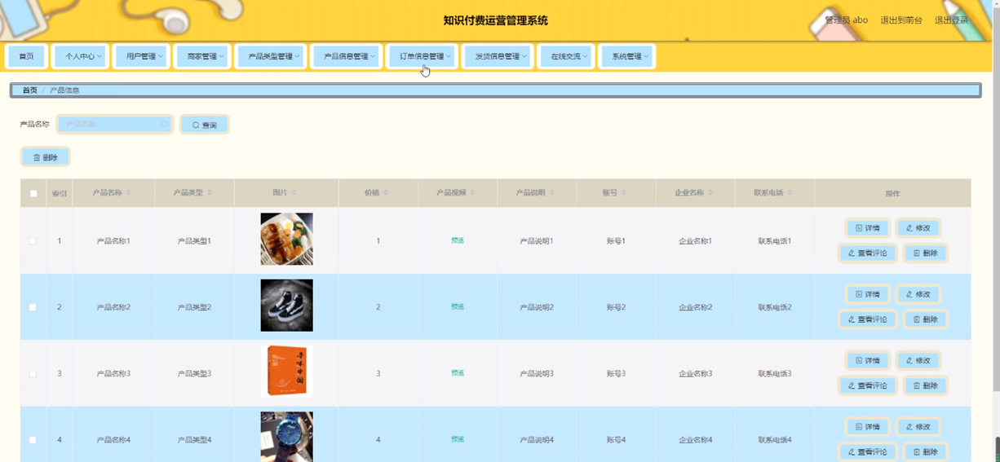

图5-10产品信息管理界面图

订单信息管理，在订单信息管理页面可以对索引、订单编号、产品名称、产品类型、价格、账号、企业名称、购买时间等内容进行详情，修改和删除等操作，如图5-11所示。

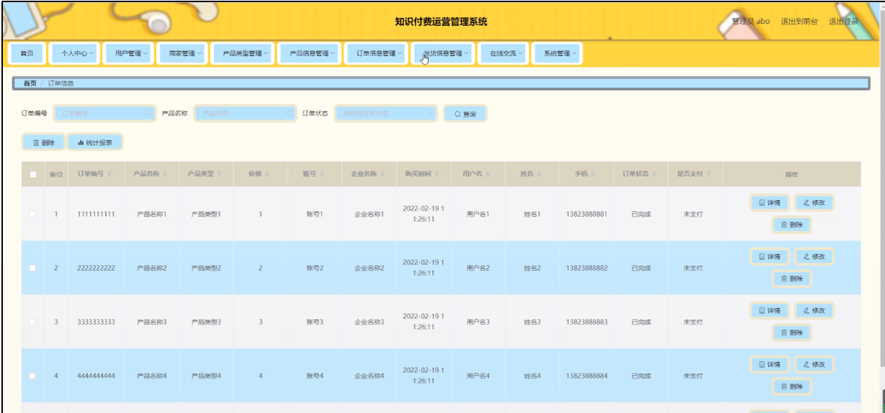

图5-11订单信息管理界面图

### 5.3商家功能模块

商家登录进入系统，可以对首页，个人中心，产品信息管理，订单信息管理，发货信息管理等功能模块进行相应操作，如图5-12所示。

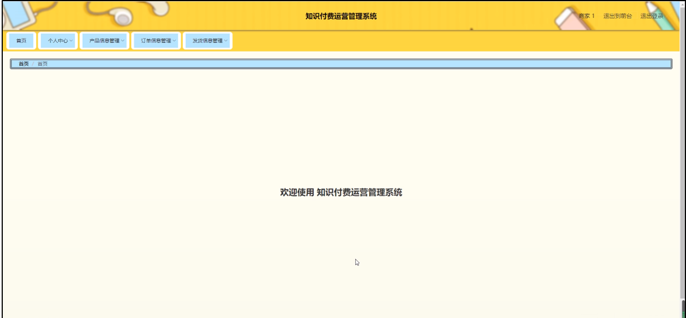

图5-12商家功能界面图

#### **JAVA** **毕设帮助，指导，源码分享，调试部署**

