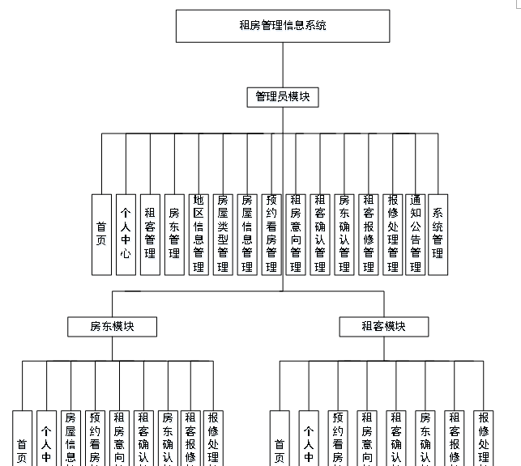
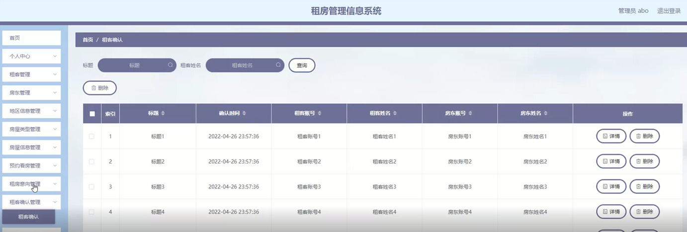

ssm+Vue计算机毕业设计租房管理信息系统（程序+LW文档）

**项目运行**

**环境配置：**

**Jdk1.8 + Tomcat7.0 + Mysql + HBuilderX** **（Webstorm也行）+ Eclispe（IntelliJ
IDEA,Eclispe,MyEclispe,Sts都支持）。**

**项目技术：**

**SSM + mybatis + Maven + Vue** **等等组成，B/S模式 + Maven管理等等。**

**环境需要**

**1.** **运行环境：最好是java jdk 1.8，我们在这个平台上运行的。其他版本理论上也可以。**

**2.IDE** **环境：IDEA，Eclipse,Myeclipse都可以。推荐IDEA;**

**3.tomcat** **环境：Tomcat 7.x,8.x,9.x版本均可**

**4.** **硬件环境：windows 7/8/10 1G内存以上；或者 Mac OS；**

**5.** **是否Maven项目: 否；查看源码目录中是否包含pom.xml；若包含，则为maven项目，否则为非maven项目**

**6.** **数据库：MySql 5.7/8.0等版本均可；**

**毕设帮助，指导，本源码分享，调试部署** **(** **见文末** **)**

总体设计

系统总体设计图如下图4-1所示：

图4-1系统总体设计图

### 4.2 数据库设计

#### 4.2.1 概念模型设计

数据可设计要遵循职责分离原则，即在设计时应该要考虑系统独立性，即每个系统之间互不干预不能混乱数据表和系统关系。

数据库命名也要遵循一定规范，否则容易混淆，数据库字段名要尽量做到与表名类似。

概念模型是对现实中的问题出现的事物的进行描述，ER图是由实体及其关系构成的图，通过E-R图可以清楚地描述系统涉及到的实体之间的相互关系。

管理员信息实体图如图4-2所示：

图4-2管理员信息实体图

租客信息实体图如图4-3所示：

图4-3租客信息实体图

租房意向信息实体图如图4-4所示：

图4-4租房意向信息实体图

租客报修信息实体图如图4-5所示：

图4-5租客报修信息实体图

管理员功能模块

管理员要登录租房管理信息系统，需要输入用户名和密码，选择登录角色进行登录，管理员登录界面如图5-1所示：

图5-1管理员登录界面

管理员功能：管理员登录系统后，能对首页、个人中心、租客管理、房东管理、地区信息管理、房屋类型管理、房屋信息管理、预约看房管理、租房意向管理、租客确认管理、房东确认管理、租客报修管理、报修处理管理、通知公告管理、系统管理进行操作。管理员功能如下图5-2所示：

图5-2管理员功能界面

租客管理：在租客管理页面，可以查看租客账号、租客姓名、年龄、性别、手机、身份证、照片等信息进行修改、删除等操作，如图5-3所示：

图5-3租客管理界面

房屋信息管理：在房屋信息管理页面，可以查看标题、房屋编号、地区、房屋类型、户型、地址、图片、面积、租金、发布日期、房东账号、房东姓名、联系电话、审核回复、审核状态、审核等内容，还能对房屋信息管理进行修改、删除等操作，如图5-4所示：

图5-4房屋信息管理界面

租客报修管理：在租客报修管理页面，可以对标题、报修时间、租客账号、租客姓名、房东账号、房东姓名、审核回复、审核状态等内容进行详情、修改、删除等操作，如图5-5所示：

图5-5租客报修管理界面

预约看房管理：在预约看房管理页面，可以查看预约编号、房屋编号、房屋类型、地址、户型、租金、租期、总价、预约时间、备注、房东账号、房东姓名、联系电话、租客账号、租客姓名、手机、审核回复、审核状态等内容，还能进行详情、删除等操作，如图5-6所示：

图5-6预约看房管理界面

租房意向管理：在租房意向管理页面，可以查看标题、总价、发送时间、租客账号、租客姓名、房东账号、房东姓名、是否支付等内容，还能进行详情、删除等操作，如图5-7所示：

图5-7租房意向管理界面

租客确认管理：在租客确认管理页面，可以查看标题、确认时间、租客账号、租客姓名、房东账号、房东姓名等内容，还能进行详情、删除等操作，如图5-8所示：

图5-8租客确认管理界面

报修处理管理：在报修处理管理页面，可以查看标题、处理状态、处理时间、租客账号、租客姓名、房东账号、房东姓名等内容，还能进行详情、删除等操作，如图5-9所示：

图5-9报修处理管理界面

系统管理：在系统管理页面，可以查看轮播图管理等内容，进行详情、修改等操作，如图5-10所示：

图5-10轮播图管理界面

5.2 系统前台功能模块

租客登录到系统前台，可以对首页、房屋信息、通知公告、个人中心、后台管理等进行相应操作，如图5-11所示：

图5-11前台首页界面

租客注册，在注册页面填写租客账号、密码、确认密码、租客姓名、年龄、手机、身份证等详细信息进行注册，如图5-12所示。

图5-12租客注册界面图

#### **JAVA** **毕设帮助，指导，源码分享，调试部署**

