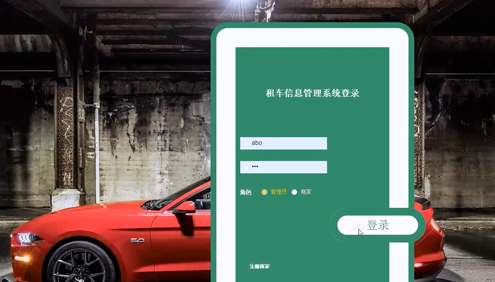
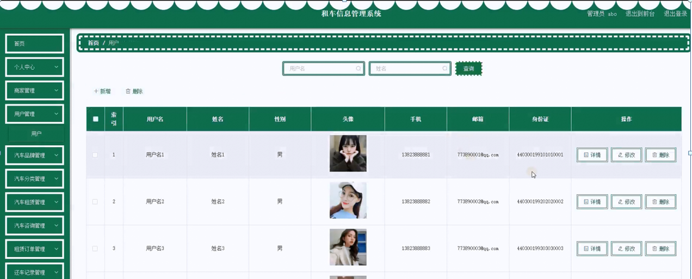
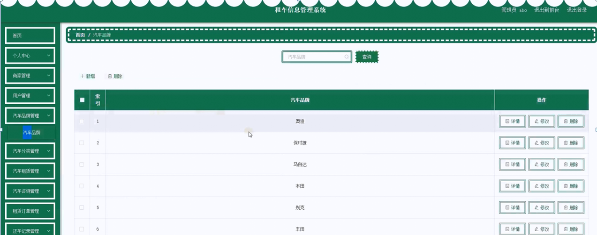

ssm+Vue计算机毕业设计租车信息管理系统（程序+LW文档）

**项目运行**

**环境配置：**

**Jdk1.8 + Tomcat7.0 + Mysql + HBuilderX** **（Webstorm也行）+ Eclispe（IntelliJ
IDEA,Eclispe,MyEclispe,Sts都支持）。**

**项目技术：**

**SSM + mybatis + Maven + Vue** **等等组成，B/S模式 + Maven管理等等。**

**环境需要**

**1.** **运行环境：最好是java jdk 1.8，我们在这个平台上运行的。其他版本理论上也可以。**

**2.IDE** **环境：IDEA，Eclipse,Myeclipse都可以。推荐IDEA;**

**3.tomcat** **环境：Tomcat 7.x,8.x,9.x版本均可**

**4.** **硬件环境：windows 7/8/10 1G内存以上；或者 Mac OS；**

**5.** **是否Maven项目: 否；查看源码目录中是否包含pom.xml；若包含，则为maven项目，否则为非maven项目**

**6.** **数据库：MySql 5.7/8.0等版本均可；**

**毕设帮助，指导，本源码分享，调试部署** **(** **见文末** **)**

### 功能结构

为了更好的去理清本系统整体思路，对该系统以结构图的形式表达出来，设计实现该租车信息管理系统的功能结构图如下所示：

图4-1 系统总体结构图

### 4.2 数据库设计

#### 4.2.1 数据库E/R图

ER图是由实体及其关系构成的图，通过E/R图可以清楚地描述系统涉及到的实体之间的相互关系。在系统中对一些主要的几个关键实体如下图：

(1) 用户注册E/R图如下所示：

图4-2用户注册E/R图

(2) 个人中心E/R图如下所示：

图4-3个人中心E/R图

(4) 汽车租赁E/R图如下所示：

图4-4汽车租赁E/R图

### 系统功能模块

租车信息管理系统，在网站首页可以查看首页，商家，汽车租赁，公告资讯，个人中心，后台管理，投诉反馈等内容，并进行详细操作；如图5-1所示。

图5-1系统首页界面图

用户注册，在用户注册页面通过填写用户名,密码,确认密码，姓名,手机,邮箱，身份证等信息进行注册操作，如图5-2所示。

图5-2用户注册界面图

商家，在商家页面可以查看商家名称,商家编号,联系电话，商家地址，经营范围，图片等内容，并进行评论和收藏操作，如图5-3所示。

图5-3商家界面图

个人中心，在个人中心页面通过填写用户名,密码,姓名,性别,上传图片,手机,邮箱，身份证等内容进行更新信息操作，并根据需要对我的收藏进行详细操作；如图5-4所示。

图5-4个人中心界面图

### 5.2 后台登录模块

后台登录，管理员和商家进入系统前在登录页面根据要求填写账号，密码和选择角色等信息，点击登录进行登录操作，如图5-5所示。

图5-5后台登录界面图

#### 5.2.1 管理员功能

管理员登陆系统后，可以查看首页，个人中心，商家管理，用户管理，汽车品牌管理，汽车分类管理，汽车租赁管理，汽车咨询管理，租赁订单管理，还车记录管理，系统管理等功能，还能对每个功能逐一进行相应操作，如图5-6所示。

图5-6管理员功能界面图

商家管理，在商家管理页面可以对索引，商家编号，商家名称，商家图片，联系电话，商家地址，经营范围，审核回复，审核状态，审核，新增等内容进行查询详情，修改和删除操作，如图5-7所示。

图5-7商家管理界面图

用户管理，在用户管理页面可以对索引，用户名，姓名，性别，头像，手机，邮箱，身份证，新增等内容进行查询详情，修改和删除等操作，如图5-8所示。

图5-8用户管理界面图

汽车品牌管理，在汽车品牌管理页面可以对索引，汽车品牌，新增等内容进行查询详情，修改和删除等操作，如图5-9所示。

图5-9汽车品牌管理界面图

汽车分类管理，在汽车分类管理页面可以对索引，汽车分类，新增等内容进行查询详情，修改和删除等操作，如图5-10所示。

图5-10汽车分类管理界面图

汽车租赁管理，在汽车租赁管理页面可以对索引，汽车名称，汽车品牌，汽车牌号，汽车图片，汽车分类，商家编号，商家名称，商家地址，联系电话，租车押金，租车价格，车身颜色，出租状态等内容进行查询详情，修改和删除等操作，如图5-11所示。

图5-11汽车租赁管理界面图

汽车咨询管理，在汽车咨询管理页面可以对索引，咨询标题，汽车名称，汽车图片，商家编号，商家名称，咨询日期，用户名，手机，审核回复，审核状态等内容进行查询详情，修改和删除等操作，如图5-12所示。

图5-12汽车咨询管理界面图

**JAVA** **毕设帮助，指导，源码分享，调试部署**

