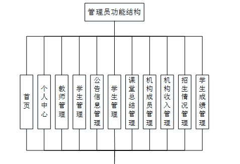
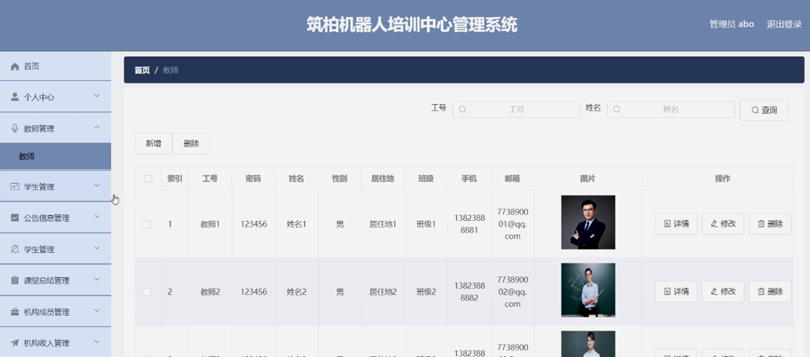
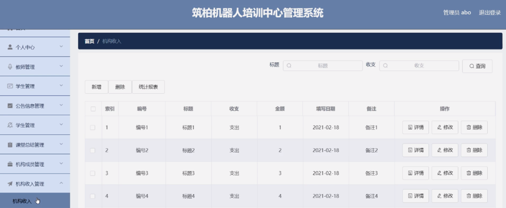

ssm+Vue计算机毕业设计筑柏机器人培训中心管理系统（程序+LW文档）

**项目运行**

**环境配置：**

**Jdk1.8 + Tomcat7.0 + Mysql + HBuilderX** **（Webstorm也行）+ Eclispe（IntelliJ
IDEA,Eclispe,MyEclispe,Sts都支持）。**

**项目技术：**

**SSM + mybatis + Maven + Vue** **等等组成，B/S模式 + Maven管理等等。**

**环境需要**

**1.** **运行环境：最好是java jdk 1.8，我们在这个平台上运行的。其他版本理论上也可以。**

**2.IDE** **环境：IDEA，Eclipse,Myeclipse都可以。推荐IDEA;**

**3.tomcat** **环境：Tomcat 7.x,8.x,9.x版本均可**

**4.** **硬件环境：windows 7/8/10 1G内存以上；或者 Mac OS；**

**5.** **是否Maven项目: 否；查看源码目录中是否包含pom.xml；若包含，则为maven项目，否则为非maven项目**

**6.** **数据库：MySql 5.7/8.0等版本均可；**

**毕设帮助，指导，本源码分享，调试部署** **(** **见文末** **)**

### 系统结构

本系统架构网站系统，本系统的具体功能如下：

图4-2系统功能结构图

管理员功能结构图，如图4-3所示：

图4-3 管理员功能结构图

教师功能结构图，如图4-4所示：

图4-4教师功能结构图

学生功能结构图，如图4-5所示：

图4-5学生功能结构图

### 4.3. 数据库设计

4.3.1 数据库实体

管理员信息结构图，如图4-6所示：

图4-6 管理员信息实体结构图

学生信息实体属性图，如图4-7所示：

图4-7学生信息实体属性图

学生成绩管理实体属性图，如图4-8所示：

图4-8学生成绩管理实体属性图

### 管理员功能模块

管理员登录，管理员通过输入用户名、密码、验证码、角色等信息即可进行系统登录，如图5-1所示。

图5-1管理员登录界面图

管理员登录进入筑柏机器人培训中心管理系统可以查看首页、个人中心、教师管理、学生管理、公告信息管理、学生管理、课堂总结管理、机构成员管理、机构收入管理、招生情况管理、学生成绩管理等内容进行相应操作，如图5-2所示。

图5-2管理员功能界面图

教师管理，在教师管理页面可以查看索引、工号、密码、姓名、性别、居住地、班级、手机、邮箱、图片等信息，并可根据需要进行修改或删除等操作，如图5-3所示。

图5-3教师管理界面图

公告信息管理，在公告信息管理页面可以查看索引、标题、发布时间等内容，并可根据需要进行修改或删除等操作，如图5-4所示。

图5-4公告信息管理界面图

学生管理，在学生管理页面可以查看索引、学号、姓名、所在班级、任课教师、班级学生数量、上课地点、学员缴费情况、到期时间、欠费、剩余课时等信息，并可根据需要进行修改或删除等操作，如图5-5所示。

图5-5学生管理界面图

机构成员管理，在机构成员管理页面可以查看索引、姓名、职务、性别、工龄、入职时间、照片等信息，并可根据需要进行修改或删除等操作，如图5-6所示。

图5-6机构成员管理界面图

机构收入管理，在机构收入管理页面可以查看索引、编号、标题、收支、金额、填写日期、备注等信息，并可根据需要进行修改或删除等操作，如图5-7所示。

图5-7机构收入管理界面图

招生情况管理，在招生情况管理页面可以查看索引、编号、标题、学年、文件、招生人数、招生日期等信息，并可根据需要进行修改或删除等操作，如图5-8所示。

图5-8招生情况管理界面图

学生成绩管理，在学生成绩管理页面可以查看索引、学号、姓名、班级、成绩、状态、登记日期等信息，并可根据需要进行修改或删除等操作，如图5-9所示。

图5-9学生成绩管理界面图

### 5.2教师功能模块

教师登录进入筑柏机器人培训中心管理系统可以查看首页、个人中心、学生管理、公告信息管理、学生管理、课堂总结管理、招生情况管理、学生成绩管理等内容并进行相应操作，如图5-10所示。

图5-10教师功能界面图

个人中心，在个人中心页面可以填写工号、姓名、性别、居住地、班级、手机、邮箱、图片等内容，并可根据需要对个人信息进行修改，如图5-11所示。

图5-11个人中心界面图

学生管理，在学生管理页面可以查看索引、学号、密码、姓名、性别、班级、手机、邮箱、照片、备注等信息，并可根据需要进行详情、添加或修改等操作，如图5-12所示。

图5-12学生管理界面图

**JAVA** **毕设帮助，指导，源码分享，调试部署**

