ssm+Vue计算机毕业设计综合众筹网站（程序+LW文档）

**项目运行**

**环境配置：**

**Jdk1.8 + Tomcat7.0 + Mysql + HBuilderX** **（Webstorm也行）+ Eclispe（IntelliJ
IDEA,Eclispe,MyEclispe,Sts都支持）。**

**项目技术：**

**SSM + mybatis + Maven + Vue** **等等组成，B/S模式 + Maven管理等等。**

**环境需要**

**1.** **运行环境：最好是java jdk 1.8，我们在这个平台上运行的。其他版本理论上也可以。**

**2.IDE** **环境：IDEA，Eclipse,Myeclipse都可以。推荐IDEA;**

**3.tomcat** **环境：Tomcat 7.x,8.x,9.x版本均可**

**4.** **硬件环境：windows 7/8/10 1G内存以上；或者 Mac OS；**

**5.** **是否Maven项目: 否；查看源码目录中是否包含pom.xml；若包含，则为maven项目，否则为非maven项目**

**6.** **数据库：MySql 5.7/8.0等版本均可；**

**毕设帮助，指导，本源码分享，调试部署** **(** **见文末** **)**

###  系统结构设计

系统架构图属于系统设计阶段，系统架构图只是这个阶段一个产物，系统的总体架构决定了整个系统的模式，是系统的基础。综合众筹网站的整体结构设计如图4-2所示。

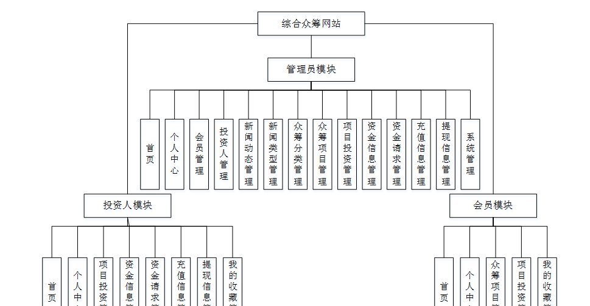

图4-2 系统结构图

### 4.3数据库设计

数据库是计算机信息系统的基础。目前，电脑系统的关键与核心部分就是数据库。数据库开发的优劣对整个系统的质量和速度有着直接影响。

#### 4.3.1 数据库设计原则

数据库的概念结构设计采用实体—联系（E-R）模型设计方法。E-R模型法的组成元素有：实体、属性、联系，E-R模型用E-
R图表示，是提示用户工作环境中所涉及的事物，属性则是对实体特性的描述。在系统设计当中数据库起着决定性的因素。下面设计出这几个关键实体的实体—关系图。

#### 4.3.2 数据库实体

数据模型中的实体（Entity），也称为实例，对应现实世界中可区别于其他对象的“事件”或“事物”。例如，公司中的每个员工，家里中的每个家具。

本系统的E-R图如下图所示：

1、会员注册实体图如图4-3所示：

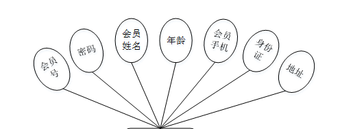

图4-3会员注册实体图

2、众筹项目管理实体图如图4-4所示：

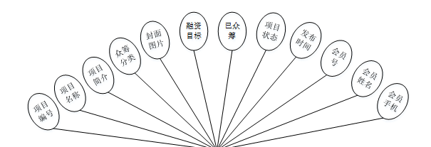

图4-4众筹项目管理实体图

### 系统功能模块

综合众筹网站，在系统首页可以查看首页、新闻动态、众筹项目、个人中心、后台管理等内容，如图5-1所示。

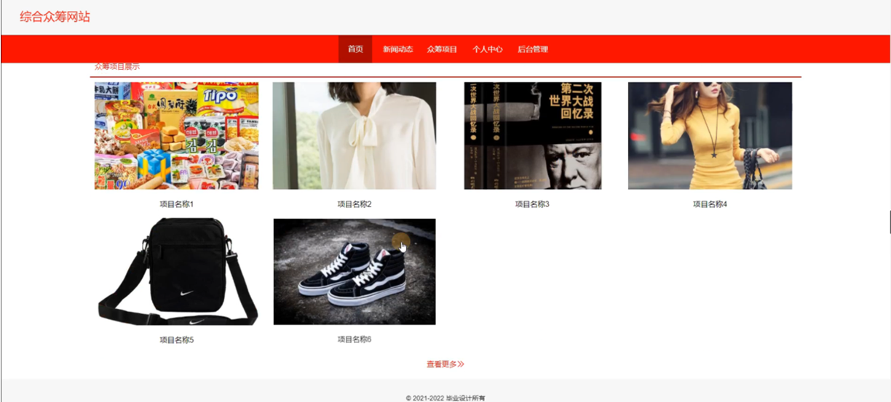

图5-1系统功能界面图

会员注册，在会员注册页面通过填写会员号、密码、会员姓名、年龄、会员手机、身份证、地址等信息完成会员注册，如图5-2所示。

图5-2会员注册界面图

新闻动态，在新闻动态页面可以查看标题、新闻类型、发布时间、发布人等详细内容，如图5-3所示。

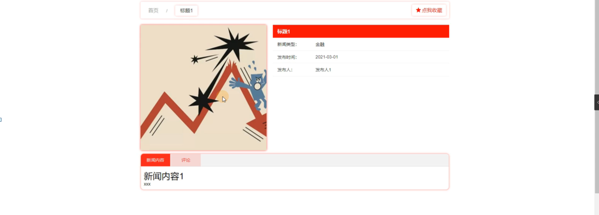

图5-3新闻动态界面图

众筹项目，在众筹项目页面可以查看项目编号、项目名称、项目简介、众筹分类、封面图片、融资目标、已众筹、项目状态、发布时间、会员号、会员姓名、会员手机等详细内容，如图5-4所示。

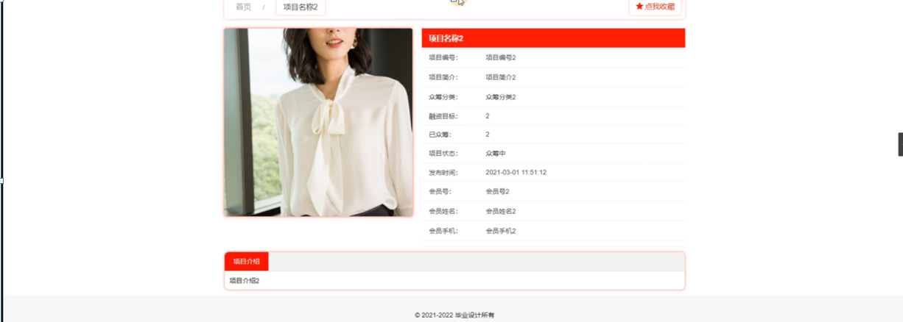

图5-4众筹项目界面图

### 5.2管理员功能模块

管理员登录，通过填写注册时输入的用户名、密码、角色进行登录，如图5-5所示。

图5-5管理员登录界面图

管理员登录进入综合众筹网站可以查看首页、个人中心、会员管理、投资人管理、新闻动态管理、新闻类型管理、众筹分类管理、众筹项目管理、项目投资管理、资金信息管理、资金请求管理、充值信息管理、提现信息管理、系统管理等信息，如图5-6所示。

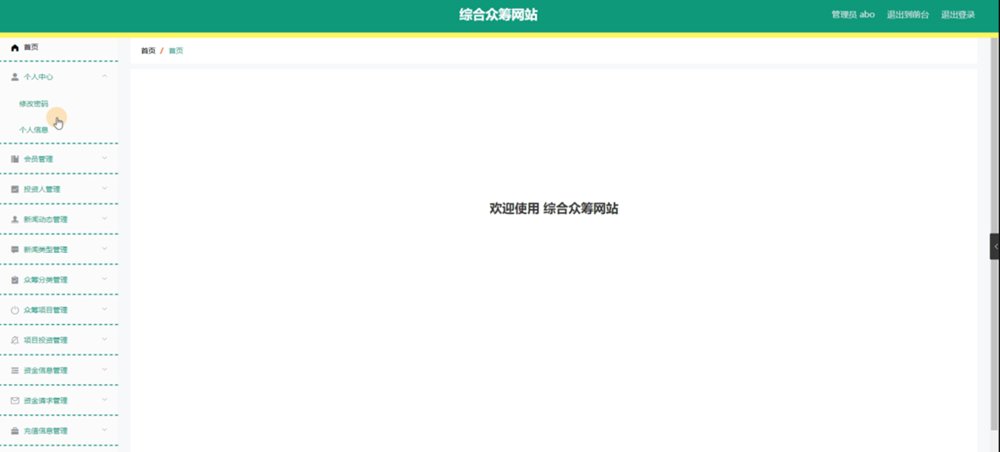

图5-6管理员功能界面图

会员管理，在会员管理页面中可以查看会员号、密码、会员姓名、性别、年龄、头像、会员手机、身份证、地址等信息，并可根据需要进行修改或删除等操作，如图5-7所示。

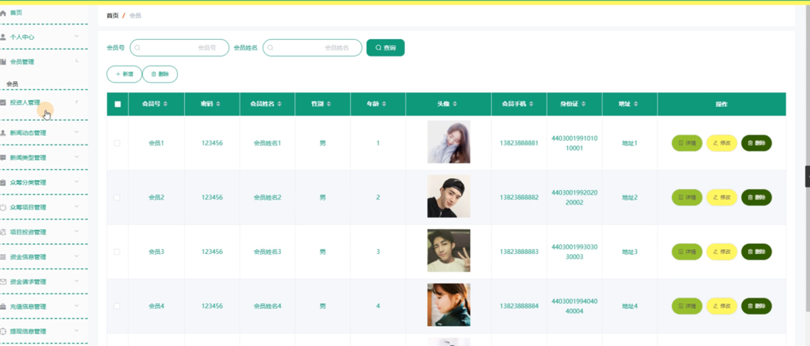

图5-7会员管理界面图

投资人管理，在投资人管理页面中可以查看投资人账号、密码、投资人姓名、性别、年龄、头像、投资人手机、银行卡、身份证、地址等信息，并可根据需要进行修改或删除等操作，如图5-8所示。

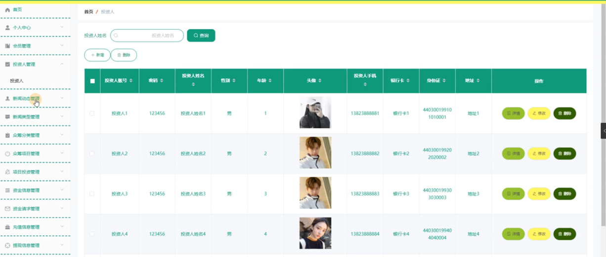

图5-8投资人管理界面图

新闻动态管理，在新闻动态管理页面中可以查看标题、新闻类型、封面图片、发布时间、发布人等信息，并可根据需要进行查看评论、修改或删除等操作，如图5-9所示。

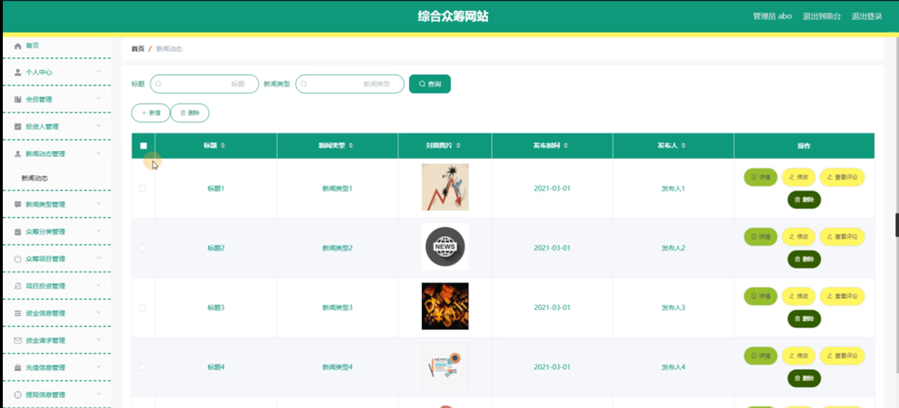

图5-9新闻动态管理界面图

新闻类型管理，在新闻类型管理页面中可以查看新闻类型等信息，并可根据需要进行修改或删除等操作，如图5-10所示。

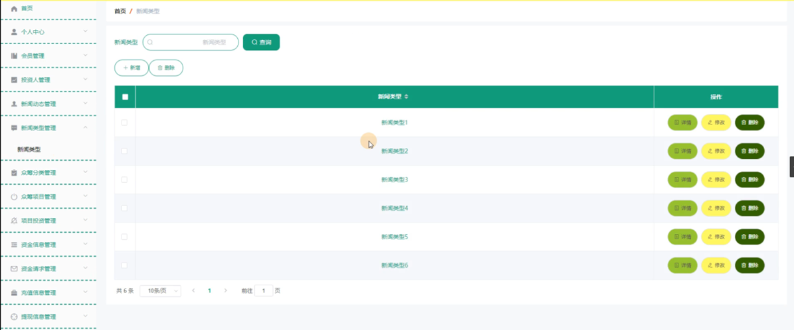

图5-10新闻类型管理界面图

众筹分类管理，在众筹分类管理页面中可以查看众筹分类等信息，并可根据需要进行修改或删除等操作，如图5-11所示。

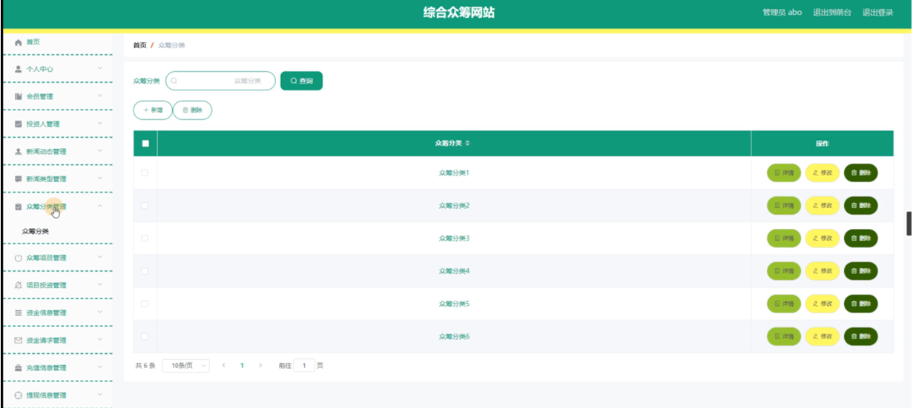

图5-11众筹分类管理界面图

众筹项目管理，在众筹项目管理页面中可以查看项目编号、项目名称、项目简介、众筹分类、封面图片、融资目标、已众筹、项目状态、发布时间、会员号、会员姓名、会员手机等信息，并可根据需要进行修改或删除等操作，如图5-12所示。

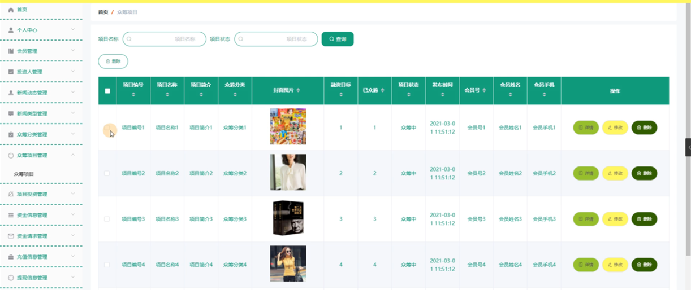

图5-12众筹项目管理界面图

#### **JAVA** **毕设帮助，指导，源码分享，调试部署**

