ssm+Vue计算机毕业设计综合售楼系统（程序+LW文档）

**项目运行**

**环境配置：**

**Jdk1.8 + Tomcat7.0 + Mysql + HBuilderX** **（Webstorm也行）+ Eclispe（IntelliJ
IDEA,Eclispe,MyEclispe,Sts都支持）。**

**项目技术：**

**SSM + mybatis + Maven + Vue** **等等组成，B/S模式 + Maven管理等等。**

**环境需要**

**1.** **运行环境：最好是java jdk 1.8，我们在这个平台上运行的。其他版本理论上也可以。**

**2.IDE** **环境：IDEA，Eclipse,Myeclipse都可以。推荐IDEA;**

**3.tomcat** **环境：Tomcat 7.x,8.x,9.x版本均可**

**4.** **硬件环境：windows 7/8/10 1G内存以上；或者 Mac OS；**

**5.** **是否Maven项目: 否；查看源码目录中是否包含pom.xml；若包含，则为maven项目，否则为非maven项目**

**6.** **数据库：MySql 5.7/8.0等版本均可；**

**毕设帮助，指导，本源码分享，调试部署** **(** **见文末** **)**

### 总体设计

根据综合售楼系统的功能需求，进行系统设计。

前台功能：用户进入系统可以实现首页，售房房源，系统公告，留言板，个人中心，后台管理，在线反馈等内容进行操作。

后台主要是管理员，管理员功能包括首页，个人中心，用户管理，销售员管理，房源类型管理，售房房源管理，售房订单管理，留言板，系统管理等；

系统对这些功能进行整合，产生的功能结构图如下图所示：

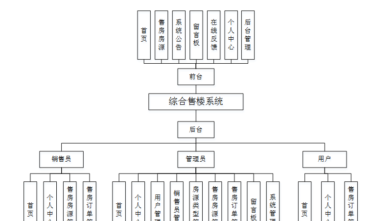图3-1 系统总体设计图

### 3.3 数据库设计

在每一个系统中数据库有着非常重要的作用，数据库的设计得好将会增加系统的效率以及系统各逻辑功能的实现。所以数据库的设计我们要从系统的实际需要出发，才能使其更为完美的符合系统功能的实现。

#### 3.3.1 数据库E-R图

E-R图为实体-关系图，本系统的E-R图展现了各个实体之间的关系，在本数据库中，各个实体之间的关系均为多对多的关系；

系统公告属性图如图3-2所示。

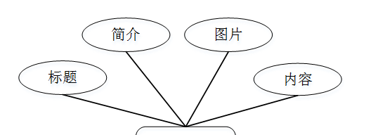

图3-2系统公告实体属性图

留言板实体属性图如图3-3所示。

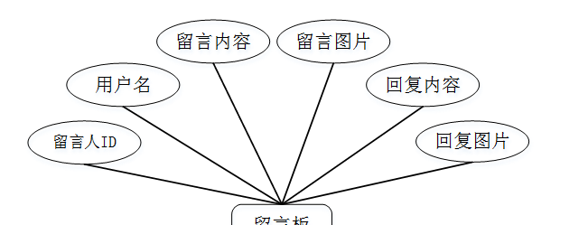

图3-3留言板实体属性图

用户实体属性图如图3-4所示。

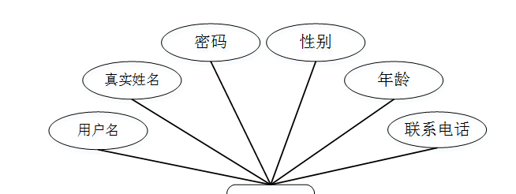

图3-4用户实体属性图

### 系统功能模块

综合售楼系统，在系统首页可以查看首页，售房房源，系统公告，留言板，个人中心，后台管理，在线反馈等内容，并进行详细操作；如图4-1所示。

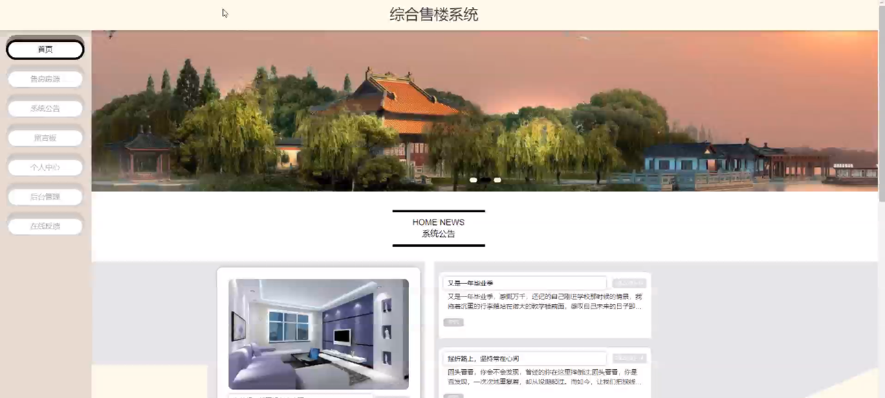

图4-1系统首页界面图

用户注册，在用户注册页面，用户通过填写用户名，真实姓名，密码，确认密码，年龄，联系电话等信息进行注册操作，如图4-2所示。

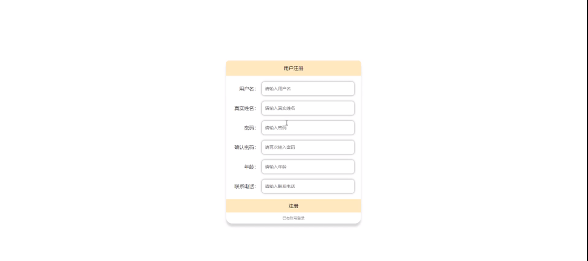

图4-2用户注册界面图

售房房源，在售房房源页面可以查看房源名称，房源类型，装修风格，房源区域，具体位置，房屋状态，周边学校，面积，售价，发布时间，销售工号，销售姓名等内容，并进行收藏等操作，如图4-3所示。

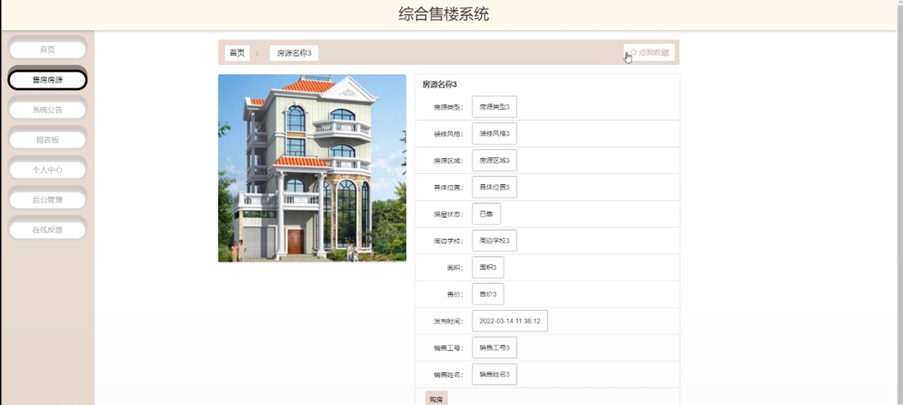

图4-3售房房源界面图

留言板，在留言板页面可以通过填写留言内容，留言图片进行提交操作，如图4-4所示。

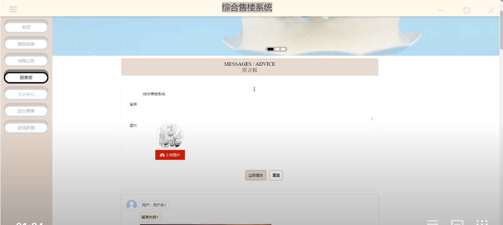

图4-4留言板界面图

个人中心，在个人中心页面通过填写用户名，真实姓名，密码，确认密码，年龄，联系电话等内容进行更新信息，还可以根据需要对我的收藏进行详细操作，如图4-5所示。

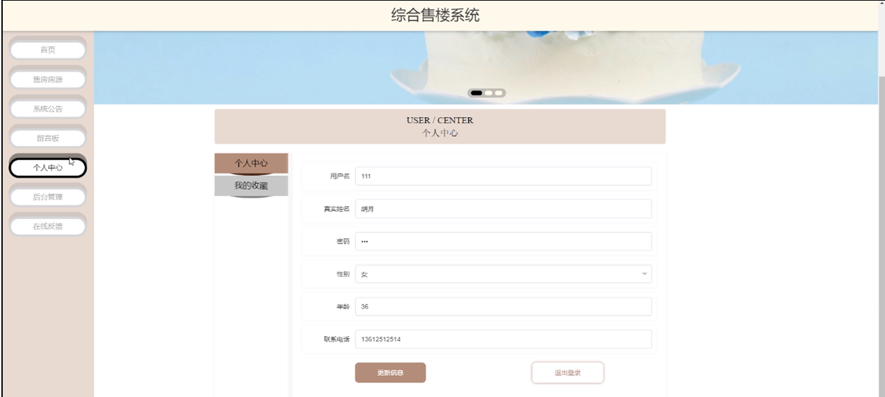

图4-5个人中心界面图

### 4.2管理员功能模块

管理员进行登录，进入系统前在登录页面根据要求填写用户名和密码，选择角色等信息，点击登录进行登录操作，如图4-6所示。

图4-6管理员登录界面图

管理员登录系统后，可以对首页，个人中心，用户管理，销售员管理，房源类型管理，售房房源管理，售房订单管理，留言板，系统管理等功能进行相应的操作管理，如图4-7所示。

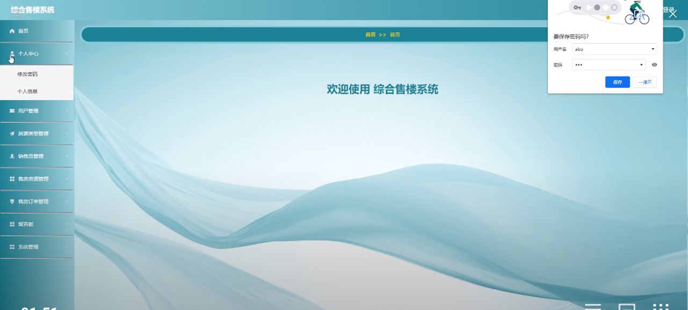

图4-7管理员功能界面图

用户管理，在用户列表可以对用户名，真实姓名，性别，年龄，联系电话等内容进行详情，修改和删除等操作，如图4-8所示。

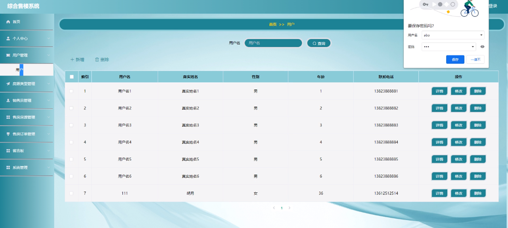

图4-8用户管理界面图

房源类型管理，在房源类型管理页面可以对房源类型等内容进行详情，修改和删除操作，如图4-9所示。

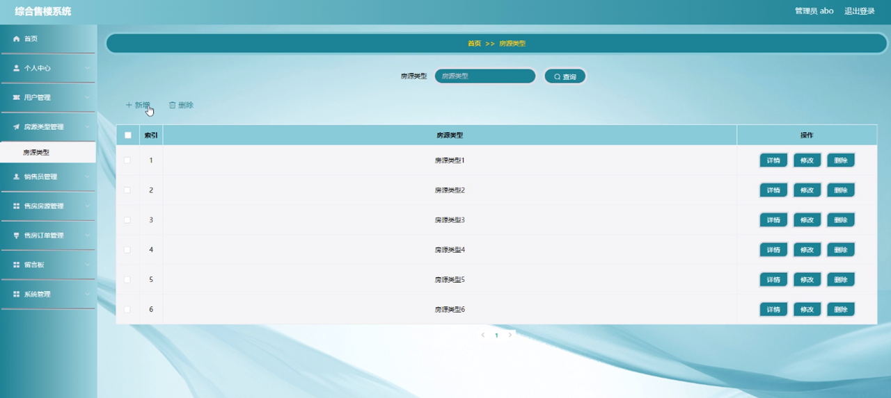

图4-9房源类型管理界面图

销售员管理，在销售员管理页面可以对销售工号，销售姓名，性别，职称，头像，联系电话等内容进行详情，修改和删除操作，如图4-10所示。

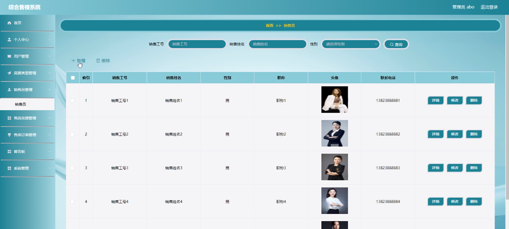

图4-10销售员管理界面图

售房订单管理，在售房订单管理页面可以对订单编号，房源名称，房源类型，装修风格，房源图片，具体位置，面积，售价，用户名，真实姓名，销售工号，销售姓名，购房时间，是否支付等内容进行详情操作，如图4-11所示。

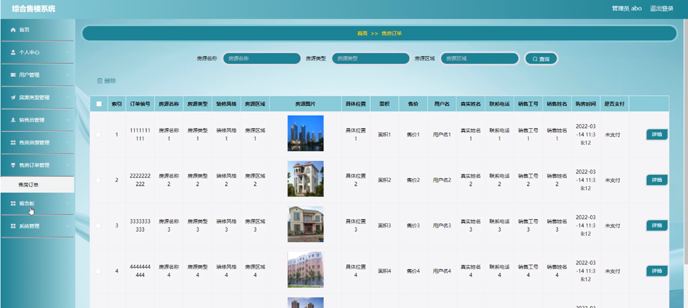

图4-11售房订单管理界面图

系统管理，在系统公告页面可以对标题，图片等内容进行详情，修改和删除等操作，还可以对轮播图管理，在线反馈进行详细的操作管理；如图4-12所示。

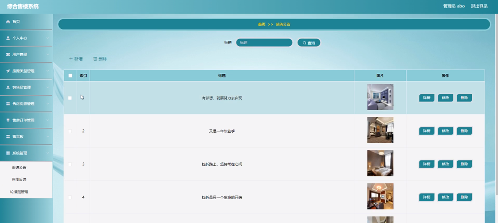

图4-12系统管理界面图

#### **JAVA** **毕设帮助，指导，源码分享，调试部署**

