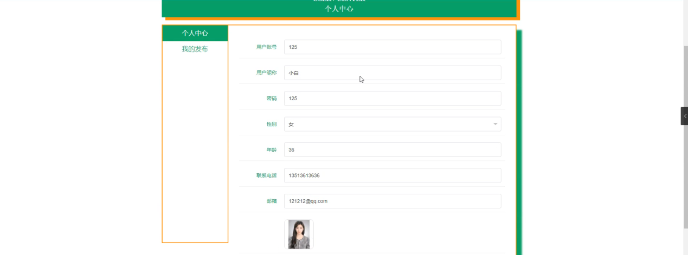
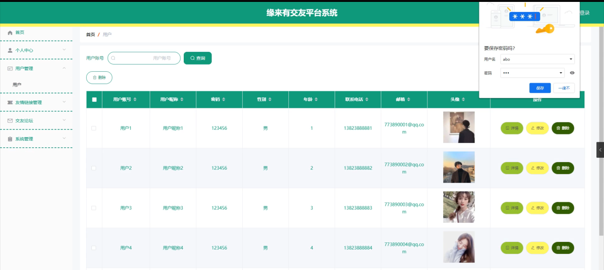

ssm+Vue计算机毕业设计缘来有交友平台系统（程序+LW文档）

**项目运行**

**环境配置：**

**Jdk1.8 + Tomcat7.0 + Mysql + HBuilderX** **（Webstorm也行）+ Eclispe（IntelliJ
IDEA,Eclispe,MyEclispe,Sts都支持）。**

**项目技术：**

**SSM + mybatis + Maven + Vue** **等等组成，B/S模式 + Maven管理等等。**

**环境需要**

**1.** **运行环境：最好是java jdk 1.8，我们在这个平台上运行的。其他版本理论上也可以。**

**2.IDE** **环境：IDEA，Eclipse,Myeclipse都可以。推荐IDEA;**

**3.tomcat** **环境：Tomcat 7.x,8.x,9.x版本均可**

**4.** **硬件环境：windows 7/8/10 1G内存以上；或者 Mac OS；**

**5.** **是否Maven项目: 否；查看源码目录中是否包含pom.xml；若包含，则为maven项目，否则为非maven项目**

**6.** **数据库：MySql 5.7/8.0等版本均可；**

**毕设帮助，指导，本源码分享，调试部署** **(** **见文末** **)**

**系统结构**

本系统架构缘来有交友平台系统，本系统的具体功能如下：

图4-2系统功能结构图

管理员功能结构图，如图4-3所示：

图4-3 管理员功能结构图

用户后台功能结构图，如图4-4所示：

图4-4 用户后台功能结构图

**4.3.** **数据库设计**

**4.3.1** **数据库实体**

管理员信息结构图，如图4-5所示：

图4-5 管理员信息实体结构图

管理员功能实体属性图，如图4-6所示：

图4-6管理员功能实体属性图

用户信息实体属性图，如图4-7所示：

图4-7用户信息实体属性图

**系统功能模块**

缘来有交友平台系统，在缘来有交友平台系统首页可以查看首页、用户、友情链接、交友论坛、系统公告、个人中心、后台管理等内容，如图5-1所示。

图5-1系统首页界面图

用户注册，在用户注册页面通过填写用户账号、用户昵称、密码、年龄、联系电话、邮箱等信息完成用户注册，如图5-2所示。

图5-2用户注册界面图

用户，在用户页面通过填写用户账号、性别、年龄、联系电话、邮箱等信息加好友，如图5-3所示。

图5-3用户界面图

交友论坛，在交友论坛页面通过填写标题、类型、内容等信息发布帖子，如图5-4所示。

图5-4交友论坛界面图

系统公告，在系统公告页面可以查看标题、图片、简介、内容等信息，如图5-5所示。

图5-5系统公告界面图

个人中心，在个人中心页面通过填写用户账号、用户昵称、密码、性别、年龄、联系电话、邮箱等信息上传图片，如图5-6所示。

图5-6个人中心界面图

我的发布，在我的发布页面可以查看标题、发布时间等信息，根据需要进行修改或删除，如图5-7所示。

图5-7我的发布界面图

**5.2** **管理员功能模块**

管理员登录，管理员通过输入用户名、密码、角色等信息即可进行系统登录，如图5-8所示。

图5-8管理员登录界面图

管理员登录进入缘来有交友平台系统可以查看首页、个人中心、用户管理、友情链接管理、交友论坛、系统管理等内容，如图5-9所示。

图5-9管理员功能界面图

用户管理，在用户管理页面可以获取用户账号、用户昵称、密码、性别、年龄、联系电话 、邮箱、头像等信息，并可根据需要进行修改或删除等操作，如图5-10所示。

图5-10用户管理界面图

友情链接管理，在友情链接管理页面可以获取网站名、网址、logo等信息，并可根据需要进行修改或删除等操作，如图5-11所示。

图5-11友情链接管理界面图

交友论坛，在交友论坛页面可以获取帖子标题、用户名、状态等信息，并可根据需要进行修改或删除等操作，如图5-12所示。

图5-12交友论坛界面图

#### **JAVA** **毕设帮助，指导，源码分享，调试部署**

