ssm+Vue计算机毕业设计羊肉溯源系统（程序+LW文档）

**项目运行**

**环境配置：**

**Jdk1.8 + Tomcat7.0 + Mysql + HBuilderX** **（Webstorm也行）+ Eclispe（IntelliJ
IDEA,Eclispe,MyEclispe,Sts都支持）。**

**项目技术：**

**SSM + mybatis + Maven + Vue** **等等组成，B/S模式 + Maven管理等等。**

**环境需要**

**1.** **运行环境：最好是java jdk 1.8，我们在这个平台上运行的。其他版本理论上也可以。**

**2.IDE** **环境：IDEA，Eclipse,Myeclipse都可以。推荐IDEA;**

**3.tomcat** **环境：Tomcat 7.x,8.x,9.x版本均可**

**4.** **硬件环境：windows 7/8/10 1G内存以上；或者 Mac OS；**

**5.** **是否Maven项目: 否；查看源码目录中是否包含pom.xml；若包含，则为maven项目，否则为非maven项目**

**6.** **数据库：MySql 5.7/8.0等版本均可；**

**毕设帮助，指导，本源码分享，调试部署** **(** **见文末** **)**

### 4.1系统总体设计

系统总体设计即对有关系统全局问题的设计，也就是设计系统总的处理方案，又称系统概要设计。它包括系统规划与系统功能设计等内容。

羊肉溯源系统主要有两类用户。分别是管理员和普通管理员，详细规划如图4-1所示。

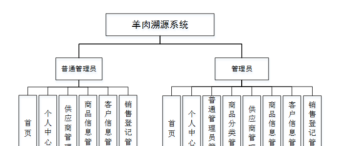

图4-1 系统规划图

其中各子模块的主要功能如下：

1、用户登录：用户进入网页先输入用户名与密码，选择权限登录，用户登录成功，要记录登录的用户名和登录类型。

2、主页内容管理：管理员登录以后，可以对首页，个人中心，普通管理员管理，商品分类管理，供应商管理，商品信息管理，客户信息管理，销售登记管理进行详细操作。

### 4.2数据库设计

数据库是一个软件项目的根基，它决定了整个项目代码的走势，同时也决定了整个项目在后期的维护以及升级的难易程度。

#### 4.2.1 数据库概念设计

根据羊肉溯源系统的功能需求，对数据库进行分析，得到相应的数据，设计用户需要的各种实体，以及相互之间的关联，为逻辑结构设计铺好路。根据所实体内的各种具体信息得于实现。

1.客户信息实体

客户信息实体包括客户名称，客户地址，客户电话，邮箱，传真等属性。客户息实体图如图4-2所示：

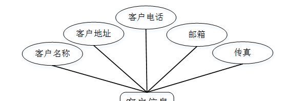

图4-2.客户信息实体图

2.普通管理员实体

普通管理员实体包括管理员账号，管理员姓名，密码，性别，联系电话，身份证等属性；普通管理员实体图如图4-3所示：

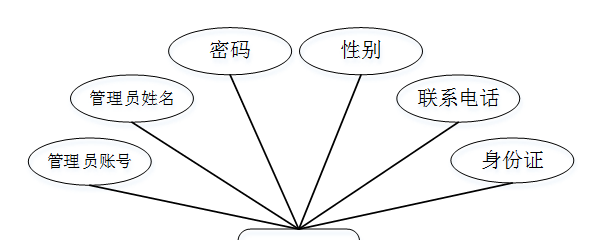

图4-3普通管理员实体图

3.商品信息实体

商品信息实体包括商品编号，商品名称，商品分类，供应商名称，规格，条形码，数量，进货价格，销售价格，详情等属性。商品信息实体图如图4-4所示：

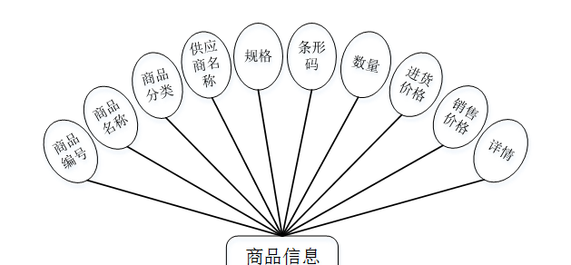

图4-4商品信息实体图

### 5.1功能页面实现

按照不同功能模块，在此对系统所涉及的关键页面的实现细节进行阐述，包括页面功能描述，页面涉及功能分析，介绍以及界面展示。

系统登录：运行系统，首先进入登录界面，按照登录界面的要求填写相应的“账号”和“密码”以及用户类型，点击“登录”然后系统判断填写是否正确，若正确进入相应的界面，否则给出要求先注册信息。具体流程如图5-1所示。

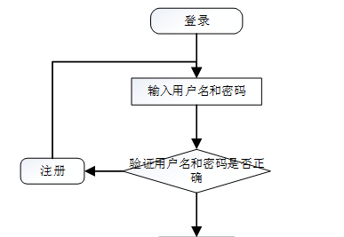

图5-1 登录流程图

系统登录，通过输入账号，密码，选择角色并点击登录进行系统登录操作，如图5-2所示。

图5-2系统登录界面图

### 5.2管理员功能模块

管理员登录系统后，可以对首页，个人中心，普通管理员管理，商品分类管理，供应商管理，商品信息管理，客户信息管理，销售登记管理等功能进行相应操作，如图5-3所示。

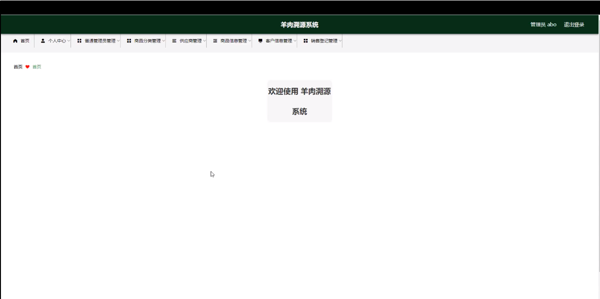

图5-3管理员功能界面图

普通管理员管理；在普通管理员管理页面可以对索引，管理员账号，管理员姓名，性别，联系电话，身份证等内容进行详情，修改或删除等操作，如图5-4所示。

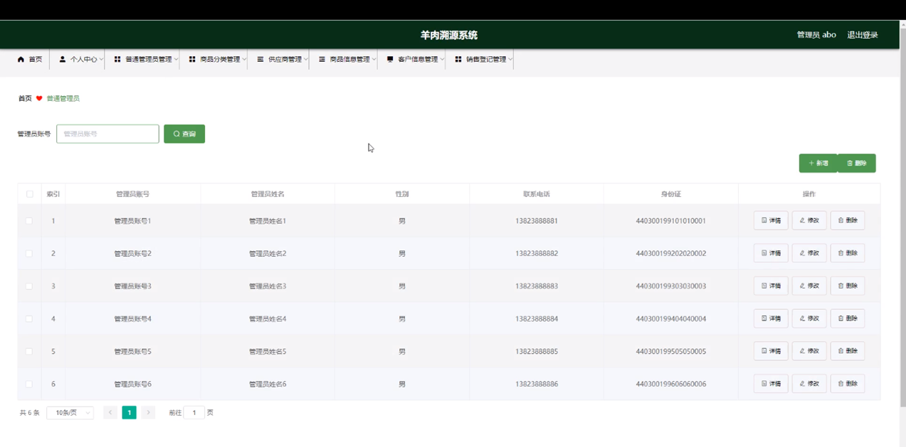

图5-4普通管理员管理界面图

商品分类管理；在商品分类管理页面可以对索引，商品分类等内容进行详情，修改或删除等操作，如图5-5所示。

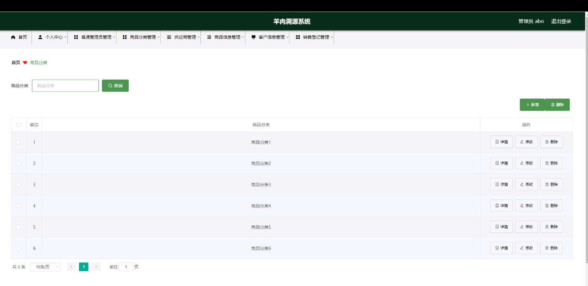

图5-5商品分类管理界面图

供应商管理；在供应商管理页面可以对索引，供应商名称，供应商地址，联系电话，负责人姓名，职务，主销产品，等内容进行详情，修改或删除等操作，如图5-6所示。

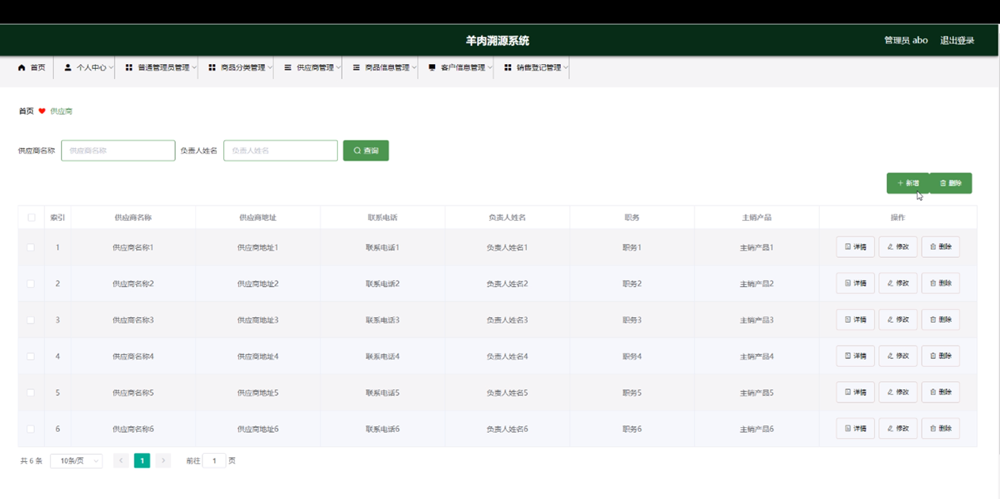

图5-6供应商管理界面图

商品信息管理；在商品信息管理页面可以对索引，商品编号，商品名称，商品分类，供应商名称，条形码，数量，进货价格，销售价格等内容进行详情，销售，修改或删除等操作，如图5-7所示。

图5-7商品信息管理界面图

客户信息管理；在客户信息管理页面可以对索引，客户名称，客户地址，客户电话，邮箱，传真等内容进行详情，修改或删除等操作，如图5-8所示。

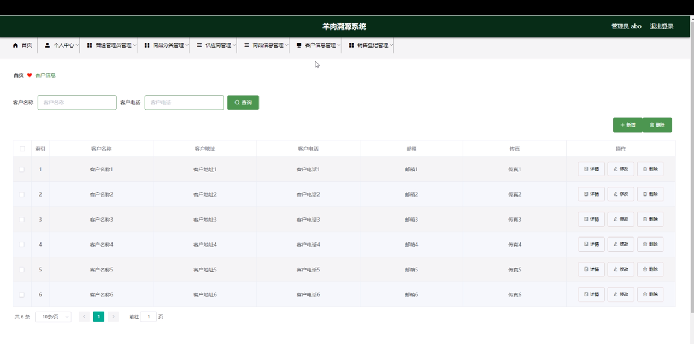

图5-8客户信息管理界面图

### 5.3普通管理员功能模块

普通管理员登录进入系统后台，可以对首页，个人中心，供应商管理，商品信息管理，客户信息管理，销售登记管理等功能进行相应操作，如图5-9所示。

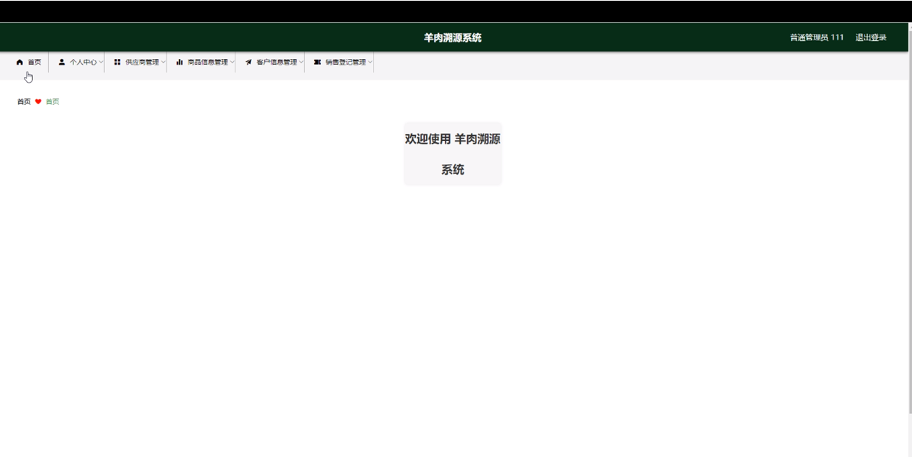

图5-9普通管理员功能界面图

供应商管理；在供应商管理页面可以对索引，供应商名称，供应商地址，联系电话，负责人姓名，职务，主销产品，等内容进行详情，修改或删除等操作，如图5-10所示。

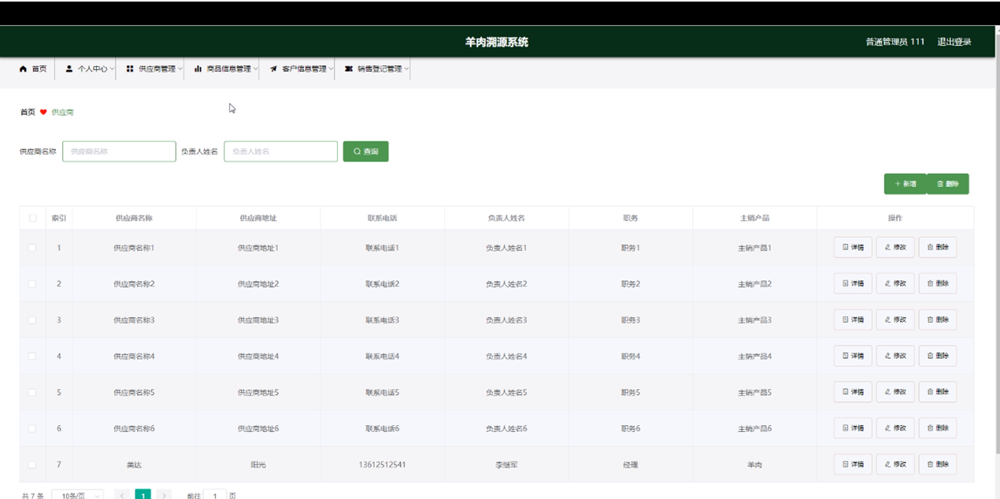

图5-10供应商管理界面图

商品信息管理；在商品信息管理页面可以对索引，商品编号，商品名称，商品分类，供应商名称，条形码，数量，进货价格，销售价格等内容进行详情，销售，修改或删除等操作，如图5-11所示。

图5-11商品信息管理界面图

客户信息管理；在客户信息管理页面可以对索引，客户名称，客户地址，客户电话，邮箱，传真等内容进行详情，修改或删除等操作，如图5-12所示。

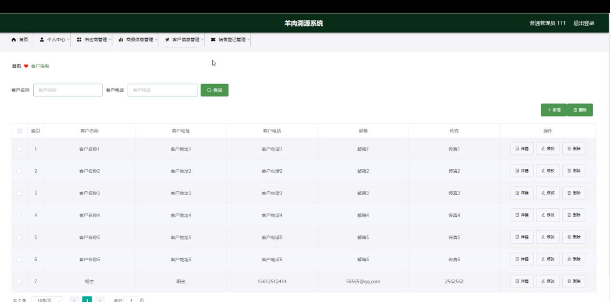

图5-12客户信息管理界面图

#### **JAVA** **毕设帮助，指导，源码分享，调试部署**

