ssm+Vue计算机毕业设计羽毛球场地管理系统（程序+LW文档）

**项目运行**

**环境配置：**

**Jdk1.8 + Tomcat7.0 + Mysql + HBuilderX** **（Webstorm也行）+ Eclispe（IntelliJ
IDEA,Eclispe,MyEclispe,Sts都支持）。**

**项目技术：**

**SSM + mybatis + Maven + Vue** **等等组成，B/S模式 + Maven管理等等。**

**环境需要**

**1.** **运行环境：最好是java jdk 1.8，我们在这个平台上运行的。其他版本理论上也可以。**

**2.IDE** **环境：IDEA，Eclipse,Myeclipse都可以。推荐IDEA;**

**3.tomcat** **环境：Tomcat 7.x,8.x,9.x版本均可**

**4.** **硬件环境：windows 7/8/10 1G内存以上；或者 Mac OS；**

**5.** **是否Maven项目: 否；查看源码目录中是否包含pom.xml；若包含，则为maven项目，否则为非maven项目**

**6.** **数据库：MySql 5.7/8.0等版本均可；**

**毕设帮助，指导，本源码分享，调试部署** **(** **见文末** **)**

### **功能结构**

为了更好的去理清本系统整体思路，对该系统以结构图的形式表达出来，设计实现该羽毛球场地管理系统的功能结构图如下所示：

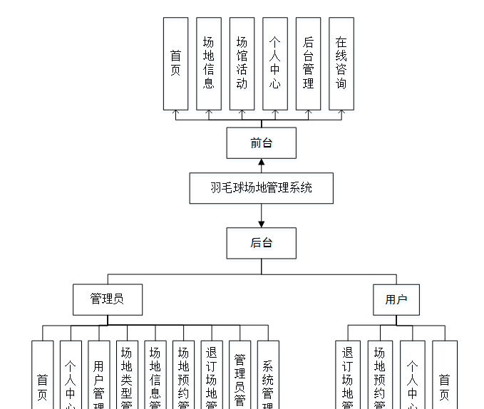

图4-1 系统总体结构图

### **4.2** **数据库设计**

#### **4.2.1** **数据库** **E/R** **图**

ER图是由实体及其关系构成的图，通过E/R图可以清楚地描述系统涉及到的实体之间的相互关系。在系统中对一些主要的几个关键实体如下图：

(1) 用户注册E/R图如下所示：

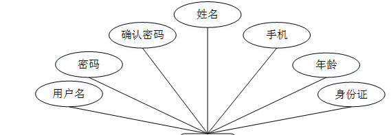

图4-2用户注册E/R图

(2)场地信息E/R图如下所示：

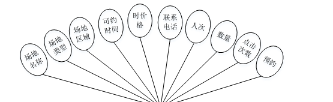

图4-3场地信息E/R图

### **系统功能模块**

羽毛球场地管理系统，在系统首页可以查看首页，场地信息，场馆活动，个人中心，后台管理， 在线咨询等内容，并进行详细操作；如图5-1所示。

图5-1系统首页界面图

用户注册，在用户注册页面通过填写用户名，密码，确认密码，姓名，手机，年龄，身份证等信息进行注册操作，如图5-2所示。

图5-2用户注册界面图

场地信息，在场地信息页面可以查看场地名称，场地类型，场地区域，可约时间，时价格，联系电话，人次，数量，点击次数，等内容，并进行预约，评论和收藏操作，如图5-3所示。

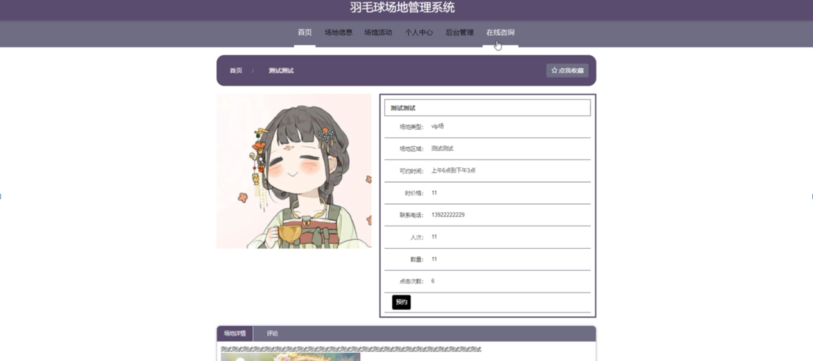

图5-3场地信息界面图

### **5.2** **后台登录模块**

后台登录，管理员，用户进入系统前在登录页面根据要求填写账号，密码，点击登录进行登录操作，如图5-4所示。

图5-4后台登录界面图

#### **5.2.1** **管理员功能模块**

管理员登陆系统后，可以查看首页，个人中心
，用户管理，场地类型管理，场地信息管理，场地预约管理，退订场地管理，管理员管理，系统管理等功能，还能对每个功能逐一进行相应操作，如图5-5所示。

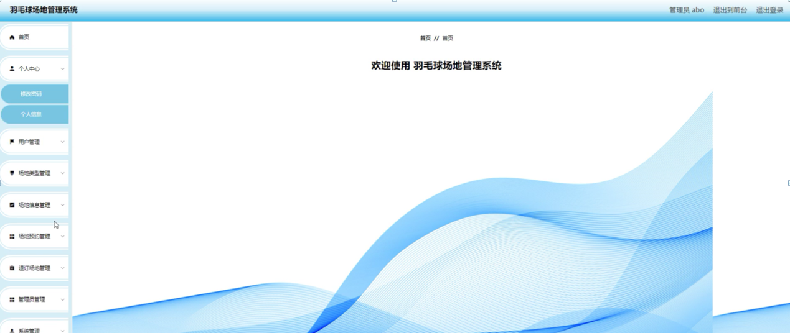

图5-5管理员功能界面图

用户管理，在用户管理页面可以对索引，用户号，姓名，性别，手机，年龄，身份证等内容进行详情，修改，删除操作，如图5-6所示。

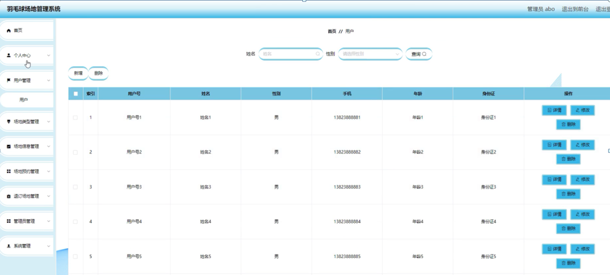

图5-6用户管理界面图

场地信息管理，在场地信息管理页面可以对索引，场地名称，场地类型，场地图片
，场地区域，可约时间，时价格，联系电话，人次，数量等内容进行详情，预约，修改，查看评论和删除等操作，如图5-7所示。

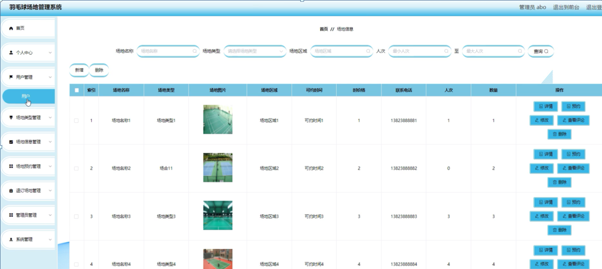

图5-7场地信息管理界面图

场地预约管理，在场地预约管理页面可以对索引，订单编号
，场地名称，场地类型，场地区域，开始时间，时价格，数量，总价，联系电话，人次，用户号，姓名，手机，下单时间，健康码，是否支持等内容进行详情，退订场地，修改和删除操作，如图5-8所示。

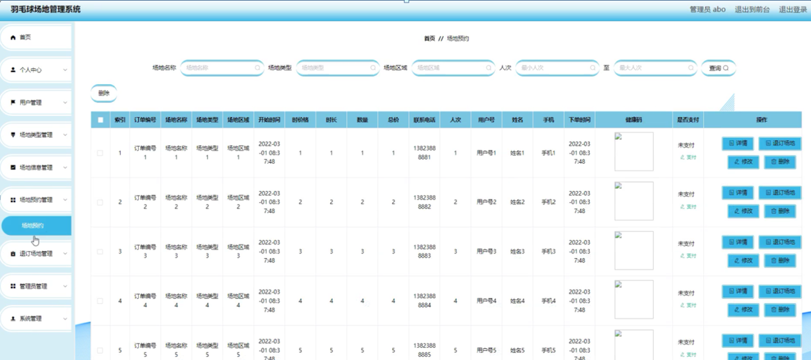

图5-8场地预约管理界面图

场地类型管理，在场地类型管理页面可以对索引，场地类型等内容进行修改和删除等操作，如图5-9所示。

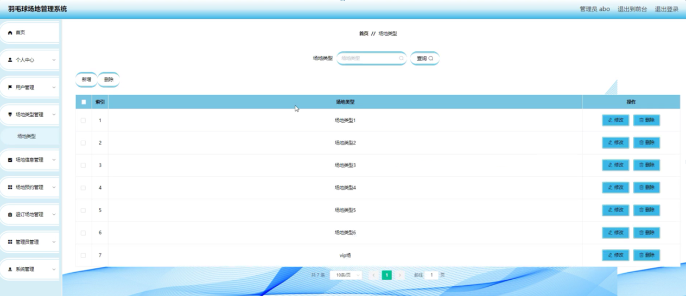

图5-9场地类型管理界面图

系统管理，在场馆活动页面可以对索引，标题，图片等内容进行详情，修改和删除等操作，还可以对在线咨询，轮播图管理进行详细操作；如图5-10所示。

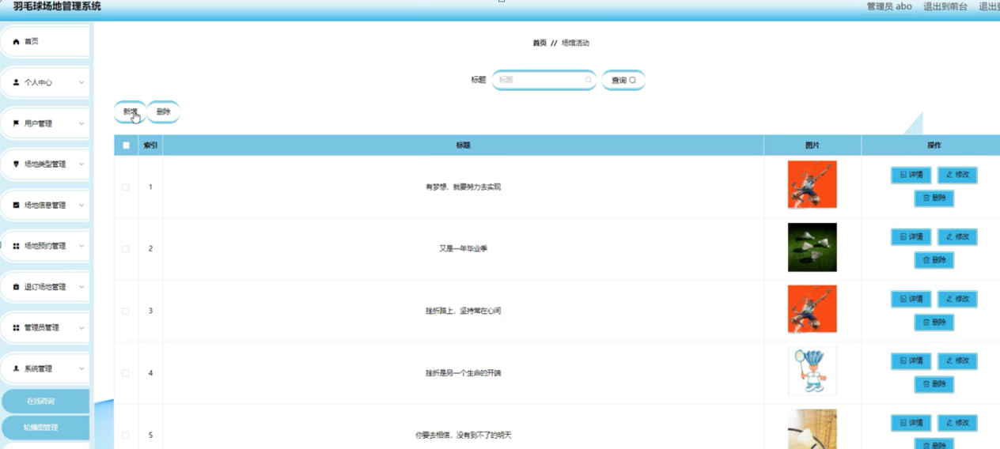

图5-10系统管理界面图

#### **5.2.2** **用户功能模块**

用户登陆系统，可以查看首页，个人中心，场地预约管理，退订场地管理等功能，还能对每个功能逐一进行相应操作，如图5-11所示。

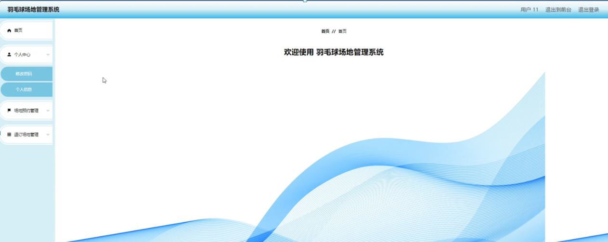

图5-11用户功能界面图

个人中心，在个人信息页面通过填写用户名,姓名,性别,手机，年龄，身份证等内容进行个人信息修改操作，如图5-12所示。

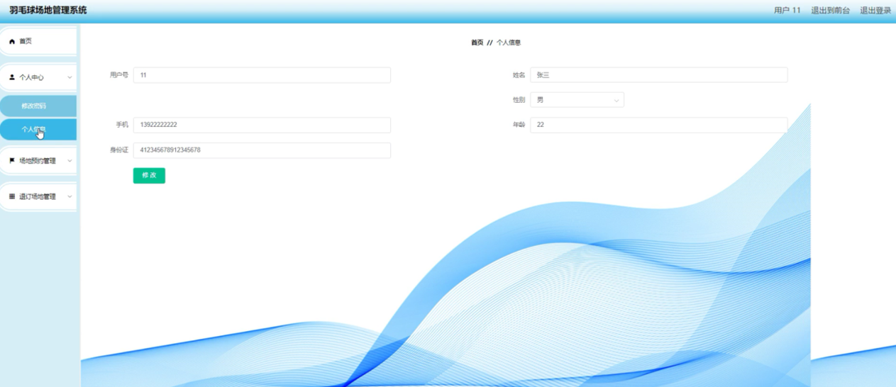

图5-12个人中心界面图

**JAVA** **毕设帮助，指导，源码分享，调试部署**

