ssm+Vue计算机毕业设计职业信息服务平台（程序+LW文档）

**项目运行**

**环境配置：**

**Jdk1.8 + Tomcat7.0 + Mysql + HBuilderX** **（Webstorm也行）+ Eclispe（IntelliJ
IDEA,Eclispe,MyEclispe,Sts都支持）。**

**项目技术：**

**SSM + mybatis + Maven + Vue** **等等组成，B/S模式 + Maven管理等等。**

**环境需要**

**1.** **运行环境：最好是java jdk 1.8，我们在这个平台上运行的。其他版本理论上也可以。**

**2.IDE** **环境：IDEA，Eclipse,Myeclipse都可以。推荐IDEA;**

**3.tomcat** **环境：Tomcat 7.x,8.x,9.x版本均可**

**4.** **硬件环境：windows 7/8/10 1G内存以上；或者 Mac OS；**

**5.** **是否Maven项目: 否；查看源码目录中是否包含pom.xml；若包含，则为maven项目，否则为非maven项目**

**6.** **数据库：MySql 5.7/8.0等版本均可；**

**毕设帮助，指导，本源码分享，调试部署** **(** **见文末** **)**

### 系统结构

本系统架构网站系统，本系统的具体功能如下：

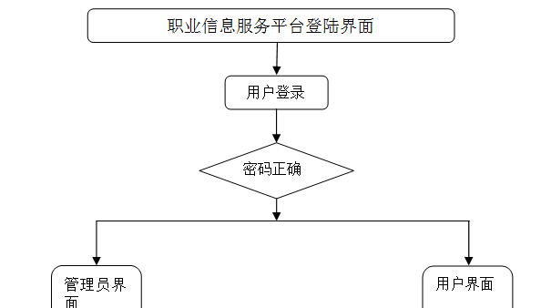

图4-2系统功能结构图

管理员功能结构图，如图4-3所示：

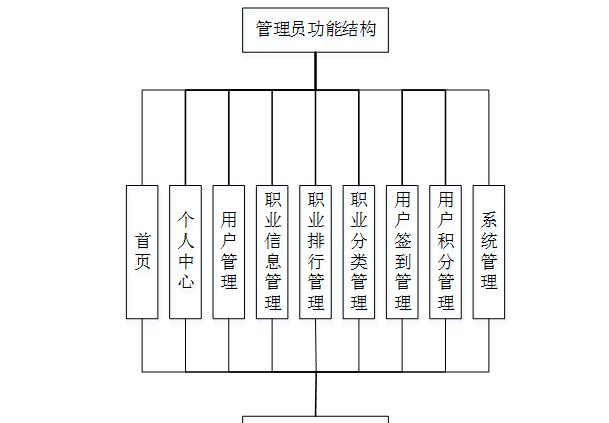

图4-3 管理员功能结构图

用户后台功能结构图，如图4-4所示：

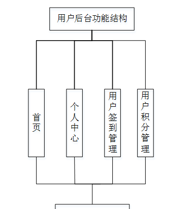

图4-4 用户后台功能结构图

### 4.3. 数据库设计

#### 4.3.1 数据库实体

管理员信息结构图，如图4-5所示：

图4-5 管理员信息实体结构图

用户信息实体属性图，如图4-6所示：

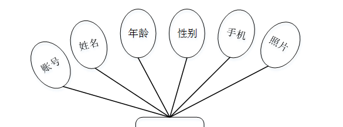

图4-6用户信息实体属性图

职业信息管理实体属性图如图4-7所示。

图4-7职业信息管理实体属性图

用户签到管理实体属性图如图4-8所示。

图4-8用户签到管理实体属性图

### 系统功能模块

职业信息服务平台，在系统首页可以查看首页、职业信息、职业排行、职业资讯、个人中心、后台管理、在线客服等内容，如图5-1所示。

图5-1系统首页界面图

职业信息，在职业信息页面可以查看职业名称、职业分类、点击次数、职业数据、封面等信息，如图5-2所示。

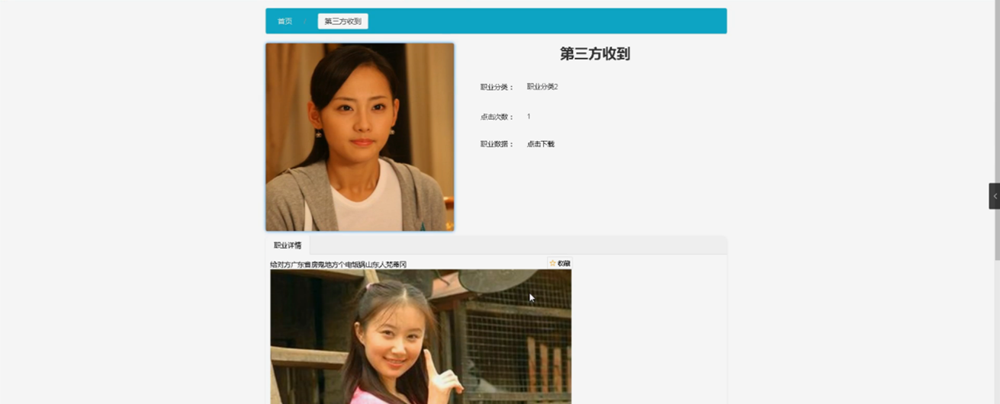

图5-2职业信息界面图

个人中心，在个人中心页面通过填写账号、密码、姓名、年龄、性别、手机等信息进行更新信息，如图5-3所示。

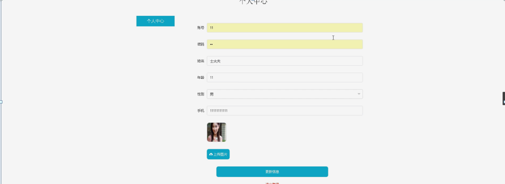

图5-3个人中心界面图

### 5.2管理员功能模块

管理员登录，通过填写注册时输入的用户名、密码、角色进行登录，如图5-4所示。

图5-4管理员登录界面图

管理员登录进入职业信息服务平台可以查看首页、个人中心、用户管理、职业信息管理、职业排行管理、职业分类管理、用户签到管理、用户积分管理、系统管理等信息，如图5-5所示。

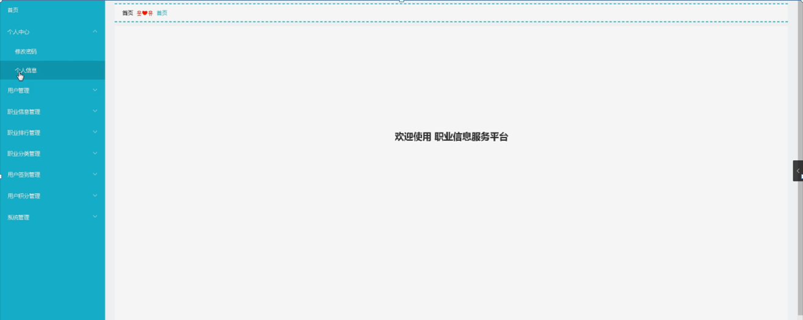

图5-5管理员功能界面图

用户管理，在用户管理页面中可以查看索引、账号、姓名、年龄、性别、手机、照片等信息，并可根据需要进行删除等操作，如图5-6所示。

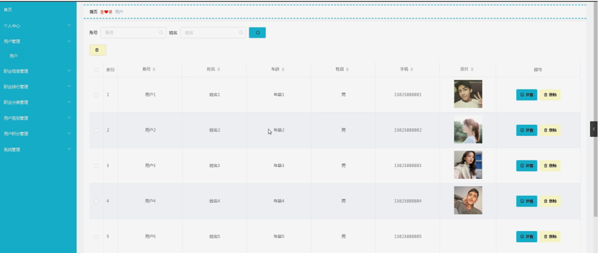

图5-6用户管理界面图

职业信息管理，在职业信息管理页面中可以查看索引、职业名称、职业分类、职业数据、封面等信息，并可根据需要进行修改或删除等操作，如图5-7所示。

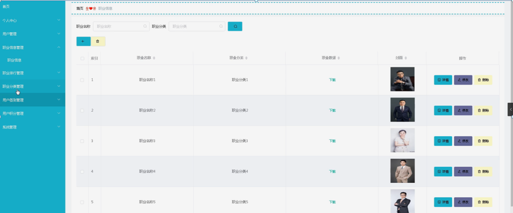

图5-7职业信息管理界面图

职业排行管理，在职业排行管理页面中可以查看索引、职业名称、职业分类、职业数据、点击次数、封面等信息，并可根据需要进行修复或删除等操作，如图5-8所示。

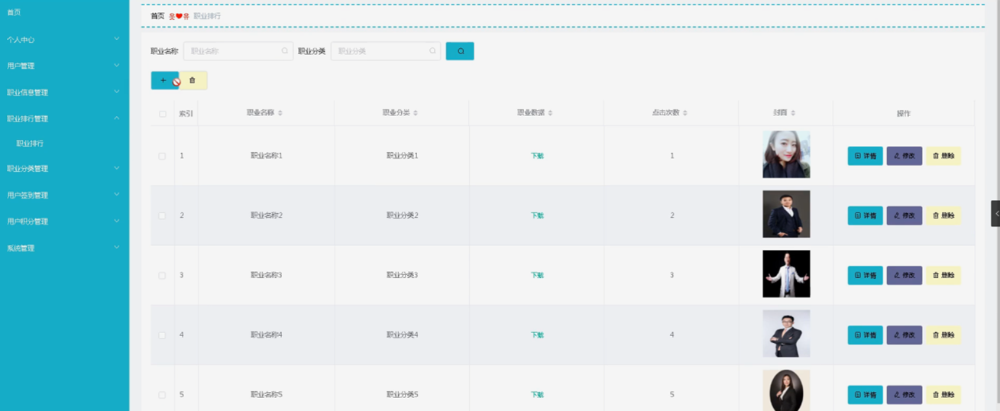

图5-8职业排行管理界面图

职业分类管理，在职业分类管理页面中可以查看索引、职业分类等信息，并可根据需要进行修改或删除操作，如图5-9所示。

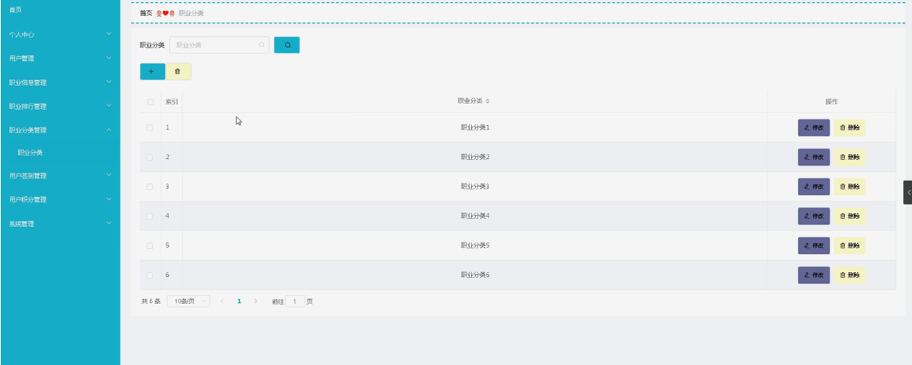

图5-9职业分类管理界面图

用户签到管理，在用户签到管理页面中可以查看索引、账号、姓名、照片、是否签到、签到时间等信息，并可根据需要进行给予积分或删除等操作，如图5-10所示。

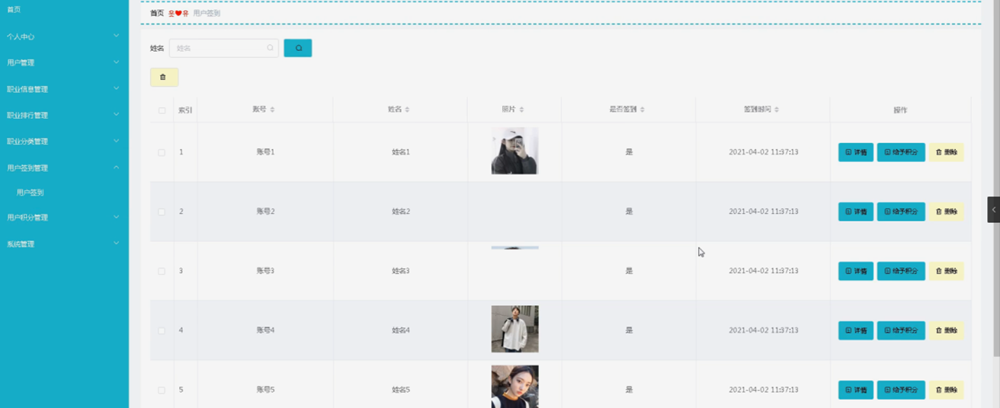

图5-10用户签到管理界面图

用户积分管理，在用户积分管理页面中可以查看索引、账号、姓名、照片、积分、登记日期等信息，并可根据需要进删除等操作，如图5-11所示。

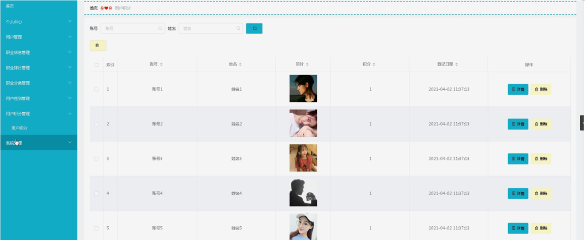

图5-11用户积分管理界面图

系统管理，在职业资讯页面中可以查看索引、标题、简介、图片等信息，并可根据需要对在线客服、轮播图管理进行相对应操作，如图5-12所示。

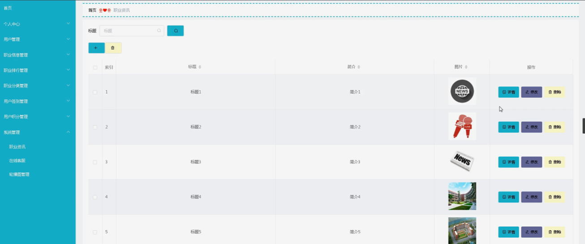

图5-12系统管理界面图

#### **JAVA** **毕设帮助，指导，源码分享，调试部署**

