ssm+Vue计算机毕业设计职业学校招生系统（程序+LW文档）

**项目运行**

**环境配置：**

**Jdk1.8 + Tomcat7.0 + Mysql + HBuilderX** **（Webstorm也行）+ Eclispe（IntelliJ
IDEA,Eclispe,MyEclispe,Sts都支持）。**

**项目技术：**

**SSM + mybatis + Maven + Vue** **等等组成，B/S模式 + Maven管理等等。**

**环境需要**

**1.** **运行环境：最好是java jdk 1.8，我们在这个平台上运行的。其他版本理论上也可以。**

**2.IDE** **环境：IDEA，Eclipse,Myeclipse都可以。推荐IDEA;**

**3.tomcat** **环境：Tomcat 7.x,8.x,9.x版本均可**

**4.** **硬件环境：windows 7/8/10 1G内存以上；或者 Mac OS；**

**5.** **是否Maven项目: 否；查看源码目录中是否包含pom.xml；若包含，则为maven项目，否则为非maven项目**

**6.** **数据库：MySql 5.7/8.0等版本均可；**

**毕设帮助，指导，本源码分享，调试部署** **(** **见文末** **)**

总体设计

根据职业学校招生系统的功能需求，进行系统设计。

前台功能：学生进入系统可以实现首页、招生信息、招生公告、个人中心、后台管理等进行操作；

后台主要是管理员和教师，管理员功能包括个人中心、教师管理、学生管理、招生信息管理、报名信息管理、报到凭证管理、系统管理；教师功能包括个人中心、招生信息管理、报名信息管理、报到凭证管理等；系统对这些功能进行整合，产生的功能结构图如下：

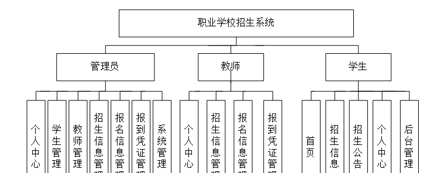

图3-1 系统总体结构图

3.4 数据库设计与实现

在每一个系统中数据库有着非常重要的作用，数据库的设计得好将会增加系统的效率以及系统各逻辑功能的实现。所以数据库的设计我们要从系统的实际需要出发，才能使其更为完美的符合系统功能的实现。

#### 3.4.1 数据库概念结构设计

数据库的E-R图反映了实体、实体的属性和实体之间的联系。下面是各个实体以及实体的属性。

报名信息管理实体属性图如下所示：

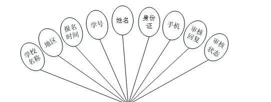

图3-2 报名信息管理实体属性图

招生信息管理实体属性图如下所示：

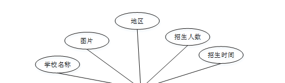

图3-3招生信息管理实体属性图

学生管理实体属性图如下所示：

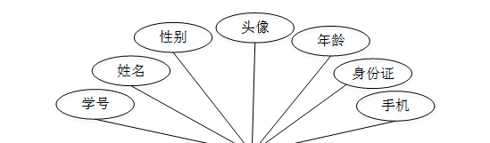

图3-4学生管理实体属性图

### 系统功能模块

职业学校招生系统，用户进入到网站首页，可以查看首页、招生信息、招生公告、个人中心、后台管理等内容进行操作，如图4-1所示。

图4-1网站首页界面图

学生注册，学生通过输入学号、姓名、密码、身份证、年龄、手机、邮箱等内容进行注册，如图4-2所

图4-2学生注册界面图

学生登录，学生注册完成后通过输入账号、密码进行登录进入系统，如图4-3所示。

图4-3学生登录界面图

个人中心，学生可在个人中心页面通过输入学号、密码、姓名、性别、上传图片、手机、年龄、身份证等内容进行更新信息等操作，如图4-4所示。

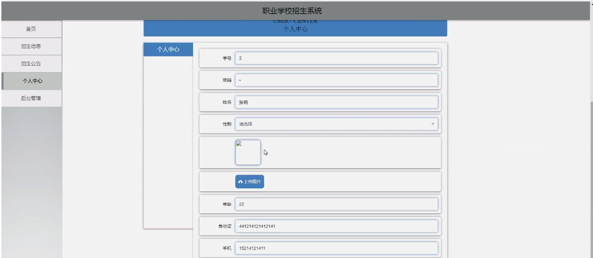

图4-4个人中心界面图

招生信息，学生可在招生信息页面查看学校名称、地区、招生人数、招生时间、报名须知、封面、学校简介等内容，还可进行报名等操作，如图4-5所示。

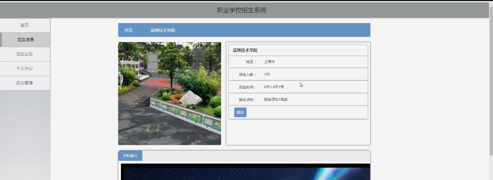

图4-5招生信息界面图

学生通过点击后台管理进入到职业学校招生系统后台可查看个人中心、报名信息管理、报到凭证管理等内容，在个人中心页面还可进行修改密码和个人信息等操作，如图4-6所示。

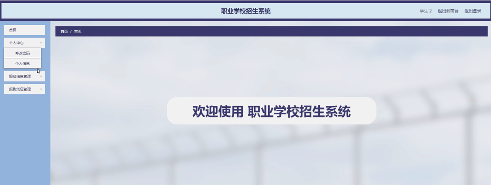图4-6学生后台功能界面图

报名信息管理，学生可在报名信息管理页面查看学校名称、地区、报名时间、学号、姓名、身份证、手机、审核回复、审核状态等内容，还可进行删除等操作，如图4-7所示。

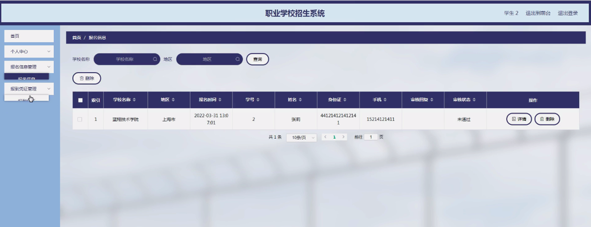图4-7报名信息管理界面图

报到凭证管理，学生可在报到凭证管理页面查看学校名称、凭证号码、分别时间、备注说明、学号、姓名、身份证、手机等内容，如图4-8所示。

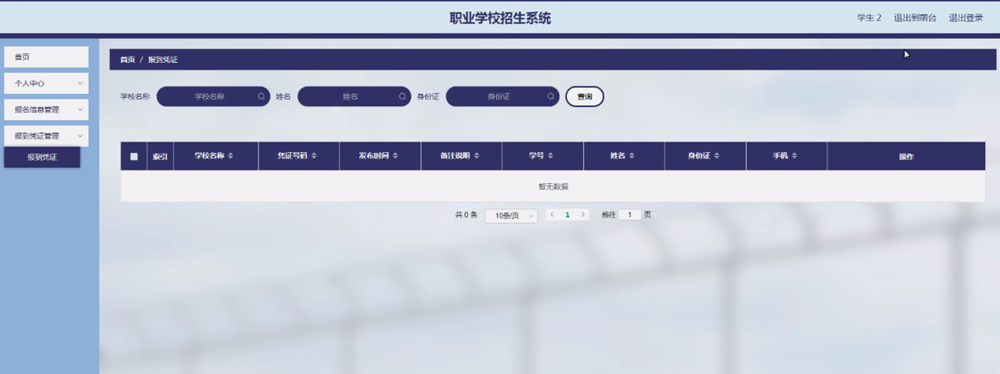

图4-8报到凭证管理界面图

### 4.2教师功能模块

教师登录，教师通过输入用户名、密码、角色进行登录进入系统，如图4-9所示。

图4-9教师登录界面图

教师通过登录进入职业学校招生系统可看出个人中心、招生信息管理、报名信息管理、报到凭证管理等内容，如图4-10所示。

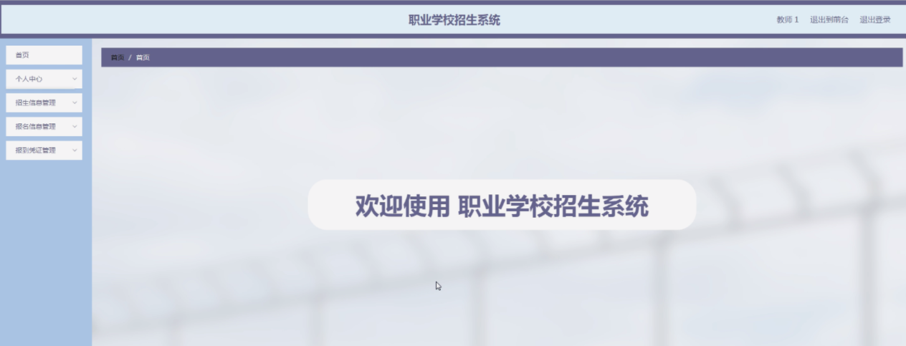

图4-10教师功能界面图

个人中心，教师可在个人中心页面通过输入工号、教师姓名、性别、头像、学院、职称、电话等内容进行更新信息或修改密码等操作，如图4-11所示。

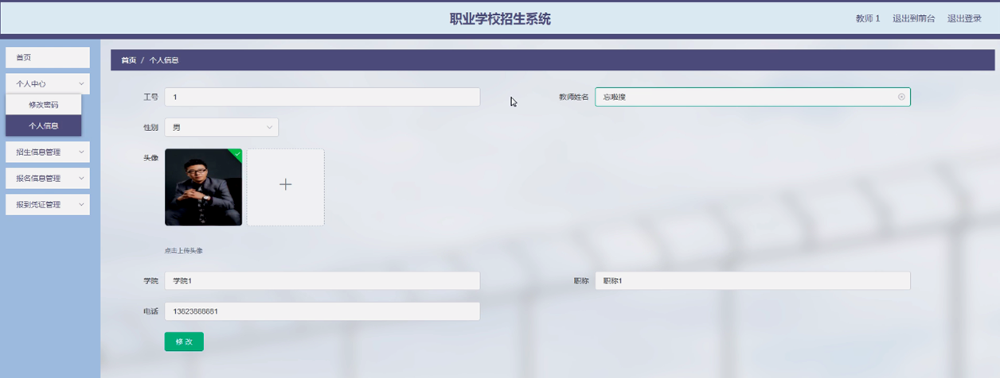

图4-11个人中心界面图

招生信息管理，教师可在招生信息管理页面查看学校名称、图片、地区、招生人数、招生时间等内容，还可进行新增、修改或删除等操作，如图4-12所示。

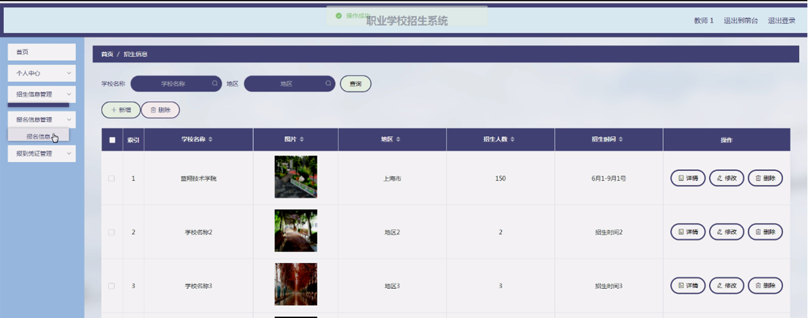

图4-12招生信息管理界面图

#### **JAVA** **毕设帮助，指导，源码分享，调试部署**

