ssm+Vue计算机毕业设计职业高中智慧教学系统（程序+LW文档）

**项目运行**

**环境配置：**

**Jdk1.8 + Tomcat7.0 + Mysql + HBuilderX** **（Webstorm也行）+ Eclispe（IntelliJ
IDEA,Eclispe,MyEclispe,Sts都支持）。**

**项目技术：**

**SSM + mybatis + Maven + Vue** **等等组成，B/S模式 + Maven管理等等。**

**环境需要**

**1.** **运行环境：最好是java jdk 1.8，我们在这个平台上运行的。其他版本理论上也可以。**

**2.IDE** **环境：IDEA，Eclipse,Myeclipse都可以。推荐IDEA;**

**3.tomcat** **环境：Tomcat 7.x,8.x,9.x版本均可**

**4.** **硬件环境：windows 7/8/10 1G内存以上；或者 Mac OS；**

**5.** **是否Maven项目: 否；查看源码目录中是否包含pom.xml；若包含，则为maven项目，否则为非maven项目**

**6.** **数据库：MySql 5.7/8.0等版本均可；**

**毕设帮助，指导，本源码分享，调试部署** **(** **见文末** **)**

### 软件功能模块设计

网站整体功能如下图所示：

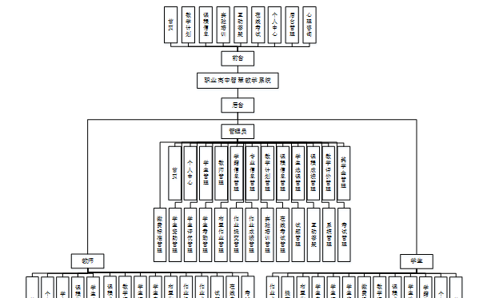

图 4-1系统总体功能模块图

### 4.2数据库设计

#### 4.2.1概念模型设计

概念模型是对现实中的问题出现的事物的进行描述，ER图是由实体及其关系构成的图，通过E-R图可以清楚地描述系统涉及到的实体之间的相互关系。

学生册实体图如图4-2所示：

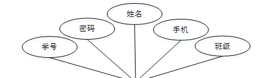

图4-2学生注册实体图

课程信息实体图如图4-3所示：

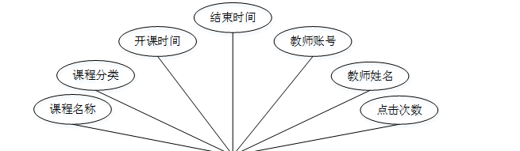

图4-3课程信息实体图

### 系统功能模块

职业高中智慧教学系统，在系统首页可以查看首页，教学计划，课程信息，实验培训，互动答疑，在线考试，个人中心，后台管理，心理咨询等内容，如图5-1所示。

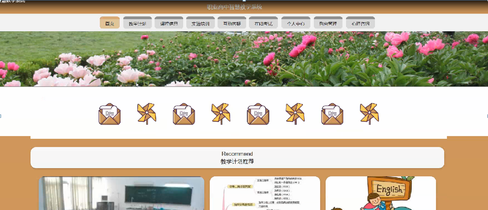

图5-1系统首页界面图

学生注册，在学生注册页面通过填写学号，密码，确认密码，姓名，年龄，手机，班级等信息进行用户注册操作，如图5-2所示。

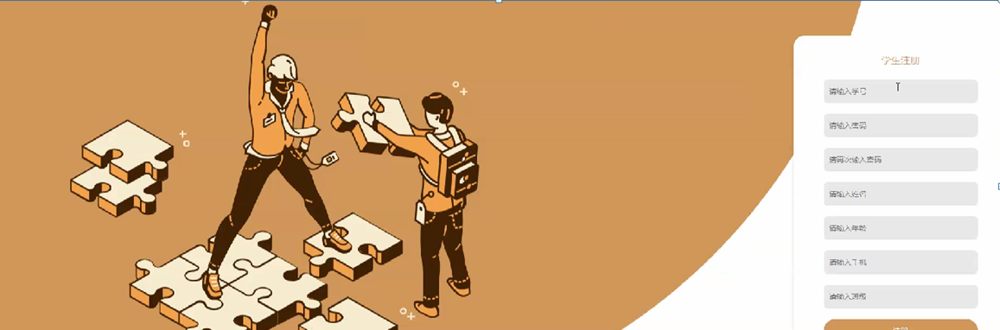

图5-2学生注册界面图

课程信息，在课程信息页面可以查看课程名称，课程分类，开课时间，结束时间，教师账号，教师姓名，点击次数等信息进行学生选课，赞一下，踩一下，点我收藏等操作，如图5-3所示。

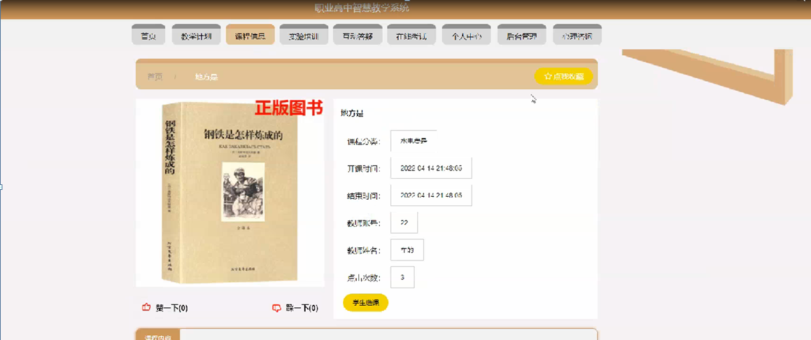

图5-3课程信息界面图

个人中心，在个人中心页面通过填写学号，密码，姓名，年龄，性别，手机，班级，图片等信息进行更新操作，还可以根据需要对我的发布，考试记录，错题本，我的收藏等进行详细操作，如图5-4所示。

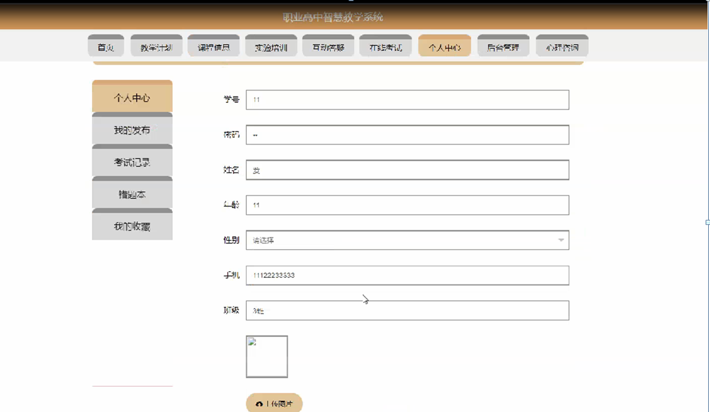

图5-4个人中心界面图

### 5.2后台功能模块

管理员，学生和教师进行进入系统后台，在登录页面根据要求填写用户名和密码，选择角色等信息，点击登录进行登录操作，如图5-5所示。

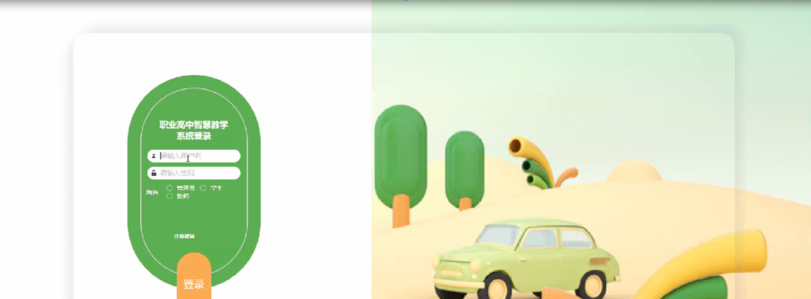

图5-5后台登录界面图

#### 5.2.1管理员功能模块

管理员登录系统后，可以对首页，个人中心，学生管理，教师管理，学籍信息管理，专业信息管理，教学计划管理，课程信息管理，学生选课管理，课程成绩管理，教学评价管理，奖学金管理，缴费通知管理，学生资助管理，学生评优管理，学生考勤管理，布置作业管理，作业提交管理，作业成绩管理，实验培训管理，在线考试管理，试题管理，互动答疑，系统管理，考试管理等功能进行相应的操作，如图5-6所示。

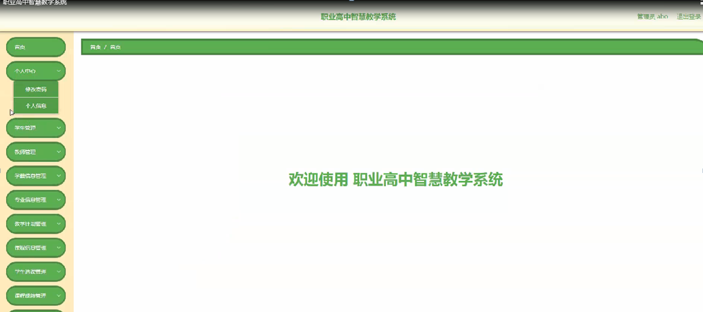

图5-6管理员功能界面图

学生管理，在学生管理页面可以对索引，学号，姓名，年龄，性别，手机，班级，照片等内容进行详情，修改和删除等操作，如图5-7所示。

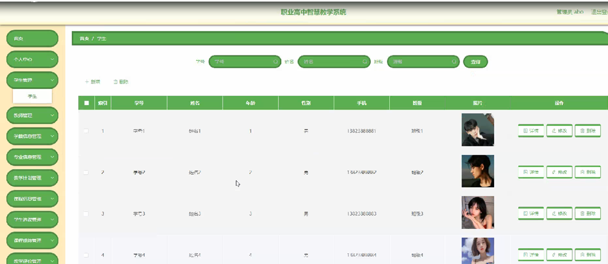

图5-7学生管理界面图

教师管理，在教师管理页面可以对索引，教师账号，教师姓名，年龄，性别，联系电话，照片等内容进行详情，修改和删除等操作，如图5-8所示。

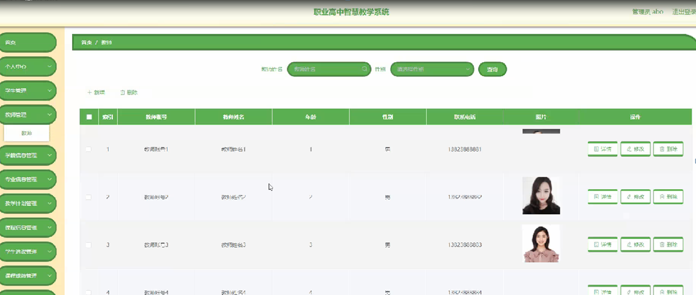

图5-8教师管理界面图

学籍信息管理，在学籍信息管理页面可以对索引，学号，姓名，年龄，性别，手机，身份证，班级，专业，籍贯，照片，政治面貌，入学日期，入学状态等内容进行详情，修改和删除操作，如图5-9所示。

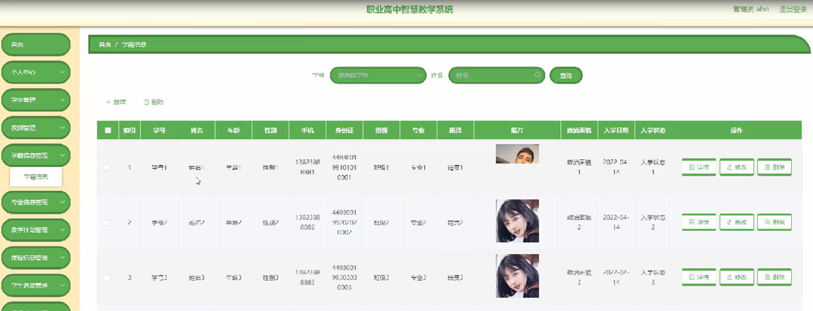

图5-9学籍信息管理界面图

教学计划管理，在教学计划管理页面可以对索引，计划标题，开始时间，结束时间，封面，参与人数等内容进行详情，修改或删除等操作，如图5-10所示。

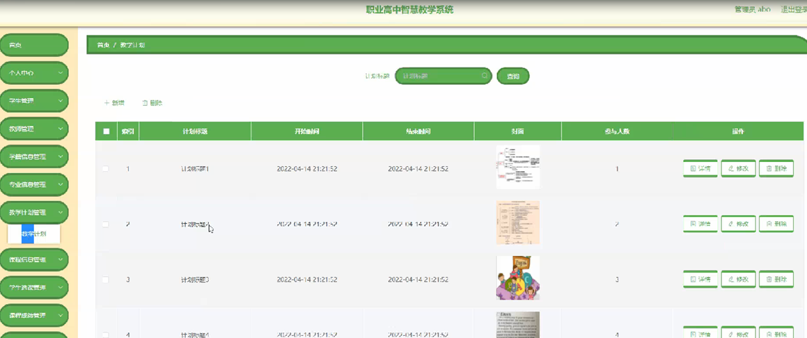

图5-10教学计划管理界面图

课程信息管理，在课程信息管理页面可以对索引，课程名称，课程分类，开课时间，结束时间，封面，教师账号，教师姓名等内容进行详情，修改和删除等操作，如图5-11所示。

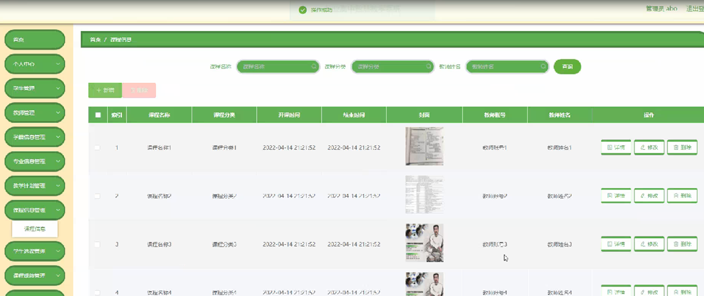

图5-11课程信息管理界面图

学生选课管理，在学生选课管理页面可以对索引，课程名称，选课时间，教师账号，教师姓名，学号，姓名，审核回复，审核状态等内容进行详情，修改和删除等操作，如图5-12所示。

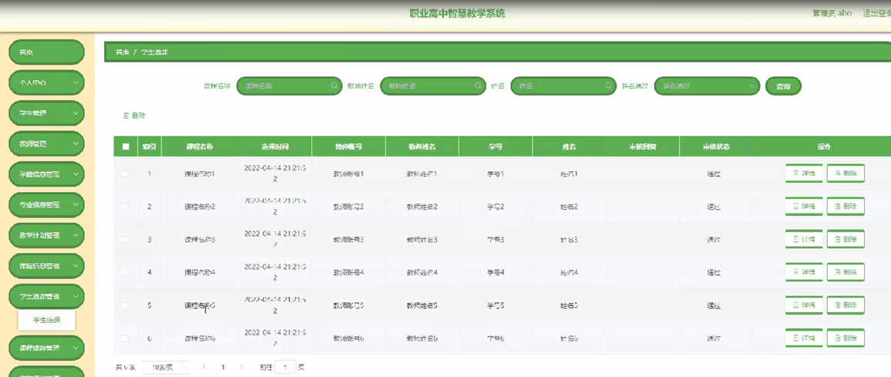

图5-12学生选课管理界面图

#### **JAVA** **毕设帮助，指导，源码分享，调试部署**

