ssm+Vue计算机毕业设计职工社保信息管理系统（程序+LW文档）

**项目运行**

**环境配置：**

**Jdk1.8 + Tomcat7.0 + Mysql + HBuilderX** **（Webstorm也行）+ Eclispe（IntelliJ
IDEA,Eclispe,MyEclispe,Sts都支持）。**

**项目技术：**

**SSM + mybatis + Maven + Vue** **等等组成，B/S模式 + Maven管理等等。**

**环境需要**

**1.** **运行环境：最好是java jdk 1.8，我们在这个平台上运行的。其他版本理论上也可以。**

**2.IDE** **环境：IDEA，Eclipse,Myeclipse都可以。推荐IDEA;**

**3.tomcat** **环境：Tomcat 7.x,8.x,9.x版本均可**

**4.** **硬件环境：windows 7/8/10 1G内存以上；或者 Mac OS；**

**5.** **是否Maven项目: 否；查看源码目录中是否包含pom.xml；若包含，则为maven项目，否则为非maven项目**

**6.** **数据库：MySql 5.7/8.0等版本均可；**

**毕设帮助，指导，本源码分享，调试部署** **(** **见文末** **)**

### 系统结构

职工社保信息管理系统,它是一个由人、电脑及其他组件构成的，一种能够收集、存储、加工、传送信息的系统。该系统可以帮助决策者找出当前急需解决的问题，然后将信息快速的反馈，使管理人员能够以最快的时间知道目前的现状，进行更进一步的计划。

当前MIS系统结构目前存在两种较为流行的结构:C/S和B/S两种。

C/S结构的系统：C/S结构就是员工机服务器结构，它可以法派任务到Client端和Server端来进行，充分利用两端硬件环境的优势，来降低系统的通讯的花费。员工端主要作用是处理人机交互，执行员工端应用程序，收集数据以及向服务器发送任务请求。服务器基本作用是执行后台程序，它主要对员工机的请求申请进行反馈，除此之外，它的作用还包括：数据库存储系统的共享管理、通讯管理、文件管理等等。

B/S结构的系统：这种网络结构简化了员工端，并把系统功能实现的中心集中到服务器上，在这种模式中，只需要一个浏览器就可以了。这种结构将很多的工作交于WEB服务器，只通过浏览器请求WEB服务，随后根据请求返回信息。

通常在只在企业网内部使用，采用C/S。而使用不仅限于内网的情况下使用B/S。考虑到本管理系统的一系列需求，所以，该系统开发使用B/S结构开发。其主要功能结构如下图所示。

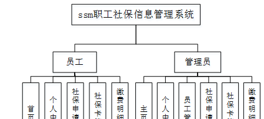

图4-1 系统总体功能结构图

### 4.2数据库设计

数据库设计是指为系统提供最优化的数据库模式，使得应用程序能够有效的存储数据，满足用户的各类需求。

#### 4.2.1 数据库概念结构设计

概念结构设计是根据用户需求形成的。用最常的E-R方法描述数据模型进行数据库的概念设计，首先设计局部的E-
R模式，最后各局部ER模式综合成一个全局模式。然后再把概念模式转换成逻辑模式。将概念设计从设计过程中独立开来，设计复杂程度降低，不受特定DBMS的限制。

1.所有实体和属性的定义如下所示。

员工管理属性图如下图4-2所示。

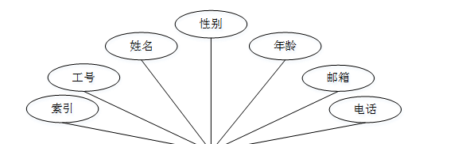

图4-2员工管理实体属性图

社保申请管理实体属性图，如图4-3所示：

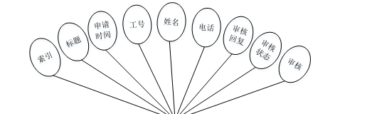

图4-3社保申请管理实体属性图

系统登录，管理员和员工进入系统前在登录页面根据要求填写用户名和密码，选择角色等信息，点击登录进行登录操作，如图5-1所示。

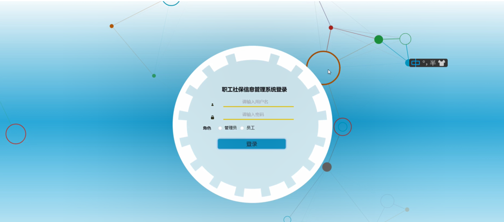

图5-1系统登录界面图

### 5.1管理员功能模块

管理员登录系统后，可以对首页，个人中心，员工管理，社保申请管理，社保卡管理，缴费明细管理等功能进行相应的操作管理，如图5-2所示。

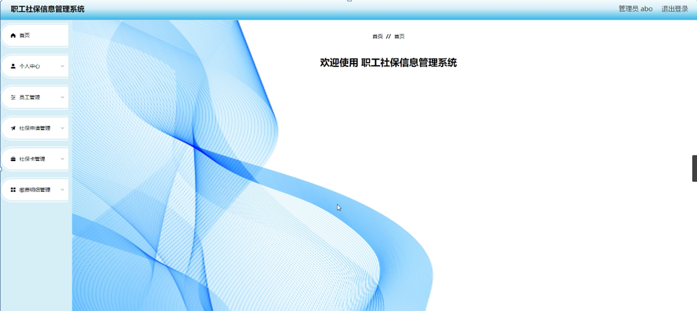

图5-2管理员功能界面图

员工管理，在员工管理页面可以对索引，工号，姓名，性别，年龄，邮箱，电话等内容进行详情，修改和删除等操作，如图5-3所示。

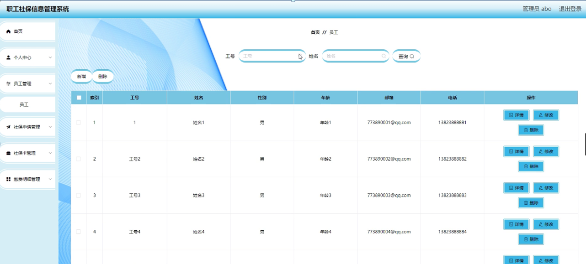

图5-3员工管理界面图

社保申请管理，在社保申请管理页面可以索引，标题，申请时间，工号，姓名，电话，审核回复，审核状态，审核等内容进行详情，办理，修改和删除等操作，如图5-4所示。

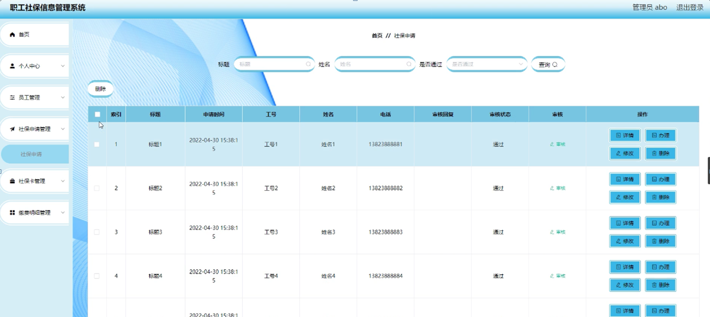

图5-4社保申请管理界面图

社保卡管理，在社保卡管理页面可以对索引，社保卡号，社会保障号码，工号，姓名，发卡日期，合作银行，发行地区等内容进行详情，修改和删除等操作，如图5-5所示。

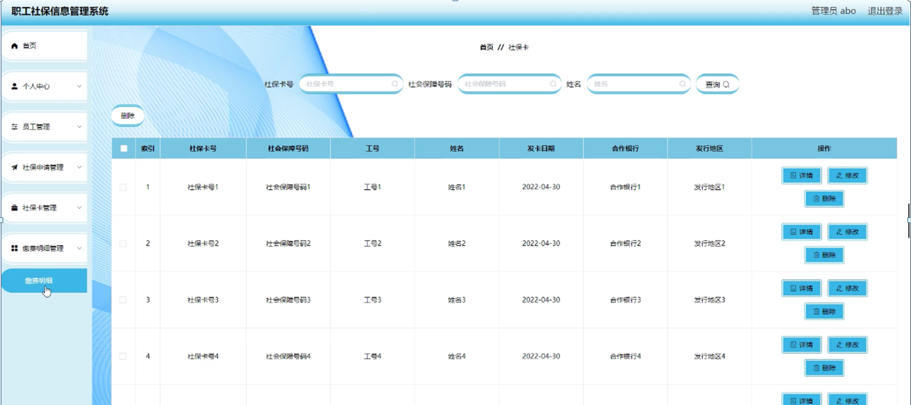

图5-5社保卡管理界面图

缴费明细管理，在缴费明细管理页面可以对索引，缴费单号，工号，姓名，养老保险，医疗保险，工伤保险，生育保险，事业保险，公司缴费，员工需缴，发布时间，是否支付等内容进行详情，修改和删除等操作，如图5-6所示。

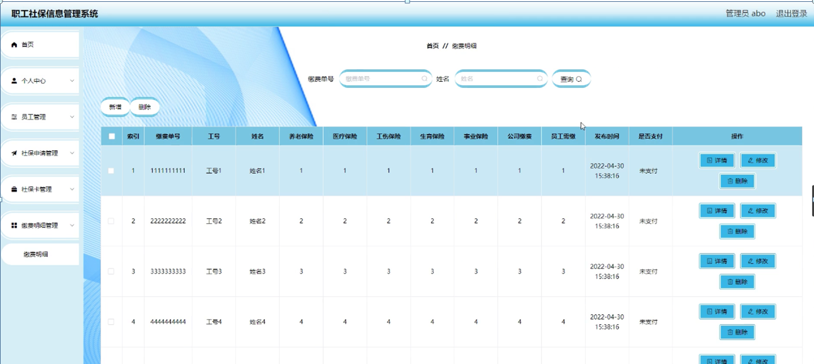

图5-6缴费明细管理界面图

### 5.2员工功能模块

员工登录进入职工社保信息管理系统可以对首页，个人中心，社保申请管理，社保卡管理，缴费明细管理等功能进行相应操作，如图5-7所示。

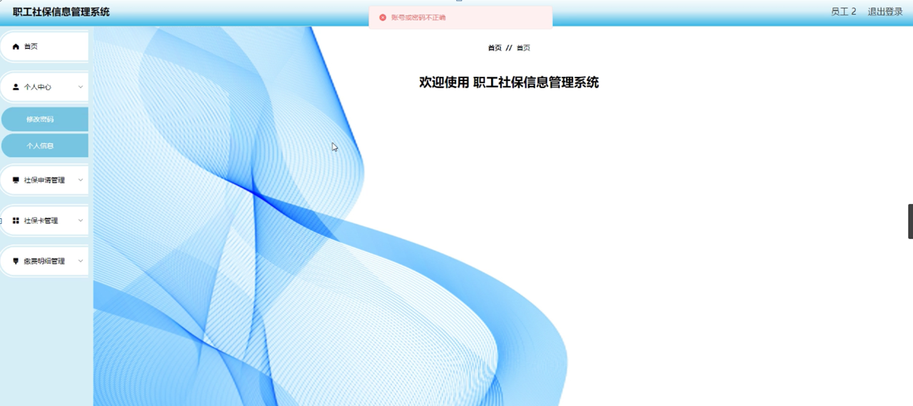

图5-7员工功能界面图

个人中心，在个人中心页面可以对工号，姓名，性别，年龄，邮箱，电话等内容进行修改操作，如图5-8所示。

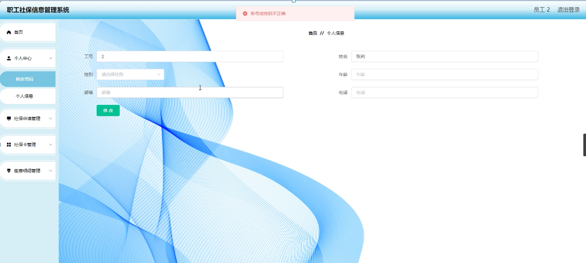

图5-8个人中心界面图

社保申请管理，在社保申请管理页面可以对索引，标题，申请时间，工号，姓名，电话，审核回复，审核状态等内容进行详情，修改和删除等操作，如图5-9所示。

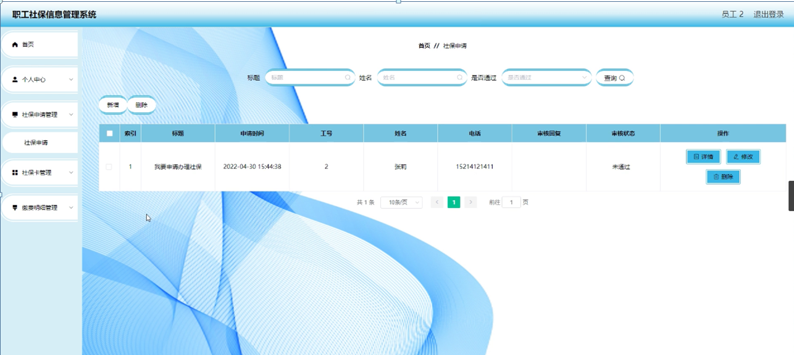

图5-9社保申请管理界面图

社保卡管理，在社保卡管理页面可以对索引，社保卡号，社会保障号码，工号，姓名，发卡日期，合作银行，发行地区等内容进行详情操作，如图5-10所示。

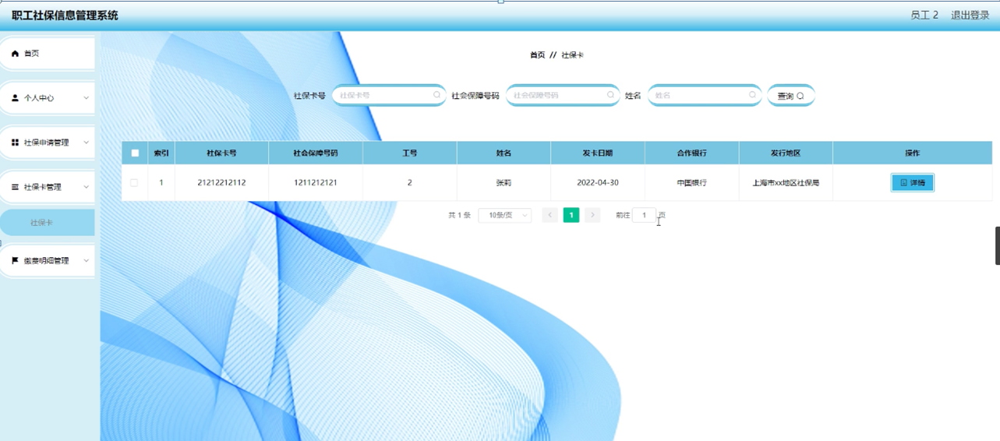

图5-10社保卡管理界面图

缴费明细管理，在缴费明细管理页面可以对索引，缴费单号，工号，姓名，养老保险，医疗保险，工伤保险，生育保险，事业保险，公司缴费，员工需缴，发布时间，是否支付等内容进行详情操作，如图5-11所示。

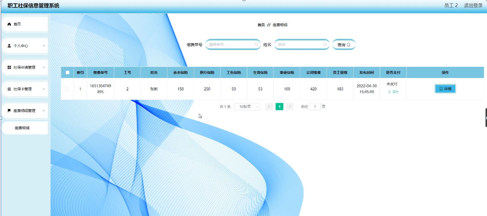

图5-11缴费明细管理界面图

#### **JAVA** **毕设帮助，指导，源码分享，调试部署**

