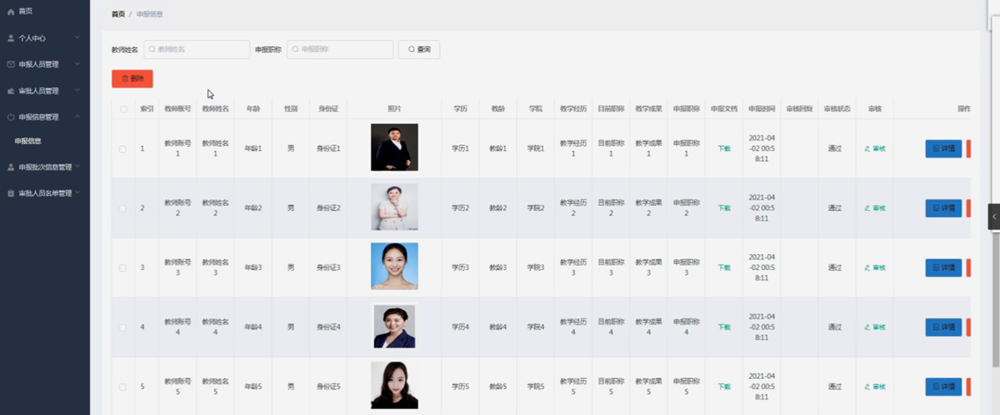

ssm+Vue计算机毕业设计职称评审系统设计（程序+LW文档）

**项目运行**

**环境配置：**

**Jdk1.8 + Tomcat7.0 + Mysql + HBuilderX** **（Webstorm也行）+ Eclispe（IntelliJ
IDEA,Eclispe,MyEclispe,Sts都支持）。**

**项目技术：**

**SSM + mybatis + Maven + Vue** **等等组成，B/S模式 + Maven管理等等。**

**环境需要**

**1.** **运行环境：最好是java jdk 1.8，我们在这个平台上运行的。其他版本理论上也可以。**

**2.IDE** **环境：IDEA，Eclipse,Myeclipse都可以。推荐IDEA;**

**3.tomcat** **环境：Tomcat 7.x,8.x,9.x版本均可**

**4.** **硬件环境：windows 7/8/10 1G内存以上；或者 Mac OS；**

**5.** **是否Maven项目: 否；查看源码目录中是否包含pom.xml；若包含，则为maven项目，否则为非maven项目**

**6.** **数据库：MySql 5.7/8.0等版本均可；**

**毕设帮助，指导，本源码分享，调试部署** **(** **见文末** **)**

###  系统结构

本系统架构网站系统，本系统的具体功能如下：

图4-2系统功能结构图

管理员功能结构图，如图4-3所示：

图4-3 管理员功能结构图

审批人员功能结构图，如图4-4所示：

图4-4 审批人员功能结构图

申报人员功能结构图，如图4-5所示：

图4-5 申报人员功能结构图

### 4.3. 数据库设计

#### 4.3.1 数据库实体

管理员信息结构图，如图4-6所示：

图4-6 管理员信息实体结构图

申报信息管理实体属性图，如图4-7所示：

图4-7申报信息管理实体属性图

审批人员名单管理实体属性图，如图4-8所示：

图4-8审批人员名单管理实体属性图

### 管理员功能模块

管理员登录，管理员通过输入用户名、密码，选择角色并点击登录进行系统登录操作，如图5-1所示。

图5-1管理员登录界图面

管理员登录系统后，可以对首页、个人中心、申报人员管理、审批人员管理、申报信息管理、申报批次信息管理、审批人员名单管理等功能模块进行相应操作，如图5-2所示。

图5-2管理员功能界图面

申报人员管理，在申报人员管理页面可以对索引、教师账号、教师姓名、年龄、性别、学历、手机、邮箱、身份证、照片等内容进行详情或删除等操作，如图5-3所示。

图5-3申报人员管理界面图

审批人员管理，在审批人员管理页面可以对索引、审批人账号、审批人姓名、年龄、性别、手机、身份证、邮箱、照片等内容进行详情或删除等操作，如图5-4所示。

图5-4审批人员管理界面图

申报信息管理，在申报信息管理页面可以对索引、教师账号、教师姓名、年龄、性别、身份证、照片、学历、教龄、学院、教学经历、目前职称、教学成果、申报职称、申报文档、申报时间、审核回复、审核状态、审核等内容进行详情或删除等操作，如图5-5所示。

图5-5申报信息管理界面图

申报批次信息管理，在申报批次信息管理页面可以对索引、批次编号、教师账号、教师姓名、申报结果、发布人、发布日期等内容进行详情、修改或删除等操作，如图5-6所示。

图5-6申报批次信息管理界面图

审批人员名单管理，在审批人员名单管理页面可以对索引、名单编号、审批人账号、审批人姓名、审批日期、审批结果、发布人、发布日期等内容进行详情、修改或删除等操作，如图5-7所示。

图5-7审批人员名单管理界面图

### 5.2申报人员功能模块

申报人员登录进入职称评审系统设计，可以对首页、个人中心、申报信息管理、申报批次信息管理、审批人员名单管理等功能模块进行相应操作，如图5-8所示。

图5-8申报人员功能界图面

个人中心，在个人中心页面通过填写教师账号、教师姓名、年龄、性别、学历、手机、邮箱、身份证、照片等信息对个人信息进行修改，如图5-9所示。

图5-9个人中心界面图

申报信息管理，在申报信息管理页面可以对索引、教师账号、教师姓名、年龄、性别、身份证、照片、学历、教龄、学院、教学经历、目前职称、教学成果、申报职称、申报文档、申报时间、审核回复、审核状态等内容进行详情、修改或删除等操作，如图5-10所示。

图5-10申报信息管理界面图

申报批次信息管理，在申报批次信息管理页面可以对索引、批次编号、教师账号、教师姓名、申报结果、发布人、发布日期等内容进行详情操作，如图5-11所示。

图5-11申报批次信息管理界面图

审批人员名单管理，在审批人员名单管理页面可以对索引、名单编号、审批人账号、审批人姓名、审批日期、审批结果、发布人、发布日期等内容进行详情操作，如图5-12所示。

图5-12审批人员名单管理界面图

#### **JAVA** **毕设帮助，指导，源码分享，调试部署**

