ssm+Vue计算机毕业设计自习室管理系统（程序+LW文档）

**项目运行**

**环境配置：**

**Jdk1.8 + Tomcat7.0 + Mysql + HBuilderX** **（Webstorm也行）+ Eclispe（IntelliJ
IDEA,Eclispe,MyEclispe,Sts都支持）。**

**项目技术：**

**SSM + mybatis + Maven + Vue** **等等组成，B/S模式 + Maven管理等等。**

**环境需要**

**1.** **运行环境：最好是java jdk 1.8，我们在这个平台上运行的。其他版本理论上也可以。**

**2.IDE** **环境：IDEA，Eclipse,Myeclipse都可以。推荐IDEA;**

**3.tomcat** **环境：Tomcat 7.x,8.x,9.x版本均可**

**4.** **硬件环境：windows 7/8/10 1G内存以上；或者 Mac OS；**

**5.** **是否Maven项目: 否；查看源码目录中是否包含pom.xml；若包含，则为maven项目，否则为非maven项目**

**6.** **数据库：MySql 5.7/8.0等版本均可；**

**毕设帮助，指导，本源码分享，调试部署** **(** **见文末** **)**

系统体系结构

自习室管理系统的结构图4-1所示：

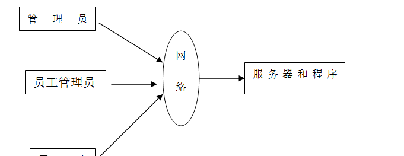

图4-1 系统结构

登录系统结构图，如图4-2所示：

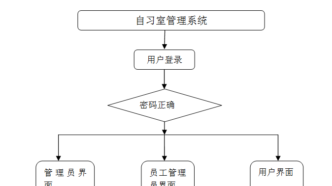

图4-2 登录结构图

系统结构图，如图4-3所示：

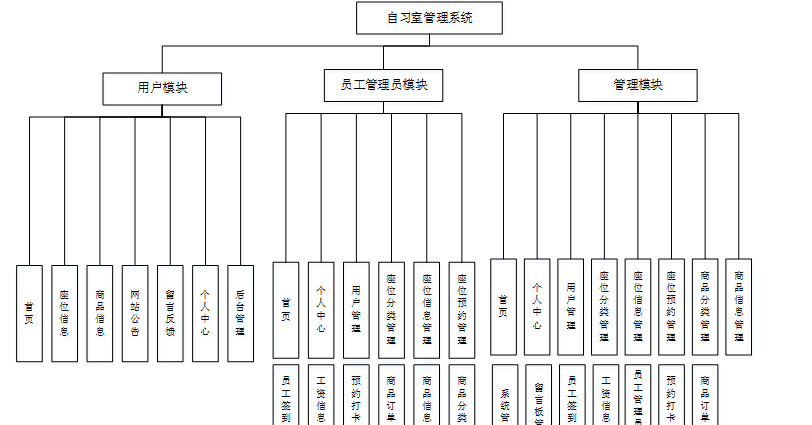

图4-3 系统结构图

4.2 数据库实体设计

数据库的功能就是对系统中所有的数据进行存储和管理。所有的数据可以在数据库中产时间的进行存储，方便用户的使用。而且所有的数据库中的数据也应该具有一定的共享性，任何的系统可以对一些数据进行使用，同时还应该保持一定的独立性，每一个数据库中的数据都有很强的安全性，可以被很好的存放到数据库，没有进行身份的验证是不能对这些数据进行查看和使用的。数据库的设计需要明确每一个实体之间的联系，系统的E-
R图如下图所示：：

管理员实体主要存储管理信息包括用户名、密码、角色属性。管理员信息属性图如图4-4所示。

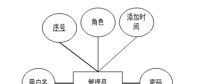

图4-4 管理员信息实体属性图

座位信息管理主要包括活动编号、标题、座位类型、图片、价格、数量、日期等属性，编号、标题、座位类型、图片、价格、数量、日期属性图如图4-5所示。

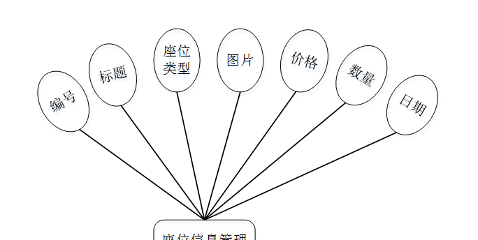

图4-5座位信息管理实体属性图

用户信息实体属性主要包括用户名、密码、姓名、年龄、性别、手机、邮箱、身份证等属性。用户实体属性图如图4-6所示。

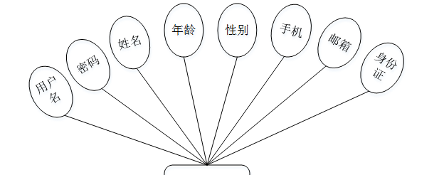

图4-6用户信息实体属性图

留言板管理属性主要包括用户名、留言内容、回复内容等属性。留言板管理实体属性图如图4-7所示。

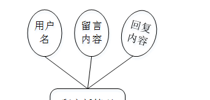

图4-7留言板管理实体属性图

### 系统功能模块

自习室管理系统，在系统的首页可以查看首页、座位信息、商品信息、网站公告、留言反馈、个人中心、后台管理等信息，如图5-1所示。

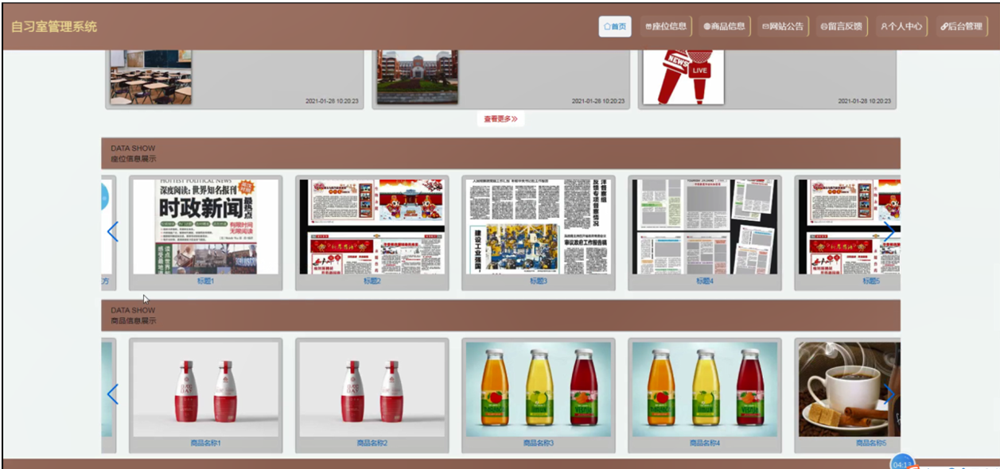

图5-1系统首页界面图

用户注册，在用户注册页面通过填写用户名、密码、姓名、年龄、手机、邮箱、身份证等信息完成用户注册，如图5-2所示。

图5-2用户注册界面图

座位信息，在座位信息页面中可以查看编号、标题、座位类型、图片、价格、数量、日期等信息，如图5-3所示。

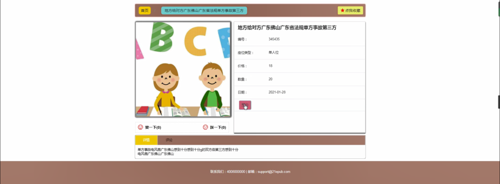

图5-3座位信息界面图

商品信息，在商品信息页面可以查看商品编号、商品名称、商品类别、商品规格、品牌、价格、数量、图片等信息，如图5-4所示。

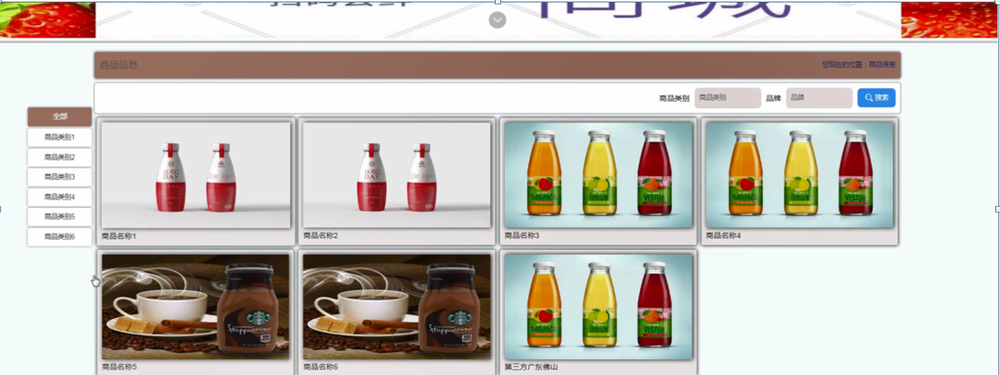

图5-4商品信息界面图

留言反馈，通过填写留言内容并提交，如图5-5所示。

图5-5留言反馈界面图

### 5.2 管理员模块

管理员登录，管理员通过输入用户名、密码、角色信息然后点击登录就能登录到系统进行系统的使用了，如图5-6所示。

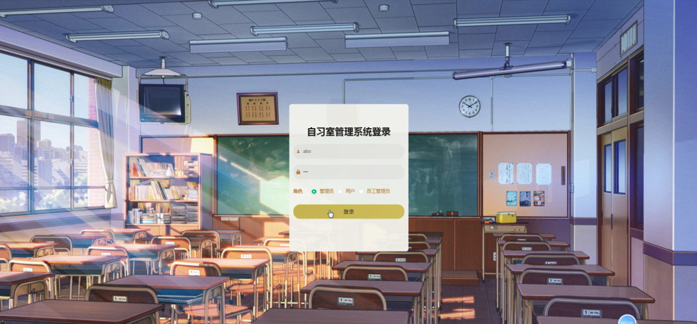

图5-6管理员登录界面图

管理员登录进入自习室管理系统之后，就可以对所有的信息进行查看，可以查看到首页、个人中心、用户管理、座位分类管理、座位信息管理、座位预约管理、商品分类管理、商品信息管理、商品订单管理、预约打卡管理、员工管理员管理、工资信息管理、员工签到管理、留言板管理、系统管理等，并且还可以对其进行相应的操作管理，如图5-7所示。

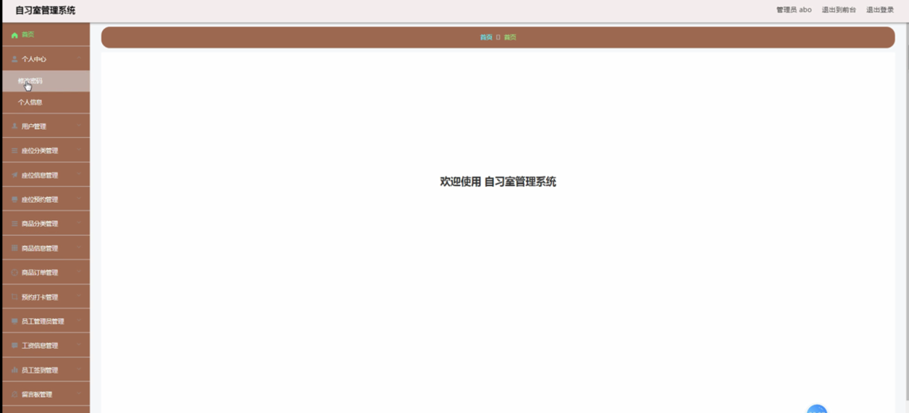

图5-7管理员功能界面图

用户管理，在用户管理页面中可以查看用户名、密码、姓名、年龄、性别、手机、邮箱、身份证等信息，还可以根据需要进行修改或删除等操作，如图5-8所示。

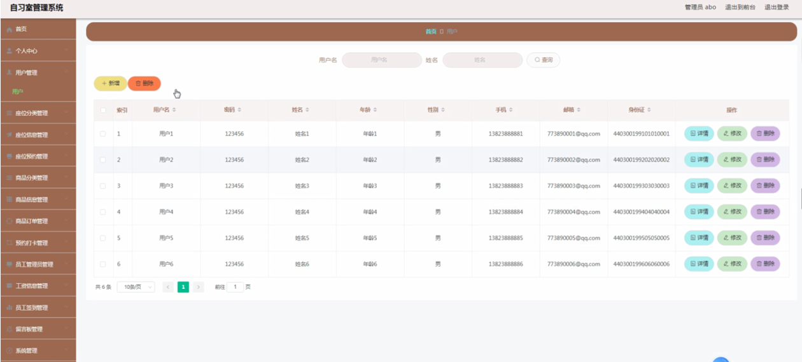

图5-8用户管理界面图

座位分类管理，在座位分类管理页面中可以查看座位类型等信息，还可以根据需要进行修改或删除等操作，如图5-9所示。

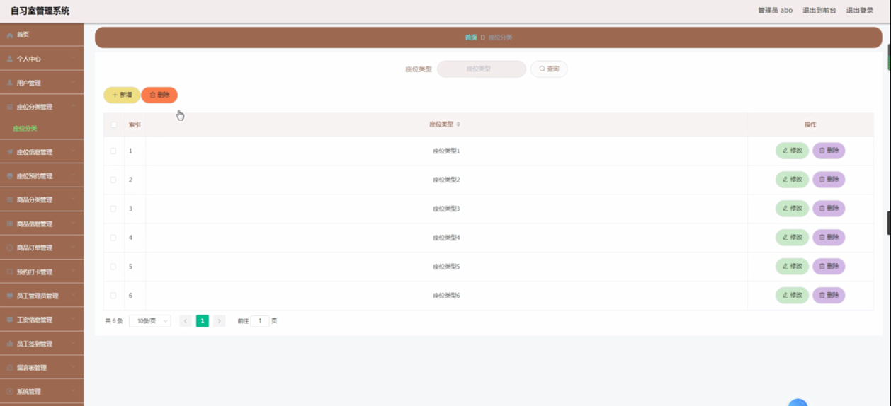

图5-9座位分类管理界面图

座位信息管理，在座位信息管理页面中可以查看编号、标题、座位类型、图片、价格、数量、日期等信息，还可以根据需要进行查看评论、修改或删除等操作，如下图5-10所示。

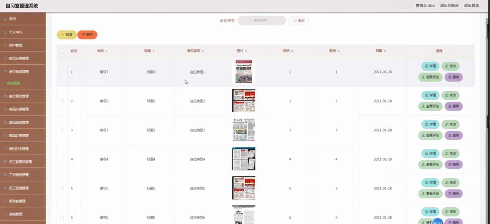

图5-10座位信息管理界面图

座位预约管理，在座位预约管理页面中可以查看编号、标题、座位类型、价格、数量、总价格、预定日期、用户名、姓名、备注、是否支付、审核回复、审核状态、审核等信息，还可以根据需要进行修改或删除等操作，如图5-11所示。

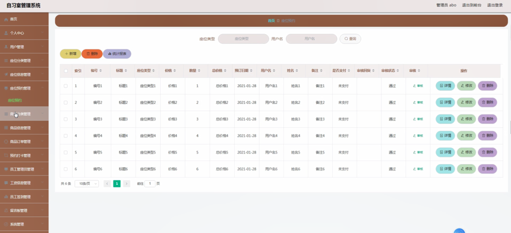

图5-11座位预约管理界面图

商品分类管理，在商品分类管理页面中可以查看商品类型等信息，还可以根据需要进行修改或删除等操作，如图5-12所示。

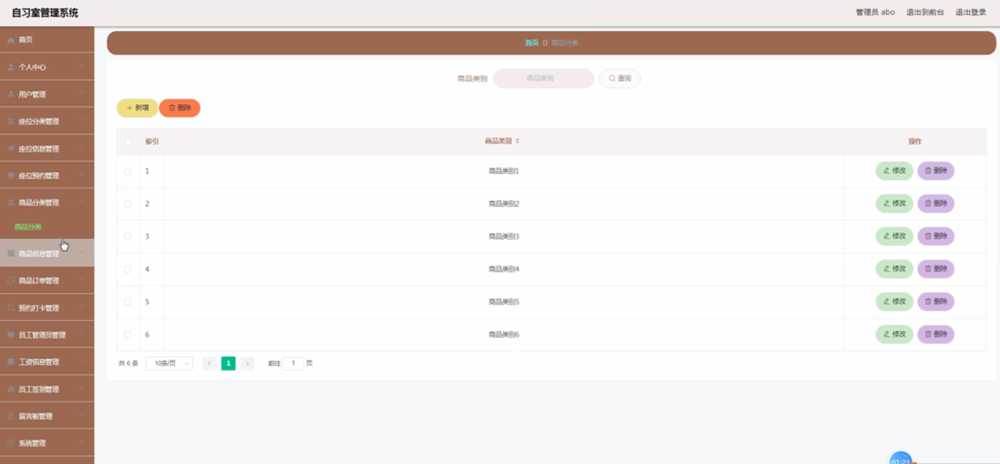

图5-12商品分类管理界面图

#### **JAVA** **毕设帮助，指导，源码分享，调试部署**

