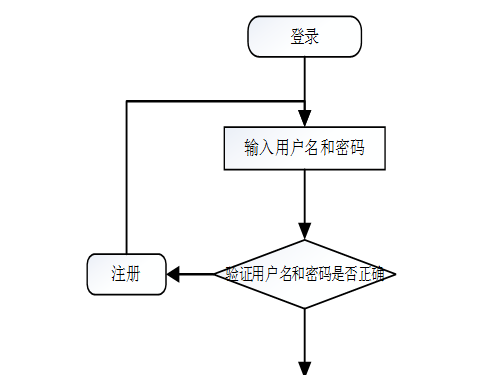

ssm+Vue计算机毕业设计自动出卷考试系统（程序+LW文档）

**项目运行**

**环境配置：**

**Jdk1.8 + Tomcat7.0 + Mysql + HBuilderX** **（Webstorm也行）+ Eclispe（IntelliJ
IDEA,Eclispe,MyEclispe,Sts都支持）。**

**项目技术：**

**SSM + mybatis + Maven + Vue** **等等组成，B/S模式 + Maven管理等等。**

**环境需要**

**1.** **运行环境：最好是java jdk 1.8，我们在这个平台上运行的。其他版本理论上也可以。**

**2.IDE** **环境：IDEA，Eclipse,Myeclipse都可以。推荐IDEA;**

**3.tomcat** **环境：Tomcat 7.x,8.x,9.x版本均可**

**4.** **硬件环境：windows 7/8/10 1G内存以上；或者 Mac OS；**

**5.** **是否Maven项目: 否；查看源码目录中是否包含pom.xml；若包含，则为maven项目，否则为非maven项目**

**6.** **数据库：MySql 5.7/8.0等版本均可；**

**毕设帮助，指导，本源码分享，调试部署** **(** **见文末** **)**

### 4.1系统总体设计

系统总体设计即对有关系统全局问题的设计，也就是设计系统总的处理方案，又称系统概要设计。它包括系统规划与系统功能设计等内容。

自动出卷考试系统主要有两类用户，分别是用户模块和管理员模块，详细规划如图4-1所示。

图4-1 系统规划图

其中各子模块的主要功能如下：

1、用户登录：用户进入网页先输入用户名与密码，选择权限登录，系统要记录登录的用户名和登录类型。

2、新用户注册：新用户填写用户名、用户姓名、性别、年龄等信息完成注册。

3、查看资源信息：用户登录成功后，能够按分类或者查找的资源信息进行管理。

4、主页内容管理：管理员登录以后，可以对个人中心、用户管理、资源信息管理、资源类型管理、试题管理、试卷管理、系统管理、考试管理进行详细操作。

### 4.2数据库设计

数据库是一个软件项目的根基，它决定了整个项目代码的走势，同时也决定了整个项目在后期的维护以及升级的难易程度。

#### 4.2.1 数据库概念设计

根据自动出卷考试系统的功能需求，对数据库进行分析，得到相应的数据，设计用户需要的各种实体，以及相互之间的关联，为逻辑结构设计铺好路。根据所实体内的各种具体信息得于实现。

资源信息实体图如图4-2所示：

图4-2资源信息实体图

用户信息实体图如图4-3所示：

图4-3用户信息实体图

系统公告实体图如图4-4所示：

图4-4系统公告实体图

### 5.1功能页面实现

按照不同功能模块，在此对系统所涉及的关键页面的实现细节进行阐述，包括页面功能描述，页面涉及功能分析，介绍以及界面展示。

系统登录：
运行系统，首先进入登录界面，按照登录界面的要求填写相应的“账号”和“密码”以及用户类型，点击“登录”然后系统判断填写是否正确，若正确进入相应的界面，否则给出要求先注册信息。具体流程如图5-1所示。

图5-1 登录流程图

登录，通过输入账号，密码，选择角色并点击登录进行系统登录操作，如图5-2所示。

图5-2登录界面图

### 5.2系统功能模块

自动出卷考试系统，在系统首页可以查看首页、资源信息、试卷、系统公告、个人中心等内容进行详细操作，如图5-3所示。

图5-3系统首页界面图

资源信息，在资源信息页面可以查看资源名称、资源图片、资源类型、资源内容、发布时间、资源文件等信息，用户可以对资源信息进行收藏、评论以及下载资源文件等操作，资源信息页面如图5-4所示。

图5-4资源信息界面图

点击试卷，用户可以查看试卷列表，包括：试卷名称、考试时长、创建时间等，用户可以对试卷信息进行搜索或考试等操作，如图5-5所示。

图5-5试卷界面图

个人中心，在个人中心页面通过填写用户名、密码、姓名、性别、上传图片、邮箱、手机等信息进行更新操作，还可以对考试记录、错题本、我的收藏进行相应的操作管理；如图5-6所示。

图5-6个人中心界面图

点击考试记录，用户可以查看试卷名称、姓名、考试得分等考试记录信息，如图5-7所示。

图5-7考试记录界面图

### 5.3管理员功能模块

管理员登录系统后，可以对个人中心、用户管理、资源信息管理、资源类型管理、试题管理、试卷管理、系统管理、考试管理等功能进行相应操作，如图5-8所示。

图5-8管理员功能界图面

用户管理，在用户管理页面可以对索引用户名、姓名、性别、头像、邮箱、手机等内容进行详情、修改或删除等操作，如图5-9所示。

图5-9用户管理界面图

资源类型管理，在资源类型管理页面可以对索引，资源类型等信息进行修改、删除或新增等操作，如图5-10所示。

图5-10资源类型管理界面图

资源信息管理，在资源信息管理页面可以对索引资源名称、资源类型、图片、资源文件、发布时间等进行查看详情、修改、删除或查看评论、新增等操作，如图5-11所示。

图5-11资源信息管理界面图

点击试题管理，管理员可以对已有的试题信息进行修改、删除或新增等操作，也可以通过输入试卷名称、试题名称进行搜索的操作；试题管理页面如图5-12所示。

图5-12试题管理界面图

**JAVA** **毕设帮助，指导，源码分享，调试部署**

