ssm+Vue计算机毕业设计自动组卷系统（程序+LW文档）

**项目运行**

**环境配置：**

**Jdk1.8 + Tomcat7.0 + Mysql + HBuilderX** **（Webstorm也行）+ Eclispe（IntelliJ
IDEA,Eclispe,MyEclispe,Sts都支持）。**

**项目技术：**

**SSM + mybatis + Maven + Vue** **等等组成，B/S模式 + Maven管理等等。**

**环境需要**

**1.** **运行环境：最好是java jdk 1.8，我们在这个平台上运行的。其他版本理论上也可以。**

**2.IDE** **环境：IDEA，Eclipse,Myeclipse都可以。推荐IDEA;**

**3.tomcat** **环境：Tomcat 7.x,8.x,9.x版本均可**

**4.** **硬件环境：windows 7/8/10 1G内存以上；或者 Mac OS；**

**5.** **是否Maven项目: 否；查看源码目录中是否包含pom.xml；若包含，则为maven项目，否则为非maven项目**

**6.** **数据库：MySql 5.7/8.0等版本均可；**

**毕设帮助，指导，本源码分享，调试部署** **(** **见文末** **)**

### 系统设计主要功能

通过市场调研及咨询研究，了解了用户及管理者的使用需求，于是制定了管理员，教师和学生等模块。功能结构图如下所示：

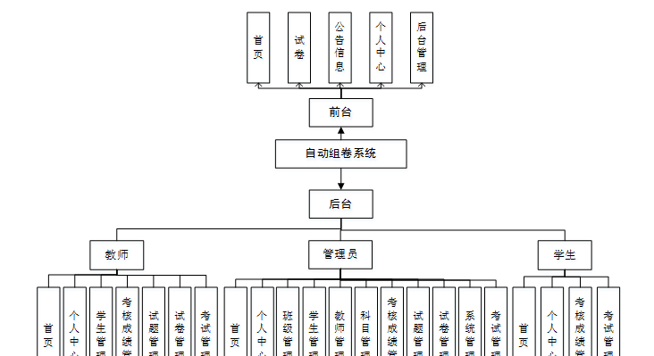

图4-1系统功能结构图

### 4.2 数据库设计

#### 4.2.1 数据库设计规范

数据可设计要遵循职责分离原则，即在设计时应该要考虑系统独立性，即每个系统之间互不干预不能混乱数据表和系统关系。

数据库命名也要遵循一定规范，否则容易混淆，数据库字段名要尽量做到与表名类似，多使用小写英文字母和下划线来命名并尽量使用简单单词。

#### 4.2.2 E/R图

学生E/R图，如下所示：

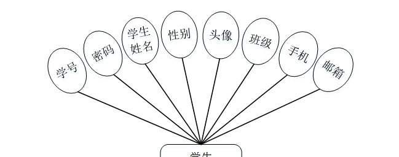

图4-2学生E/R图

考核成绩E/R图，如下所示：

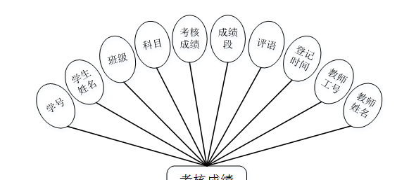

图4-3考核成绩E/R图

公告信息E/R图，如下所示。

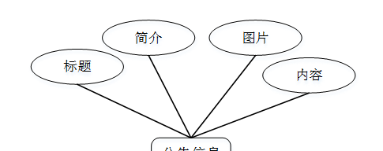

图4-4公告信息E/R图

### 系统功能模块

自动组卷系统，在系统首页可以查看首页，试卷，公告信息，个人中心，后台管理等内容，并进行详细操作；如图5-1所示。

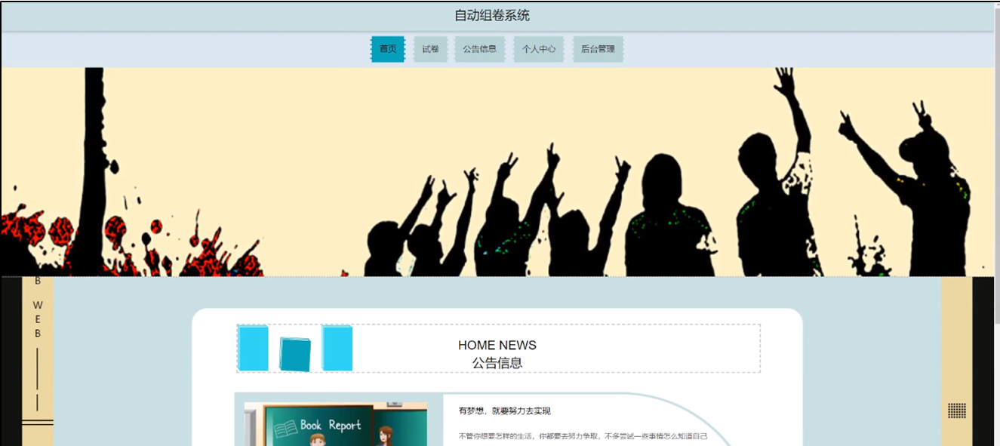

图5-1系统首页界面图

考试，在试卷列表页面可以查看考试名称，考试时长，创建时间等内容，并点击进行考试操作；如图5-2所示。

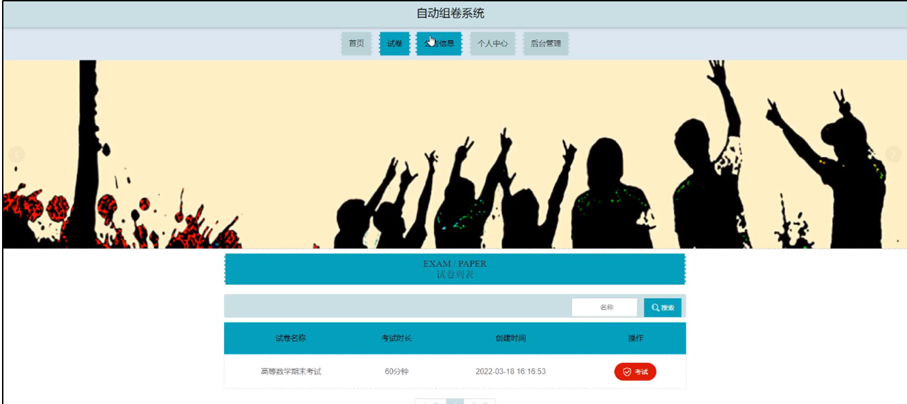

图5-2考试界面图

公告信息，在公告信息页面可以查看公告标题，公告封面，公告类型等内容，还可以点击查看公告详细内容，如图5-3所示。

图5-3公告界面图

个人中心，在个人中心页面通过填写学号，密码，学生姓名，性别，上传图片，班级，手机，邮箱等内容进行更新信息，还可以根据需要对考试记录，错题本进行相对应操作，如图5-4所示。

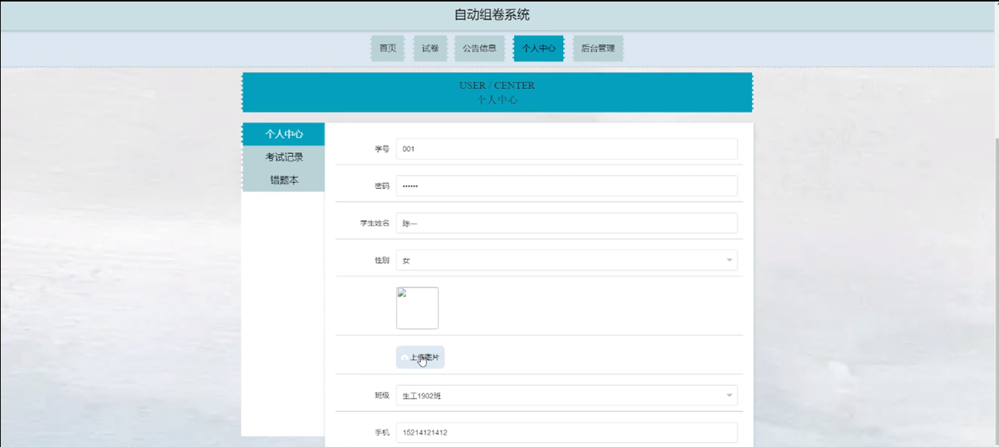

图5-4个人中心界面图

### 5.2管理员功能模块

管理员进行登录，进入系统前在登录页面根据要求填写用户名和密码，选择角色等信息，点击登录进行登录操作，如图5-5所示。

图5-5管理员登录界面图

管理员登录系统后，可以对首页，个人中心，班级管理，学生管理，教师管理，科目管理，考核成绩管理，试题管理，试卷管理，系统管理，考试管理等功能进行相应的操作管理，如图5-6所示。

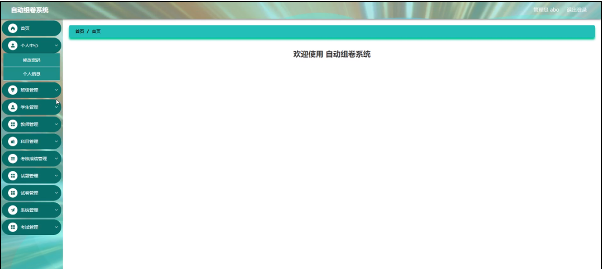

图5-6管理员功能界面图

班级管理，在班级管理页面可以对索引，班级等内容进行详情，修改和删除等操作，如图5-7所示。

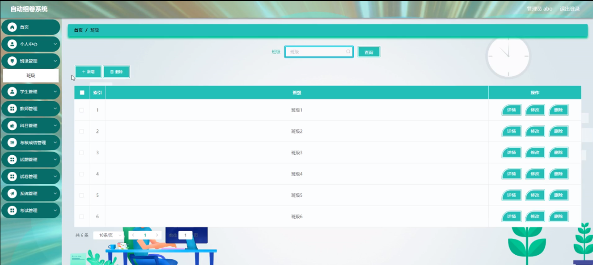

图5-7班级管理界面图

学生管理，在学生管理页面可以对索引，学号，学生姓名，性别，头像，班级，手机，邮箱等内容进行详情，修改和删除等操作，如图5-8所示。

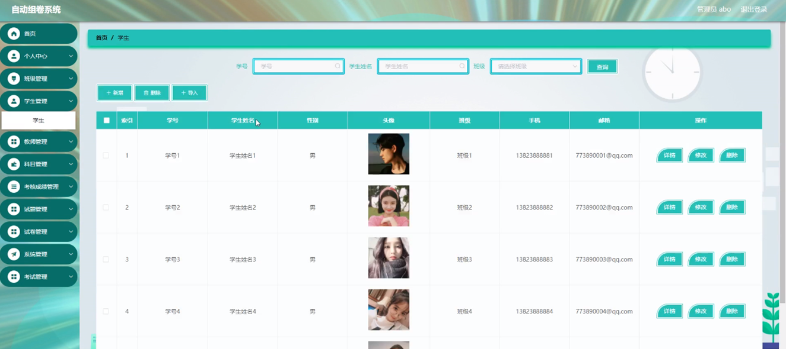

图5-8学生管理界面图

教师管理，在教师管理页面可以对索引，教师工号，教师姓名，性别，头像，职称，任教科目，联系电话，教师邮箱等内容进行详情，修改和删除等操作，如图5-9所示。

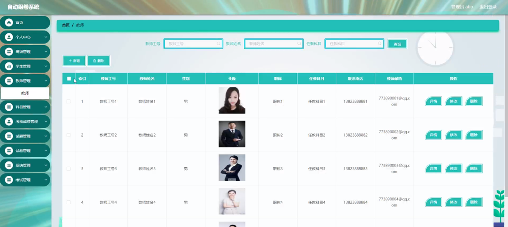

图5-9教师管理界面图

科目管理，在科目管理页面可以对索引，科目等内容进行详情，修改和删除操作，如图5-10所示。

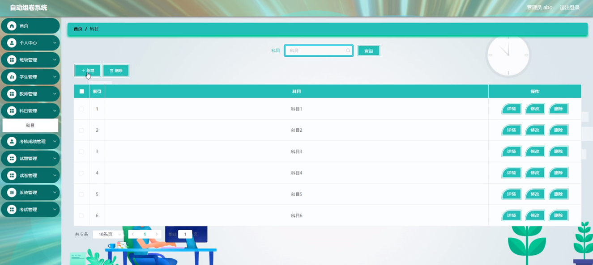

图5-10科目管理界面图

系统管理，在公告信息管理页面可以对索引，标题，图片等内容进行查看，修改和删除等操作，还可以对轮播图管理进行细的操作管理；如图5-11所示。

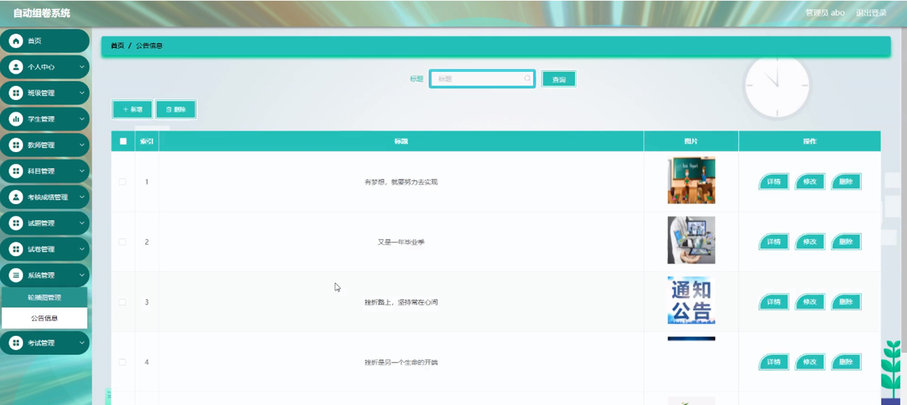

图5-11系统管理界面图

### 5.3教师功能模块

教师登录进入系统可以对首页，个人中心，学生管理，考核成绩管理，试题管理，试卷管理，考试管理等功能进行相应操作，如图5-12所示。

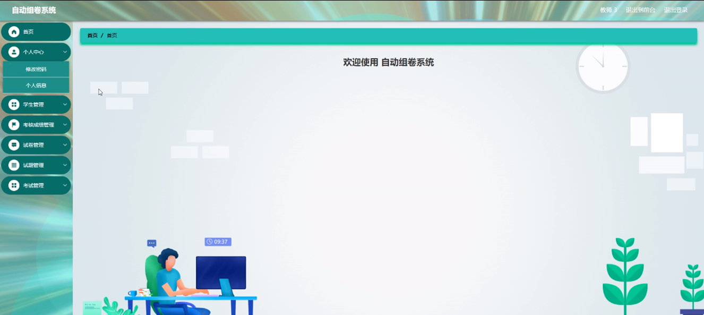

图5-12教师功能界面图

#### **JAVA** **毕设帮助，指导，源码分享，调试部署**

