ssm+Vue计算机毕业设计自助旅游平台（程序+LW文档）

**项目运行**

**环境配置：**

**Jdk1.8 + Tomcat7.0 + Mysql + HBuilderX** **（Webstorm也行）+ Eclispe（IntelliJ
IDEA,Eclispe,MyEclispe,Sts都支持）。**

**项目技术：**

**SSM + mybatis + Maven + Vue** **等等组成，B/S模式 + Maven管理等等。**

**环境需要**

**1.** **运行环境：最好是java jdk 1.8，我们在这个平台上运行的。其他版本理论上也可以。**

**2.IDE** **环境：IDEA，Eclipse,Myeclipse都可以。推荐IDEA;**

**3.tomcat** **环境：Tomcat 7.x,8.x,9.x版本均可**

**4.** **硬件环境：windows 7/8/10 1G内存以上；或者 Mac OS；**

**5.** **是否Maven项目: 否；查看源码目录中是否包含pom.xml；若包含，则为maven项目，否则为非maven项目**

**6.** **数据库：MySql 5.7/8.0等版本均可；**

**毕设帮助，指导，本源码分享，调试部署** **(** **见文末** **)**

### 系统结构设计

系统设计主要是管理员登录后对整个系统相关操作进行处理，可进行系统管理。系统的功能结构图如下图所示。

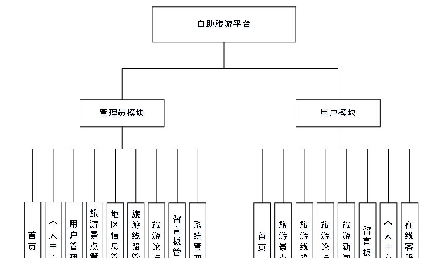

图3-1 系统结构图

### 3.4数据库设计

数据可设计要遵循职责分离原则，即在设计时应该要考虑系统独立性，即每个系统之间互不干预不能混乱数据表和系统关系。

数据库命名也要遵循一定规范，否则容易混淆，数据库字段名要尽量做到与表名类似。

#### 3.4.1 E-R图设计

概念模型是对现实中的问题出现的事物的进行描述，ER图是由实体及其关系构成的图，通过E-R图可以清楚地描述系统涉及到的实体之间的相互关系。

留言板信息ER图如下图所示。

图3-2留言板信息ER图

用户信息ER图如下图所示。

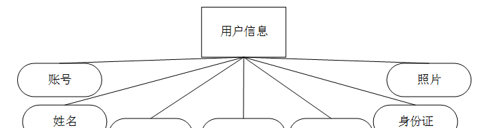

图3-3用户信息ER图

旅游线路信息ER图如下图所示。

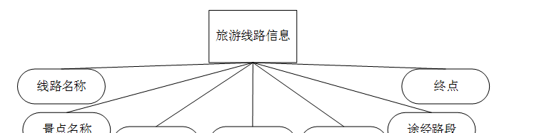

图3-4旅游线路信息ER图

旅游景点信息ER图如下图所示。

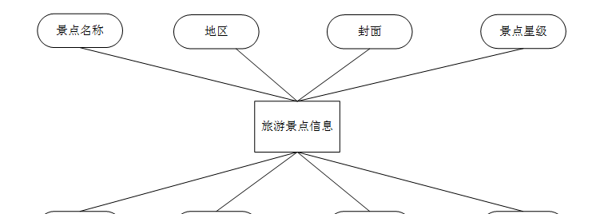

图3-5旅游景点信息ER图

### 后台功能模块—管理员功能模块

#### 4.2.1管理员登录

管理员在登录页面输入用户名、密码等信息，进行登录操作，如下图4-1所示：

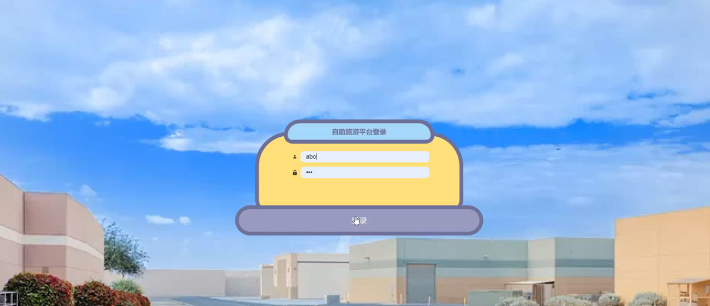

图4-1 管理员登录界面图

#### 4.2.2管理员功能

该界面是自助旅游平台的首页，界面设置要求界面简洁明了、操作简单、兼容性好。在考虑设计界面时，首先要考虑界面标准化设计，其次是完善界面设计，但不要因对界面的美化使界面的操作变得复杂。

管理员登录自助旅游平台后，可以查看首页、个人中心、用户管理、旅游景点管理、地区信息管理、旅游线路管理、旅游论坛、留言板管理、系统管理等功能进行详细操作，如图4-2所示：

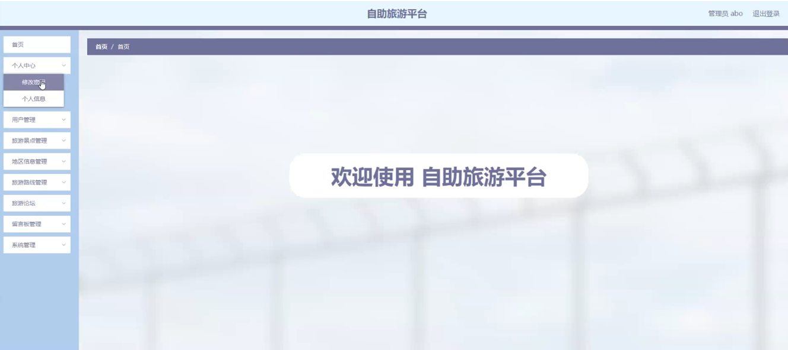

图4-2 管理员功能界面图

#### 4.2.3修改密码

管理员密码修改功能：每一个新的管理员都可以修改密码，在这里修改密码时有一定的限制要求，原密码正确，新密码以及确认新密码输入的内容必须一致，点击确认方可完成修改。二者有其一不满足要求，则修改失败。在这里新密码和确认密码都是使用的掩码，对于密码修改，目的在于，如果更换管理员时，管理员可以将密码进行修改，以保证后台的安全性，也确保平台的安全性，如下图4-3所示：

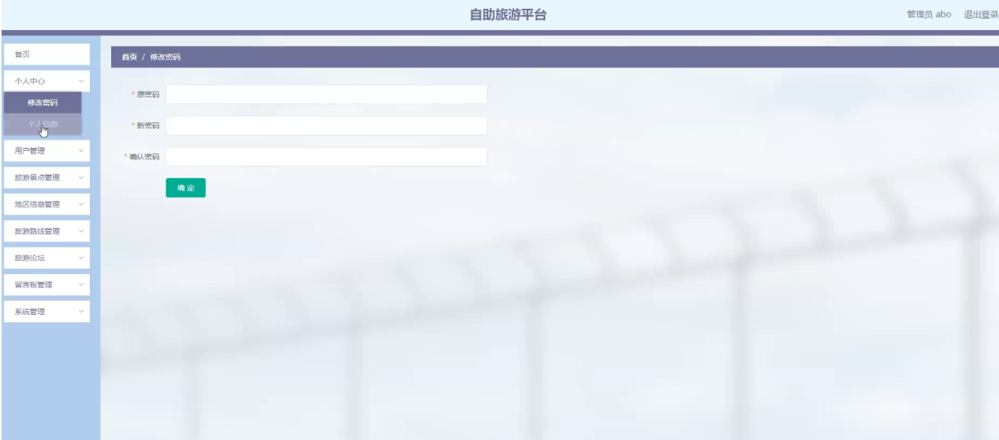

图4-3 修改密码界面图

#### 4.2.4用户管理

在用户管理页面，管理员可以查看账号、姓名、年龄、性别、手机、身份证、照片等信息，可根据需要进行详情、修改、删除等操作，如下图4-4所示：

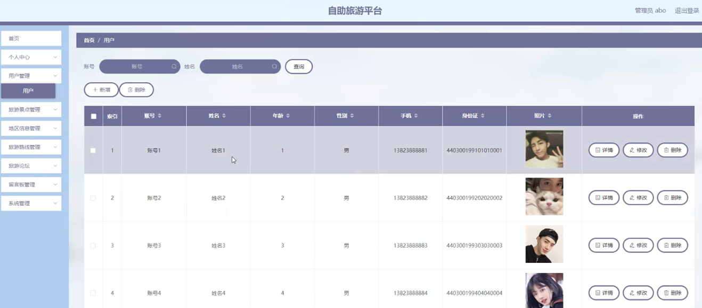

图4-4 用户管理界面图

#### 4.2.5旅游景点管理

在旅游景点管理页面，管理员可以查看景点名称、地区、封面、景点星级、景点地址、营业时间、负责人、联系电话等信息，可根据需要进行详情、修改、删除等操作，如下图4-5所示：

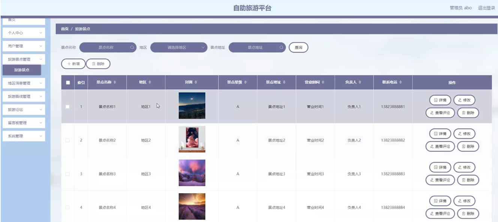

图4-5 旅游景点管理界面图

#### 4.2.6地区信息管理

在地区信息管理页面，管理员可以查看地区等信息，可根据需要进行详情、修改、删除等操作，如下图4-6所示：

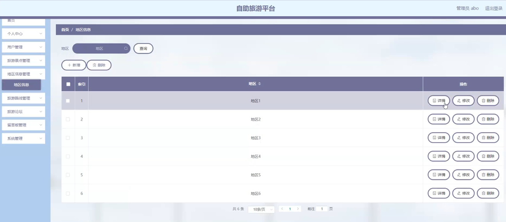

图4-6地区信息管理界面图

#### 4.2.7旅游线路管理

在旅游线路管理页面，管理员可以查看线路名称、景点名称、出行方式、图片、起点、途经路段、终点等信息，可根据需要进行详情、修改、删除等操作，如下图4-7所示：

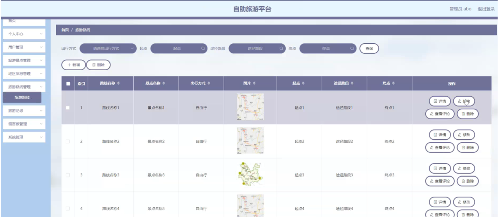

图4-7旅游线路管理界面图

#### 4.2.8旅游论坛

在旅游论坛页面，管理员可以查看帖子标题、用户名、状态等信息，可根据需要进行详情、修改、删除等操作，如下图4-8所示：

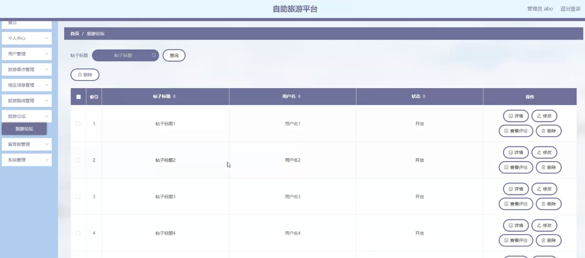

图4-8旅游论坛界面图

#### 4.2.9留言板管理

在留言板管理页面，管理员可以查看用户名、留言内容、留言图片、回复内容、回复图片等信息，可根据需要进行详情、修改、删除等操作，如下图4-9所示：

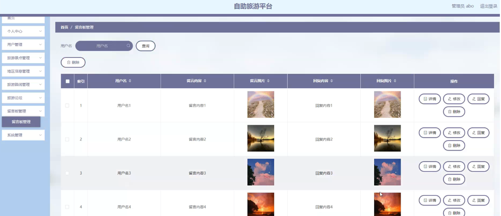

图4-9留言板管理界面图

#### 4.2.10系统管理

系统管理；管理员在该页面为轮播图管理界面，旅游新闻界面。管理员可以在此页面进行首页轮播图的管理、旅游新闻的发布，通过新建操作可在轮播图中加入新的图片，还可以对以上传的图片进行修改操作，以及图片的删除操作，如下图4-10
4-11所示：

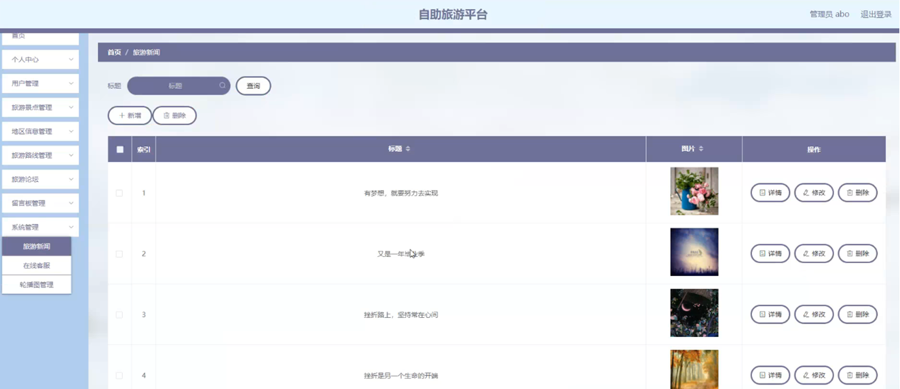

图4-10旅游新闻界面图

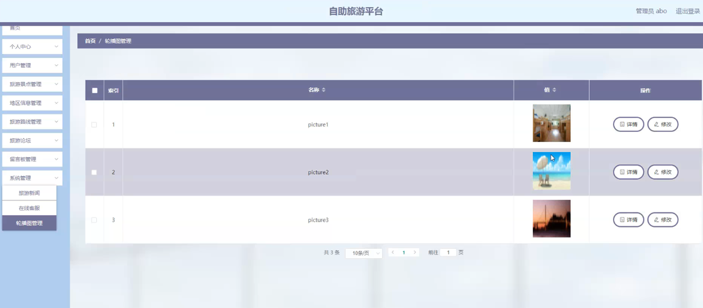

图4-11轮播图管理界面图

### 4.3用户前台功能模块

#### 4.3.1前台首页

用户进入到自助旅游平台页面，可以查看首页、旅游景点、旅游线路、旅游论坛、旅游新闻、留言板、个人中心、在线客服等信息，用户在未注册、登录的情况下，对这些功能只有查看的功能，如下图
4-12所示：

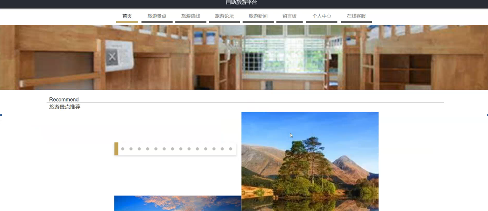

图 4-12系统前台首页界面图

#### **JAVA** **毕设帮助，指导，源码分享，调试部署**

