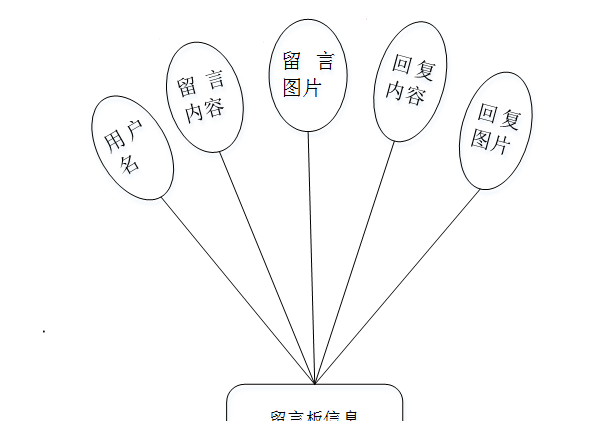

ssm+Vue计算机毕业设计舟影短视频平台（程序+LW文档）

**项目运行**

**环境配置：**

**Jdk1.8 + Tomcat7.0 + Mysql + HBuilderX** **（Webstorm也行）+ Eclispe（IntelliJ
IDEA,Eclispe,MyEclispe,Sts都支持）。**

**项目技术：**

**SSM + mybatis + Maven + Vue** **等等组成，B/S模式 + Maven管理等等。**

**环境需要**

**1.** **运行环境：最好是java jdk 1.8，我们在这个平台上运行的。其他版本理论上也可以。**

**2.IDE** **环境：IDEA，Eclipse,Myeclipse都可以。推荐IDEA;**

**3.tomcat** **环境：Tomcat 7.x,8.x,9.x版本均可**

**4.** **硬件环境：windows 7/8/10 1G内存以上；或者 Mac OS；**

**5.** **是否Maven项目: 否；查看源码目录中是否包含pom.xml；若包含，则为maven项目，否则为非maven项目**

**6.** **数据库：MySql 5.7/8.0等版本均可；**

**毕设帮助，指导，本源码分享，调试部署** **(** **见文末** **)**

### **系统设计主要功能**

通过市场调研及咨询研究，了解了用户的使用需求，于是制定了管理员、用户模块。其功能结构图如下图4-1所示：

图4-1系统功能结构图

### **4.2** **数据库设计**

#### 4.2.1 数据库设计规范

数据可设计要遵循职责分离原则，即在设计时应该要考虑系统独立性，即每个系统之间互不干预不能混乱数据表和系统关系。

数据库命名也要遵循一定规范，否则容易混淆，数据库字段名要尽量做到与表名类似。

#### 4.2.2 E-R图

留言板信息E-R图，如图4-2所示：

图4-2 留言板信息E-R图

用户信息E-R图，如图4-3所示：

图4-3用户信息E-R图

视频信息E-R图如图4-4所示。

图4-4视频信息E-R图

### **前台功能模块**

舟影短视频平台，在网站首页可以查看首页、视频信息、网站公告、关于我们、留言板、个人中心、后台管理、联系我们等内容操作，如图5-1所示。

图5-1网站首页界面图

用户注册、用户登录，在注册页面可以填写账号、密码、确认密码、姓名、年龄、手机等详细内容进行注册、登录，如图5-2所示。

图5-2 用户注册、用户登录界面图

网站公告；在网站公告页面中可以查看标题、简介、发布时间、封面、点击次数等内容，根据需要可进行收藏操作；如图5-3所示。

图5-3网站公告界面图

视频信息；在视频信息页面中可以查看视频名称、视频分类、封面、视频、友情链接、发布日期、账号、姓名、点击次数等内容，根据需要可进行点赞、收藏以及评论等操作；如图5-4所示。

图5-4视频信息界面图

在留言板页面填写留言、图片、用户名等内容，可进行提交，如图5-5所示。

图5-5留言板界面图

在关于我们页面查看标题、简介、发布时间、关于我们的内容等信息，如图5-6所示。

图5-6关于我们界面图

在个人中心页面通过查看我的收藏，个人信息进行编辑账号、密码、姓名、年龄、性别、手机、照片等信息进行更新信息操作，如图5-7 5-8所示。

图5-7个人中心界面图

图5-8我的收藏界面图

### **5.2** 用户后台功能模块

用户登录进入舟影短视频平台后台查看首页、个人中心、视频信息管理等内容进行相应操作，如图5-9所示。

图5-9用户后台功能界面图

个人中心；在个人中心页面中可以填写账号、姓名、年龄、性别、手机、照片等内容，并且进行修改，如图5-10所示。

图5-10个人中心界面图

视频信息管理；在视频信息管理页面中可以查看视频名称、视频分类、封面、视频、友情链接、发布日期、账号、姓名、审核回复、审核状态等内容，并且进行详情、修改、删除操作，如图5-11所示。

图5-11视频信息管理界面图

### **5.3** **管理员功能模块**

管理员登录，通过登录页面输入用户名、密码、选择角色等信息进行登录操作，如图5-12所示。

图5-12管理员登录界面图

**JAVA毕设帮助，指导，源码获取，调试部署**

