ssm+Vue计算机毕业设计英语单词记忆系统（程序+LW文档）

**项目运行**

**环境配置：**

**Jdk1.8 + Tomcat7.0 + Mysql + HBuilderX** **（Webstorm也行）+ Eclispe（IntelliJ
IDEA,Eclispe,MyEclispe,Sts都支持）。**

**项目技术：**

**SSM + mybatis + Maven + Vue** **等等组成，B/S模式 + Maven管理等等。**

**环境需要**

**1.** **运行环境：最好是java jdk 1.8，我们在这个平台上运行的。其他版本理论上也可以。**

**2.IDE** **环境：IDEA，Eclipse,Myeclipse都可以。推荐IDEA;**

**3.tomcat** **环境：Tomcat 7.x,8.x,9.x版本均可**

**4.** **硬件环境：windows 7/8/10 1G内存以上；或者 Mac OS；**

**5.** **是否Maven项目: 否；查看源码目录中是否包含pom.xml；若包含，则为maven项目，否则为非maven项目**

**6.** **数据库：MySql 5.7/8.0等版本均可；**

**毕设帮助，指导，本源码分享，调试部署** **(** **见文末** **)**

### 系统结构设计

系统设计是把本系统的各项功能需求进行细化，而转换为软件系统表示的一个设计过程，在对目标系统的研究分析之后，做出整个系统平台的总体规划，进而对用例中各个对象进一步地合理精细设计。为降低整个系统的复杂度，而使其更加便于修改，提高代码的可读性，我们会将系统模块化，模块间保持相对独立，且每个模块只完成一个子功能，并且与其他模块通过简单的接口链接，即高内聚低耦合原则，而使整个系统能够拥有一个高性能的结构，这边是系统概要设计最重要的目的。在之前的需求分析的基础上，本英语单词记忆系统结构，如下图4-1所示。

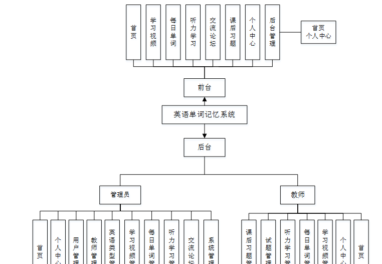 图4-1 系统总体结构功能图

### 4.2数据库设计

在查询时，应保证所有满足条件的记录都能查到。数据库记录通常在几百条以上，如有遗漏将会对用户的统计造成影响。一般操作的响应时间应该在1-2秒内。采用菜单界面，对用户比较友好。本文中将通过E-
R图来设计并展示数据的概念模型，

用户注册实体属性图如图4-2所示。

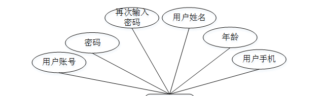

图4-2用户注册实体属性图

学习视频实体E-R图如图4-3所示。

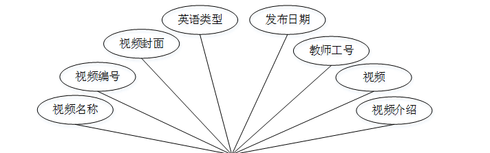

图4-3学习视频实体E-R图

每日单词E-R图如图4-4所示。

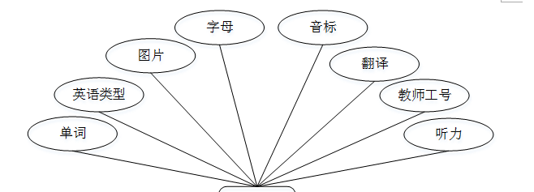

图4-4每日单词E-R图

### 系统功能模块

英语单词记忆系统，在系统首页可以查看首页、学习视频、每日单词、听力学习、交流论坛、课后习题、个人中心、后台管理等内容，并进行详细操作；如图5-1所示。

图5-1系统首页界面图

学习视频，在学习视频页面可以查看视频名称、视频编号、视频封面、英语类型、发布日期、教师工号、视频、视频介绍等内容，并进行收藏等操作，如图5-2所示。

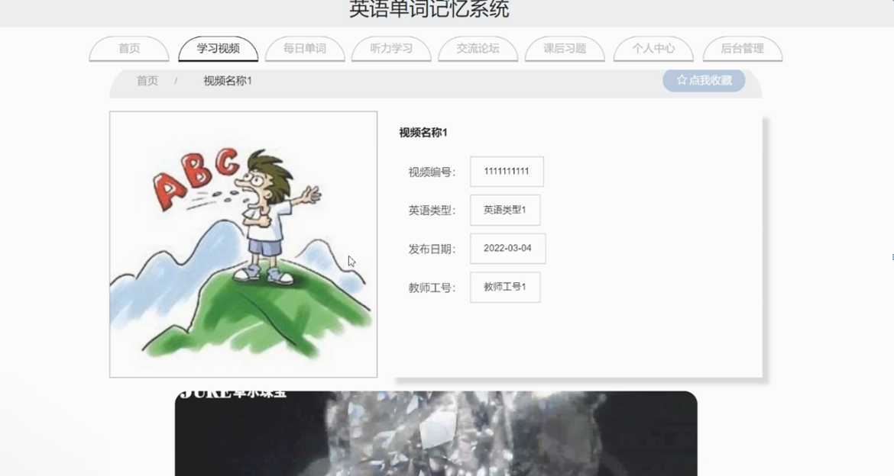

图5-2学习视频界面图

个人中心，在个人中心页面通过填写用户账号、密码、用户姓名、性别、年龄、上传图片、用户手机等内容进行更新信息，还可以根据需要对我的发布，考试记录，错题本，我的收藏等进行详细操作；如图5-3所示。

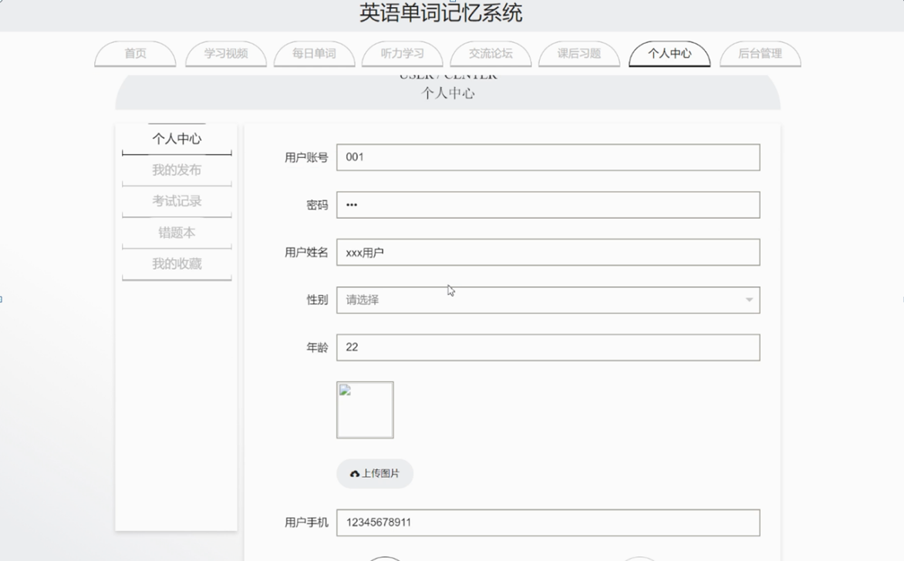

图5-3个人中心界面图

### 5.2后台功能模块

后台登录，管理员和教师进入系统前在登录页面根据要求填写用户名和密码，选择角色等信息，点击登录进行登录操作，如图5-4所示。

图5-4后台登录界面图

#### 5.2.1管理员功能模块

管理员登录系统后，可以对首页、个人中心、用户管理、教师管理、英语类型管理、学习视频管理、每日单词管理、听力学习管理、交流论坛、系统管理等功能进行相应的操作管理，如图5-5所示。

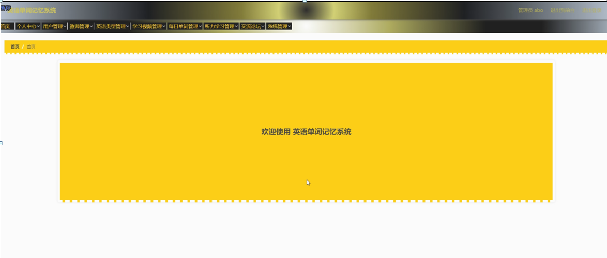

图5-5管理员功能界面图

用户管理，在用户管理页面可以对索引、用户账号、用户姓名、性别、年龄、头像、用户手机等内容进行详情，修改和删除操作，如图5-6所示。

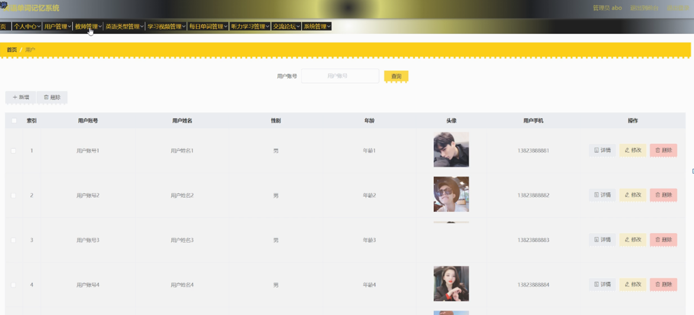

图5-6用户管理界面图

教师管理，在教师管理页面可以对索引、教师工号、教师姓名、性别、照片、职称、联系电话、教师邮箱等内容进行详情，修改和删除操作，如图5-7所示。

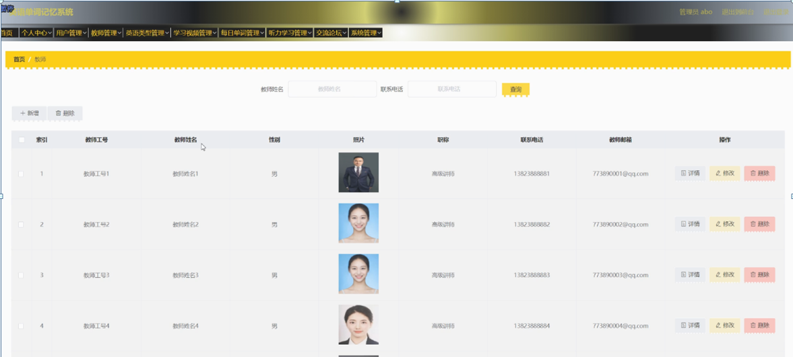

图5-7教师管理界面图

学习视频管理，在学习视频管理页面可以对索引、视频编号、英语类型、视频名称、视频封面、视频、发布日期、教师工号等内容进行详情，修改和删除操作，如图5-8所示。

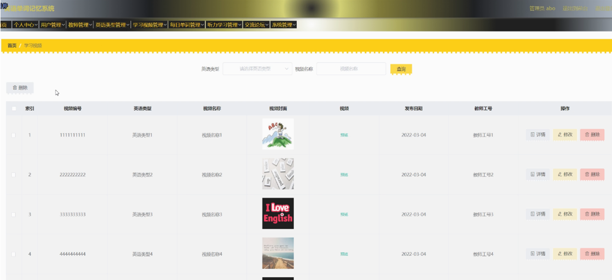

图5-8学习视频管理界面图

每日单词管理，在每日单词管理页面可以对索引、单词、英语类型、图片、字母、音标、听力、教师工号等内容进行详情，修改和删除操作，如图5-9所示。

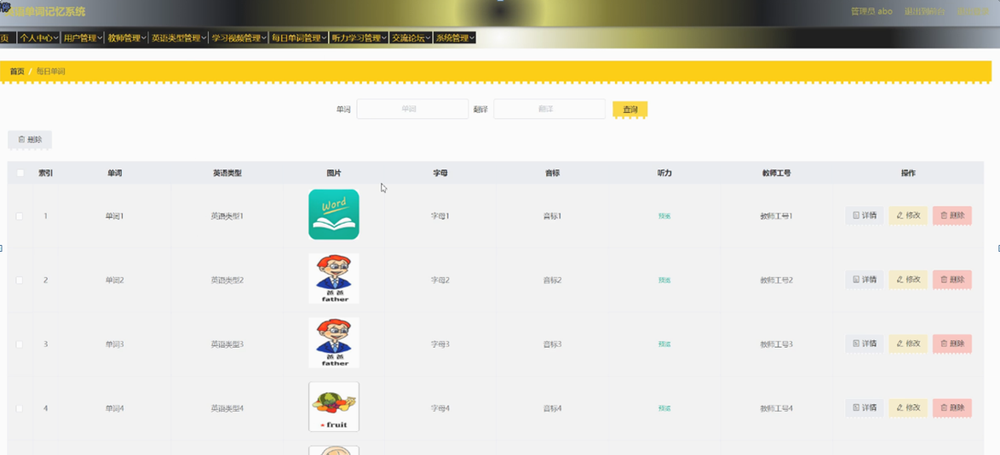

图5-9每日单词管理界面图

听力学习管理，在听力学习管理页面可以对索引、标题、音频、封面图片、英语类型、教师工号等内容进行详情修改和删除操作，如图5-10所示。

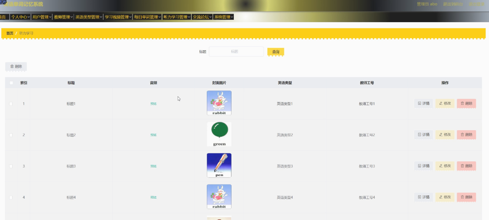

图5-10听力学习管理界面图

系统管理，在轮播图管理页面可以对索引、名称、值等内容进行详情和修改等操作；如图5-11所示。

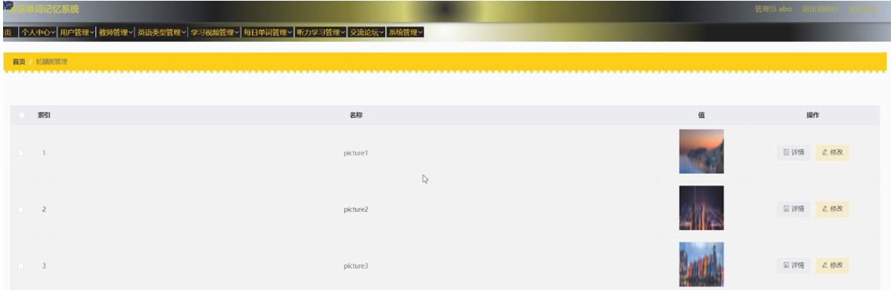

图5-11系统管理界面图

#### 5.2.2教师功能模块

教师登录进入系统可以对首页、个人中心、学习视频管理、每日单词管理、听力学习管理、试题管理、课后习题管理等功能进行相应操作，如图5-12所示。

图5-12教师功能界面图

#### **JAVA** **毕设帮助，指导，源码分享，调试部署**

