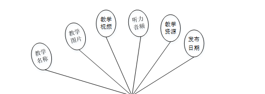
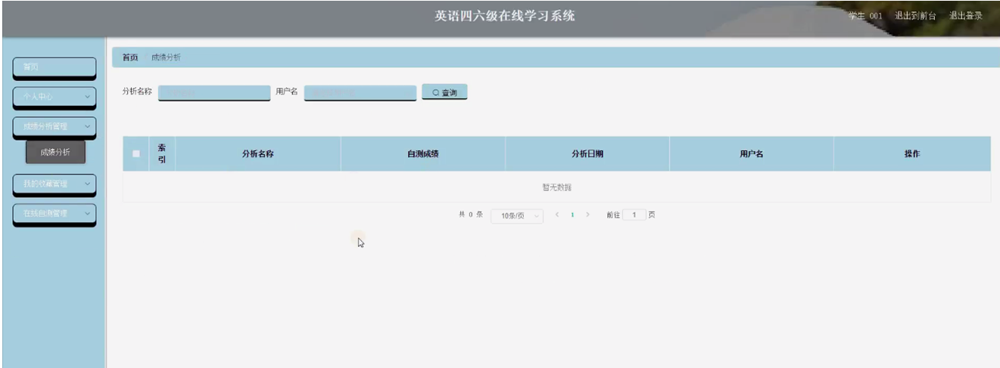

ssm+Vue计算机毕业设计英语四六级在线学习系统（程序+LW文档）

**项目运行**

**环境配置：**

**Jdk1.8 + Tomcat7.0 + Mysql + HBuilderX** **（Webstorm也行）+ Eclispe（IntelliJ
IDEA,Eclispe,MyEclispe,Sts都支持）。**

**项目技术：**

**SSM + mybatis + Maven + Vue** **等等组成，B/S模式 + Maven管理等等。**

**环境需要**

**1.** **运行环境：最好是java jdk 1.8，我们在这个平台上运行的。其他版本理论上也可以。**

**2.IDE** **环境：IDEA，Eclipse,Myeclipse都可以。推荐IDEA;**

**3.tomcat** **环境：Tomcat 7.x,8.x,9.x版本均可**

**4.** **硬件环境：windows 7/8/10 1G内存以上；或者 Mac OS；**

**5.** **是否Maven项目: 否；查看源码目录中是否包含pom.xml；若包含，则为maven项目，否则为非maven项目**

**6.** **数据库：MySql 5.7/8.0等版本均可；**

**毕设帮助，指导，本源码分享，调试部署** **(** **见文末** **)**

### 系统设计主要功能

通过市场调研及咨询研究，了解了英语四六级在线学习系统及管理者的使用需求，于是制定了管理员和学生等模块。功能结构图如下所示：

图4-1系统功能结构图

### 4.2 数据库设计

#### 4.2.1 数据库设计规范

数据可设计要遵循职责分离原则，即在设计时应该要考虑系统独立性，即每个系统之间互不干预不能混乱数据表和系统关系。

数据库命名也要遵循一定规范，否则容易混淆，数据库字段名要尽量做到与表名类似，多使用小写英文字母和下划线来命名并尽量使用简单单词。

#### 4.2.2 E/R图

学生管理E/R图，如下所示：

图4-2 学生管理E/R图

教学信息管理E/R图，如下所示：

图4-3教学信息管理E/R图

英语单词管理E/R图，如下所示。

图4-4英语单词管理E/R图

### 系统功能模块

英语四六级在线学习系统，在系统首页可查看首页、教学信息、英语单词、交流分享、在线自测、公告展示、个人中心、后台管理等内容，如图5-1所示。

图5-1系统首页界面图

学生注册，通过输入用户名、密码、姓名、手机等内容进行注册，注册完通过输入账号、密码进行登录，如图5-2所示。

图5-2学生注册、登录界面图

教学信息，在教学信息页面可查看教学名称、封面、发布日期、听力音频、教学资源、视频等内容，还可进行教学资源下载或收藏等操作，如图5-3所示。

图5-3教学信息界面图

英语单词，在英语单词页面可查看单词名称、单词分类、单词解析、应用场景、语音播报、封面、详情等内容，还可进行评论或收藏等操作，如图5-4所示。

图5-4英语单词界面图

交流分享，在交流分享页面可通过输入标题、类型、内容进行发布帖子等操作，如图5-5所示。

图5-5交流分享界面图

个人中心，用户可在个人中心页面通过输入用户名、密码、姓名、性别、手机、上传图片等内容进行更新信息或查看我的收藏、我的发布、在线自测记录、错题本等内容，如图5-6所示。

图5-6个人中心界面图

5.2学生功能模块

后台管理，学生进入后台管理可查看个人中心、成绩分析管理、我的收藏管理、在线自测管理等内容，如图5-7所示。

图5-7学生功能界面图

成绩分析管理，学生可在成绩分析管理页面查看分析名称、自测成绩、分析日期、用户名等内容，如图5-8所示。

图5-8成绩分析管理界图面

我的收藏管理，学生可在我的收藏管理页面查看收藏名称、收藏图片、推荐类型等内容，还可进行删除等操作，如图5-9所示。

图5-9我的收藏管理界图面

在线自测，学生可在在线自测记录页面查看姓名、在线自测、在线自测得分等内容，如图5-10所示。

图5-10在线自测记录界面图

5.3管理员功能模块

管理员登录，管理员通过输入用户名、密码、角色进行登录，如图5-11所示。

图5-11管理员登录界面图

管理员通过登录进入系统可查看个人中心、学生管理、单词分类管理、教学信息管理、英语单词管理、成绩分析管理、试题管理、交流分享、在线自测管理、系统管理等内容，如图5-12所示。

图5-12管理员功能界面图

**JAVA** **毕设帮助，指导，源码分享，调试部署**

