ssm+Vue计算机毕业设计药品公司后台管理系统（程序+LW文档）

**项目运行**

**环境配置：**

**Jdk1.8 + Tomcat7.0 + Mysql + HBuilderX** **（Webstorm也行）+ Eclispe（IntelliJ
IDEA,Eclispe,MyEclispe,Sts都支持）。**

**项目技术：**

**SSM + mybatis + Maven + Vue** **等等组成，B/S模式 + Maven管理等等。**

**环境需要**

**1.** **运行环境：最好是java jdk 1.8，我们在这个平台上运行的。其他版本理论上也可以。**

**2.IDE** **环境：IDEA，Eclipse,Myeclipse都可以。推荐IDEA;**

**3.tomcat** **环境：Tomcat 7.x,8.x,9.x版本均可**

**4.** **硬件环境：windows 7/8/10 1G内存以上；或者 Mac OS；**

**5.** **是否Maven项目: 否；查看源码目录中是否包含pom.xml；若包含，则为maven项目，否则为非maven项目**

**6.** **数据库：MySql 5.7/8.0等版本均可；**

**毕设帮助，指导，本源码分享，调试部署** **(** **见文末** **)**

###  系统体系结构

药品公司后台管理系统开发系统的结构图4-1所示：

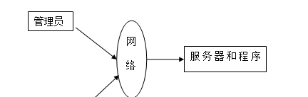

图4-1 系统结构

模块包括首页、个人中心、会员管理、员工管理、厂商信息管理、考勤信息管理、请假信息管理、离职信息管理、工资信息管理、业绩信息管理、药品信息管理、药品入库管理、药品出库管理、症状表管理、药品类别管理、订单信息管理、管理员管理、管理员等进行相应的操作。

登录系统结构图，如图4-2所示：

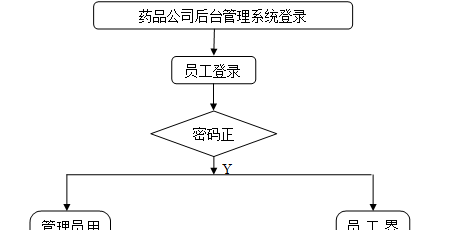

图4-2 登录结构图

这些功能可以充分满足药品公司后台管理系统的需求。此系统功能较为全面如下图系统功能结构如图4-3所示。

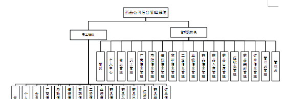

图4-3系统功能结构图

### 4.2 数据库设计原则

每个数据库的应用它们都是和区分开的，当运行到一定的程序当中，它就会与自己相关的协议与客户端进行通讯。那么这个系统就会对使这些数据进行连接。当我们选择哪个桥段的时候，接下来就会简单的叙述这个数据库是如何来创建的。当点击完成按钮的时候就会自动在对话框内弹出数据源的名称，在进行点击下一步即可，直接在输入相对应的身份验证和登录密码。

药品公司后台管理系统的数据流程：

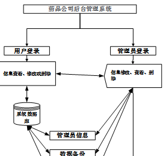

图4-4 系统数据流程图

员工管理实体E-R图，如图4-5所示。

图4-5员工管理E-R图

药品信息管理E-R图，如图4-6所示。

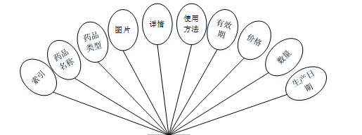

图4-6药品信息管理E-R图

### 管理员功能模块

管理员通过账号、密码和角色填写完成后选则提交进行登录，如图5-1所示。

图5-1管理员登录页面

管理员登录成功后进入到系统操作界面，可以对首页、个人中心、会员管理、员工管理、厂商信息管理、考勤信息管理、请假信息管理、离职信息管理、工资信息管理、业绩信息管理、药品信息管理、药品入库管理、药品出库管理、症状表管理、药品类别管理、订单信息管理、管理员管理、管理员等功能模块进行相对应操作，如图5-2所示。

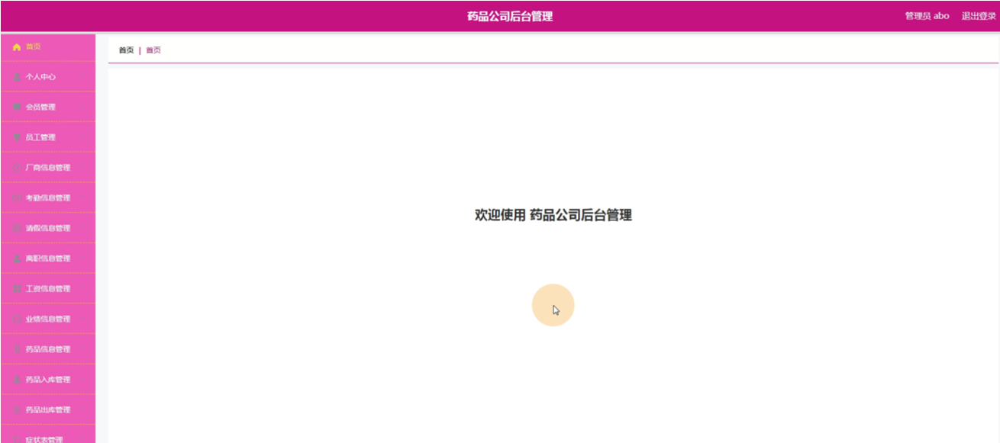

图5-2管理员系统功能界面图

会员管理：通过列表可以获取索引、会员账号、姓名、性别、身份证、手机等信息，进行修改或删除操作，如图5-3所示。

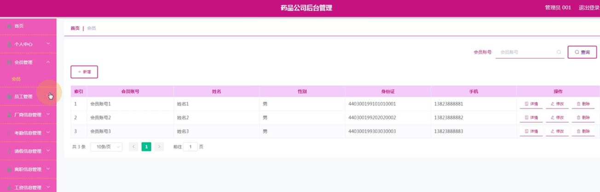

图5-3会员管理界面图

员工管理：通过列表可以获取索引、工号、密码、姓名、性别、职位、身份证、电话等信息，进行修改或删除操作，如图5-4所示。

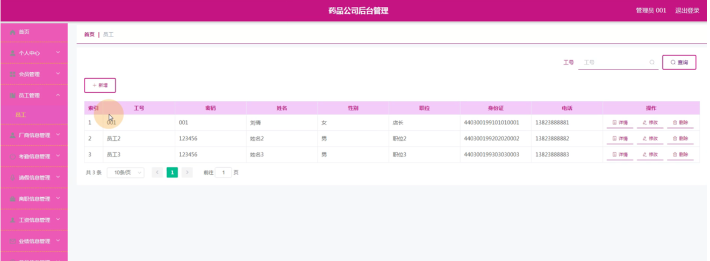

图5-4员工管理界面图

考勤信息管理：通过列表可以获取索引、名称、工号、姓名、出勤情况、考勤日期、备注等信息，进行修改或删除操作，如图5-5所示。

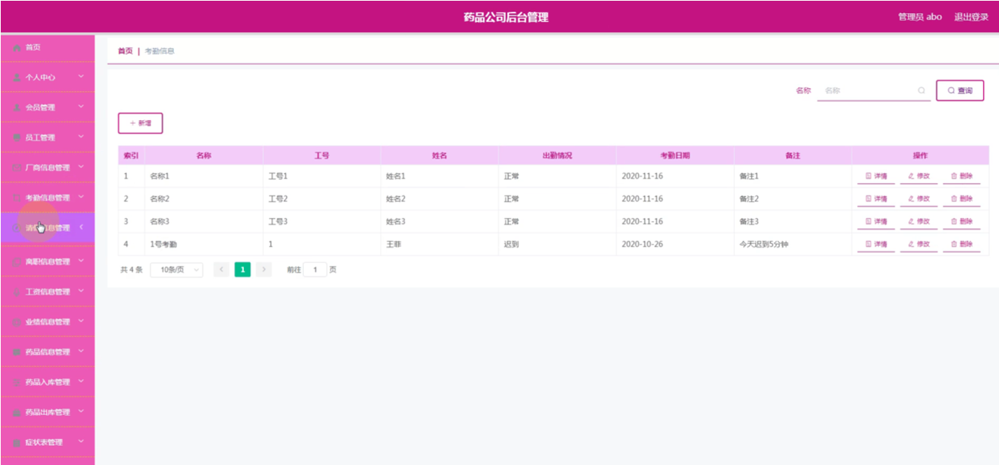

图5-5考勤信息管理界面图

请假信息管理：通过列表可以获取索引、名称、工号、姓名、请假内容、请假日期、请假天数、审核回复等信息，进行修改或删除操作，如图5-6所示。

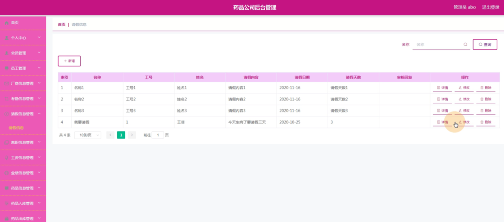

图5-6请假信息管理界面图

离职信息管理：通过列表可以获取索引、标题、内容、日期、工号、姓名、审核回复、审核等信息，进行修改或删除操作，如图5-7所示。

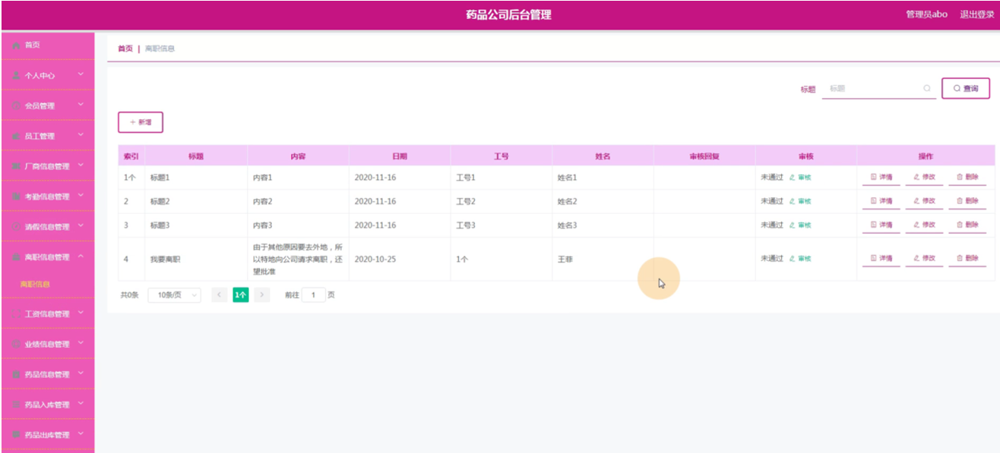

图5-7离职信息管理界面图

工资信息管理：通过列表可以获取索引、名称、工号、姓名、基本工资、加班工资、补贴、伙食费、其他费用、实收工资、日期等信息，进行修改或删除操作，如图5-8所示。

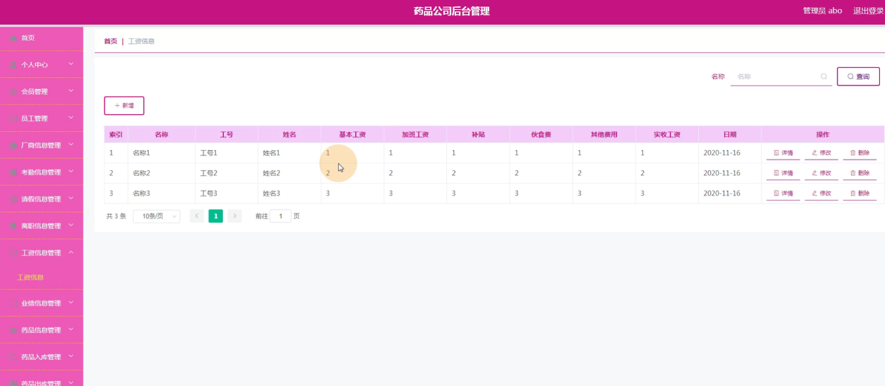

图5-8工资信息管理界面图

业绩信息管理：通过列表可以获取索引、名称、工号、姓名、销售总额、日期等信息，进行修改或删除操作，如图5-9所示。

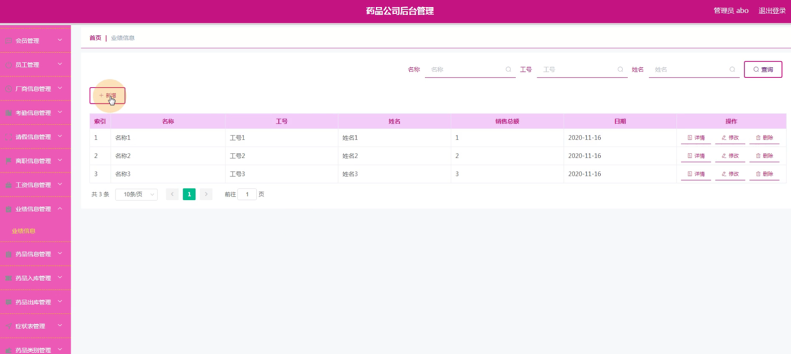

图5-9业绩信息管理界面图

药品入库管理：通过列表可以获取索引、药品名称、药品类型、数量、入库日期、备注、入库价格、总价格、厂商名称等信息，进行修改或删除操作，如图5-10所示。

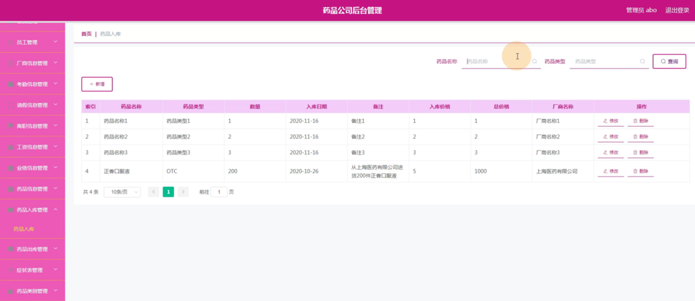

图5-10药品入库管理界面图

### 5.2员工功能模块

员工点击后台进入到系统操作界面，可以对首页、个人中心、会员管理、厂商信息管理、考勤信息管理、请假信息管理、离职信息管理、工资信息管理、业绩信息管理、药品信息管理、药品入库管理、药品出库管理、症状表管理、药品类别管理、订单信息管理等功能模块进行修改或删除等操作，如图5-11所示。

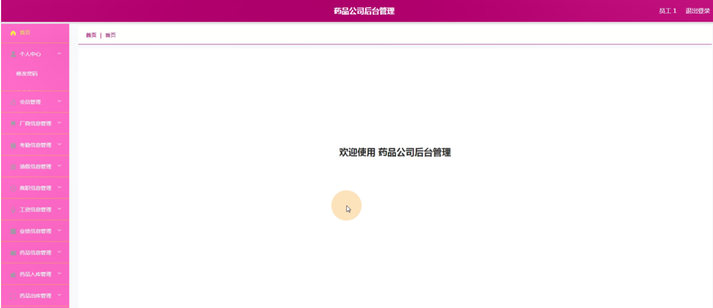

图5-11员工功能界面图

个人中心：通过填写工号、密码、姓名、性别、职位、身份证、电话等信息进行修改操作，如图5-12所示。

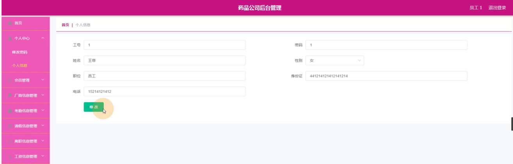

图5-12个人中心界面图

**JAVA** **毕设帮助，指导，源码分享，调试部署**

