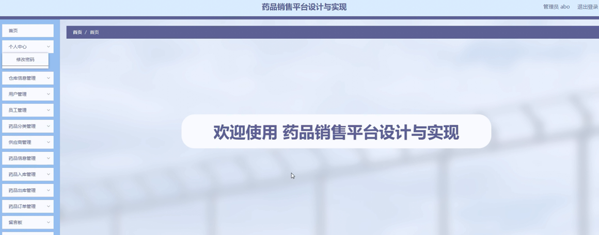

ssm+Vue计算机毕业设计药品销售平台（程序+LW文档）

**项目运行**

**环境配置：**

**Jdk1.8 + Tomcat7.0 + Mysql + HBuilderX** **（Webstorm也行）+ Eclispe（IntelliJ
IDEA,Eclispe,MyEclispe,Sts都支持）。**

**项目技术：**

**SSM + mybatis + Maven + Vue** **等等组成，B/S模式 + Maven管理等等。**

**环境需要**

**1.** **运行环境：最好是java jdk 1.8，我们在这个平台上运行的。其他版本理论上也可以。**

**2.IDE** **环境：IDEA，Eclipse,Myeclipse都可以。推荐IDEA;**

**3.tomcat** **环境：Tomcat 7.x,8.x,9.x版本均可**

**4.** **硬件环境：windows 7/8/10 1G内存以上；或者 Mac OS；**

**5.** **是否Maven项目: 否；查看源码目录中是否包含pom.xml；若包含，则为maven项目，否则为非maven项目**

**6.** **数据库：MySql 5.7/8.0等版本均可；**

**毕设帮助，指导，本源码分享，调试部署** **(** **见文末** **)**

### 总体设计

根据药品销售平台的功能需求，进行系统设计。

系统功能：用户进入系统可以实现首页，药品信息，新闻公告，留言板，个人中心，后台管理等功能进行操作；

后台主要是管理员，管理员功能包括首页，个人中心，仓库信息管理，用户管理，员工管理，药品分类管理，供应商管理，药品信息管理，药品入库管理，药品出库管理，药品订单管理，留言板，系统管理等内容；

系统对这些功能进行整合，产生的功能结构图如下：

图4-1 系统总体结构图

### 4.2 数据库设计

ER图是由实体及其关系构成的图，通过E/R图可以清楚地描述系统涉及到的实体之间的相互关系。在系统中对一些主要的几个关键实体如下图：

1.用户注册实体

用户注册实体包括用户名，姓名，密码，确认密码，年龄，手机号等属性。用户注册实体图如图4-2所示：

图4-2用户注册实体图

2.仓库信息管理

仓库信息管理包括索引，仓库名称，仓库类型，仓库位置，仓库面积等属性。仓库信息管理图如图4-3所示：

图4-3仓库信息管理图

3.供应商管理

供应商管理包括索引，供应商名称，供应商地址，联系电话，负责人姓名，职务，主销产品等属性。供应商管理实体图如图4-4所示：

图4-4供应商管理实体图

### 系统功能模块

药品销售平台，在系统首页可以查看首页，药品信息，新闻公告，留言板，个人中心，后台管理等内容，并进行详细操作；如图5-1所示。

图5-1系统首页界面图

用户注册，在用户注册页面通过填写用户名，姓名，密码，确认密码，年龄，手机号等信息进行注册操作，如图5-2所示。

图5-2用户注册界面图

药品信息，在药品信息页面可以查看药品名称，药品编号，药品分类，类别，药品数量，药品售价，规格，供应商名称，点击次数等信息，并进行收藏和评论操作，如图5-3所示。

图5-3药品信息界面图

个人中心，在个人中心页面通过填写用户名，姓名，密码，性别，年龄，手机号等内容进行更新信息操作，还可以对我的收藏进行详细操作；如图5-4所示。

图5-4个人中心界面图

### 5.2管理员功能模块

管理员进行登录，进入系统前在登录页面根据要求填写用户名和密码，选择角色等信息，点击登录进行登录操作，如图5-5所示。

图5-5管理员登录界面图

管理员登录系统后，可以对首页，个人中心，仓库信息管理，用户管理，员工管理，药品分类管理，供应商管理，药品信息管理，药品入库管理，药品出库管理，药品订单管理，留言板，系统管理等功能进行相应的操作管理，如图5-6所示。

图5-6管理员功能界面图

仓库信息管理，在仓库信息管理页面可以对索引，仓库名称，仓库类型，仓库位置，仓库面积等内容进行详情，修改和删除等操作，如图5-7所示。

图5-7仓库信息管理界面图

用户管理，在用户管理页面可以对索引，用户名，姓名，性别，年龄，手机号进行详情，修改和删除等操作，如图5-8所示。

图5-8用户管理界面图

药品分类管理，在药品分类管理页面可以对索引，药品分类等内容进行详情，修改和删除操作，如图5-9所示。

图5-9药品分类管理界面图

供应商管理，在供应商管理页面可以对索引，供应商名称，供应商地址，联系电话，负责人姓名，职务，主销产品等内容进行详情，修改和删除操作，如图5-10所示。

图5-10供应商管理界面图

药品入库管理，在药品入库管理页面可以对索引，入库编号，药品编号，药品名称，药品分类，规格，供应商名称，药品数量，药品售价，总金额，仓库名称等内容进行详情，修改和删除操作；如图5-11所示。

图5-11药品入库理界面图

药品出库管理，在药品出库管理页面可以对索引，出库编号，药品编号，药品名称，药品分类，规格，供应商名称，药品数量，药品进价，总金额，登记时间等内容进行详情，修改和删除操作；如图5-12所示。

图5-12药品出库管理界面图

**JAVA** **毕设帮助，指导，源码分享，调试部署**

