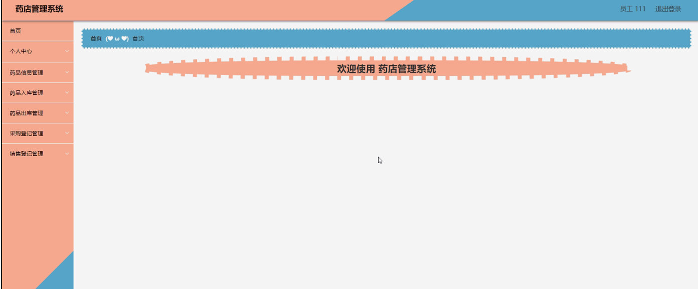

ssm+Vue计算机毕业设计药店管理系统（程序+LW文档）

**项目运行**

**环境配置：**

**Jdk1.8 + Tomcat7.0 + Mysql + HBuilderX** **（Webstorm也行）+ Eclispe（IntelliJ
IDEA,Eclispe,MyEclispe,Sts都支持）。**

**项目技术：**

**SSM + mybatis + Maven + Vue** **等等组成，B/S模式 + Maven管理等等。**

**环境需要**

**1.** **运行环境：最好是java jdk 1.8，我们在这个平台上运行的。其他版本理论上也可以。**

**2.IDE** **环境：IDEA，Eclipse,Myeclipse都可以。推荐IDEA;**

**3.tomcat** **环境：Tomcat 7.x,8.x,9.x版本均可**

**4.** **硬件环境：windows 7/8/10 1G内存以上；或者 Mac OS；**

**5.** **是否Maven项目: 否；查看源码目录中是否包含pom.xml；若包含，则为maven项目，否则为非maven项目**

**6.** **数据库：MySql 5.7/8.0等版本均可；**

**毕设帮助，指导，本源码分享，调试部署** **(** **见文末** **)**

### 系统结构设计

系统设计主要是管理员登录后对整个系统相关操作进行处理，可进行系统管理。系

统的功能结构图如下图所示。

图3-1 系统总体结构图

3.4 数据库设计与实现

数据可设计要遵循职责分离原则，即在设计时应该要考虑系统独立性，即每个系统之间互不干预不能混乱数据表和系统关系。

数据库命名也要遵循一定规范，否则容易混淆，数据库字段名要尽量做到与表名类似，多使用小写英文字母和下划线来命名并尽量使用简单单词。

#### 3.4.1 数据库概念结构设计

数据库的E-R图反映了实体、实体的属性和实体之间的联系。下面是各个实体以及实体的属性。

员工管理实体属性图如下所示：

图3-2 员工管理实体属性图

药品信息管理实体属性图如下所示：

图3-3药品信息管理实体属性图

会员管理实体属性图如下所示：

图3-4会员管理实体属性图

### 管理员功能模块

管理员登录，管理员通过输入用户名、密码、角色进行登录进入系统，如图4-1所示。

图4-1管理员登录界面图

管理员通过登录进入药店管理系统可查看个人中心、员工管理、会员管理、药品分类管理、药品信息管理、供应商管理、药品入库管理、药品出库管理、采购登记管理、销售登记管理等内容，如图4-2所示。

图4-2管理员功能界面图

员工管理，管理员可在员工管理页面查看员工工号、员工姓名、性别、联系电话、身份证等内容，还可进行新增、修改或删除等操作，如图4-3所示。

图4-3员工管理界面图

会员管理，管理员可在会员管理页面查看会员卡号、会员姓名 、性别、年龄、身份证、联系电话、邮箱、头像等内容，还可进行新增、修改或删除等操作，如图4-4所示。

图4-4会员管理界面图

药品分类管理，管理员可在药品分类管理页面通过输入药品分类进行查询、新增、修改或删除等操作，如图4-5所示。

图4-5药品分类管理界面图

药品信息管理，管理员可在药品信息管理页面查看药品编号、药品名称、药品正式名、规格、单位、产地、药品数量、药品进价、药品售价等内容，还可进行新增、统计、修改或删除等操作，如图4-6所示。

图4-6药品信息管理界面图

供应商管理，管理员可在供应商管理页面查看供应商名称、地址、联系电话、负责人姓名、职务、主销产品等内容，还可进行新增、修改或删除等操作，如图4-7所示。

图4-7供应商管理界面图

药品入库管理，管理员可在药品入库管理页面查看药品编号、药品名称、药品正式名、规格、单位、药品数量、产地、药品进价、总金额、登记时间等内容，还可进行修改、删除或统计等操作，如图4-8所示。

图4-8药品入库管理界面图

药品出库管理，管理员可在药品出库管理页面查看药品编号、药品名称、药品正式名、规格、单位、药品数量、产地、药品售价、总金额、会员卡号、会员姓名、联系电话、出库时间等内容，还可进行统计、修改或删除等操作，如图4-9所示。

图4-9药品出库管理界面图

采购登记管理，管理员可在采购登记管理页面查看药品编号、药品名称、药品正式名、规格、单位、药品数量、产地、药品进价、供应商名称、采购时间等内容，还可进行统计、修改或删除等操作，如图4-10所示。

图4-10采购登记管理界面图

4.3员工功能模块

员工通过输入用户名、密码、角色进行登录，如图4-11所示。

图4-11员工登录界面图

员工通过登录进入药店管理系统可查看个人中心、药品信息管理、药品入库管理、药品出库管理、采购登记管理、销售登记管理等内容，如图4-12所示。

图4-12员工功能界面图

#### **JAVA** **毕设帮助，指导，源码分享，调试部署**

