ssm+Vue计算机毕业设计虚拟问诊系统（程序+LW文档）

**项目运行**

**环境配置：**

**Jdk1.8 + Tomcat7.0 + Mysql + HBuilderX** **（Webstorm也行）+ Eclispe（IntelliJ
IDEA,Eclispe,MyEclispe,Sts都支持）。**

**项目技术：**

**SSM + mybatis + Maven + Vue** **等等组成，B/S模式 + Maven管理等等。**

**环境需要**

**1.** **运行环境：最好是java jdk 1.8，我们在这个平台上运行的。其他版本理论上也可以。**

**2.IDE** **环境：IDEA，Eclipse,Myeclipse都可以。推荐IDEA;**

**3.tomcat** **环境：Tomcat 7.x,8.x,9.x版本均可**

**4.** **硬件环境：windows 7/8/10 1G内存以上；或者 Mac OS；**

**5.** **是否Maven项目: 否；查看源码目录中是否包含pom.xml；若包含，则为maven项目，否则为非maven项目**

**6.** **数据库：MySql 5.7/8.0等版本均可；**

**毕设帮助，指导，本源码分享，调试部署** **(** **见文末** **)**

### 系统结构

通常在只在网站网内部使用，采用C/S。而使用不仅限于内网的情况下使用B/S。考虑到本管理系统的一系列需求，所以，该系统开发使用B/S结构开发。其主要功能结构如下图所示。

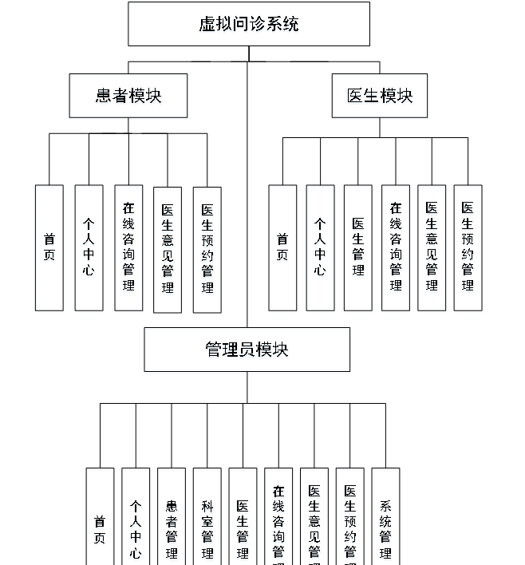

图4-1 系统总体功能结构图

###  4.2数据库设计

数据库设计是指为系统提供最优化的数据库模式，使得应用程序能够有效的存储数据，满足患者的各类需求。

#### 4.2.1 数据库概念结构设计

概念结构设计是根据患者需求形成的。用最常的E-R方法描述数据模型进行数据库的概念设计，首先设计局部的E-
R模式，最后各局部ER模式综合成一个全局模式。然后再把概念模式转换成逻辑模式。将概念设计从设计过程中独立开来，设计复杂程度降低，不受特定DBMS的限制。

1.所有实体和属性的定义如下所示。

管理员信息属性图如下图4-2所示。

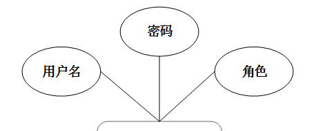

图4-2 管理员信息实体属性图

患者信息实体属性图，如图4-3所示：

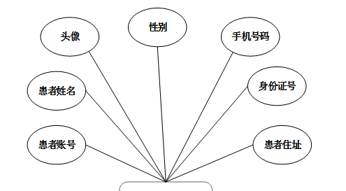

图4-3患者信息实体属性图

医生信息实体属性图，如图4-4所示：

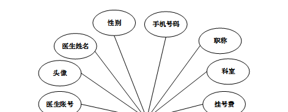

图4-4医生信息实体属性图

在线咨询信息实体属性图，如图4-5所示：

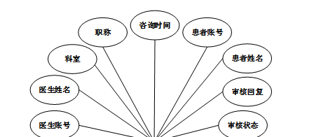

图4-5在线咨询信息实体属性图

### 管理员功能模块

管理员登录，管理员通过登录页面输入用户名，密码，选择角色等信息即可进行系统登录，如图5-1所示。

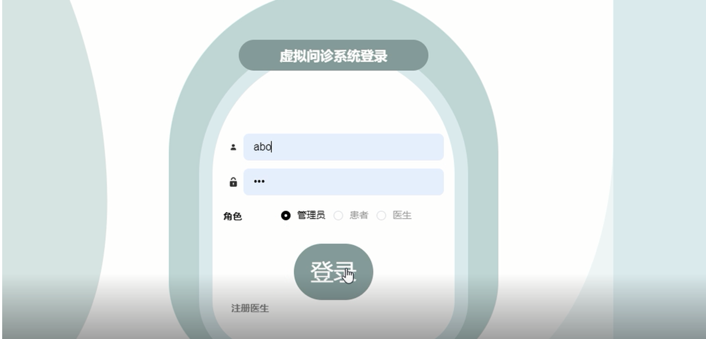

图5-1管理员登录界面图

管理员登录进入虚拟问诊系统可以查看首页、个人中心、患者管理、科室管理、医生管理、在线咨询管理、医生意见管理、医生预约管理、系统管理等内容进行详细操作，如图5-2所示。

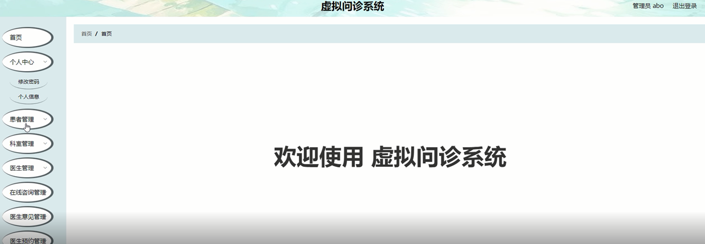

图5-2管理员功能界面图

患者管理，在患者管理页面可以查看患者账号、患者姓名、头像、性别、手机号码、身份证号、患者住址等信息，并可根据需要对患者管理进行修改或删除等操作，如图5-3所示。

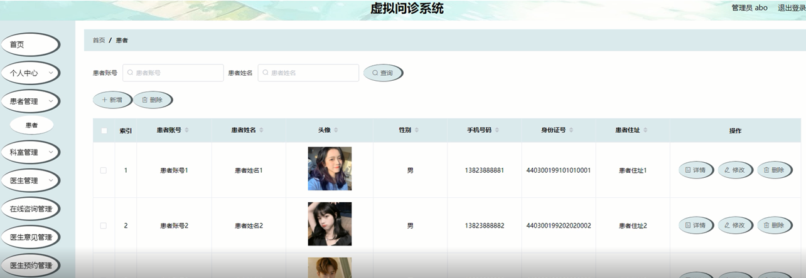

图5-3患者管理界面图

科室管理，在科室管理页面可以新增科室信息等内容，并可根据需要对科室管理进行修改或删除等操作，如图5-4所示。

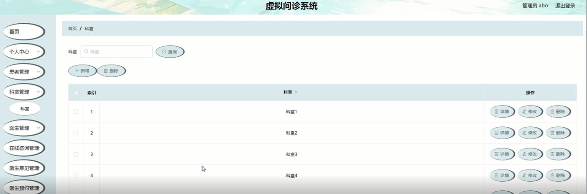

图5-4科室管理界面图

医生管理，在医生管理页面可以查看医生账号、头像、医生姓名、性别、手机号码、职称、科室、挂号费等信息，并可根据需要对医生管理进行修改或删除等操作，如图5-5所示。

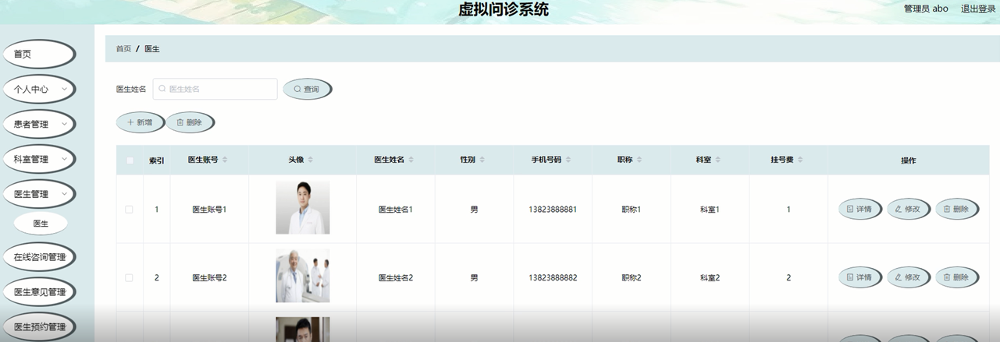

图5-5医生管理界面图

在线咨询管理，在在线咨询管理页面可以查看医生账号、医生姓名、科室、职称、咨询时间、患者账号、患者姓名、审核回复、审核状态等信息，并可根据需要对在线咨询管理进行详情或删除等操作，如图5-6所示。

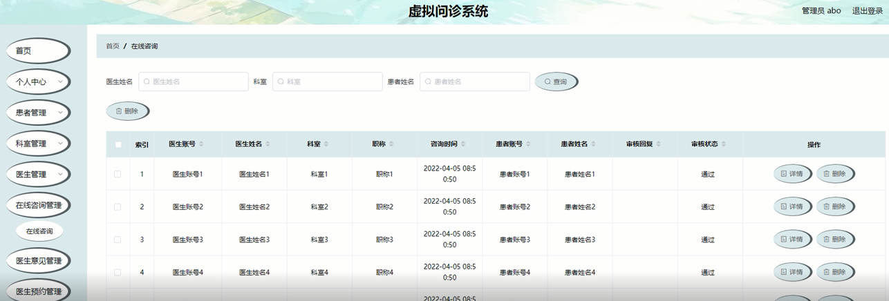

图5-6在线咨询管理界面图

医生意见管理，在医生意见管理页面可以查看医生账号、医生姓名、科室、职称、咨询时间、患者账号、患者姓名、建议时间等信息，并可根据需要对医生意见管理进行详情或删除等操作，如图5-7所示。

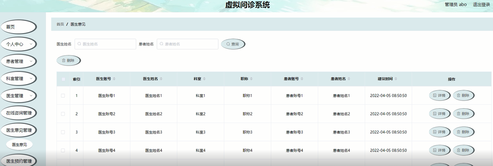

图5-7医生意见管理界面图

系统管理；管理员通过系统管理页面查看轮播图管理、医疗资讯等进行前台上传图片，医疗资讯发布，进行添加、删除、修改以及查看并对整个系统进行维护等操作，如图5-8
5-9所示。

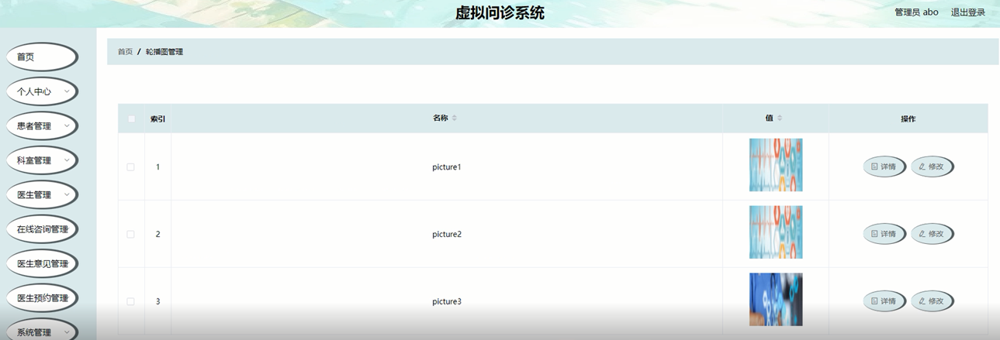

图5-8轮播图管理界面图

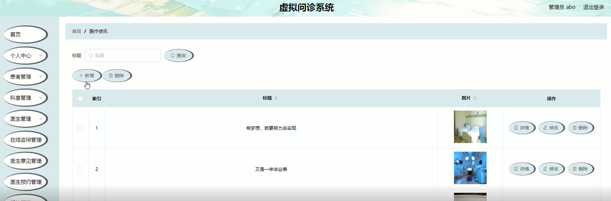

图5-9医疗资讯界面图

### 5.2患者功能模块

患者登录到虚拟问诊系统后台后，可以对首页、个人中心、在线咨询管理、医生意见管理、医生预约管理等功能进行相应操作，如图5-10所示。

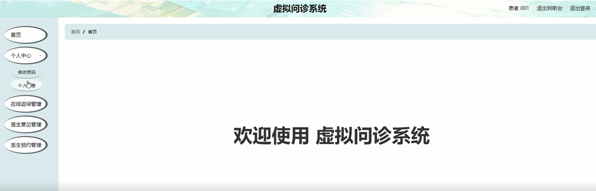

图5-10患者功能界面图

个人中心，在个人中心页面，患者通过输入患者账号、患者姓名、头像、性别、手机号码、身份证号、患者住址等信息进行修改，并且也可以修改密码，如图5-11所示。

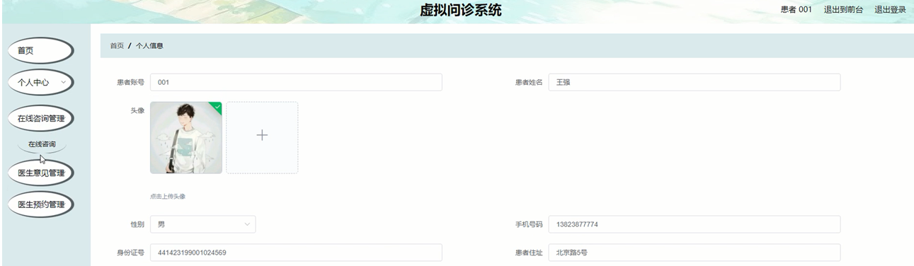

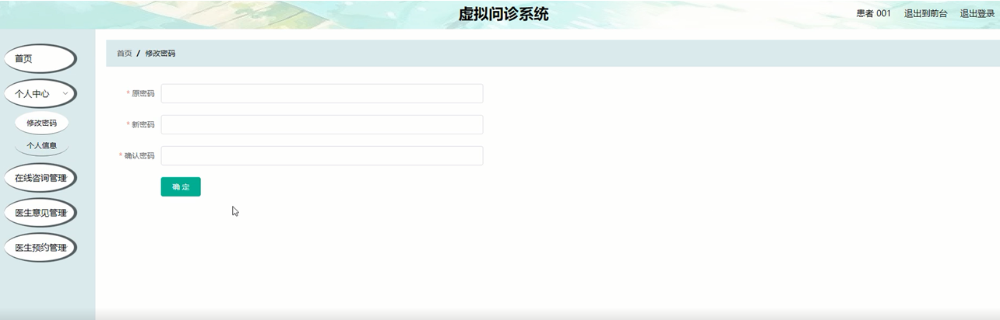

图5-11个人中心界面图

在线咨询管理，在在线咨询管理页面可以查看医生账号、医生姓名、科室、职称、咨询时间、患者账号、患者姓名、审核回复、审核状态等信息，并可根据需要对在线咨询管理进行详情操作，如图5-12所示。

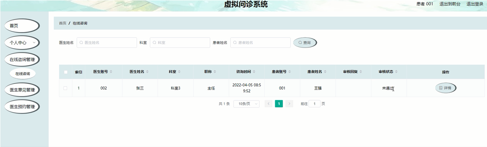

图5-12在线咨询管理界面图

**JAVA** **毕设帮助，指导，源码分享，调试部署**

