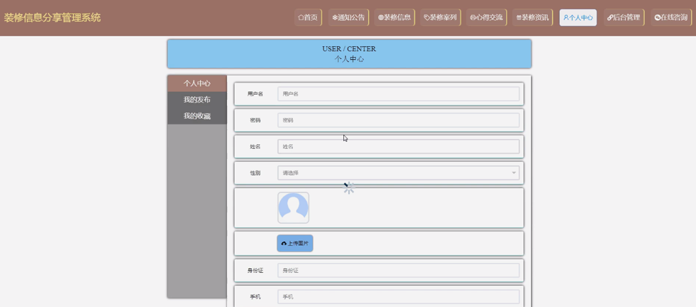

ssm+Vue计算机毕业设计装修信息分享管理系统（程序+LW文档）

**项目运行**

**环境配置：**

**Jdk1.8 + Tomcat7.0 + Mysql + HBuilderX** **（Webstorm也行）+ Eclispe（IntelliJ
IDEA,Eclispe,MyEclispe,Sts都支持）。**

**项目技术：**

**SSM + mybatis + Maven + Vue** **等等组成，B/S模式 + Maven管理等等。**

**环境需要**

**1.** **运行环境：最好是java jdk 1.8，我们在这个平台上运行的。其他版本理论上也可以。**

**2.IDE** **环境：IDEA，Eclipse,Myeclipse都可以。推荐IDEA;**

**3.tomcat** **环境：Tomcat 7.x,8.x,9.x版本均可**

**4.** **硬件环境：windows 7/8/10 1G内存以上；或者 Mac OS；**

**5.** **是否Maven项目: 否；查看源码目录中是否包含pom.xml；若包含，则为maven项目，否则为非maven项目**

**6.** **数据库：MySql 5.7/8.0等版本均可；**

**毕设帮助，指导，本源码分享，调试部署** **(** **见文末** **)**

系统体系结构

装修信息分享管理系统的结构图4-1所示：

图4-1 系统结构

登录系统结构图，如图4-2所示：

图4-2 登录结构图

系统结构图，如图4-3所示：

图4-3 系统结构图

4.2 数据库实体设计

数据库的功能就是对系统中所有的数据进行存储和管理。所有的数据可以在数据库中产时间的进行存储，方便用户的使用。而且所有的数据库中的数据也应该具有一定的共享性，任何的系统可以对一些数据进行使用，同时还应该保持一定的独立性，每一个数据库中的数据都有很强的安全性，可以被很好的存放到数据库，没有进行身份的验证是不能对这些数据进行查看和使用的。数据库的设计需要明确每一个实体之间的联系，系统的E-
R图如下图所示：：

用户管理主要包括索引、用户名、密码、姓名、性别、头像、身份证、手机等属性，用户管理属性图如图4-4所示。

图4-4用户管理实体属性图

装修信息管理实体属性主要包括账号、密码、性别等属性。装修信息管理实体属性图如图4-5所示。

图4-5装修信息管理实体属性图

系统功能模块

装修信息分享管理系统，在系统的首页可以查看首页、通知公告、装修信息、装修案例、心得交流、装修资讯、个人中心、后台管理、在线咨询等信息，如图5-1所示。

图5-1系统首页界面图

装修信息，在装修信息页面中可以对房屋室内装修、装修类型、价格、图片、完工时间、发布时间、详细内容、评论进行查看预定等操作，如图5-2所示。

图5-2装修信息界面图

心得交流，在心得交流页面中可以填写标题、类型、内容等信息进行帖子发布，如图5-3所示。

图5-3心得交流界面图

用户注册，新用户可以进行用户注册的操作，可以根据界面上的提示输入用户名、密码、姓名、身份证、手机等信息，然后点击提交，所有的信息就被系统保存了下来，具体操作如图5-4所示。

图5-4用户注册界面图

个人中心，在个人中心页面中可以填写用户名、密码、姓名、性别、图片、身份证、手机等信息进行修改，还可以根据需要对我的发布、我的收藏进行相应操作，如图5-5所示。

图5-5个人中心界面图

### 5.2 管理员功能模块

管理员登录，管理员通过输入用户名、密码、角色等信息然后点击登录就能登录到系统进行系统的使用了，如图5-6所示。

图5-6管理员登录界面图

管理员登录进入装修信息分享管理系统之后，就可以对所有的信息进行查看，可以查看到首页、个人中心、用户管理、通知公告管理、装修分类管理、装修信息管理、装修案例管理、订单信息管理、心得交流、系统管理等内容，并且还可以对其进行相应的操作管理，如图5-7所示。

图5-7管理员功能界面图

用户管理，在用户管理页面中可以查看索引、用户名、密码、姓名、性别、头像、身份证、手机等信息进行修改或删除等操作，如图5-8所示。

图5-8用户管理界面图

通知公告管理，在通知公告管理页面中可以查看索引、标题、图片、发布时间等信息进行修改或删除等操作，如图5-9所示。

图5-9通知公告管理界面图

装修分类管理，在装修分类管理页面中可以查看索引、装修类型等信息进行修改或删除等操作，如图5-10所示。

图5-10装修分类管理界面图

装修信息管理，在装修信息管理页面中可以查看索引、名称、装修类型、图片、价格、完工时间、发布时间等信息进行详情查看、修改、查看评论或删除等操作，如图5-11所示。

图5-11装修信息管理界面图

装修案例管理，在装修案例管理页面中可以查看索引、标题、图片、发布时间等信息进行详情查看、修改、查看评论或删除等操作，如图5-12所示。

图5-12装修案例管理界面图

#### **JAVA** **毕设帮助，指导，源码分享，调试部署**

