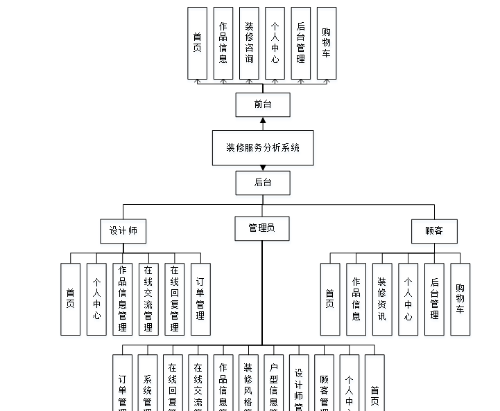

ssm+Vue计算机毕业设计装修服务分析系统（程序+LW文档）

**项目运行**

**环境配置：**

**Jdk1.8 + Tomcat7.0 + Mysql + HBuilderX** **（Webstorm也行）+ Eclispe（IntelliJ
IDEA,Eclispe,MyEclispe,Sts都支持）。**

**项目技术：**

**SSM + mybatis + Maven + Vue** **等等组成，B/S模式 + Maven管理等等。**

**环境需要**

**1.** **运行环境：最好是java jdk 1.8，我们在这个平台上运行的。其他版本理论上也可以。**

**2.IDE** **环境：IDEA，Eclipse,Myeclipse都可以。推荐IDEA;**

**3.tomcat** **环境：Tomcat 7.x,8.x,9.x版本均可**

**4.** **硬件环境：windows 7/8/10 1G内存以上；或者 Mac OS；**

**5.** **是否Maven项目: 否；查看源码目录中是否包含pom.xml；若包含，则为maven项目，否则为非maven项目**

**6.** **数据库：MySql 5.7/8.0等版本均可；**

**毕设帮助，指导，本源码分享，调试部署** **(** **见文末** **)**

### 软件功能模块设计

系统整功能如下图所示：

图 4-1 系统总体功能模块图

### 系统登录

系统登录，管理员，设计师和顾客进入系统前在登录页面根据要求填写用户名和密码，选择角色等信息，点击登录进行登录操作，如图5-1所示。

图5-1系统登录界面图

### 5.2管理员功能模块

管理员登录系统后，可以对首页、个人中心、顾客管理、设计师管理、户型信息管理、装修风格管理、作品信息管理、在线交流管理、在线回复管理、系统管理、订单管理等功能进行相应的操作管理，如图5-2所示。

图5-2管理员功能界面图

顾客管理，在顾客管理页面可以对索引、用户名、顾客姓名、性别、头像、年龄、邮箱、手机等内容进行修改和删除等操作，如图5-3所示。

图5-3顾客管理界面图

设计师管理，在设计师管理页面可以对索引、账号、姓名、性别、头像、等级、年龄、电话、邮箱等信息进行修改和删除等操作，如图5-4所示。

图5-4设计师管理界面图

户型信息管理，在户型信息管理页面可以对索引、户型等内容进行修改和删除等操作，如图5-5所示。

图5-5户型信息管理界面图

装修风格管理，在装修风格管理页面可以对索引、装修风格等内容进行修改和删除等操作，如图5-6所示。

图5-6装修风格管理界面图

作品信息管理，在作品信息管理页面可以对索引、公司名称、作品名称、图片、装修风格、户型、面积范围、账号、姓名、电话、等级、价格、审核回复、审核状态等内容进行详情，修改，查看评论和删除等操作，如图5-7所示。

图5-7作品信息管理界面图

在线交流管理，在在线交流管理页面可以对索引、账号、姓名、发布时间、用户名、顾客姓名等内容进行详情，修改和删除等操作，如图5-8所示。

图5-8在线交流管理界面图

在线回复管理，在在线回复管理页面可以对索引、用户名、顾客姓名、回复时间、账号、姓名等内容进行详情，修改和删除等操作，如图5-9所示。

图5-9在线回复管理界面图

系统管理，在系统管理页面可以对轮播图进行管理，对装修资讯进行索引、标题、图片等内容进行详情，修改等操作，如图5-10所示。

图5-10系统管理界面图

### 5.3设计师功能模块

设计师登录进入装修服务分析系统可以对首页、个人中心、作品信息管理、在线交流管理、在线回复管理、订单管理等功能进行相应操作，如图5-11所示。

图5-11设计师功能界面图

作品信息管理，在作品信息管理页面可以对索引、公司名称、作品名称、图片、装修风格、户型、面积范围、账号、姓名、电话、等级、价格、审核回复、审核状态等内容进行详情，修改，查看评论和删除等操作，如图5-12所示。

图5-12作品信息管理界面图

#### **JAVA** **毕设帮助，指导，源码分享，调试部署**

