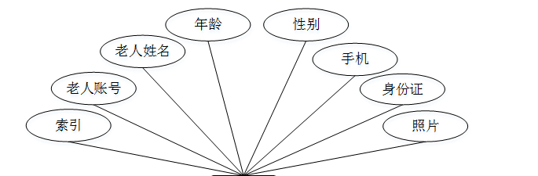
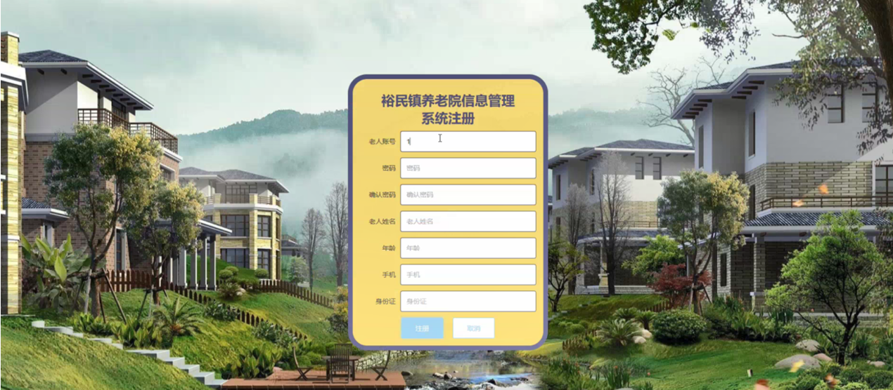
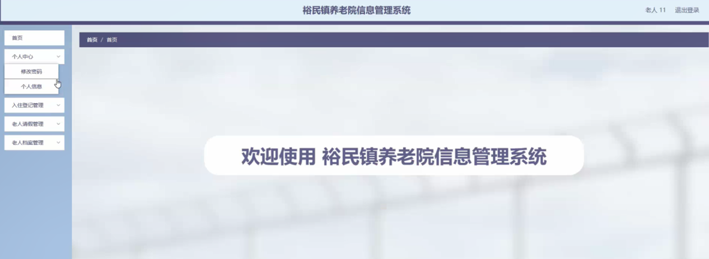
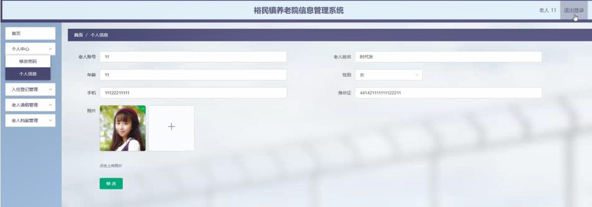

ssm+Vue计算机毕业设计裕民镇养老院信息管理系统（程序+LW文档）

**项目运行**

**环境配置：**

**Jdk1.8 + Tomcat7.0 + Mysql + HBuilderX（Webstorm也行）+ Eclispe（IntelliJ
IDEA,Eclispe,MyEclispe,Sts都支持）。**

**项目技术：**

**SSM + mybatis + Maven + Vue 等等组成，B/S模式 + Maven管理等等。**

**环境需要**

**1.运行环境：最好是java jdk 1.8，我们在这个平台上运行的。其他版本理论上也可以。**

**2.IDE环境：IDEA，Eclipse,Myeclipse都可以。推荐IDEA;**

**3.tomcat环境：Tomcat 7.x,8.x,9.x版本均可**

**4.硬件环境：windows 7/8/10 1G内存以上；或者 Mac OS；**

**5.是否Maven项目: 否；查看源码目录中是否包含pom.xml；若包含，则为maven项目，否则为非maven项目**

**6.数据库：MySql 5.7/8.0等版本均可；**

**毕设帮助，指导，本源码分享，调试部署(** **见文末)**

### **系统设计主要功能**

通过市场调研及咨询研究，了解了用户及管理者的使用需求，于是制定了管理员，老人和用户等模块。功能结构图如下所示：

图4-1系统功能结构图

### **4.2** **数据库设计**

#### 4.2.1 数据库设计规范

数据可设计要遵循职责分离原则，即在设计时应该要考虑系统独立性，即每个系统之间互不干预不能混乱数据表和系统关系。

数据库命名也要遵循一定规范，否则容易混淆，数据库字段名要尽量做到与表名类似，多使用小写英文字母和下划线来命名并尽量使用简单单词。

#### 4.2.2 E/R图

老人E/R图，如下所示：

图4-2老人E/R图

员工管理E/R图，如下所示：

图4-3员工管理E/R图

入住登记管理E/R图，如下所示。

图4-4入住登记管理E/R图

### **登陆注册功能模块**

裕民镇养老院信息管理系统，老人注册在页面填写老人账号，密码，确认密码，老人姓名，年龄，手机，身份证等内容，进行注册操作；如图5-1所示。

图5-1老人注册界面图

裕民镇养老院信息管理系统，员工注册在页面填写工号，密码，确认密码，姓名，年龄，手机等内容，进行注册操作；如图5-2所示。

图5-2员工注册界面图

管理员，员工，老人进行登录，进入系统前在登录页面根据要求填写用户名和密码，选择角色等信息，点击登录进行登录操作，如图5-3所示。

图5-3 登录界面图

### **5.2** **管理员功能模块**

管理员登录系统后，可以对首页，个人中心，老人管理，员工管理，入住登记管理，老人请假管理，员工请假管理，员工工资管理，老人档案管理，事故记录管理等功能进行相应的操作管理，如图5-4所示。

图5-4管理员功能界面图

老人管理，在老人管理页面可以对索引，老人账号，老人姓名，年龄，性别，手机，身份证，照片等内容进行详情，修改和删除等操作，如图5-5所示。

图5-5老人管理界面图

员工管理，在员工管理页面可以对索引，工号，姓名，性别，年龄，手机，照片等内容进行详情，修改和删除等操作，如图5-6所示。

图5-6员工管理界面图

入住登记管理，在入住登记管理页面可以对索引，登记编号，房间号，老人账号，老人姓名，手机，入职费用，状态
，入住时间，是否支付等信息进行详情，修改和删除等操作，如图5-7所示。

图5-7入住登记管理界面图

老人请假管理，在老人请假管理页面可以对索引，老人账号，老人姓名，请假时间，请假天数，备注，审核回复，审核状态，审核等内容进行详情,删除操作，如图5-8所示。

图5-8老人请假管理界面图

员工请假管理，在员工请假管理页面可以对索引，工号，姓名，请假时间，请假天数，备注，审核回复，审核状态，审核等内容进行详情，删除等操作，如图5-9所示。

图5-9员工请假管理界面图

### **5.3** **老人功能模块**

老人登录进入系统可以对首页，个人中心，入住登记管理，老人请假管理，老人档案管理等功能进行相应操作，如图5-10所示。

图5-10老人功能界面图

个人中心，在编辑老人页面通过填写老人账号，老人姓名，年龄，性别，手机，身份证，照片等内容并提交进行个人信息修改操作，如图5-11所示。

图5-11个人中心界面图

入住登记管理，在入住登记管理页面可以对索引，登记编号，房间号，老人账号，老人姓名，手机，入住费用，状态，入住时间，是否支付等内容进行详情操作，如图5-12所示。

图5-12入住登记管理界面图

#### **JAVA毕设帮助，指导，源码分享，调试部署**

